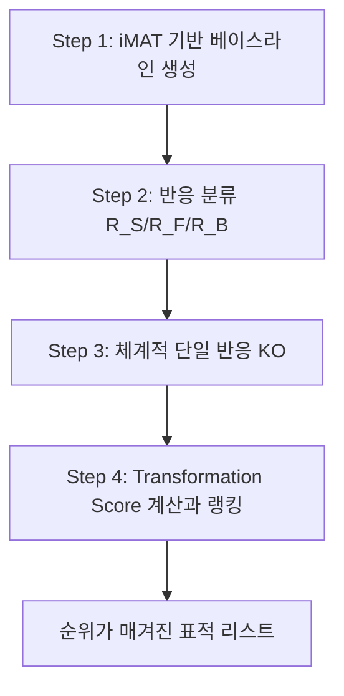

# 6. 대사 정상화(Metabolic Restoration): "죽이기" 대신 "고치기"

## 6.1 패러다임 전환

**질문을 완전히 뒤집어 봅시다.** 지금까지(§3~§5)의 접근법은 주로 "**어떤 유전자를 제거하면 암 세포의 성장이 감소하는가**"를 묻습니다. 이 질문은 "죽여야 할 대상(암세포)이 있다"는 것을 전제로 합니다. 그런데 §1.6에서 살펴본 당뇨병·NAFLD·노화를 다시 떠올려 봅시다 — 이 질환들에는 "죽여야 할 세포"가 없습니다. 인슐린 저항성에 걸린 간세포도, 세린이 부족한 지방간 세포도, 미토콘드리아 기능이 떨어진 노화 세포도 모두 환자 몸의 정상적인 구성 세포이며, 우리가 원하는 것은 이 세포들을 "죽이는 것"이 아니라 "다시 건강했던 상태로 되돌리는 것"입니다. 이것이 이 절 전체를 관통하는 패러다임 전환입니다 — "죽이기(kill)"에서 "고치기(fix)"로.

이 전환을 수학적으로 표현하려면 새로운 재료가 필요합니다. §3~§5의 KO 시뮬레이션은 "야생형 하나의 기준 상태"만 있으면 충분했습니다(그 상태에서 유전자를 하나씩 꺼보면 되니까요). 그러나 "무엇을 목표로 되돌릴 것인가"를 정의하려면 최소 두 개의 상태 — 지금의 나쁜 상태(source, 예: 질병 조직)와 원하는 좋은 상태(target, 예: 정상 조직 또는 장수 상태) — 가 필요합니다. Yizhak et al. (2013)의 **MTA(Metabolic Transformation Algorithm)**는 source와 target 두 상태의 발현 차이를 이용해, source의 flux를 target에서 기대되는 **변화 방향**으로 옮길 가능성이 큰 대사 개입을 순위화합니다. 이는 계산적 가설 생성법이며, 질병이 실제로 “건강 상태로 회복되었다”는 임상적 보장을 뜻하지 않습니다.

**기존 "죽이기" 접근의 한계:**

1. **선택성 부족** — 빠르게 분열하는 모든 세포(정상 상피·조혈세포 등)를 공격
2. **내성 발생** — 강한 선택압이 약물 펌프 상향조절, 대사 우회 경로 활성화를 유도
3. **만성 질환에 부적합** — 당뇨병·NAFLD에는 "죽일" 대상이 없음
4. **재발** — 생존한 세포가 다시 증식

**대사 정상화 접근의 잠재적 이점:** 증식 억제 외의 목표를 명시할 수 있고, source-target 전사체 차이를 개입 설계에 직접 이용할 수 있다는 점입니다. 그러나 낮은 선택압, 내성 감소, 가역성이나 임상적 병용 시너지는 각 표적에서 실험으로 확인해야 할 가설이지 MTA 수식이 보장하는 성질은 아닙니다. 이 접근은 다음 세 가지 가정에 의존합니다.

1. 유전자 발현은 대사 상태의 프록시(proxy)이다.
2. 대사 네트워크는 중복성(redundancy)과 탄력성(resilience)을 가진다.
3. 대사 상태의 변화는 연속적이며 중간 상태를 거쳐 목표 상태에 도달할 수 있다.

이 세 가정을 하나씩 뜯어봅시다. 가정 1은 [Chapter 6](../chapter-6/README.md)에서 이미 다룬 "발현-활성 역설"과 정확히 같은 한계를 공유합니다 — mRNA 수준이 실제 효소 활성과 완벽히 비례하지 않을 수 있다는 것입니다. 가정 2는 §1.2에서 배운 글루타민 우회 경로처럼, 네트워크가 하나의 경로를 잃어도 다른 경로로 적응할 수 있다는 유연성을 전제로 하며, 역설적으로 이 유연성이 바로 MTA가 "완전히 새로운 경로를 만드는" 대신 "기존에 존재하는 경로들 사이의 균형을 재조정"하는 방식으로 작동하는 이유입니다. 가정 3은 가장 미묘합니다 — source에서 target으로 가는 길에 반드시 거쳐야 하는 "중간 지점"이 세포에게 생리적으로 감내 가능해야 한다는 뜻이며, 만약 그 경로 중간에 세포가 견딜 수 없는 상태(예: ATP 고갈)가 있다면 계산상으로는 최적이라도 실제로는 도달 불가능할 수 있습니다.


❓ **잠깐, 생각해보기:** 이미 §3에서 MOMA/ROOM으로 "야생형과 가장 가까운 상태"를 예측할 수 있는데, 굳이 새로운 알고리즘(MTA)이 왜 필요할까요?

MOMA/ROOM은 사용자가 제공한 **기준 flux**에서 출발해 KO 뒤 변화의 크기 또는 바뀐 반응 수를 최소화합니다. 그 기준은 실험 WT일 수도, 질병 상태에서 추정한 flux일 수도 있습니다. 하지만 별도의 target 전사체가 “어느 반응이 어느 방향으로 움직여야 하는가”를 알려 주지는 않습니다. MTA는 source 기준 flux에 더해 target과의 차등발현 방향을 목적에 포함한다는 점이 다릅니다.


## 6.2 MTA vs FBA/MOMA/ROOM

| 특성 | FBA | MOMA | ROOM | MTA |
|------|-----|------|------|-----|
| 핵심 질문 | 주어진 목적의 최적 flux는? | KO 뒤 기준 flux와 가장 가까운 해는? | KO 뒤 크게 바뀌는 반응 수가 가장 적은 해는? | target 방향 변화를 유도할 개입은? |
| 수학적 형태 | LP | QP(원형) 또는 LP(linear MOMA) | MILP | **MIQP** |
| 입력 | S, 경계, 목적함수 | S, 경계, 기준 flux | S, 경계, 기준 flux, 변화 허용치 | S, source 기준 flux, source-target 발현 비교 |
| 출력 | 단일 최적 플럭스 | KO 후 플럭스 | KO 후 플럭스 | 각 KO의 Transformation Score 순위 |
| 발현 데이터 | 불필요 | 불필요 | 불필요 | **필수** |

FBA·[MOMA·ROOM](../chapter-8/README.md)은 모두 "주어진 KO에 대해 대사 상태가 어떻게 변하는가?"라는 **예측(forward prediction)** 문제에 답합니다. 반면 MTA는 "질병 상태를 건강 상태로 변환하려면 무엇을 조절해야 하는가?"라는 **역설계(inverse design)** 문제를 다룹니다.

이 표를 처음 보면 "MIQP가 QP나 MILP보다 더 좋은 방법인가?"라고 오해하기 쉽습니다. 그렇지 않습니다 — MIQP는 단지 "이산적 선택(어떤 반응을 교란할지, 이진 변수 $$q_i$$)"과 "연속적 최적화(그 교란 아래에서 flux가 얼마씩 변하는지)"를 동시에 다뤄야 하기 때문에 필요한 수학적 도구일 뿐, FBA·MOMA·ROOM보다 "더 우월한 계산"이 아닙니다. 표의 "입력" 행을 보면 이 차이가 명확해집니다 — FBA·MOMA·ROOM은 모두 발현 데이터 없이 화학량론과 경계, (필요하다면) 기준 flux만으로 계산되는 반면, MTA는 반드시 source와 target 두 상태의 발현 비교가 있어야 정의됩니다. 발현 데이터가 없다면 애초에 "어느 방향으로 변화해야 하는가"를 알 수 없으므로 MTA 자체를 실행할 수 없습니다.

MOMA와 ROOM을 각각 “즉시 반응”과 “적응 완료”에 일대일 대응시키는 것은 과도한 단순화입니다. 원 ROOM 논문의 별도 6개 결손 적응진화 자료에서는 적응 전 성장률에 MOMA가, 적응 후 성장률에 ROOM/FBA가 더 잘 맞은 경향이 있었지만 이는 해당 결손·조건의 경험적 결과입니다. 또한 5개 *E. coli* 결손을 여러 배지에서 측정한 9개 knockout–condition flux 실험의 평균 변화 반응 수(ROOM 12, FBA 119, MOMA 317)는 그 benchmark의 결과이지 모든 모델에서의 고정 순서가 아닙니다. 자세한 원 논문 해석은 [유전자 교란, MOMA와 ROOM](../supplements/perturbation-analysis.md)을 참고하십시오.

## 6.3 MTA의 핵심 아이디어: Source-Target 변환

MTA는 세 가지 핵심 개념으로 구성됩니다.

**① Source state와 Target 정보:** 원 논문은 source 전사체에 **iMAT**을 적용하고, 선택된 활성/비활성 상태와 일치하는 해 공간에서 2,000개 flux를 샘플링한 평균을 $$v_{ref}$$로 사용했습니다. 2,000은 원 구현의 설정이지 보편적 충분 표본 수가 아닙니다. Target은 하나의 완전한 target flux 벡터로 직접 주어지는 것이 아니라, source-target 차등발현에서 유도한 **반응별 변화 방향**으로 들어갑니다.

**② 반응의 세 가지 분류:** source와 target의 차등발현 분석과 GPR 매핑으로 반응을 다음 세 집합으로 분류합니다. 원 구현에서 복합체(AND)는 관련 유전자들이 모두 같은 변화 범주일 때, 아이소자임(OR)은 적어도 하나가 그 범주일 때 반응 방향을 부여하되 상·하향 증거가 충돌하면 unchanged로 처리했습니다. 이는 연속 RAS의 단순 `min/max` 계산과 동일하지 않습니다.

- $$R_S$$ (Unchanged): 발현 변화가 유의하지 않음 → $$v_{ref}$$와 유사하게 유지되어야 함
- $$R_F$$ (Forward-change): 건강 상태에서 상향조절되어야 함 → $$v_{ref}$$보다 증가해야 함
- $$R_B$$ (Backward-change): 건강 상태에서 하향조절되어야 함 → $$v_{ref}$$보다 감소해야 함

**③ Transformation Score(TS):** 각 반응의 개별 KO가 source를 target으로 "얼마나 잘 변환"하는지를 페널티 항($$R_S$$ 변화의 제곱합, 작을수록 좋음)과 보상 항($$R_F \cup R_B$$의 성공적 변화 수, 클수록 좋음)의 균형으로 정량화합니다.

건축물 수리에 비유하면, $$R_S$$는 "건드리면 안 되는 기둥과 벽", $$R_F/R_B$$는 "원래 설계도대로 조정되어야 할 천장·바닥 높이"이며, 가장 좋은 개입(KO)은 기둥과 벽에는 영향을 주지 않으면서 천장과 바닥만 조정하는 것입니다.

작은 예로 분류 로직을 확인해 봅시다. 어떤 반응 $$i$$의 GPR이 `geneA and geneB`(AND, 복합체)라 하고, source→target 차등발현 검정에서 geneA는 유의하게 상향(target에서 발현 ↑), geneB는 유의한 변화 없음으로 나왔다고 합시다. AND 규칙에서는 "관련 유전자들이 **모두** 같은 변화 범주일 때"만 방향을 부여하므로, 이 경우 geneA(상향)과 geneB(무변화)가 서로 다른 범주이니 반응 $$i$$는 $$R_S$$(unchanged)로 분류됩니다. 만약 GPR이 `geneC or geneD`(OR, 아이소자임)이고 geneC만 유의하게 상향, geneD는 무변화라면, OR 규칙에서는 "적어도 하나가 그 범주"이면 방향을 부여하므로 반응은 $$R_F$$(forward-change)로 분류됩니다. 이처럼 AND/OR 규칙에 따라 같은 "하나는 변하고 하나는 안 변한" 상황이 정반대의 분류로 이어질 수 있다는 점이 GPR 매핑을 신중하게 다뤄야 하는 이유입니다.

## 6.4 MIQP 수학적 정형화

MTA는 각 후보 개입마다 **MIQP(Mixed Integer Quadratic Programming)**를 풉니다. 논리를 단순화하면 proxy 목적함수는 다음 두 페널티를 함께 최소화합니다.

$$
\min_{v,q}\ (1-\alpha)\sum_{i\in R_S}(v_i-v_{ref,i})^2
+\frac{\alpha}{2}\sum_{i\in R_F}q_i
+\frac{\alpha}{2}\sum_{i\in R_B}q_i
$$

$$q_i=1$$은 해당 반응이 요구된 변화량을 달성하지 못했음을 나타내는 페널티 변수라고 생각할 수 있습니다. big-M 제약이 $$R_F$$에서는 $$v_i\ge v_{ref,i}+\epsilon_i$$, $$R_B$$에서는 $$v_i\le v_{ref,i}-\epsilon_i$$라는 요구와 $$q_i$$를 연결하며, 항상 $$Sv=0$$, flux 경계와 후보 KO 제약을 함께 적용합니다. 원 논문 본문 결과는 $$\alpha=0.66$$을 사용하고 0.1~0.9에서 민감도를 확인했지만, 이를 모든 데이터의 “기본값”으로 고정해서는 안 됩니다. $$\epsilon_i$$ 역시 데이터셋별로 유의한 flux 변화가 무엇인지에 맞춰 정합니다.

중요하게도 **MIQP proxy 값 자체가 최종 순위 점수는 아닙니다.** 원 MTA는 해 $$v^{res}$$에서 목표 방향 변화에 성공한 집합 $$R_{success}$$와 실패한 집합 $$R_{unsuccess}$$를 나눈 뒤 다음 Transformation Score를 계산했습니다.

$$
TS=\frac{
\sum_{i\in R_{success}}|v_i^{res}-v_i^{ref}|-
\sum_{i\in R_{unsuccess}}|v_i^{res}-v_i^{ref}|
}{
\sum_{i\in R_S}|v_i^{res}-v_i^{ref}|
}
$$

따라서 TS는 “성공 개수의 선형 보상 − unchanged 제곱합” 같은 임의 합산 점수와 다릅니다. 분모가 매우 작을 때의 수치 안정성과 대체 최적해도 확인해야 합니다.

아주 작은 가상의 숫자로 TS 계산의 감을 잡아 봅시다. 어떤 후보 KO를 시험했더니, $$R_F\cup R_B$$에 속한 반응 3개 중 2개가 목표 방향으로 성공적으로 변화했고($$R_{success}$$, $$|v^{res}-v^{ref}|$$ 값이 각각 4와 3), 1개는 실패했다고 합니다($$R_{unsuccess}$$, 값 2). 한편 건드리면 안 되는 $$R_S$$ 반응들의 총 변화량은 5였습니다.

$$
TS=\frac{(4+3)-2}{5}=\frac{5}{5}=1.0
$$

TS가 1.0이라는 것은 "목표 방향 변화(성공-실패 순합)"가 "건드리면 안 될 반응들의 흔들림"과 정확히 같은 크기라는 뜻입니다. 만약 다른 후보 KO에서 같은 성공/실패 패턴이 나왔지만 $$R_S$$ 변화량이 20으로 훨씬 컸다면 $$TS=5/20=0.25$$로 크게 낮아집니다 — 목표 방향으로는 똑같이 잘 움직였어도, 건드리지 않아야 할 부분을 훨씬 크게 흔들었으므로 순위가 낮아지는 것입니다. 이 예시가 보여주듯 TS는 "얼마나 목표에 가까워졌는가"와 "얼마나 부작용이 적은가"를 하나의 비율로 동시에 평가합니다.

MIQP는 이진 변수로 인해 해 공간이 지수적으로 증가하는 **NP-hard** 문제이므로 CPLEX·Gurobi 같은 고성능 솔버가 필요합니다.


⚠️ **주의:** MIQP는 순수 LP(FBA)나 QP(MOMA)보다 훨씬 무거운 계산입니다. 대규모 인체 GEM에서는 Gurobi·CPLEX·SCIP 등 MIQP 지원 solver의 성능 차이가 크므로, 사용한 버전·시간 제한·optimality gap을 기록해야 합니다. §6.5의 체계적 후보 분석에서는 이 문제가 여러 번 반복되므로 후보 축소와 병렬화가 유용하지만, 병렬 처리가 알고리즘의 논리적 필수조건은 아닙니다.


## 6.5 MTA 4단계 파이프라인

**Step 1 — source 기준 flux:** 원 구현은 iMAT의 한 최적 활성/비활성 패턴과 일치하는 해 공간에서 2,000개 flux를 샘플링해 평균 $$v_{ref}$$를 만들었습니다. 재현 연구에서는 샘플 수·수렴 진단·무작위 시드를 보고해야 합니다.

**Step 2 — 반응 분류:** source/target RNA-seq의 통계 검정으로 유전자 변화 방향을 정한 뒤, 복합체·아이소자임의 범주형 GPR 규칙과 가역 반응의 기준 방향을 적용해 $$R_S/R_F/R_B$$를 만듭니다. 다중검정 보정과 충돌 증거 처리 규칙을 명시해야 합니다.

**Step 3 — 후보 반응 교란:** dead-end·인공 반응과 조건상 필수 반응을 제외하고, 기능적으로 결합된 반응은 대표를 택하는 등 후보 집합을 정의합니다. 각 후보에 대해 $$v_j=0$$ 등의 교란을 적용하고 MIQP를 풉니다. 전수 KO는 한 선택이며, “모든 반응”이 MTA의 필수 요건은 아닙니다.

**Step 4 — TS 계산과 랭킹:**

§6.4의 원 TS 비율을 계산해 내림차순 정렬합니다. MIQP 목적값과 TS를 혼용하지 말아야 하며, 해석 시에는 (1) 무교란·무작위 교란 기준선, (2) $$\alpha/\epsilon$$ 민감도, (3) 알려진 병태생리와의 일치, (4) DrugBank 등 표적 DB, (5) 정상 조직 작업과 필수성에 대한 독성 가능성을 종합해야 합니다.


❓ **잠깐, 생각해보기:** 왜 굳이 네트워크의 "모든" 반응을 하나씩 KO해 보는 계산 비용이 큰 방법을 쓸까요? 그냥 질병에서 발현이 가장 많이 변한 유전자를 바로 표적으로 삼으면 안 될까요?

발현이 가장 많이 변한 유전자가 반드시 "억제했을 때 나머지 네트워크를 가장 잘 정상화하는" 유전자는 아니기 때문입니다. 대사 네트워크는 서로 강하게 얽혀 있어서, 어떤 반응 하나를 막았을 때의 파급 효과(다른 반응들이 어느 방향으로, 얼마나 움직이는지)는 네트워크 전체의 화학량론적 제약 $$Sv=0$$을 풀어봐야만 정확히 알 수 있습니다. 단순히 발현 변화 크기 순으로 표적을 고르면, 정작 그 유전자를 막았을 때 원하지 않는 부작용($$R_S$$ 반응들의 큰 흔들림)이 생기거나, 반대로 원하는 변화($$R_F/R_B$$)를 충분히 유도하지 못할 수 있습니다. TS는 이 "네트워크 전체 파급 효과"를 체계적으로 계산에 반영한다는 점에서 발현량 순위보다 훨씬 정교한 기준입니다.


## 6.6 rMTA: 대규모·robust 버전

원 MTA의 MIQP는 후보가 원하는 방향으로 움직일 수 있는 **best-case** 해를 골라 효과를 과대평가할 수 있습니다. **rMTA(robust MTA; Valcárcel et al., 2019)**는 “100개 flux 샘플마다 MTA를 반복해 중앙값을 내는 방법”이 아닙니다. 세 점수를 결합합니다.

- **bTS**: 원 MTA가 주는 best-case Transformation Score
- **wTS**: $$R_F$$와 $$R_B$$를 뒤바꿔 원하지 않는 방향의 가능성을 보는 worst-case score
- **mTS**: source 기준 flux에서 MOMA로 교란 후 해를 구해 계산한 score

rMTA는 논문에서 $$mTS>0$$이고, $$bTS>0$$이며 $$wTS<0$$인 후보를 우선해 “좋은 방향으로도 나쁜 방향으로도 쉽게 움직일 수 있는” 미결정 후보를 걸러냈습니다. 따라서 rMTA의 robust는 샘플 수가 아니라 **best/worst/MOMA 시나리오의 방향 일관성**을 뜻합니다. 이 조건 역시 독립 실험 검증을 대신하지 않습니다.

세 점수의 관계를 비유로 정리하면 이렇습니다 — bTS는 "이 후보 개입이 가장 유리하게 작동했을 때 얼마나 좋은가"를 묻는 낙관적 시나리오, wTS는 정반대로 "이 후보가 가장 불리하게(원치 않는 방향으로) 작동했을 때 얼마나 나쁜가"를 묻는 비관적 시나리오, mTS는 "특별히 낙관적이지도 비관적이지도 않은, MOMA가 예측하는 가장 그럴듯한 시나리오"입니다. 원 MTA(bTS만 사용)는 마치 "이 후보가 잘 풀렸을 때"만 상상하고 순위를 매기는 것과 같아서, 실제로는 잘 안 풀릴 위험이 있는 후보까지 높은 순위로 착시를 일으킬 수 있습니다. rMTA는 세 시나리오를 모두 확인해 "낙관적으로도 무난하고(bTS>0), 비관적으로도 크게 나쁘지 않고(wTS<0, 즉 반대 방향 점수가 낮고), 중간값으로도 괜찮은(mTS>0)" 후보만 남김으로써 이 착시를 줄이려는 시도입니다.


📌 **§6 미니 요약.** 이 절에서는 "죽이기"에서 "고치기"로 질문을 전환하는 MTA의 논리를 배웠습니다. source 기준 flux와 target 방향 정보로 반응을 $$R_S/R_F/R_B$$로 분류하고(§6.3), 각 후보 교란마다 MIQP를 풀어(§6.4) 원 TS 정의로 순위를 매기는(§6.5) 4단계 파이프라인, 그리고 best/worst/MOMA 시나리오를 결합해 과대평가를 줄이는 rMTA(§6.6)까지 다뤘습니다. 다음 §7에서는 이 알고리즘이 암(MLYCD)뿐 아니라 당뇨병·NAFLD·노화·COVID-19까지 얼마나 폭넓게 적용될 수 있는지, 그리고 각 사례에서 실제로 사용된 방법이 항상 "완전한 MTA/rMTA"는 아니라는 점을 구체적으로 살펴봅니다.


---
