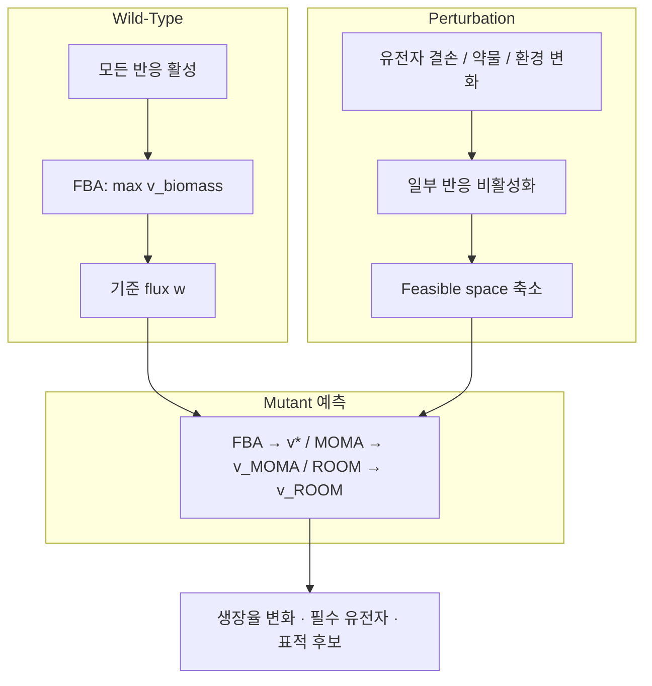
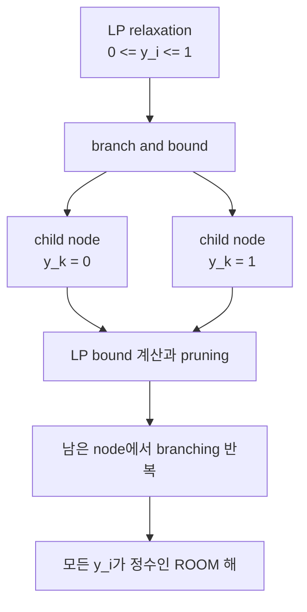
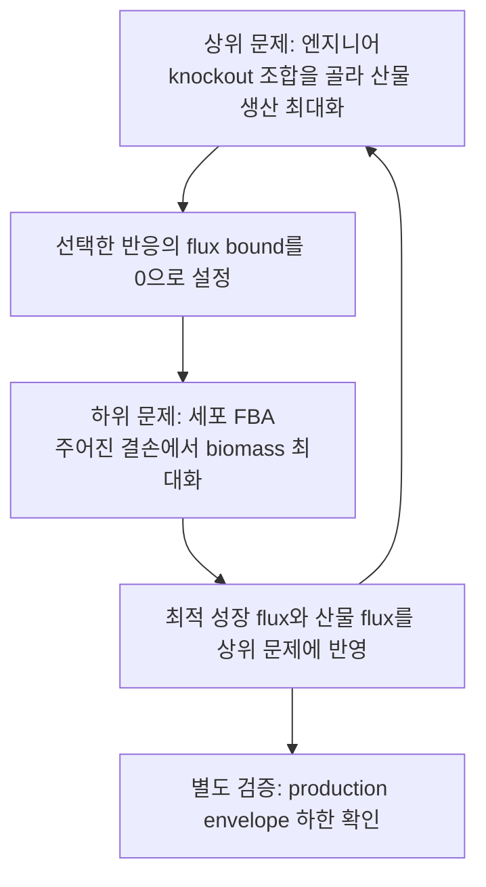

# Chapter 8. 미생물·세포공장·합성생물학 응용

> 유전자 하나를 껐을 때 세포는 무엇을 할까요? 이 장에서는 유전자 결손(gene knockout)이 대사 흐름에 미치는 영향을 예측하는 세 방법(FBA·MOMA·ROOM)을 손으로 계산하며 배우고, 이를 발판으로 미생물을 유용 물질 **세포 공장(cell factory)**으로 재설계하는 **균주 설계(strain design)** 알고리듬과 여러 미생물이 대사를 나누는 **커뮤니티(community) 모델링**까지 나아갑니다. 이 장을 마치면 여러분은 `e_coli_core`로 단일·이중 결손, MOMA/ROOM, production envelope를 직접 실행하고 그 결과를 해석할 수 있게 됩니다.


유전자 회로·표준 부품·ALE·바이오센서에서 세포공장 설계로 이어지는 큰 그림은 [준비 학습 C: 합성생물학에서 GEM 기반 세포공장까지](supplements/synthetic-biology.md)를 함께 보십시오.


## 이 장을 시작하며

여러분이 맥주 양조장을 운영한다고 상상해 봅시다. 효모는 포도당을 먹고 열심히 에탄올을 뱉어냅니다. 그런데 어느 날 이런 생각이 듭니다 — "효모가 에너지를 자기 몸집 불리는 데 그만 쓰고, 내가 팔고 싶은 물질을 더 많이 만들게 할 수는 없을까?" 세포를 마치 **공장의 생산 라인처럼 개조**하는 것, 이것이 이 장의 핵심 질문입니다.

[Chapter 4](chapter-4.-flux-balance-analysis-fba.md)에서 우리는 [FBA](chapter-4.-flux-balance-analysis-fba.md)로 "세포가 최적으로 행동할 때 어떤 flux 분포를 택하는가"를 계산했습니다. [Chapter 7](chapter-7..md)에서는 그 도구를 질병에 겨눠, "어떤 유전자를 **끄면**(knockout) 암세포를 굶겨 죽일 수 있는가"를 물었습니다. 이제 산업 현장으로 무대를 옮기면 질문의 방향이 정반대가 됩니다 — "어떤 유전자를 끄고 켜야 세포가 **더 많이 만들어낼까**?" MOMA·ROOM의 핵심만 먼저 복습하려면 [Perturbation 분석 보충](supplements/perturbation-analysis.md), 원 논문을 순서대로 읽으려면 [필독 논문 통합 가이드](landmark-papers.md)를 참고하십시오.

> **잠깐, 생각해보기:** 암 표적 발굴(Ch7)과 세포 공장 설계(Ch8)는 정반대의 목적을 가지는데, 왜 같은 유전자 결손·FBA 도구를 쓸 수 있을까요? 힌트: 두 경우 모두 "유전자를 껐을 때 대사 흐름이 어떻게 재배치되는가"라는 **동일한 예측 문제**를 풀며, 다만 그 예측을 "생장 억제"에 쓰느냐 "생산 증대"에 쓰느냐만 다릅니다.

하지만 곧바로 곤란한 사실과 마주합니다. Ch4의 FBA는 돌연변이도 지정한 목적을 재최적화한다고 가정하지만, 결손 직후 세포가 새 최적 상태에 도달한다는 보장은 없습니다. 이 차이를 시험하기 위해 **MOMA**와 **ROOM**이라는 두 대안 가설이 등장했습니다. 뒤에서는 FBA·FVA 또는 MOMA·ROOM을 평가 층으로 활용하는 균주 설계 알고리듬(OptKnock, OptForce, OptGene, FSEOF)으로 확장합니다. 실행 예제는 [Chapter 1](chapter-1..md)의 `e_coli_core`(반응 95, 대사물 72, 유전자 137)를 사용합니다.

---

## 학습 목표

이 장을 마치면 학습자는 다음을 할 수 있게 됩니다.

**이론적 목표**
1. Perturbation(섭동) 분석의 대수적 기초 — null space, feasible space, 세 가지 제약(화학량론적·열역학적·perturbation-specific) — 을 설명할 수 있다.
2. **GPR (Gene-Protein-Reaction)** 규칙의 Boolean 평가를 통해 유전자 결손이 반응 비활성화로 이어지는 메커니즘을 손으로 추론하고, 단일/이중 결손 결과를 essential/growth-reduced/non-essential로 분류할 수 있다.
3. MOMA의 이차계획법(QP) 정형화와 ROOM의 혼합정수선형계획법(MILP) 정형화를 수식으로 설명하고 두 방법을 비교할 수 있다.
4. OptKnock, OptForce, OptGene, FSEOF 등 균주 설계 알고리듬의 수학적 정형화와 적용 맥락의 차이를 설명할 수 있다.
5. Production envelope와 phenotype phase plane이 생산-생장 트레이드오프를 어떻게 시각화하는지 꼭짓점을 손으로 읽으며 설명할 수 있다.
6. 커뮤니티 대사 모델링의 개념(cross-feeding, competition, mutualism)과 대표 프레임워크(MICOM, SteadyCom, OptCom, COMETS)의 차이를 설명할 수 있다.

**실습적 목표**
7. COBRApy로 단일/이중 유전자 결손, `moma()`, `room()`을 실행하고 결과를 비교·시각화할 수 있다.
8. `production_envelope()`로 생산 포락선을 계산하고 growth-coupled 여부를 판정할 수 있다.
9. 두 개의 최소 모델을 이어 붙여 cross-feeding 커뮤니티 모델을 만들고 FBA로 분석할 수 있다.

**통합적 목표**
10. 연구 질문(과도 상태 vs. 안정 상태, 약물 표적 스크리닝 vs. 균주 설계, 단일 종 vs. 커뮤니티)에 따라 이 장에서 다룬 방법 중 적절한 것을 선택하는 기준을 제시할 수 있다.

---

## 1. Perturbation 분석: 유전자 결손의 대수적·생물학적 기초

### 1.1 왜 배우나: perturbation이 만드는 "가능성의 축소"

**동기 먼저.** 균주를 설계하려면 "이 유전자를 끄면 세포가 어떻게 반응할까?"를 예측할 수 있어야 합니다. 그 예측의 출발점은 놀랍도록 단순한 관찰 하나입니다 — **유전자를 끄면 세포가 할 수 있는 일이 줄어든다.**

**Perturbation(섭동)**은 대사 네트워크에 가해지는 유전적·환경적·화학적 변화입니다. 유전자 결손, 과발현, 배지 조성 변화, 효소 저해제 처리가 모두 perturbation의 예입니다. [Chapter 4](chapter-4.-flux-balance-analysis-fba.md)에서 다룬 FBA의 기본 제약에 perturbation을 추가하면, 가능한 flux distribution의 집합인 **feasible space(가능 영역)**가 다음 세 가지 제약의 교집합으로 정의됩니다.

$$\mathcal{P} = \{\mathbf{v} \in \mathbb{R}^n : \mathbf{S}\mathbf{v} = \mathbf{0}, \; \mathbf{v}^{\min} \leq \mathbf{v} \leq \mathbf{v}^{\max}, \; v_j = 0 \; \forall j \in \mathcal{A}\}$$

| 제약 | 의미 |
|:---|:---|
| **화학량론적 제약** $$\mathbf{S}\mathbf{v} = \mathbf{0}$$ | 각 대사물질의 steady-state 질량보존 (Chapter 2·4) |
| **열역학적/용량 제약** $$v_i^{\min} \leq v_i \leq v_i^{\max}$$ | 반응의 방향성과 최대 용량 |
| **Perturbation 제약** $$v_j = 0,\; j \in \mathcal{A}$$ | 결손·저해로 비활성화된 반응 집합 $$\mathcal{A}$$ |

Perturbation 전의 feasible space를 $$\mathcal{P}_{WT}$$(wild-type), 이후를 $$\mathcal{P}_{MUT}$$(mutant)라 하면

$$\mathcal{P}_{MUT} = \mathcal{P}_{WT} \cap \{\mathbf{v} : v_j = 0,\, j \in \mathcal{A}\} \subseteq \mathcal{P}_{WT}$$

입니다. 즉 **perturbation은 feasible space를 축소시키거나 그대로 유지할 뿐, 절대 확장하지 않습니다.**

> **잠깐, 생각해보기:** 유전자를 하나 끄면(반응 하나를 $$v_j=0$$으로 강제하면) 세포가 택할 수 있는 flux 조합의 "개수"는 늘어날까요, 줄어들까요? 답: 반드시 줄거나 그대로입니다. 제약을 하나 더 얹는 것은 선택지에 새 조건을 부과하는 것이므로, 원래 가능하던 해 중 "$$v_j=0$$을 만족하지 않던" 해들이 통째로 제거되기 때문입니다.

이 장 전체는 "축소된 feasible space 안에서 세포가 실제로 어떤 flux distribution을 택하는가"라는 질문에 대한 서로 다른 답변들 — FBA, MOMA, ROOM, 그리고 이들을 발판으로 한 균주 설계 — 을 다룹니다.



### 1.2 Null space와 feasible space의 기하학

Chapter 2에서 배운 것을 잠시 떠올려 봅시다. Stoichiometric matrix $$\mathbf{S}$$ ($$m$$개 대사물질 × $$n$$개 반응)에 대해 steady-state 조건 $$\mathbf{S}\mathbf{v} = \mathbf{0}$$을 만족하는 모든 $$\mathbf{v}$$의 집합이 **null space(영공간)** $$\mathcal{N}(\mathbf{S})$$이며, 그 차원은

$$\dim(\mathcal{N}(\mathbf{S})) = n - \text{rank}(\mathbf{S})$$

입니다. COBRApy `load_model("textbook")`의 화학량론 행렬은 $$n=95$$, $$\operatorname{rank}(\mathbf{S})=67$$이므로 영공간 차원은 $$95-67=28$$입니다. 반응 상·하한과 knockout 제약이 추가되면 실제 feasible space의 차원은 더 낮아질 수 있습니다.

비유하자면, feasible space는 "세포가 살 수 있는 모든 방식을 담은 방"입니다. Knockout으로 반응 $$j$$의 $$v_j=0$$이 강제되면 그 방의 한 차원(벽)이 잘려나가 방의 부피가 줄어듭니다 — 이것이 1.1절의 $$\mathcal{P}_{MUT} \subseteq \mathcal{P}_{WT}$$ 관계의 기하학적 근거입니다.

### 1.3 GPR 규칙을 통한 반응 비활성화 — 손으로 해보기

유전자 결손을 반응 비활성화로 변환하는 절차가 **in silico gene deletion**이며, [Chapter 3](chapter-3.-genome-scale-metabolic-model-gem.md)에서 소개한 **GPR (Gene-Protein-Reaction)** 규칙의 Boolean 평가로 이루어집니다. 규칙은 두 가지 논리 연산으로 요약됩니다.

| GPR 표현 | 생물학적 의미 | 결손 시 반응 상태 |
|:---|:---|:---|
| `geneA` | 단일 유전자가 효소를 인코딩 | geneA 결손 → 비활성화 |
| `geneA or geneB` | Isozyme(동일 기능의 복수 효소) | **둘 다** 결손되어야 비활성화 |
| `geneA and geneB` | 헤테로다이머 효소(복합체) | **하나만** 결손해도 비활성화 |
| `(geneA and geneB) or geneC` | 복합 조합 | geneC가 살아있으면 활성 유지 |

평가 절차는 간단합니다. ① 결손된 유전자를 `False`, 나머지를 `True`로 치환 ② Boolean 식을 계산 ③ 결과가 `False`이면 $$v_j^{\min} = v_j^{\max} = 0$$으로 설정합니다.

**손으로 직접 계산해 봅시다.** 세 개의 반응과 다섯 개의 유전자로 이루어진 장난감 예제를 생각합니다.

- 반응 $$R_a$$: GPR = `g1 or g2` (isozyme)
- 반응 $$R_b$$: GPR = `g3 and g4` (복합체)
- 반응 $$R_c$$: GPR = `(g1 and g4) or g5`

**단일 결손 `g1`을 시험**해 봅시다. `g1=False`, 나머지 `True`를 대입합니다.

| 반응 | Boolean 식 대입 | 결과 | 반응 상태 |
|:---|:---|:---:|:---:|
| $$R_a$$ | `False or True` | `True` | ✅ 활성 (g2가 대신 수행) |
| $$R_b$$ | `True and True` | `True` | ✅ 활성 (g1 무관) |
| $$R_c$$ | `(False and True) or True` | `True` | ✅ 활성 (g5가 대신 수행) |

`g1` 하나를 껐지만 세 반응 모두 살아남았습니다 — 이것이 대사 네트워크가 **강건한(robust)** 유전적 이유입니다.

이번엔 **이중 결손 `g1`+`g2`**를 시험합니다.

| 반응 | Boolean 식 대입 | 결과 | 반응 상태 |
|:---|:---|:---:|:---:|
| $$R_a$$ | `False or False` | `False` | ❌ **비활성** ($$v_{R_a}=0$$) |
| $$R_b$$ | `True and True` | `True` | ✅ 활성 |
| $$R_c$$ | `(False and True) or True` | `True` | ✅ 활성 (g5 생존) |

두 isozyme을 모두 껐더니 비로소 $$R_a$$가 꺼집니다. 반대로 복합체 $$R_b$$는 `g3` **하나만** 꺼도 (`False and True = False`) 즉시 비활성화됩니다. 이 비대칭 — "isozyme은 둘 다, 복합체는 하나만" — 이 knockout 예측의 핵심 직관입니다.


💡 **팁:** COBRApy에서는 `gene.knock_out()`이 이 Boolean 평가를 자동으로 수행해 연관된 모든 반응의 bound를 조정합니다. `with model:` 블록 안에서 실행하면 블록을 벗어날 때 원래 상태로 자동 복원되므로, 수백 개 유전자를 순차적으로 껐다 켜며 스크리닝할 때 매우 편리합니다.


### 1.4 대사 네트워크의 강건성과 취약성

방금 손으로 확인했듯, 대부분의 단일 유전자 결손이 생장을 완전히 멈추지 않는 이유는 다음 세 가지 네트워크 구조 때문입니다.

| 특성 | 설명 |
|:---|:---|
| **중복성(redundancy)** | 동일 기능을 수행하는 여러 병렬 경로 존재 |
| **퇴화성(degeneracy)** | 구조적으로 다른 구성 요소가 유사 기능 수행 (isozyme) |
| **모듈성(modularity)** | 기능적으로 독립된 모듈 조직으로 손상 파급 제한 |

반대로 일부 유전자는 **필수적(essential)**입니다 — 대체 경로가 없는 unique pathway, 핵심 대사물질을 잇는 hub metabolite(Chapter 2에서 본 ATP·NADH 같은 고연결 대사물), 또는 개별로는 비필수지만 조합되면 치명적인 **합성 치사(synthetic lethality)**(§2.4) 때문입니다. 이 강건성/취약성의 경계를 정량화하는 것이 다음 절의 essentiality 분석입니다.


🔑 **핵심 개념 · 용어(English):** **Perturbation(섭동)** — 유전적·환경적·화학적 변화에 의해 대사 네트워크의 feasible space와 flux distribution이 재배치되는 과정. **GPR (Gene-Protein-Reaction)** — 유전자·단백질·반응의 관계를 Boolean logic으로 표현한 규칙. **Null space(영공간)** — $$\mathbf{Sv}=\mathbf{0}$$을 만족하는 모든 flux 벡터의 집합.


---

## 2. Gene Knockout 분석: 단일/이중 결손과 필수성 매핑

### 2.1 단일 유전자 결손과 결과 분류

**동기.** 균주를 설계하려면 먼저 "어떤 유전자를 절대 건드리면 안 되는가(필수 유전자)"와 "어떤 유전자는 꺼도 되는가"를 알아야 합니다. **단일 유전자 결손 분석(single gene deletion analysis)**은 모델의 각 유전자를 하나씩 결손시키고 FBA로 생장율을 재계산하는 체계적 절차이며, 결과는 관례적으로 세 범주로 분류됩니다.

| 분류 | 기준 (WT 대비 생장율 비율) | 생물학적 의미 |
|:---|:---|:---|
| **Essential (필수)** | $$\approx 0$$ | 대체 불가능한 기능 — 결손 세포 생존 불가 |
| **Growth-reduced (생장 감소)** | $$0 < r < 0.9$$ | 대체 경로는 있으나 비효율적(추가 ATP 소모, cofactor 불균형) |
| **Non-essential (비필수)** | $$\geq 0.9$$ | 완전한 대체 경로 존재 — 네트워크 강건성의 발현 |

> 💡 **실습: `e_coli_core`로 단일 유전자 결손 스크리닝**

```python
# 목적: e_coli_core의 137개 유전자를 하나씩 껐을 때 생장율을 재계산해 필수 유전자를 찾는다
from cobra.io import load_model
from cobra.flux_analysis import single_gene_deletion

model = load_model("textbook")                # 반응 95, 대사물 72, 유전자 137
wt_growth = model.slim_optimize()              # 야생형 성장률 ≈ 0.874 h⁻¹

deletion_results = single_gene_deletion(model, processes=1)
# infeasible은 해당 조건에서 가능한 생장 해가 없다는 뜻이므로 필수성 분류에서는 0으로 둔다.
deletion_results["growth_ratio"] = deletion_results["growth"].fillna(0) / wt_growth

essential = deletion_results[deletion_results["growth_ratio"] < 0.01]
growth_reduced = deletion_results[
    (deletion_results["growth_ratio"] >= 0.01) &
    (deletion_results["growth_ratio"] < 0.9)
]
nonessential = deletion_results[deletion_results["growth_ratio"] >= 0.9]
print(f"전체 유전자 수: {len(deletion_results)}")
print(len(essential), len(growth_reduced), len(nonessential))
# COBRApy 0.30 textbook 기본 조건: 전체 137, 필수 7, 생장감소 24, 비필수 106
```

> **잠깐, 생각해보기:** 기본 포도당 배지의 축소 모델에서 106개 유전자가 WT 생장의 90% 이상을 유지한다는 것은 네트워크 중복성과 제한된 배지·목표의 결과입니다. 이를 "안심하고 삭제 가능"으로 일반화하면 안 됩니다. 다른 탄소원, 스트레스, 경쟁 배양, 조절·동역학 제약에서는 조건부 필수가 될 수 있으므로 배지별 재계산과 실험 검증이 필요합니다.

### 2.2 대규모 essentiality 스크리닝과 실험적 검증

*E. coli*의 경우 Baba et al. (2006)이 구축한 **Keio collection**(3,985개 단일 유전자 결손 돌연변이 라이브러리)이 실험적 필수성 판정의 기준이 됩니다. in silico(FBA 기반) 예측과 in vivo(실험) 필수성을 비교하면 완벽히 일치하지 않는데, 이는 모델 불완전성, 규제 효과 미반영, kinetic 한계, 그리고 **조건 특이적 필수성(condition-dependent essentiality)** 때문입니다.

| 연구 | 모델 | 예측 정확도 |
|:---|:---|---:|
| Edwards & Palsson (2000) | *E. coli* iJE660a | ~82% |
| Joyce et al. (2006) | *E. coli* iJR904 (rich medium) | ~89% |
| Förster et al. (2003) | *S. cerevisiae* iFF708 | ~71% |

배지 조성(glucose minimal vs. rich medium), 산소 조건, 스트레스 조건에 따라 필수성이 달라지므로, 실무에서는 exchange reaction bound를 바꿔가며 스크리닝을 반복해 **조건별 필수성 지도(condition-specific essentiality map)**를 구축합니다.

### 2.3 FBA 기반 KO의 한계: 최적성 가정 문제

단일/이중 결손 스크리닝은 매 시나리오마다 FBA를 다시 풀어 mutant가 지정한 목적을 재최적화한 상태를 예측합니다. 이 가정은 적응된 상태에는 유용할 수 있지만, 결손 직후에는 성립하지 않을 수 있습니다.

1. **진화적 적응의 부재**: 인위적으로 결손된 균주는 새로운 유전적 배경에 최적화될 시간이 없었습니다.
2. **규제 네트워크의 경직성**: transcription factor·signaling network는 빠르게 재배선되지 않습니다.
3. **Kinetic constraint 무시**: 효소 발현량·촉매 상수가 반영되지 않습니다.
4. **시간적 차원의 무시**: FBA는 steady-state만 다루어 perturbation 직후의 과도 상태를 포착하지 못합니다.


❓ **흔한 오해:** "유전자를 껐을 때의 성장률을 FBA로 계산하면 그게 실제 돌연변이 균주의 성장률 아닌가요?" — 아닙니다. FBA가 주는 값은 돌연변이가 **새로운 목적 최적 상태를 이미 찾았다고 가정한 상한적 예측**입니다. 적응되지 않은 세포가 옛 flux에 가깝게 머물 수 있다는 것은 MOMA가 시험하는 대안 가설이지 모든 결손의 보편적 사실은 아닙니다. FBA가 일부 결손에서 실제보다 낙관적일 수 있는 이 간극을 비교하기 위해 §3의 MOMA와 §4의 ROOM을 함께 사용합니다.


### 2.4 이중 결손과 합성 치사(Synthetic Lethality) — 손으로 계산하기

**이중 유전자 결손(double gene deletion)** 분석은 두 유전자를 동시에 결손시켜 유전적 상호작용(genetic interaction)을 정량화합니다. 계산 복잡도는 $$O(G^2)$$로, genome-scale 모델(유전자 수 $$G$$가 수천)에서는 조합적 폭발이 문제가 되어 비필수 유전자로 후보를 좁히거나 병렬화가 필요합니다.

두 유전자의 상호작용은 **epistasis score(에피스태시 점수)**로 정량화됩니다.

$$\varepsilon_{ij} = W_{ij} - W_i \cdot W_j$$

여기서 $$W_i, W_j$$는 각각 유전자 $$i$$, $$j$$ 단일 결손 시 fitness(WT 대비 생장율), $$W_{ij}$$는 이중 결손 시 fitness입니다. 핵심 아이디어는 "두 유전자가 서로 무관하다면 이중 결손의 효과는 개별 효과의 **곱**($$W_i W_j$$)일 것"이라는 곱셈 기대(multiplicative expectation)입니다.

**손으로 직접 계산해 봅시다.** 두 유전자 X, Y가 각각 단일 결손 시 $$W_X=0.8$$, $$W_Y=0.7$$이라 하자. 곱셈 기대값은 $$0.8 \times 0.7 = 0.56$$입니다. 이제 이중 결손을 실제로 측정한 값 $$W_{XY}$$에 따라 판정합니다.

| 관측된 $$W_{XY}$$ | $$\varepsilon_{XY}=W_{XY}-0.56$$ | 판정 | 해석 |
|:---:|:---:|:---|:---|
| $$0.56$$ | $$0$$ | **Independent(독립적)** | 두 유전자가 서로 다른 경로 |
| $$0.40$$ | $$-0.16$$ | **Synergistic(상승적)** | 예상보다 심각 — 병렬 경로 (중복 기능) |
| $$0.05$$ | $$-0.51$$ | **Synthetic lethal에 근접** | $$W_{XY}\approx 0$$, 두 병렬 경로를 모두 차단 |
| $$0.70$$ | $$+0.14$$ | **Antagonistic(길항적)** | 예상보다 덜 심각 — buffering |

$$\varepsilon_{XY}$$가 음수일수록 두 유전자는 서로의 기능을 백업하는 병렬 관계이고, 그 백업이 완전할 때($$W_{XY}\approx 0$$) **합성 치사(synthetic lethality, SL)**가 됩니다.

> 💡 **실습: Epistasis score 계산 함수**

```python
# 목적: 두 유전자의 단일/이중 결손 fitness로부터 epistasis score를 계산한다
import numpy as np

def calculate_epistasis(model, gene_i, gene_j):
    def growth_or_zero(m):
        solution = m.optimize()
        if solution.status != "optimal" or not np.isfinite(solution.objective_value):
            return 0.0
        return max(0.0, float(solution.objective_value))

    wt = growth_or_zero(model)
    if wt <= 0:
        raise ValueError("WT 모델이 현재 배지·목적함수에서 성장하지 않습니다.")
    with model as m:                       # with 블록: 나갈 때 자동 복원
        m.genes.get_by_id(gene_i).knock_out()
        w_i = growth_or_zero(m) / wt
    with model as m:
        m.genes.get_by_id(gene_j).knock_out()
        w_j = growth_or_zero(m) / wt
    with model as m:
        m.genes.get_by_id(gene_i).knock_out()
        m.genes.get_by_id(gene_j).knock_out()
        w_ij = growth_or_zero(m) / wt
    epsilon = w_ij - w_i * w_j
    return w_i, w_j, w_ij, epsilon

# 예: W_i=0.8, W_j=0.7, W_ij=0.4 -> epsilon = 0.4 - 0.56 = -0.16 (synergistic)
```

합성 치사는 4가지 유형으로 분류됩니다.

| 유형 | 개별 KO | 이중 KO | 메커니즘 |
|:---|:---|:---:|:---|
| I. Synthetic Lethal | 둘 다 비필수 | $$\approx 0$$ | 완전한 병렬 경로 |
| II. Synthetic Sick | 둘 다 경미한 결손 | $$\ll W_i, W_j$$ | 부분적 기능 중복 |
| III. Synthetic Dosage Lethal | 과발현 + 결손 | $$\approx 0$$ | 과발현 단백질이 결손 유전자 기능에 의존 |
| IV. Complementary SL | 조건부 필수 | $$\approx 0$$ | 모든 조건에서 치명적으로 결합 |

합성 치사 탐색의 산업적·의학적 가치는 큽니다. 병원성 미생물에서는 **broad-spectrum** 또는 **species-specific** 항생제 표적으로, 종양에서는 정상세포에 무해하면서 암세포만 선택적으로 사멸시키는 표적으로 활용됩니다. 대표적 임상 사례인 **PARP 저해제-BRCA 결핍** 합성 치사와, 환자 유전체 기반 표적 예측·MTA(Metabolic Transformation Algorithm)는 [Chapter 7](chapter-7..md)에서 자세히 다룹니다. 여기서는 합성 치사가 **이중 결손 분석의 자연스러운 산물**이라는 메커니즘적 관점에 집중합니다.


🔑 **핵심 개념 · 용어(English):** **Essentiality(필수성)** — 유전자 결손이 생장을 불가능하게 만드는 정도. **Epistasis(에피스태시)** — 두 유전자의 결합 효과가 개별 효과의 곱과 다른 정도. **Synthetic lethality(합성 치사)** — 개별로는 비필수이나 동시 결손 시 치명적인 유전자 쌍.


---

## 3. MOMA: Minimization of Metabolic Adjustment

### 3.1 근접성 원리(Proximity Principle)

**동기.** §2.3에서 FBA가 돌연변이 성장률을 낙관적으로 예측한다는 것을 봤습니다. 그렇다면 "최적화되지 않은 돌연변이 세포"는 실제로 어떤 flux를 택할까요?

**비유 먼저.** 매일 다니던 통근길이 공사로 막혔다고 합시다. 여러분은 지도를 펼쳐 "이론적으로 가장 빠른 완전히 새로운 경로"를 찾나요? 아니면 원래 길에서 **가능한 한 조금만 벗어난** 우회로를 택하나요? 대부분의 사람은 후자입니다. 세포도 마찬가지입니다.

**MOMA (Minimization of Metabolic Adjustment)**는 Segrè, Vitkup, Church (2002)가 제안한 방법으로, mutant가 곧바로 새 성장 최적점을 택하기보다 wild-type 상태에서 최소한만 벗어난다는 **근접성 원리(proximity principle)**를 가정합니다. 진화적으로 최적화되지 않은 돌연변이나 perturbation 초기 상태를 설명할 후보 가설로 자주 쓰이지만, 시간대만으로 타당성이 보장되지는 않으며 원 논문도 결손 직후를 시간분해 측정하지 않았습니다.

### 3.2 이차계획법(QP) 정형화

MOMA는 mutant flux $$\mathbf{v}$$가 wild-type 기준 flux $$\mathbf{w}$$(실측 플럭스 또는 계산한 대표 해)로부터 최소한의 **Euclidean distance(유클리드 거리)**만큼 떨어지도록 하는 이차계획법(quadratic programming, QP) 문제를 풉니다.

$$\min_{\mathbf{v}} \; \|\mathbf{v} - \mathbf{w}\|_2^2 = \sum_{i=1}^{n} (v_i - w_i)^2$$

$$\text{s.t.} \quad \mathbf{S}\mathbf{v} = \mathbf{0}, \quad \mathbf{v}^{\min} \leq \mathbf{v} \leq \mathbf{v}^{\max}, \quad v_j = 0 \; \forall j \in \mathcal{A}$$

목적함수의 Hessian은 $$\nabla^2 f(\mathbf{v}) = 2\mathbf{I}$$로 **positive definite**이며, 따라서 $$f$$는 **strictly convex(엄격 볼록)**입니다. 선형 제약 하에서 strictly convex QP는 feasible space가 비어있지 않은 한 **유일한 전역 최적해**를 갖습니다 — 이는 여러 대안 최적해(alternate optima)가 흔한 LP 기반 FBA와 대비되는 중요한 성질입니다. 기하학적으로 MOMA 해는 wild-type 점 $$\mathbf{w}$$를 mutant feasible space $$\mathcal{P}_{MUT}$$ 위로 **투영(projection)**한 것입니다.

$$\mathbf{v}^{MOMA} = \arg\min_{\mathbf{v} \in \mathcal{P}_{MUT}} \|\mathbf{v} - \mathbf{w}\|_2^2$$


*그림 8.1: 보라색 야생형 기준점에서 돌연변이 feasible polytope까지의 가장 짧은 유클리드 거리가 주황색 quadratic MOMA 해를 정합니다. 초록색 별은 같은 영역에서 성장을 최대화한 FBA 해로, MOMA 해와 일치할 필요가 없습니다. 이는 QP의 투영 원리를 설명하기 위한 2차원 모식도이며 `e_coli_core`를 계산해 축소 투영한 결과가 아닙니다.*

즉 "막힌 통근길에서 원래 경로와 가장 가까운 대안"을 수학적으로 정확히 찾는 것이 MOMA입니다.

### 3.3 Euclidean distance minimization의 의미

목적함수 $$(v_i - w_i)^2$$는 변화량이 클수록 **제곱으로 무겁게 penalize**됩니다. 그 결과 MOMA는 "여러 반응의 작은 조정"을 선호하고 "소수 반응의 큰 변화"를 회피합니다. 그러나 이 성질은 한계이기도 합니다 — 대안 경로로 우회하려면 그 경로에 속한 여러 반응이 동시에 크게 바뀌어야 하는데, Euclidean metric은 이런 **경로 재배선(pathway rerouting)**을 불필요하게 penalize합니다. 이 한계가 §4의 ROOM을 낳은 핵심 동기입니다.

계산 비용을 줄이기 위한 **lin_MOMA**는 $$L_2$$-norm 대신 $$L_1$$-norm을 최소화하는 LP로 근사합니다.

$$\min_{\mathbf{v}} \; \sum_i |v_i - w_i|$$

$$L_1$$-norm은 희소해(sparse solution)를 선호하여 소수 반응만 변하고 나머지는 정확히 $$w_i$$를 유지하는 경향을 보이며, MOMA와 ROOM의 중간적 성격을 갖습니다.

### 3.4 적용: 돌연변이 예측과 균주 설계


**꼭 알아야 할 논문 — MOMA.** Segrè, Vitkup & Church (2002), *Analysis of optimality in natural and perturbed metabolic networks* (doi: `10.1073/pnas.232349399`)는 mutant feasible space에서 야생형 flux와의 Euclidean 거리를 최소화하는 QP를 제안했습니다. `pykA/pykF` 이중 결손에서는 두 carbon-limited 조건의 absolute flux와 세 조건 모두의 상대 flux 변화가 FBA보다 잘 설명됐지만, 원 논문은 결손 직후를 시간분해 측정하지 않았습니다. 따라서 MOMA를 “초기 반응의 정답”이 아니라 실측 flux로 검증할 상태 선택 가설로 다뤄야 합니다.


대사공학적으로 설계된 균주는 진화적으로 최적화되지 않았을 수 있으므로, §6에서 다룰 **OptGene**은 MOMA를 시뮬레이션 레이어로 선택할 수 있습니다. 그러나 MOMA가 모든 결손·시간대에서 FBA보다 우월하다는 뜻은 아니며, 기준 flux와 실험 시점에 대한 민감도를 함께 확인해야 합니다.

> 💡 **실습: isozyme 함정을 확인하고 linear MOMA 실행**

```python
# COBRApy 0.30: moma(..., linear=True)가 기본값이다.
from cobra.flux_analysis import moma, pfba

biomass_id = "Biomass_Ecoli_core"
wt_reference = pfba(model)  # 한 대표 WT flux; pFBA도 유일성을 절대 보장하지는 않는다.

# pykF(b1676) 하나만 끄면 pykA(b1854)가 PYK를 대신하므로 성장 결손이 없다.
print(model.reactions.PYK.gene_reaction_rule)  # b1854 or b1676
with model as pykf_mutant:
    pykf_mutant.genes.get_by_id("b1676").knock_out()
    print("pykF KO FBA growth:", pykf_mutant.slim_optimize())  # WT와 사실상 동일

# 실제 flux 재배치를 보기 위해 tpiA(b3919) 결손을 예로 든다.
with model as mutant:
    mutant.genes.get_by_id("b3919").knock_out()
    fba_solution = mutant.optimize()
    lmoma_solution = moma(mutant, wt_reference, linear=True)

    print("FBA growth:", fba_solution.fluxes[biomass_id])
    print("linear MOMA distance:", lmoma_solution.objective_value)
    print("linear MOMA growth:", lmoma_solution.fluxes[biomass_id])

    # 원 논문의 quadratic MOMA는 QP 지원 솔버가 필요하다.
    # qmoma_solution = moma(mutant, wt_reference, linear=False)
```

`moma_solution.objective_value`는 성장률이 아니라 **WT와의 거리 목적값**입니다. 성장률은 반드시 바이오매스 반응의 flux에서 읽어야 합니다. 또한 quadratic MOMA와 linear MOMA는 서로 다른 목적함수를 풀므로 결과를 섞어 해석하면 안 됩니다.

---

## 4. ROOM: Regulatory On/Off Minimization

### 4.1 규제 최소성 원리(Regulatory Parsimony)

**동기.** MOMA는 "모든 반응을 조금씩 바꾼다"고 봤습니다. 그런데 세포의 유전자 조절은 정말 그렇게 작동할까요?

**비유 먼저.** 100개의 전등이 있는 방에서 밝기를 바꿔야 한다고 합시다. MOMA는 모든 전등의 밝기 다이얼을 아주 조금씩 돌립니다. 하지만 실제 세포의 유전자 스위치는 다이얼보다 **on/off 스위치**에 가깝습니다 — 소수의 스위치만 딸깍 켜거나 끄는 것이죠.

**ROOM (Regulatory On/Off Minimization)**은 Shlomi, Berkman, Ruppin (2005)이 제안한 방법으로, "세포는 flux의 거리보다 **변경해야 하는 반응의 수**를 최소화하려 한다"는 가정에 기반합니다. 이는 transcriptional regulation이 본질적으로 on/off에 가깝고, operon 구조로 하나의 규제 신호가 여러 반응을 동시에 조절한다는 생물학적 관찰에 근거합니다.

### 4.2 혼합정수선형계획법(MILP) 정형화

ROOM은 각 반응 $$i$$에 대해 "wild-type 범위를 유의하게 벗어났는가"를 나타내는 이진 변수 $$y_i \in \{0,1\}$$를 도입해 다음 MILP를 풉니다.

$$\min_{\mathbf{v}, \mathbf{y}} \; \sum_{i=1}^{n} y_i$$

$$\text{s.t.} \quad \mathbf{S}\mathbf{v} = \mathbf{0}, \quad \mathbf{v}^{\min} \leq \mathbf{v} \leq \mathbf{v}^{\max}, \quad v_j = 0 \; \forall j \in \mathcal{A}$$

$$v_i - y_i(v_i^{\max} - w_i^{\mathrm{up}}) \leq w_i^{\mathrm{up}}, \qquad v_i - y_i(v_i^{\min} - w_i^{\mathrm{lo}}) \geq w_i^{\mathrm{lo}}$$

여기서 $$w_i^{\mathrm{up}} = w_i + \delta|w_i| + \varepsilon$$, $$w_i^{\mathrm{lo}} = w_i - \delta|w_i| - \varepsilon$$이며, $$\delta$$(상대 허용치)와 $$\varepsilon$$(절대 허용치)가 **tolerance threshold(허용 임계값)**입니다. $$y_i=0$$이면 $$v_i$$는 wild-type 근방 $$[w_i^{\mathrm{lo}}, w_i^{\mathrm{up}}]$$에 묶이고, $$y_i=1$$이면 자유롭게 벗어날 수 있습니다. 목적함수 $$\sum_i y_i$$는 "유의하게 변한 반응의 총 수"(켜진 스위치의 개수)를 최소화합니다.


*그림 8.2: 연한 파란 띠는 반응별 야생형 tolerance 구간이고, 초록 마름모는 구간 안에 남아 $$y_i=0$$인 돌연변이 flux, 주황 마름모는 구간을 벗어나 $$y_i=1$$인 flux입니다. ROOM은 주황 마름모의 거리 합이 아니라 그 **개수**를 최소화합니다. 수치를 임의로 정한 MILP 개념 모식도이며 COBRApy 계산 결과가 아닙니다.*

이 부등식은 **Big-M 방법**으로 논리 조건을 선형화한 것입니다. ROOM의 MILP는 이론적으로 NP-hard이지만, **branch-and-bound**(LP relaxation → branching → pruning)와 presolve·cutting plane 등 현대 solver 기법(Gurobi, CPLEX)으로 genome-scale 모델에서도 실용적 시간 내에 풀립니다.



*그림 8.3: ROOM MILP를 푸는 branch-and-bound의 개념 흐름입니다. 실제 solver는 presolve·cut·휴리스틱과 더 복잡한 node 선택을 함께 사용하므로, 이 도식은 특정 solver의 실행 로그나 성능 측정이 아닙니다.*


❓ **흔한 오해:** "MOMA와 ROOM은 둘 다 wild-type에 가깝게 유지하니까 결국 비슷한 답을 주지 않나요?" — 아닙니다. 목적함수의 **단위**가 완전히 다릅니다. MOMA는 flux 값의 **거리**(연속적 크기)를 최소화하고, ROOM은 허용 범위를 벗어난 반응의 **개수**(이산적 카운트)를 최소화합니다. 그 결과 MOMA는 많은 반응의 작은 변화를, ROOM은 소수 반응의 큰 재배선을 선호하는 경향이 있지만 실제 개수는 모델·기준 해·임계값에 따라 달라집니다.


### 4.3 Tolerance $$\delta$$의 역할과 방법 비교

| $$\delta$$ | 효과 |
|:---|:---|
| 작음 | 엄격 — 작은 변화도 허용 범위를 벗어나 $$y_i=1$$로 계산될 수 있음 |
| 중간 | 기준 flux의 측정·계산 오차를 어느 정도 허용 |
| 큼 | 느슨 — 큰 변화만 카운트되어 대안 ROOM 해가 늘 수 있음 |

COBRApy의 기본값은 $$\delta=0.03$$, $$\varepsilon=0.001$$입니다. 이 값이 모든 데이터에 보편적으로 맞는 것은 아니므로, 실측 오차와 flux 스케일을 고려해 민감도 분석을 수행해야 합니다.


**꼭 알아야 할 논문 — ROOM.** Shlomi, Berkman & Ruppin (2005), *Regulatory on/off minimization of metabolic flux changes after genetic perturbations* (doi: `10.1073/pnas.0406346102`)는 5개 결손 유전자를 여러 배지에서 측정한 9개 knockout–condition **flux 실험** 가운데 8개에서 ROOM이 기존 방법과 같거나 더 나은 flux 예측을 보였다고 보고했습니다. 평균 유의 변화 반응 수는 ROOM 12, FBA 119, MOMA 317이었고 최종 성장률 평균 상대오차는 ROOM 14%, FBA 15%, MOMA 31%였습니다. 별도의 6개 결손 적응진화 자료에서는 적응 전 **성장률**에 MOMA의 상관이 높았고($$r=0.834$$), 적응 후 성장률에는 ROOM($$r=0.727$$)과 FBA($$r=0.724$$)가 MOMA($$r=0.658$$)보다 높았습니다. 핵심은 **ROOM이 언제나 최고**가 아니라, 서로 다른 상태 가설을 별도 자료로 검증해야 한다는 점입니다.


> 💡 **실습: FBA·MOMA·ROOM 세 방법 한 번에 비교**

```python
# 목적: 같은 tpiA 결손에 대해 세 방법의 예측을 나란히 비교한다
from cobra.flux_analysis import room

with model as mutant:
    mutant.genes.get_by_id("b3919").knock_out()
    fba_sol = mutant.optimize()
    lmoma_sol = moma(mutant, wt_reference, linear=True)
    # COBRApy 0.30의 zero-tolerance linear ROOM 변형이다.
    # 원 ROOM MILP는 linear=False와 tolerance를 명시하며 더 오래 걸릴 수 있다.
    room_sol = room(mutant, wt_reference, linear=True)

    print("FBA objective (= growth):", fba_sol.objective_value)
    print("linear MOMA objective (= L1 distance):", lmoma_sol.objective_value)
    print("zero-tolerance linear ROOM objective:", room_sol.objective_value)
    print("growths:", {"FBA": fba_sol.fluxes[biomass_id],
                       "linear MOMA": lmoma_sol.fluxes[biomass_id],
                       "zero-tolerance linear ROOM": room_sol.fluxes[biomass_id]})
```

여기서는 기본 설치 환경에서 실행 시간을 줄이기 위해 COBRApy 0.30.0의 `linear=True` 변형을 사용했습니다. 이 구현은 $$y_i$$를 연속화하고 $$\delta=\varepsilon=0$$으로 재설정하므로 목적값을 “바뀐 반응 수” 또는 기본 tolerance ROOM MILP의 하한이라고 해석할 수 없습니다. 원 ROOM을 재현하려면 `linear=False, delta=0.03, epsilon=0.001`처럼 tolerance를 명시하고 MILP solver·시간 제한·optimality gap을 함께 기록하십시오.

---

## 5. FBA vs. MOMA vs. ROOM: 종합 비교와 방법 선택

### 5.1 수학적 구조 비교

세 방법은 결국 "돌연변이 세포는 어떻게 행동하는가"에 대한 **세 가지 서로 다른 세포관**입니다.

| 구성 요소 | FBA | MOMA | ROOM |
|:---|:---|:---|:---|
| 목적함수 | $$\max v_{\text{biomass}}$$ | $$\min \lVert\mathbf{v}-\mathbf{w}\rVert_2^2$$ | $$\min \sum_i y_i$$ |
| 세포관(비유) | "즉시 재최적화되는 세포" | "옛 길에 매달리는 세포" | "스위치를 최소한만 바꾸는 세포" |
| 문제 유형 | LP | QP (quadratic) 또는 LP (linear MOMA) | MILP; COBRApy `linear=True`는 $$\delta=\varepsilon=0$$인 연속 변형 |
| 최적해 유일성 | 대안 최적해 존재 가능 | QP는 유일; linear MOMA는 보장 안 됨 | 보장 안 됨 |
| 해석 가설 | 주 목적 재최적화 | 기준 flux와의 거리 최소 | 유의하게 변한 반응 수 최소 |
| 예측 패턴 | 최적화 주도 재배선 | 많은 반응의 작은 변화 | 소수 반응의 큰 변화 |
| 계산 비용 | 매우 낮음 | 낮음 | 중간~높음 |

### 5.2 시간적 적용 범위

어떤 방법이 맞느냐는 perturbation 후 시간, 적응 여부, 기준 flux의 질에 달려 있습니다. 다음은 원 논문의 관찰에서 출발한 **가설적 선택 지침**이지 보편적 시간 법칙은 아닙니다.

```
Perturbation 시점
   │
   ├─ 적응 전: WT 근접성 가설을 시험                   → MOMA 후보
   ├─ 조절 재배선 후: 소수의 큰 변화 가설을 시험         → ROOM 후보
   └─ 선택·적응 후: 주 목적 재최적화 가설을 시험          → FBA 후보
```

> **잠깐, 생각해보기:** 항생제를 처리한 지 **5분** 된 세포의 flux를 예측한다면, WT 근접성 가설인 MOMA를 우선 시험할 수 있습니다. 그러나 5분이라는 시간만으로 MOMA가 정답이 되는 것은 아닙니다. 효소 조절·대사물 농도 변화는 정상상태 GEM 밖의 과정일 수 있으므로, 시계열 flux 데이터로 MOMA·ROOM·FBA를 비교 검증해야 합니다.

### 5.3 상황별 선택 가이드

| 연구 상황 | 추천 방법 | 이유 |
|:---|:---|:---|
| 돌연변이 균주의 초기 반응 | MOMA를 우선 비교 | WT 근접성 가설 |
| 조절 재배선 후 반응 | ROOM을 우선 비교 | 변화 반응 수 최소 가설 |
| 적응 진화 후 안정 상태 | FBA도 함께 비교 | 성장 등 선택 목적 재최적화 가능 |
| Genome-wide 필수성 스크리닝 | FBA | 가장 빠르고 표준적 |
| 균주 설계 시뮬레이션 레이어 | FBA/MOMA/ROOM 비교 | 재최적화·거리 최소·변화 수 최소 가설을 비교 |

이 장의 나머지는 이 perturbation 예측 도구들을 **균주 설계(strain design)**라는 공학적 목적에 활용하는 방법을 다룹니다.


⚠️ **주의 · 흔히 놓치는 함정:** **MOMA와 ROOM만** wild-type 기준 flux $$\mathbf{w}$$에 의존합니다. FBA는 mutant feasible space에서 자신의 목적함수를 새로 최적화하므로 WT reference를 쓰지 않습니다. 계산한 $$\mathbf{w}$$는 [Chapter 4](chapter-4.-flux-balance-analysis-fba.md)의 대안 최적해 때문에 달라질 수 있고, pFBA도 유일성을 절대 보장하지 않습니다. 따라서 pFBA 대표 해, 다른 최적 WT 해, 가능하면 $$^{13}$$C-MFA 실측 flux를 기준으로 민감도 분석을 수행해야 합니다.



🔑 **핵심 개념 · 용어(English):** **MOMA (Minimization of Metabolic Adjustment)** — 이차계획법으로 wild-type과의 Euclidean distance를 최소화하는 perturbation 예측법. **ROOM (Regulatory On/Off Minimization)** — MILP로 유의하게 변한 반응의 수를 최소화하는 perturbation 예측법. **Tolerance threshold($$\delta$$)** — ROOM에서 "유의한 변화"를 판정하는 허용 범위.


---

## 6. 균주 설계(Strain Design) 알고리듬

### 6.1 균주 설계의 문제 정의: 성장과 생산의 트레이드오프

**동기.** §2~5의 도구들은 "이미 정해진 결손의 결과를 예측"했습니다. 하지만 세포 공장을 만들려면 반대로 물어야 합니다 — "목표 물질을 최대한 만들려면 **어떤 유전자를 껐다/켜야** 하는가?"

**균주 설계(strain design)**는 "어떤 유전적 개입이 생장을 유지하면서 목표 화합물로 대사 흐름을 돌릴 것인가?"라는 질문에 대한 계산적 답을 구합니다. 핵심 긴장은 세포와 엔지니어의 목적이 **다르다**는 데 있습니다 — 세포는 자기 몸집(biomass)을 불리고 싶어 하고, 엔지니어는 목표 물질을 팔고 싶어 합니다. 대표적인 네 계열 — **OptKnock, OptForce, OptGene, FSEOF** — 은 이 긴장을 각기 다르게 해소합니다.

### 6.2 OptKnock: Growth-coupled 생산을 위한 이중 레벨 MILP

**OptKnock**(Burgard, Pharkya, Maranas, 2003)은 균주 설계의 시초격 알고리듬으로, 문제를 **이중 레벨 혼합정수선형계획법(bilevel MILP)**으로 정형화합니다. 상위 레벨(엔지니어)은 결손 조합(이진 변수 $$y_j$$)을 선택해 생산 flux $$v_{product}$$를 최대화하고, 하위 레벨(세포)은 그 제약 하에서 [FBA](chapter-4.-flux-balance-analysis-fba.md)로 생장을 최대화한다고 가정합니다.

$$\max_{\mathbf{y}} \; v_{product} \quad \text{s.t.} \quad \max_{\mathbf{v}} \; v_{biomass}$$

$$\mathbf{S}\mathbf{v} = \mathbf{0}, \quad lb_j \leq v_j \leq ub_j, \quad v_j = 0 \text{ if } y_j=1, \quad \sum_j y_j \leq K$$

여기서 $$K$$는 허용 가능한 최대 결손 수입니다. 이 정형화의 핵심은 **strong duality(강 쌍대성)**를 이용해 이중 레벨 문제를 단일 레벨 MILP로 변환해 Gurobi·CPLEX 같은 solver로 풀 수 있다는 점입니다. OptKnock은 생산과 생장의 결합을 **지향**하지만, 표준 optimistic bilevel 해는 최대 성장 대안해 가운데 생산이 큰 해를 선택할 수 있습니다. 따라서 같은 최대 성장률에서 산물 flux가 0인 대안해가 남는지 production envelope의 하한으로 확인해야 합니다.



*그림 8.4: OptKnock의 논리적 이중 수준 구조를 나타낸 모식도입니다. 위·아래 문제가 실제로 번갈아 실행된다는 뜻은 아니며, 구현에서는 하위 LP의 쌍대성과 optimality 조건을 이용해 하나의 MILP로 재정형화합니다. 마지막 production-envelope 검증은 optimistic 대안해의 위험을 확인하는 별도 단계입니다.*

> **잠깐, 생각해보기:** 어떤 OptKnock 설계에서 최대 성장점의 산물 flux **하한이 0보다 크다면**, 세포는 목표 물질을 생산하지 않고 최적으로 자랄 수 없습니다. 이 성질이 왜 중요할까요? 발효조에서 생산을 포기한 돌연변이가 더 빨리 자라 집단을 장악할 위험을 줄이고, 성장 선택압이 생산 phenotype 유지에 기여할 수 있기 때문입니다. 반대로 하한이 0이면 표준 OptKnock의 선택된 해가 생산적이어도 강건한 growth coupling이 증명된 것은 아닙니다.

### 6.3 OptForce: FVA 기반 MUST/FORCE 세트

OptKnock이 결손에만 초점을 둔다면, **OptForce**(Ranganathan et al., 2010)는 flux를 능동적으로 **증가**시켜야 하는 반응까지 식별합니다. 절차는 [FVA](chapter-4.-flux-balance-analysis-fba.md)를 wild-type과 목표 과생산 조건 양쪽에서 수행해, flux가 반드시 변해야 하는 **MUST set**을 구하고, 이를 실제로 조작해야 하는 최소 집합인 **FORCE set**으로 정제하는 2단계로 진행됩니다. *E. coli* succinate 과생산 사례(iAF1260 모델, 혐기)에서 OptForce는 PPC(phosphoenolpyruvate carboxylase) 과발현, PFL·LDH 약화, glyoxylate shunt 활성화 등 기존에 알려진 전략을 재현하는 동시에 비직관적 개입도 발굴했습니다. 효소 kinetic 관계를 통합한 확장판 **k-OptForce**는 MINLP(혼합정수비선형계획법)로 재정형화되어 계산 비용은 늘지만 실험 적합도가 향상됩니다.

### 6.4 OptGene: 비선형 목적함수를 위한 유전 알고리듬

**OptGene**(Patil et al., 2005)은 MILP의 결정론적 최적화 대신 **유전 알고리듬(genetic algorithm)**을 사용합니다. 두 가지 이점이 있습니다. 첫째, 적합도 평가와 최적화 전략이 분리되어 **BPCY (Biomass-Product Coupled Yield)**(생장율과 생산 수율의 곱)처럼 비선형·비볼록 목적함수도 다룰 수 있습니다. 둘째, 시뮬레이션 레이어로 FBA뿐 아니라 §3~4의 **MOMA/ROOM**을 선택할 수 있어 서로 다른 mutant 행동 가설을 시험할 수 있습니다. 단, 유전 알고리듬은 전역 최적성을 보장하지 않아 지역 최적해에 수렴할 수 있으므로 여러 난수 시드로 반복 실행해야 합니다. OptGene은 효모의 세스퀴테르펜·바닐린 생산(MOMA를 시뮬레이션 레이어로 사용)과 growth-coupled succinate 설계에 적용되었습니다.

### 6.5 FSEOF/FVSEOF: 증폭 표적 스캐닝

OptKnock·OptForce·OptGene이 결손/강제 조정에 집중하는 반면, **FSEOF (Flux Scanning based on Enforced Objective Flux)**(Choi et al.)는 **과발현(증폭) 표적**을 찾습니다. 방법은 직관적입니다 — wild-type FBA 해에서 시작해 목표 생산 flux를 이론적 최대치까지 점진적으로 강제 증가시키면서 모든 반응의 flux를 관찰하고, 생산 flux와 함께 단조 증가하는 반응을 증폭 후보로 지정합니다. 확장판 **FVSEOF**는 FVA와 Grouping Reaction 제약을 결합해 세 지표로 후보를 세분화합니다. *E. coli* shikimate 사례에서 FVSEOF는 원래 FSEOF가 놓친 `pps`를 포함해 11개 반응 flux를 증폭 후보로 제시했습니다(DOI: [10.1186/1752-0509-6-106](https://doi.org/10.1186/1752-0509-6-106)). 별도의 *S. coelicolor* 연구에서는 FSEOF가 새 표적 BCDH(branched-chain α-keto acid dehydrogenase)를 발굴했고, 그 과발현 균주가 actinorhodin 생산을 52배 높였습니다(DOI: [10.1002/biot.201300539](https://doi.org/10.1002/biot.201300539)). 후보 목록과 실험 검증된 표적을 구분해서 읽어야 합니다.

> 💡 **실습: succinate 생산을 강제하며 FSEOF 후보 찾기**

```python
import numpy as np
import pandas as pd
from cobra.flux_analysis import pfba

target_id = "EX_succ_e"

# 1) 이론적 최대 생산량을 계산한다.
with model:
    model.objective = target_id
    max_product = model.slim_optimize()

# 2) 최대치의 10~90%를 차례로 강제하고, 각 단계에서 생장을 유지하는 pFBA 해를 구한다.
levels = np.linspace(0.1 * max_product, 0.9 * max_product, 9)
profiles = []
for enforced in levels:
    with model:
        model.reactions.get_by_id(target_id).lower_bound = float(enforced)
        sol = pfba(model)  # 원래 biomass 목적을 유지한 대표 해
        profiles.append(sol.fluxes)

flux_table = pd.DataFrame(profiles, index=levels)
flux_table.index.name = "enforced_succinate"

# 3) 생산 강제량이 커질수록 역행 없이 증가하고, 처음보다 충분히 커진 반응을 추린다.
tol = 1e-7
monotone = (flux_table.diff().iloc[1:] >= -tol).all(axis=0)
gain = flux_table.iloc[-1] - flux_table.iloc[0]
candidates = gain[monotone & (gain > tol)].sort_values(ascending=False)

# 교환·바이오매스·목표 반응은 공학적 효소 증폭 후보에서 제외한다.
exclude = {target_id, "Biomass_Ecoli_core"} | {r.id for r in model.exchanges}
candidates = candidates.drop(labels=list(exclude), errors="ignore")

for reaction_id, delta_flux in candidates.head(10).items():
    reaction = model.reactions.get_by_id(reaction_id)
    print(reaction_id, round(delta_flux, 3), reaction.gene_reaction_rule)
```

이 코드는 강의용 최소 구현입니다. 실제 FSEOF에서는 반응 방향, flux 정규화, 비단조 후보, GPR을 통한 유전자 매핑, 과발현 가능한 효소인지 여부를 추가로 큐레이션해야 합니다. `pFBA`를 쓴 이유는 각 강제 단계의 대안 최적해에 따른 임의성을 줄이기 위해서이며, pFBA도 유일성을 보장하지 않으므로 상위 후보는 FVA와 실험으로 재검증합니다.


**꼭 알아야 할 균주 설계 논문.** Burgard, Pharkya & Maranas (2003)의 **OptKnock**(doi: `10.1002/bit.10803`)은 세포의 성장 최적화를 내부 문제로 두고 결손을 고르는 이중 수준 최적화를 제시해, 생산을 성장과 결합하는 설계 원리를 확립했습니다. Choi et al. (2010)의 **FSEOF**(doi: `10.1128/AEM.00115-10`)는 목표 생산을 단계적으로 강제할 때 함께 증가하는 반응을 스캔해 **결손이 아니라 증폭 표적**을 찾는 간단하고 해석 가능한 전략을 제시했습니다. 두 논문의 차이는 "생존하려면 만들게 할 것인가"와 "더 만들려면 어느 경로를 키울 것인가"입니다. [필독 논문 통합 가이드](landmark-papers.md)에서 OptGene·OptForce와 함께 비교하십시오.


### 6.6 확장 알고리듬과 통합 소프트웨어

기초 4개 알고리듬 이후 다양한 확장이 등장했습니다.

| 확장 | 핵심 아이디어 |
|:---|:---|
| **M-OptKnock** | 생산·생장·대사적 조정량($$L_1$$-distance)의 trade-off를 내부 목적에 넣어 최적 성장 가정의 편향을 완화; 보고된 사례에서 coupling 개선 |
| **RobustKnock** | $$\max_{\mathbf{y}} \min_{\mathbf{v}\in V^*} v_{product}$$ — 대안 최적해 중 **최악의 경우**를 최대화해 최적해 비유일성에 강건 |
| **OptCouple** | **최소 절단 집합(minimal cut set, MCS)** — 원치 않는 대사 모드를 모두 차단하는 최소 반응 집합 — 을 이용해 growth-coupled 생산을 강제 |
| **OptDesign** | 결손과 flux 상/하향 조절을 하나의 틀로 통합; succinate 사례에서 OptForce·OptReg보다 더 많은 새로운 개입을 발굴 |
| **StrainDesign (Python)** | OptKnock·RobustKnock·MCS 기반 방법을 하나의 인터페이스로 통합해 알고리듬 간 비교를 용이하게 함 |

M-OptKnock이 coupling을 개선한 한 계산 사례는 그 효과를 숫자로 보여줍니다. *E. coli* succinate 생산에서 결손 수 $$K=5$$, 생장율 하한 $$0.1\ \text{h}^{-1}$$ 조건일 때, 표준 OptKnock 설계의 대안 최적해 생산 flux는 **0–38.24 mmol/gDW/h**였지만, M-OptKnock 설계는 **38.06–38.21 mmol/gDW/h** 범위를 보였습니다(DOI: [10.3390/a18120786](https://doi.org/10.3390/a18120786)). 이는 해당 모델·배지·목적의 in silico 결과이며 모든 조건에서의 수학적 보장이나 보편적 성능 배수가 아닙니다. 핵심은 이름만 보고 강건성을 가정하지 말고 production envelope(§7.1)의 하한까지 검사하는 것입니다.

이들 알고리듬의 특징을 정리하면 다음과 같습니다.

| 알고리듬 | 정형화 | 개입 유형 | 전역 최적성 | 시뮬레이션 레이어 |
|:---|:---|:---|:---:|:---|
| OptKnock | Bilevel MILP | 결손 | 예 (정확 MILP) | FBA |
| OptForce | FVA 기반 MUST/FORCE | 결손 + 상/하향 조절 | 예 (FORCE set) | FVA |
| OptGene | 유전 알고리듬 | 결손 | 아니오 (휴리스틱) | FBA, MOMA, ROOM |
| FSEOF/FVSEOF | Flux scanning | 증폭 | 아니오 (순위화) | FBA/FVA |

### 6.7 실험 구현: CRISPR 다중 편집과 ML 결합

계산적으로 예측된 균주 설계는 **CRISPR-Cas** 기반 유전체 편집으로 실현됩니다. CRISPRa/i는 dCas9(dead Cas9)를 이용해 DNA를 절단하지 않고도 유전자 발현을 조절하며, 여러 sgRNA를 동시에 사용하는 **다중 편집(multiplexed editing)**은 여러 후보 조합을 한 주기에서 구현할 가능성을 넓힙니다. 실제 편집 수와 성공률은 숙주·편집 방식·표적 간 상호작용에 크게 의존하므로, 계산 후보 수를 곧바로 동시 편집 성능으로 읽어서는 안 됩니다. 최근에는 **AMN-Reservoir**(신경망-기계론적 하이브리드로 uptake flux bound 추정), **FlowGAT**와 **FluxGAT**(flux-informed 그래프로 유전자 필수성 예측)처럼 머신러닝이 제약 기반 모델링과 결합되고 있습니다 — 이 흐름은 [Chapter 9](chapter-9.-ai.md)에서 더 자세히 다룹니다.


🔑 **핵심 개념 · 용어(English):** **Strain design(균주 설계)** — 목표 화합물 생산을 위해 유전적 개입을 계산적으로 탐색하는 과정. **Growth-coupled production(생장 결합 생산)** — 생산이 최적 생장의 필연적 부산물이 되도록 설계된 대사 상태. **Bilevel optimization(이중 레벨 최적화)** — 상위·하위 목적함수가 중첩된 최적화 구조.


---

## 7. Production Envelope와 Phenotype Phase Plane

### 7.1 Production Envelope: 생장-생산 트레이드오프의 시각화

**동기.** 균주를 설계했다면, "이 설계가 정말 growth-coupled인가?"를 한눈에 확인하고 싶습니다. 그 그림이 바로 production envelope입니다.

**Production envelope(생산 포락선)**는 생장율(가로축)과 목표 산물의 분비 flux(세로축) 사이의 실현 가능한 관계를 그린 그래프입니다. 각 생장율 값에서 [FVA](chapter-4.-flux-balance-analysis-fba.md)를 수행해 그 생장율을 유지하는 조건에서 산물 flux의 최댓값·최솟값을 구하면, 포락선의 상한선과 하한선이 얻어집니다.

**손으로 꼭짓점을 읽어 봅시다.** 어떤 균주의 포락선이 다음 꼭짓점을 가진다고 합시다(모식적 수치).

- 점 A = (생장율 0, 산물 flux 20): 세포가 전혀 자라지 않으면 모든 탄소를 산물로 돌려 최대 20까지 생산 가능.
- 점 B = (생장율 0.8, 산물 flux 0): 산물을 전혀 안 만들고 최대 성장(0.8)만 추구 가능 — **non-coupled**.
- 점 B' = (생장율 0.8, 산물 flux 5): 최대 성장 지점에서도 산물 하한이 5 — **growth-coupled**.

핵심은 **최대 생장율 지점에서 산물 flux의 하한**을 읽는 것입니다.

| 포락선 형태 | 최대 생장율에서 산물 하한 | 해석 |
|:---|:---:|:---|
| B'처럼 하한 > 0 | 예 (예: 5) | **Growth-coupled** — 자라려면 반드시 생산 (OptKnock이 지향) |
| B처럼 하한 = 0 | 아니오 (0) | Non-coupled — 생산 없이도 최적 생장, 진화 중 생산성 소실 위험 |
| 상·하한 폭이 넓음 | — | 같은 생장률에서 산물 flux의 대안해 범위가 큼 (§6.6 RobustKnock이 다루는 문제) |


*그림 8.5: COBRApy 0.30.0 `textbook` 모델과 GLPK로 생장률 30개 지점에서 계산한 아세테이트 production envelope입니다. 파란 상한과 초록 하한 사이가 각 생장률에서 가능한 분비 flux 범위이며, 최대 생장점의 하한이 0이므로 이 야생형 모델은 아세테이트 생산에 growth-coupled되어 있지 않습니다. 그림 8.1–8.4의 모식도와 달리 실제 COBRApy 계산 결과입니다.*

> **잠깐, 생각해보기:** 어떤 설계의 production envelope에서 최대 생장율 지점의 산물 하한이 0으로 나왔습니다. 이 설계는 좋은 세포 공장일까요? 답: 아닙니다. 세포가 산물을 전혀 안 만들고도 최고 속도로 자랄 수 있다는 뜻이므로, 발효조에서 진화하며 생산을 "포기한" 돌연변이가 집단을 장악할 위험이 큽니다(§6.2 참고). §6.6의 **RobustKnock**은 최악의 대안해를 목적에 직접 넣는 선택입니다. **M-OptKnock**도 보고된 사례에서는 하한을 개선했지만, 어느 방법이든 최종 production envelope를 다시 계산해 하한이 실제로 0보다 큰지 확인해야 합니다.

> 💡 **실습: `production_envelope`로 포락선 계산**

```python
# 목적: 생장률을 x축으로, 아세테이트 분비의 최소·최대를 y축으로 계산한다.
from cobra import Configuration
from cobra.flux_analysis import production_envelope

# production_envelope는 내부적으로 여러 LP를 푼다. 노트북·Windows/macOS에서
# worker spawn 문제를 피하고 교육 결과를 재현하기 위해 전역 worker 수를 1로 둔다.
Configuration().processes = 1

envelope = production_envelope(
    model,
    reactions=[model.reactions.Biomass_Ecoli_core],
    objective="EX_ac_e",
    points=20,
)
cols = ["Biomass_Ecoli_core", "flux_minimum", "flux_maximum"]
print(envelope[cols].head())

max_growth_row = envelope.loc[envelope["Biomass_Ecoli_core"].idxmax()]
print(max_growth_row[cols])
# WT textbook 모델에서는 최대 생장률에서 acetate 하한이 0이므로 growth-coupled가 아니다.
```

### 7.2 Phenotype Phase Plane (PhPP)로의 확장

**PhPP (Phenotype Phase Plane)**는 두 환경 변수(전형적으로 두 기질의 흡수율)를 축으로 하여 각 조합에서의 최적 대사 전략을 지도화한 것입니다. [Chapter 4](chapter-4.-flux-balance-analysis-fba.md)의 로버스트니스 분석·shadow price 개념을 2차원으로 확장한 것으로, 평면은 **Line of Optimality (LO)** — 두 기질이 최적 비율로 소비되는 경계선 — 에 의해 영역이 나뉘며, 각 영역 내에서는 shadow price가 일정하게 유지되다가 영역 경계를 넘으면 불연속적으로 바뀝니다. 균주 설계 맥락에서는 두 축 중 하나를 **산물 분비율**로 대체한 3차원 PhPP로, 기질·산소 조건에 따라 production envelope가 어떻게 이동하는지 탐색할 수 있습니다. PhPP의 일반 이론(shadow price, 로버스트니스 분석)은 [Chapter 4](chapter-4.-flux-balance-analysis-fba.md)를 참고하십시오.

### 7.3 배지 조건 최적화와 Pareto Frontier

산소·탄소원 흡수율 같은 배지 조건은 production envelope의 형태 자체를 바꿉니다 — 혐기 조건은 발효 부산물(에탄올, 아세테이트, 젖산) 생산을 촉진하지만 ATP 수율은 낮추므로, 목표 산물에 따라 최적 산소 조건이 다릅니다. 생장율과 산물 수율은 흔히 상충하는 두 목적이므로, 여러 균주 설계 후보를 **Pareto frontier**(한 목적을 희생하지 않고는 다른 목적을 개선할 수 없는 경계) 위에 배치해 비교하는 것이 실무적으로 유용합니다.

> 💡 **실습: 배지 조건 스캔과 Pareto 비교**

```python
# 목적: 환경별 최대 생장의 일정 비율을 유지하면서 목표 산물을 최대화한다.
import numpy as np
import pandas as pd

def medium_scan(model, target_rxn_id, o2_range, glc_range, growth_fraction=0.9):
    rows = []
    for o2 in o2_range:
        for glc in glc_range:
            with model as m:
                m.reactions.EX_o2_e.lower_bound = -o2
                m.reactions.EX_glc__D_e.lower_bound = -glc
                max_growth = m.slim_optimize(error_value=np.nan)
                # 탄소원이 0인 조건처럼 infeasible이면 NaN을 bound에 넣지 않는다.
                if not np.isfinite(max_growth) or max_growth <= 0:
                    rows.append({"o2": o2, "glc": glc,
                                 "growth": np.nan, "production": np.nan,
                                 "unconstrained_max_growth": np.nan,
                                 "status": "infeasible"})
                    continue
                required_growth = growth_fraction * max_growth
                m.reactions.Biomass_Ecoli_core.lower_bound = required_growth
                m.objective = target_rxn_id
                product_solution = m.optimize()
                if product_solution.status == "optimal":
                    growth = product_solution.fluxes["Biomass_Ecoli_core"]
                    production = product_solution.objective_value
                else:
                    growth = production = np.nan
            rows.append({"o2": o2, "glc": glc, "growth": growth,
                         "production": production,
                         "unconstrained_max_growth": max_growth,
                         "status": product_solution.status})
    return pd.DataFrame(rows)

def pareto_frontier(points):
    """(growth, production) 쌍 중 어느 것에도 지배되지 않는 점만 남긴다"""
    pts = sorted(points, key=lambda p: (-p[0], -p[1]))
    frontier, best_prod = [], -np.inf
    for growth, prod in pts:
        if prod > best_prod:
            frontier.append((growth, prod))
            best_prod = prod
    return frontier
```


🔑 **핵심 개념 · 용어(English):** **Production envelope(생산 포락선)** — 생장율과 목표 산물 flux 사이의 실현 가능 영역. **Line of Optimality (LO)** — PhPP에서 두 기질이 최적 비율로 소비되는 경계선. **Pareto frontier(파레토 경계)** — 한 목적을 악화시키지 않고는 다른 목적을 개선할 수 없는 최적해들의 집합.


---

## 8. 바이오 생산 사례: 미생물 세포공장

### 8.1 산업적 응용 개관

GEM 기반 균주 설계는 바이오연료·항생제 전구체·아미노산 등 여러 산업 분야에서 실제 생산 균주 개발을 가속해 왔습니다.

| 분야 | 대표 산물 | 생산 균주 | 대사 전략 |
|:---|:---|:---|:---|
| 바이오연료 | 에탄올, 이소부탄올, 부탄올 | *S. cerevisiae*, *E. coli*, *C. acetobutylicum* | 발효 경로 강화, 호흡 억제, 2-케토산 경로 확장 |
| 항생제 전구체 | 6-APA, 폴리케타이드 | *P. chrysogenum*, *S. erythraea* | 생합성 경로 강화, 전구체 공급 증대 |
| 아미노산 | L-글루탐산, L-라이신, L-트립토판 | *C. glutamicum*, *E. coli* | 피드백 저항성 효소, 수송체 과발현, 경쟁 경로 결손 |
| 유기산 | Succinate, 젖산, itaconic acid | *E. coli*, *C. glutamicum*, *A. terreus* | 부산물 경로 결손, 산화적 경로 재배선 |

### 8.2 성공 사례 요약

아래 표는 계산 모델, 합리적 경로 설계, 적응 진화가 실제 균주 개발과 만난 대표 사례입니다. **모든 사례가 특정 GEM 알고리듬의 직접 실험 검증인 것은 아닙니다.** 논문마다 계산이 후보 선정에 실제 사용됐는지, 아니면 사후에 같은 설계 원리로 해석되는지를 구분해야 합니다.

| 산물 | 균주 | Titer | 핵심 개입 | 알고리듬적 근거 |
|:---|:---|---:|:---|:---|
| Succinate | *E. coli* KJ060 | 86.6 g/L | 5개 결손 (*ldhA, adhE, ackA, focA, pflB*) + 2,000세대 이상 선택 | 결손 설계와 metabolic evolution의 결합; OptKnock 자체의 검증은 아님 |
| Succinate | *E. coli* KJ134 | 71.6 g/L, 약 1.0 g/g | 부산물 경로의 반복적 결손 + 선택 | 성장 선택압으로 생산 phenotype을 안정화한 사례 |
| 아르테미신산 | *S. cerevisiae* | 25 g/L | 이종 생합성 경로·MVA 공급·발효 공정 최적화 | 합성생물학·경로공학 사례; 특정 GEM 알고리듬의 직접 검증은 아님 |
| Actinorhodin | *S. coelicolor* | 52배 증가 | FSEOF가 제안한 BCDH 과발현 | GEM/FSEOF 예측을 실제 과발현으로 검증한 직접 사례 |

몇 가지 패턴이 관찰됩니다. 첫째, 계산 후보는 최종 답이 아니라 편집·배양·측정·재설계를 시작하는 출발점입니다. 둘째, succinate 사례처럼 **적응 진화(adaptive laboratory evolution)**가 결손 설계 뒤의 성장·생산 phenotype을 다시 조정할 수 있습니다. 셋째, FSEOF–actinorhodin처럼 알고리듬이 낸 구체적 후보를 실제 조작해 검증한 경우와, 아르테미신산처럼 넓은 경로공학 원리를 보여 주지만 특정 GEM 방법의 검증은 아닌 경우를 구분해야 합니다.

### 8.3 아르테미신산: 계산 균주 설계에서 인도적 의약품까지

말라리아 치료제 아르테미시닌의 반합성 생산은 대사공학의 대표 사례입니다. Paddon et al.(2013)은 식물 유래 산화 경로를 효모에 완성하고 MVA 전구체 공급과 extractive fed-batch 공정을 함께 최적화해 **아르테미신산 25 g/L**를 보고했습니다(DOI: [10.1038/nature12051](https://doi.org/10.1038/nature12051)). 기억할 결론은 “GEM 하나가 25 g/L를 예측했다”가 아니라, 경로 발견·효소 선택·숙주 조절·발효 공정·화학 전환을 여러 기관이 장기간 연결해야 의약품 생산 공정으로 이어진다는 점입니다.

### 8.4 다중 CRISPR 편집과 산업 규모 요구사항

§6.7에서 다룬 CRISPR 다중 편집은 산업 규모 생산에도 직접 적용됩니다. 다만 상업화 기준은 제품 가격·정제 비용·산소전달·배양 방식에 따라 달라지므로 “titer가 몇 g/L이면 성공” 같은 하나의 보편적 숫자는 없습니다. **titer·rate·yield**, 유전적 안정성, 원료·에너지 비용과 downstream recovery를 함께 최적화해야 합니다. 산업적 적용에서는 계산 예측(§6) → 다중 유전체 편집 → 고속 표현형 분석 → 모델 재보정으로 이어지는 **design-build-test-learn 주기**가 핵심이며, 이 주기의 각 단계에 머신러닝을 결합하는 흐름은 [Chapter 9](chapter-9.-ai.md)에서 다룹니다.


🔑 **핵심 개념 · 용어(English):** **Design-build-test-learn cycle** — 계산 예측·유전체 편집·표현형 측정·모델 재보정을 반복하는 대사공학 워크플로우. **Growth-coupled strain(생장 결합 균주)** — 생산이 생장의 필연적 결과가 되도록 설계된 균주.


---

## 9. Community/Microbiome 대사 모델링

### 9.1 왜 커뮤니티 모델링인가

**동기.** 지금까지 다룬 모든 방법은 **단일 종(single-organism)** 모델을 전제로 했습니다. 그러나 자연·산업·인체 환경의 미생물은 대부분 **여러 종이 함께** 존재하며, 종간 상호작용에서 발생하는 **창발적(emergent) 대사 행동**은 개별 종 모델만으로는 포착할 수 없습니다.

숫자로 실감해 봅시다 — 인간 장내 미생물 세포와 인체 세포는 모두 대략 $$10^{13}$$ 규모이며 개인·측정 정의에 따라 크게 달라집니다. 과거의 “미생물이 인체 세포보다 10배 많다”는 단순 비율은 현재의 표준 추정으로 쓰지 않습니다. 중요한 점은 이 거대한 군집의 집합적 대사가 숙주와 끊임없이 물질을 교환한다는 사실입니다. 커뮤니티 모델링은 이러한 종간 대사 교환을 화학량론적 제약 안에서 명시적으로 표현합니다.

### 9.2 종간 상호작용의 유형

| 상호작용 | 정의 | 대사적 표현 |
|:---|:---|:---|
| **Cross-feeding(교차 급식)** | 한 종의 분비 대사물을 다른 종이 흡수·이용 | 종 A의 exchange 산물이 종 B의 exchange 기질이 됨 |
| **Competition(경쟁)** | 공통 자원(탄소원 등)을 두고 경합 | 공유 exchange pool에 대한 동시 수요 |
| **Mutualism(상리공생)** | 양쪽 모두 상대의 대사산물에 의존 | 상호 cross-feeding (obligate mutualism) |
| **Amensalism/Parasitism** | 한쪽이 다른 쪽에 일방적으로 해를 끼침 | 저해 대사물 분비, 자원 고갈 |

**SMETANA (Species Metabolic Coupling Analysis)**는 공유 대사물에 대한 경쟁 정도를 나타내는 **MRO (Metabolic Resource Overlap)** 점수와 교차 급식 가능성을 나타내는 **MIP (Metabolic Interaction Potential)** 점수 등으로 잠재 상호작용을 정량화합니다. 이 점수는 주어진 모델·배지에서 가능한 의존성을 나타내며 실제 분비·흡수나 공존을 자동 증명하지 않습니다. **Black Queen Hypothesis**는 이웃이 제공하는 공공재 때문에 일부 기능을 잃어 상호 의존이 진화할 수 있다는 설명이지만, 가까운 종은 같은 자원을 두고 더 강하게 경쟁할 수도 있습니다.

> **잠깐, 생각해보기:** 두 종이 같은 탄소원을 쓰면서 한 종이 비타민을 분비한다면 경쟁과 cross-feeding 중 어느 관계일까요? 답은 “둘 다 가능”입니다. 탄소원에서는 경쟁하고 비타민에서는 의존할 수 있습니다. 상호작용은 종 쌍에 하나의 고정 라벨을 붙이기보다 **대사물·배지·공간별 flux**로 기술해야 합니다.

### 9.3 커뮤니티 모델링 프레임워크

단일 종 FBA를 여러 종으로 확장하는 방법은 계산 전략에 따라 나뉩니다.

| 프레임워크 | 최적화 방식 | 규모 | 시간/공간 해상도 | 특징 |
|:---|:---|:---|:---|:---|
| **MICOM** | 커뮤니티 성장과 개별 종 성장의 cooperative trade-off | 수백 종까지 적용 | Steady-state, 비공간적 | 메타지놈 상대 존재비와 통합, trade-off와 최소 성장률을 명시 |
| **SteadyCom** | 모든 종이 같은 정상상태 커뮤니티 성장률을 공유하도록 상대 존재비·flux 계산 | 다종 | Steady-state | 장기적으로 일정한 조성과 공존 가능한 해를 탐색 |
| **OptCom / d-OptCom** | 종 수준 목적을 내부 문제, 커뮤니티 목적을 외부 문제로 둔 multi-level 최적화 | 주로 소수 종 | 정적/동적 | 종과 커뮤니티 목적의 충돌을 명시적으로 표현하지만 계산비용이 큼 |
| **muBialSim** | 수치적분과 FBA를 결합한 대규모 dFBA | 수백 종 사례 | Dynamic, 비공간적 | 농도·생체량을 시간에 따라 갱신하는 well-mixed 시뮬레이션 |
| **COMETS** | dFBA + 편미분방정식(확산) | 개체군 수준 | 동적, 2D 공간 | 바이오필름·군집 형태 등 공간 구조 시뮬레이션 |
| **BacArena** | 개체 기반(agent-based) FBA | 개체 수준 | 동적, 2D/3D 공간 | 개별 세포 단위의 이질적 상호작용, 초기 군집 형성에 강점 |

**MICOM**과 **SteadyCom**은 장내 미생물처럼 종 수가 많은 well-mixed 커뮤니티에, **OptCom**은 종별 목적을 명시해야 하는 소수 종 시스템에, **muBialSim**은 well-mixed 동역학에, **COMETS/BacArena**는 바이오필름처럼 공간 구조가 중요한 시스템에 주로 사용됩니다. 단순한 community FBA는 각 균주 $$k$$의 상대적 존재비 가중치 $$w_k$$와 생장율 $$\mu_k$$에 대해

$$\max \sum_k w_k \cdot \mu_k$$

를 공통 환경(장내강, 배지 등) 제약 아래에서 최적화할 수 있습니다. 정상상태 모델이 직접 결정하는 것은 공유 대사물의 **질량수지와 교환 flux**이지 농도가 아닙니다. 농도 시간변화까지 예측하려면 dFBA나 kinetic transport를 추가해야 합니다. 또한 가중합만 최대화하면 한 종을 희생할 수 있어 최소 성장률, 공정성 또는 안정 공존 제약을 함께 둡니다.

### 9.4 AGORA/AGORA2와 장내 미생물 모델

**AGORA (Assembly of Gut Organisms through Reconstruction and Analysis)**는 인간 장내 미생물의 균주 수준 GEM을 체계적으로 큐레이션한 자원으로, 2017년 773개 재구축에서 시작해 **AGORA2**(2023)는 **7,302개 균주 수준 모델**(1,738종, 25개 문)로 확장되었습니다. AGORA2는 CarveMe·KBase·gapseq·BiGG·MAGMA 등 대안적 재구축 방법과 비교해 대사물 흡수·분비·효소 활성을 다루는 세 개의 독립 실험 데이터셋 모두에서 가장 높은 예측 정확도(0.72–0.84)를 보였고, 98개 약물·15개 효소에 대한 균주 특이적 약물 생체전환 반응을 포함해 개인화된 미생물 약물 대사 예측의 토대를 제공합니다. **MICOM** 도구는 AGORA(2) 모델들을 연결해 커뮤니티 수준 FBA를 수행하며, 실제로 이 파이프라인이 예측한 아세테이트·프로피오네이트·부티레이트 등 단쇄지방산(SCFA) 생산량은 여러 코호트의 대변 SCFA 실측치·숙주 심대사 바이오마커와 강한 상관관계를 보였습니다 — 다만 "고섬유질 식단이 모두에게 부티레이트 생산을 늘린다"처럼 모든 개인에게 보편적으로 유익한 단일 식이 중재는 없었다는 점이 개인 맞춤형 모델링의 필요성을 뒷받침합니다. AGORA2는 별도로 일본인 616명 코호트에 적용되어 각 개인의 메타지놈 상대 존재비로부터 맞춤형 장내 미생물 모델을 구축하는 데도 쓰였습니다(존재하는 균종의 97%가 AGORA2 종에 매핑됨). 장내 미생물군의 질병(염증성 장질환, 대사증후군) 응용과 환자 특이적 마이크로바이옴-숙주 모델링은 [Chapter 7](chapter-7..md)과 [Chapter 5](chapter-5..md)에서 더 다룹니다 — 여기서는 커뮤니티 모델을 구성하는 방법론 자체에 집중합니다.

### 9.5 합성 미생물 군집 설계와 환경·산업 응용

커뮤니티 GEM은 자연 생태계뿐 아니라 **합성 미생물 군집 설계(synthetic community design)**와 환경 생명공학에도 활용됩니다. **FLYCOP**은 COMETS와 지역 탐색(local search) 알고리듬을 결합해 군집 조성·초기 접종 비율·교차 급식 속도·배지 조성을 자동으로 최적화하며, *Synechococcus*-*Pseudomonas* 바이오플라스틱 생산 군집 설계에 적용되었습니다. 환경 응용 사례로는 폐수처리 미생물(*Thauera* sp., iThauera861 모델)이 70종 이상의 탄소·질소원에서 95%의 생장 예측 정확도를 보이며 폴리하이드록시부티레이트(PHB) 생산 최적화에 쓰였고, 콜로라도 Rifle 현장의 우라늄 생물학적 정화(bioremediation)에서는 **동적 다종 모델링(Dynamic Multi-species Metabolic Modeling, DMMM)**이 *Geobacter*와 황산염 환원균(SRB)의 아세테이트 경쟁을 예측해 Fe(III)·아세테이트 연속 주입 전략(배치 주입만으로는 불충분)을 최적화했으며, 이후 **d-OptCom**이 이 예측을 장기 군집 천이(succession) 동역학까지 확장했습니다. 이러한 응용은 §6~8의 단일 종 균주 설계를 다종 시스템으로 확장한 것으로, 미생물 세포공장의 다음 단계로 여겨집니다.

> 💡 **실습: 공유 외부 pool을 가진 최소 두 균주 cross-feeding 모델**

```python
from cobra import Model
from cobra.io import load_model
from cobra.flux_analysis import pfba
from cobra.manipulation import rename_genes

base = load_model("textbook")

def species_copy(base_model, tag, knockout_reactions=()):
    """내부 ID만 종별로 분리하고 세포외 대사물 ID는 공유한다."""
    m = base_model.copy()
    for rid in knockout_reactions:
        m.reactions.get_by_id(rid).knock_out()

    # 종마다 있던 환경 exchange는 제거하고, 마지막에 하나의 공통 환경을 만든다.
    m.remove_reactions(list(m.exchanges), remove_orphans=False)
    for met in m.metabolites:
        if met.compartment != "e":
            met.id = f"{tag}_{met.id}"
    # Gene 객체의 id만 직접 바꾸면 GPR 문자열이 갱신되지 않는다.
    rename_genes(m, {g.id: f"{tag}_{g.id}" for g in list(m.genes)})
    for reaction in m.reactions:
        reaction.id = f"{tag}_{reaction.id}"
    m.repair()
    return m

producer = species_copy(base, "P", knockout_reactions=["CYTBD"])
consumer = species_copy(base, "C", knockout_reactions=["GLCpts"])

community = Model("two_strain_cross_feeding")
community.add_reactions([r.copy() for r in producer.reactions])
community.add_reactions([r.copy() for r in consumer.reactions])

# 같은 ID의 extracellular metabolite는 두 균주가 함께 쓰는 pool이다.
# 공통 pool과 실제 배지를 잇는 환경 exchange를 한 벌만 만든다.
for met in list(community.metabolites):
    if met.compartment == "e":
        template = base.reactions.get_by_id(f"EX_{met.id}")
        community.add_boundary(
            met, type="exchange", reaction_id=f"EX_{met.id}",
            lb=template.lower_bound, ub=template.upper_bound,
        )

# 외부에서 acetate를 넣거나 빼지 못하게 하므로, acetate는 두 균주 사이에서만 이동한다.
community.reactions.EX_ac_e.bounds = (0, 0)
community.reactions.EX_glc__D_e.lower_bound = -10
community.reactions.EX_o2_e.lower_bound = -20

p_biomass = community.reactions.P_Biomass_Ecoli_core
c_biomass = community.reactions.C_Biomass_Ecoli_core
p_biomass.lower_bound = 0.05
c_biomass.lower_bound = 0.05
community.objective = {p_biomass: 1, c_biomass: 1}

solution = pfba(community)
assert solution.status == "optimal"
print("producer growth:", solution.fluxes[p_biomass.id])
print("consumer growth:", solution.fluxes[c_biomass.id])
print("producer acetate transport:", solution.fluxes.P_ACt2r)
print("consumer acetate transport:", solution.fluxes.C_ACt2r)
print("acetate exchange with environment:", solution.fluxes.EX_ac_e)

# P_ACt2r < 0, C_ACt2r > 0, EX_ac_e = 0이면
# producer가 내놓은 acetate를 consumer가 공유 pool에서 가져간 것이다.
```

두 균주의 최소 성장률을 강제한 이유는 단순한 성장률 합 목적함수가 한 균주를 희생시키는 것을 막기 위해서입니다. 이 장난감 예제는 **공유 대사물 질량수지**를 실제로 연결하지만, 두 균주가 같은 *E. coli* 모델에서 파생됐고 존재비·공간·농도 동역학을 다루지 않습니다. 실제 군집 분석에서는 이 최소값과 community objective를 민감도 분석하고 MICOM·SteadyCom·COMETS 같은 검증된 프레임워크를 사용하십시오. 여기서 관계는 consumer가 producer에 의존하지만 역방향 의존은 강제되지 않은 **편리공생(commensalism)**에 가깝지, 상리공생을 자동 증명한 것이 아닙니다.


🔑 **핵심 개념 · 용어(English):** **Cross-feeding(교차 급식)** — 한 종의 분비 대사물을 다른 종이 흡수·이용하는 상호작용. **Community FBA(커뮤니티 FBA)** — 여러 종의 GEM을 공통 환경 제약 아래 결합해 최적화하는 확장 FBA. **AGORA2** — 7,302개 균주 수준 장내 미생물 GEM 자원.


---

## 💡 실습: `e_coli_core`로 결손·MOMA/ROOM·production envelope 한 번에

이 장의 개별 스니펫을 하나의 흐름으로 묶으면 다음과 같습니다. 전체 실행 가능한 예제와 시각화는 실습 노트북 `gem9_w04_lab.ipynb`에 있습니다.

```python
# 목적: 단일 결손 스크리닝 -> 세 방법 비교 -> production envelope까지 한 파이프라인으로
from cobra.io import load_model
from cobra.flux_analysis import (single_gene_deletion, moma, pfba,
                                 production_envelope, room)

model = load_model("textbook")               # 반응 95 / 대사물 72 / 유전자 137
biomass_id = "Biomass_Ecoli_core"
wt_growth = model.slim_optimize()              # μ ≈ 0.874 h⁻¹
wt_reference = pfba(model)                     # MOMA/ROOM용 WT 대표 flux

# 1) 단일 결손 스크리닝으로 필수 유전자 찾기
res = single_gene_deletion(model, processes=1)
res["ratio"] = res["growth"].fillna(0) / wt_growth
print("필수 유전자 수:", (res["ratio"] < 0.01).sum())

# 2) tpiA 결손에 대해 FBA/linear MOMA/ROOM 비교
with model as m:
    m.genes.get_by_id("b3919").knock_out()
    fba_sol = m.optimize()
    lmoma_sol = moma(m, wt_reference, linear=True)
    room_sol = room(m, wt_reference, linear=True)

    print("FBA growth:", fba_sol.fluxes[biomass_id])
    print("linear MOMA: distance=", lmoma_sol.objective_value,
          "growth=", lmoma_sol.fluxes[biomass_id])
    print("zero-tolerance linear ROOM objective=", room_sol.objective_value,
          "growth=", room_sol.fluxes[biomass_id])

# 3) 아세테이트 생산 포락선으로 growth-coupled 여부 판정
env = production_envelope(
    model,
    reactions=[model.reactions.Biomass_Ecoli_core],
    objective="EX_ac_e",
)
max_growth_row = env.loc[env[biomass_id].idxmax()]
print(max_growth_row[[biomass_id, "flux_minimum", "flux_maximum"]])
# flux_minimum > 0일 때만 최대 생장 지점에서 생산이 강제된다.
```

FBA는 같은 mutant feasible space에서 성장을 직접 최대화하므로 MOMA·ROOM 성장률보다 작을 수는 없지만, **MOMA와 ROOM 사이의 성장률 순서는 보장되지 않습니다.** 위 코드는 실행 시간을 위해 COBRApy의 zero-tolerance linear ROOM 변형을 사용했습니다. 정확한 ROOM MILP는 `linear=False`와 tolerance를 명시하며 GLPK에서 오래 걸릴 수 있습니다. 게놈 규모로 확장할 때는 후보 유전자를 좁히고 MILP solver·시간 제한·optimality gap을 명시하십시오.

---

## 한 장 요약

- **Perturbation 분석은 feasible space의 축소로 시작한다.** 유전자 결손·약물·환경 변화는 세 가지 제약(화학량론적·열역학적·perturbation-specific)에 반응 비활성화 제약 $$v_j=0$$을 더해 $$\mathcal{P}_{MUT}\subseteq\mathcal{P}_{WT}$$로 feasible space를 줄이며, 세포가 이 축소된 공간에서 어떤 flux를 택하는지가 핵심 질문이다.
- **GPR 규칙의 Boolean 평가가 유전자 결손을 반응 비활성화로 번역한다.** `or`(isozyme)는 둘 다 결손되어야, `and`(복합체)는 하나만 결손되어도 반응이 꺼지며(§1.3에서 손으로 확인), 이 논리가 대사 네트워크 강건성/취약성의 유전적 근거다.
- **FBA·MOMA·ROOM은 서로 다른 검증 가능한 가설이다.** FBA는 mutant 공간에서 주 목적을 재최적화하고 WT reference를 쓰지 않는다. quadratic MOMA는 WT와의 $$L_2$$ 거리를, linear MOMA는 $$L_1$$ 거리를, ROOM은 허용 범위를 벗어난 반응 수를 최소화한다. `objective_value`의 의미도 서로 다르므로 성장률은 바이오매스 flux에서 비교한다.
- **합성 치사는 이중 결손 분석의 자연스러운 산물이다.** epistasis score $$\varepsilon_{ij}=W_{ij}-W_i W_j$$가 강한 음수인 유전자 쌍은 항생제·항암 표적으로 유망하며(§2.4에서 손 계산), PARP-BRCA가 대표적 임상 사례다.
- **균주 설계 알고리듬은 perturbation을 예측 대상에서 최적화 변수로 바꾼다.** OptKnock(결손, 이중 레벨 MILP), OptForce(강제 flux 변화, FVA 기반), OptGene(유전 알고리듬, MOMA/ROOM 결합), FSEOF(증폭 표적)는 각기 다른 개입 유형과 정형화를 대표하며, growth-coupled 설계가 적응 진화에도 생산성을 유지시킨다.
- **Production envelope와 PhPP는 생산-생장 트레이드오프를 시각화한다.** 포락선의 하한이 최대 생장율에서 0보다 크면 growth-coupled 설계이며(§7.1에서 꼭짓점 읽기), PhPP는 두 환경 변수에 따른 최적 전략 전환(Line of Optimality)을 지도화한다.
- **계산 모델은 DBTL 주기의 한 구성요소다.** FSEOF–actinorhodin처럼 직접 검증된 예측도 있지만, succinate와 아르테미신산 사례의 성과를 특정 GEM 알고리듬 하나의 효과로 돌리면 안 된다. 후보 설계, 편집, 적응·배양, 분석과 공정 최적화의 기여를 원 논문에서 분리해 읽는다.
- **커뮤니티 모델링은 단일 종 방법을 다종 시스템으로 확장한다.** cross-feeding·competition·mutualism을 화학량론적 제약 안에 표현하며, MICOM·SteadyCom·OptCom·COMETS 등이 규모·해상도의 트레이드오프에 따라 선택되고, AGORA2(7,302 균주)와 결합해 장내 미생물·환경·합성 군집 응용을 가능하게 한다.

---

## 스스로 점검

1. **(GPR 손 계산)** 반응 R1의 GPR 규칙이 `(geneA and geneB) or geneC`이다. `geneA`만 결손시키고 `geneB`, `geneC`는 그대로 두었을 때 R1은 활성 상태로 남는가? §1.3의 절차대로 판정하라. *(정답: `geneA=False, geneB=True, geneC=True` → `(False and True) or True = True`. `and` 분기가 끊겨도 `or`로 연결된 `geneC` 경로가 살아있어 R1은 **활성** — isozyme·대체 경로가 있는 반응이 강건한 이유다.)*

2. **(Epistasis 계산)** 유전자 X 단일 결손 시 $$W_X=0.6$$, 유전자 Y 단일 결손 시 $$W_Y=0.9$$, 이중 결손 시 $$W_{XY}=0.1$$이다. $$\varepsilon_{XY}$$를 계산하고 §2.4의 어느 범주인지 판정하라. *(정답: $$\varepsilon_{XY}=0.1-(0.6\times0.9)=0.1-0.54=-0.44$$, 강한 음수 → **synergistic**이며 $$W_{XY}$$가 0에 가까워 합성 치사(엄밀히는 완전 치사에 못 미쳐 synthetic sick에 근접) 후보다.)*

3. **(방법 선택)** 항생제를 처리한 지 5분 된 세포의 flux 재분배를 예측하려 한다. 어떤 방법을 우선 가설로 시험하고, 어떤 검증이 필요한가? *(정답: 적응 전 WT 근접성 가설인 **MOMA**를 우선 비교할 수 있다. 그러나 시간만으로 정답이 정해지지 않으므로 같은 기준 flux로 FBA·ROOM과 비교하고, 시계열 flux 또는 성장 데이터로 검증해야 한다. 정상상태 가정 자체가 부적절한지도 확인한다.)*

4. **(Production envelope 해석)** 어떤 균주 설계의 production envelope에서 최대 생장율 지점의 산물 flux **하한이 0**으로 나타났다. 성공적인 growth-coupled 균주인가? 개선하려면 §6.6의 어떤 알고리듬을? *(정답: 하한이 0이면 산물 생산 없이도 최적 생장이 가능하므로 **growth-coupled로 보기 어렵다**. 대안 최적해 중 최악의 경우를 직접 최대화하는 **RobustKnock**(max-min)을 우선 고려할 수 있다. M-OptKnock도 사례에 따라 하한을 개선할 수 있지만 보편적 보장은 아니므로, 어느 설계든 production envelope로 재검증해야 한다.)*

5. **(커뮤니티 프레임워크 선택)** (a) 장내 미생물 200종의 메타지놈 상대 존재비 데이터가 있고 계산 자원은 제한적. (b) 토양 biofilm의 2차원 공간 구조를 재현하고 싶다. 각 상황에 §9.3의 어느 프레임워크가 적합한가? *(정답: (a) 종 수가 많고 공간 구조가 덜 중요 → **MICOM**(또는 SteadyCom) 같은 well-mixed·steady-state 프레임워크. (b) 공간적으로 이질적인 개체 단위 상호작용이 핵심 → **BacArena**(또는 COMETS) 같은 공간 explicit 프레임워크.)*

---

## 다음 장 예고

이 장에서 우리는 유전자 결손의 메커니즘(GPR 불리언 평가, MOMA/ROOM의 정형화)부터, 세포를 유용 물질 공장으로 개조하는 균주 설계 알고리듬(OptKnock·OptForce·OptGene·FSEOF), production envelope를 통한 생장-생산 트레이드오프 시각화, 그리고 여러 미생물이 대사를 나누는 커뮤니티 모델링까지 살펴봤습니다.

그런데 여기서 다룬 모든 방법 — perturbation 예측(MOMA/ROOM)과 균주 설계(OptKnock 등) — 은 공통적으로 **화학량론·최적화에 기반한 기계론적(mechanistic) 방법**입니다. 결손 조합을 MILP·QP로 정확히 풀거나 유전 알고리듬으로 탐색하는 식이지요. 하지만 이런 정확해 탐색은 계산 비용이 크고, 유전자 서열·효소 동역학처럼 화학량론만으로는 담을 수 없는 정보를 활용하지 못합니다. 만약 실험 데이터에서 **패턴을 학습**해 "이 유전자를 끄면 어떻게 될지"를 빠르게 예측할 수 있다면 어떨까요? 다음 [Chapter 9. AI와 대사모델링](chapter-9.-ai.md)에서는 AMN-Reservoir·FlowGAT·FluxGAT처럼 **머신러닝이 필수성 예측과 플럭스 추정을 가속·보완**하는 흐름을 다룹니다 — 기계론적 모델과 데이터 기반 모델이 어떻게 손잡는지 확인하게 될 것입니다.

---

## 핵심 용어 정리

| 용어 (한글 / English) | 정의 | 관련 챕터 |
|:---|:---|:---|
| 섭동 / Perturbation | 유전적·환경적·화학적 변화에 의해 feasible space와 flux distribution이 재배치되는 과정 | 본 장 §1 |
| 유전자 결손 / Gene knockout | GPR 규칙을 통해 특정 유전자 관련 반응을 $$v_j=0$$으로 비활성화하는 in silico 조작 | 본 장 §1–2 |
| GPR / Gene-Protein-Reaction | 유전자·단백질·반응의 관계를 Boolean logic으로 표현한 규칙 | [Ch3](chapter-3.-genome-scale-metabolic-model-gem.md) |
| Null space / 영공간 | $$\mathbf{Sv}=\mathbf{0}$$을 만족하는 모든 flux 벡터의 집합; 차원 = $$n-\text{rank}(\mathbf{S})$$ | 본 장 §1.2, [Ch2](chapter-2..md) |
| 필수성 / Essentiality | 유전자 결손이 생장을 불가능하게 만드는 정도 (essential/growth-reduced/non-essential) | 본 장 §2 |
| 에피스태시 / Epistasis | $$\varepsilon_{ij}=W_{ij}-W_i W_j$$; 두 유전자 결합 효과의 비가산성 | 본 장 §2.4 |
| 합성 치사 / Synthetic lethality | 개별로는 비필수이나 동시 결손 시 치명적인 유전자 쌍 | 본 장 §2.4, [Ch7](chapter-7..md) |
| MOMA | 원형은 QP로 $$L_2^2$$ 거리를 최소화하며, linear MOMA는 LP로 $$L_1$$ 거리를 최소화하는 perturbation 예측법 | 본 장 §3 |
| ROOM | MILP로 유의하게 변한 반응의 수 $$\sum_i y_i$$를 최소화하는 perturbation 예측법 | 본 장 §4 |
| Tolerance threshold ($$\delta$$) | ROOM에서 "유의한 변화"를 판정하는 허용 범위 | 본 장 §4.2–4.3 |
| 균주 설계 / Strain design | 목표 화합물 생산을 위한 유전적 개입을 계산적으로 탐색하는 과정 | 본 장 §6 |
| OptKnock | 이중 레벨 MILP로 growth-coupled 결손 전략을 찾는 알고리듬 | 본 장 §6.2 |
| OptForce | FVA 기반 MUST/FORCE set으로 강제 flux 변화 표적을 찾는 알고리듬 | 본 장 §6.3 |
| OptGene | 유전 알고리듬으로 비선형 목적함수(BPCY)를 최적화하는 균주 설계법 | 본 장 §6.4 |
| FSEOF | 강제 생산 flux 증가에 반응하는 증폭(과발현) 표적을 스캐닝하는 방법 | 본 장 §6.5 |
| Growth-coupled production | 생산이 최적 생장의 필연적 부산물이 되도록 설계된 대사 상태 | 본 장 §6.2, §7.1 |
| Production envelope | 생장율과 목표 산물 flux 사이의 실현 가능 영역(포락선) | 본 장 §7.1 |
| PhPP / Phenotype Phase Plane | 두 환경 변수 축 위에 최적 대사 전략을 지도화한 위상 평면 | 본 장 §7.2, [Ch4](chapter-4.-flux-balance-analysis-fba.md) |
| Line of Optimality (LO) | PhPP에서 두 기질이 최적 비율로 소비되는 경계선 | 본 장 §7.2 |
| Cross-feeding / 교차 급식 | 한 종의 분비 대사물을 다른 종이 흡수·이용하는 상호작용 | 본 장 §9 |
| Community FBA | 여러 종의 GEM을 공통 환경 제약 아래 결합해 최적화하는 확장 FBA | 본 장 §9.3 |
| AGORA2 | 7,302개 균주 수준 장내 미생물 GEM 자원 | 본 장 §9.4, [Ch5](chapter-5..md) |
| FBA / FVA / pFBA | 제약 기반 최적화의 기초 방법론 (본 장의 모든 예측이 이 위에 구축됨) | [Ch4](chapter-4.-flux-balance-analysis-fba.md) |

---

## 참고문헌 / 더 읽을거리

**Perturbation 예측 방법론 (MOMA / ROOM / KO)**
1. Segrè D, Vitkup D, Church GM (2002). "Analysis of optimality in natural and perturbed metabolic networks." *PNAS* 99(23): 15112–15117. doi: `10.1073/pnas.232349399`. — MOMA 원 논문 (QP 정형화).
2. Shlomi T, Berkman O, Ruppin E (2005). "Regulatory on/off minimization of metabolic flux changes after genetic perturbations." *PNAS* 102(21): 7695–7700. doi: `10.1073/pnas.0406346102`. — ROOM 원 논문 (MILP 정형화), MOMA와의 비교 포함.
3. Edwards JS, Palsson BO (2000). "Robustness analysis of the Escherichia coli metabolic network." *Biotechnol. Prog.* 16(6): 927–939. — genome-scale 유전자 결손·강건성 분석의 선구적 연구.
4. Lewis NE, Nagarajan H, Palsson BO (2012). "Constraining the metabolic genotype–phenotype relationship using a phylogeny of in silico methods." *Nat. Rev. Microbiol.* 10(4): 291–305. — FBA·MOMA·ROOM 등 방법론 종합 리뷰.

**균주 설계 알고리듬**
5. Burgard AP, Pharkya P, Maranas CD (2003). "OptKnock: A bilevel programming framework for identifying gene knockout strategies for microbial strain optimization." *Biotechnol. Bioeng.* 84(6): 647–657. doi: `10.1002/bit.10803`.
6. Ranganathan S, Suthers PF, Maranas CD (2010). "OptForce: An optimization procedure for identifying all genetic manipulations leading to targeted overproductions." *PLoS Comput. Biol.* 6(4): e1000744. doi: `10.1371/journal.pcbi.1000744`.
7. Patil KR, Rocha I, Förster J, Nielsen J (2005). "Evolutionary programming as a platform for in silico metabolic engineering." *BMC Bioinformatics* 6: 308. doi: `10.1186/1471-2105-6-308`. — OptGene.
8. Choi HS, Lee SY, Kim TY, Woo HM (2010). "In silico identification of gene amplification targets for improvement of lycopene production." *Appl. Environ. Microbiol.* 76(10): 3097–3105. doi: `10.1128/AEM.00115-10`. — FSEOF.
9. Park JM, Park HM, Kim WJ, et al. (2012). "Flux variability scanning based on enforced objective flux for identifying gene amplification targets." *BMC Systems Biology* 6:106. doi: `10.1186/1752-0509-6-106`. — FVSEOF.
10. Kim M, Sang Yi J, Kim J, et al. (2014). "Reconstruction of a high-quality metabolic model enables the identification of gene overexpression targets for enhanced antibiotic production in Streptomyces coelicolor A3(2)." *Biotechnology Journal* 9(9):1185–1194. doi: `10.1002/biot.201300539`.
11. Wang B, Jiang S, Xu S, Li J (2025). "Bilevel modelling of metabolic networks for computational strain design." *Algorithms* 18(12):786. doi: `10.3390/a18120786`. — M-OptKnock/M-OptYield 비교.

**합성 치사 및 임상 응용**
12. Hartman JL, Garvik B, Hartwell L (2001). "Principles for the buffering of genetic variation." *Science* 291(5506): 1001–1004.
13. Lord CJ, Ashworth A (2017). "PARP inhibitors: Synthetic lethality in the clinic." *Science* 355(6330): 1152–1158.

**바이오 생산 사례 및 산업 응용** (강의 노트 1주차 §5.3 및 종합 자료 기반)
14. Jantama K, et al. (2008). "Combining metabolic engineering and metabolic evolution to develop nonrecombinant strains of E. coli C that produce succinate and malate." *Biotechnol. Bioeng.* 99(5): 1140–1153. doi: `10.1002/bit.21694`. — succinate KJ060/KJ134.
15. Paddon CJ, Keasling JD (2014). "Semi-synthetic artemisinin: a model for the use of synthetic biology in pharmaceutical development." *Nat. Rev. Microbiol.* 12(5): 355–367. — 아르테미신산 세포공장.
16. Paddon CJ, et al. (2013). "High-level semi-synthetic production of the potent antimalarial artemisinin." *Nature* 496:528–532. doi: `10.1038/nature12051`. — 아르테미신산 25 g/L의 1차 연구.

**커뮤니티 / 마이크로바이옴 모델링**
17. Diener C, Gibbons SM, Resendis-Antonio O (2020). "MICOM: Metagenome-scale modeling to infer metabolic interactions in the gut microbiota." *mSystems* 5(1): e00606-19.
18. Chan SHJ, Simons MN, Maranas CD (2017). "SteadyCom: Predicting microbial abundances while ensuring community stability." *PLoS Comput. Biol.* 13(5): e1005539.
19. Zomorrodi AR, Maranas CD (2012). "OptCom: A multi-level optimization framework for the metabolic modeling and analysis of microbial communities." *PLoS Comput. Biol.* 8(2): e1002363.
20. Heinken A, et al. (2023). "Genome-scale metabolic reconstruction of 7,302 human microorganisms for personalized medicine." *Nat. Biotechnol.* 41: 1320–1331. — AGORA2.

**소프트웨어**
- COBRApy — `single_gene_deletion`, `double_gene_deletion`, `moma`, `room`, `production_envelope` (https://opencobra.github.io/cobrapy/)
- StrainDesign — OptKnock·RobustKnock·MCS 통합 Python 패키지 (https://github.com/klamt-lab/straindesign)
- MICOM — 커뮤니티 대사 모델링 Python 패키지 (https://github.com/micom-dev/micom)
- 본 장의 실습 코드 전체: `raw_data/GEM_lecture_notes/gem9_w04_lab.ipynb`

> 본 장의 방법론 서술은 9주차 GEM 강의자료 4주차(Perturbation 분석·MOMA·ROOM)와 1주차(§5.3 산업적 응용, §6.3 AGORA2)를 바탕으로 재구성하였으며, 균주 설계 알고리듬·커뮤니티 프레임워크의 세부 사례는 강의 종합 자료를 참고하였습니다.
