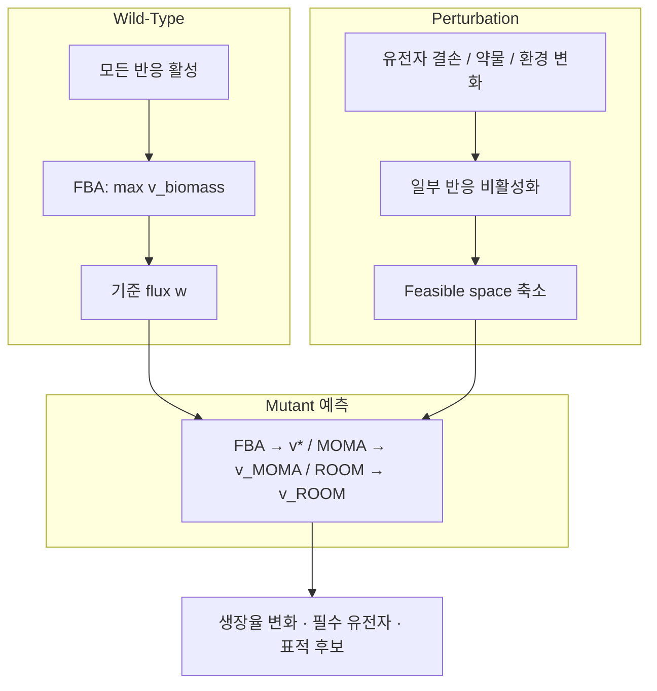

# 1. Perturbation 분석: 유전자 결손의 대수적·생물학적 기초

## 1.1 왜 배우나: perturbation이 만드는 "가능성의 축소"

**동기 먼저.** 균주를 설계하려면 "이 유전자를 끄면 세포가 어떻게 반응할까?"를 예측할 수 있어야 합니다. 그 예측의 출발점은 놀랍도록 단순한 관찰 하나입니다 — **유전자를 끄면 세포가 할 수 있는 일이 줄어든다.**

**Perturbation(섭동)**은 대사 네트워크에 가해지는 유전적·환경적·화학적 변화입니다. 유전자 결손, 과발현, 배지 조성 변화, 효소 저해제 처리가 모두 perturbation의 예입니다. [Chapter 4](../chapter-4/README.md)에서 다룬 FBA의 기본 제약에 perturbation을 추가하면, 가능한 flux distribution의 집합인 **feasible space(가능 영역)**가 다음 세 가지 제약의 교집합으로 정의됩니다.

$$\mathcal{P} = \{\mathbf{v} \in \mathbb{R}^n : \mathbf{S}\mathbf{v} = \mathbf{0}, \; \mathbf{v}^{\min} \leq \mathbf{v} \leq \mathbf{v}^{\max}, \; v_j = 0 \; \forall j \in \mathcal{A}\}$$

| 제약 | 의미 |
|:---|:---|
| **화학량론적 제약** $$\mathbf{S}\mathbf{v} = \mathbf{0}$$ | 각 대사물질의 steady-state 질량보존 (Chapter 2·4) |
| **열역학적/용량 제약** $$v_i^{\min} \leq v_i \leq v_i^{\max}$$ | 반응의 방향성과 최대 용량 |
| **Perturbation 제약** $$v_j = 0,\; j \in \mathcal{A}$$ | 결손·저해로 비활성화된 반응 집합 $$\mathcal{A}$$ |

Perturbation 전의 feasible space를 $$\mathcal{P}_{WT}$$(wild-type), 이후를 $$\mathcal{P}_{MUT}$$(mutant)라 하면

$$\mathcal{P}_{MUT} = \mathcal{P}_{WT} \cap \{\mathbf{v} : v_j = 0,\, j \in \mathcal{A}\} \subseteq \mathcal{P}_{WT}$$

입니다. 즉 **perturbation은 feasible space를 축소시키거나 그대로 유지할 뿐, 절대 확장하지 않습니다.**

> **잠깐, 생각해보기:** 유전자를 하나 끄면(반응 하나를 $$v_j=0$$으로 강제하면) 세포가 택할 수 있는 flux 조합의 "개수"는 늘어날까요, 줄어들까요? 답: 반드시 줄거나 그대로입니다. 제약을 하나 더 얹는 것은 선택지에 새 조건을 부과하는 것이므로, 원래 가능하던 해 중 "$$v_j=0$$을 만족하지 않던" 해들이 통째로 제거되기 때문입니다.

이 장 전체는 "축소된 feasible space 안에서 세포가 실제로 어떤 flux distribution을 택하는가"라는 질문에 대한 서로 다른 답변들 — FBA, MOMA, ROOM, 그리고 이들을 발판으로 한 균주 설계 — 을 다룹니다.

## 1.2 Null space와 feasible space의 기하학

Chapter 2에서 배운 것을 잠시 떠올려 봅시다. Stoichiometric matrix $$\mathbf{S}$$ ($$m$$개 대사물질 × $$n$$개 반응)에 대해 steady-state 조건 $$\mathbf{S}\mathbf{v} = \mathbf{0}$$을 만족하는 모든 $$\mathbf{v}$$의 집합이 **null space(영공간)** $$\mathcal{N}(\mathbf{S})$$이며, 그 차원은

$$\dim(\mathcal{N}(\mathbf{S})) = n - \text{rank}(\mathbf{S})$$

입니다. COBRApy `load_model("textbook")`의 화학량론 행렬은 $$n=95$$, $$\operatorname{rank}(\mathbf{S})=67$$이므로 영공간 차원은 $$95-67=28$$입니다. 반응 상·하한과 knockout 제약이 추가되면 실제 feasible space의 차원은 더 낮아질 수 있습니다.

비유하자면, feasible space는 "세포가 살 수 있는 모든 방식을 담은 방"입니다. Knockout으로 반응 $$j$$의 $$v_j=0$$이 강제되면 그 방의 한 차원(벽)이 잘려나가 방의 부피가 줄어듭니다 — 이것이 1.1절의 $$\mathcal{P}_{MUT} \subseteq \mathcal{P}_{WT}$$ 관계의 기하학적 근거입니다.

## 1.3 GPR 규칙을 통한 반응 비활성화 — 손으로 해보기

유전자 결손을 반응 비활성화로 변환하는 절차가 **in silico gene deletion**이며, [Chapter 3](../chapter-3/README.md)에서 소개한 **GPR (Gene-Protein-Reaction)** 규칙의 Boolean 평가로 이루어집니다. 규칙은 두 가지 논리 연산으로 요약됩니다.

| GPR 표현 | 생물학적 의미 | 결손 시 반응 상태 |
|:---|:---|:---|
| `geneA` | 단일 유전자가 효소를 인코딩 | geneA 결손 → 비활성화 |
| `geneA or geneB` | Isozyme(동일 기능의 복수 효소) | **둘 다** 결손되어야 비활성화 |
| `geneA and geneB` | 헤테로다이머 효소(복합체) | **하나만** 결손해도 비활성화 |
| `(geneA and geneB) or geneC` | 복합 조합 | geneC가 살아있으면 활성 유지 |

평가 절차는 간단합니다. ① 결손된 유전자를 `False`, 나머지를 `True`로 치환 ② Boolean 식을 계산 ③ 결과가 `False`이면 $$v_j^{\min} = v_j^{\max} = 0$$으로 설정합니다.

**손으로 직접 계산해 봅시다.** 세 개의 반응과 다섯 개의 유전자로 이루어진 장난감 예제를 생각합니다.

- 반응 $$R_a$$: GPR = `g1 or g2` (isozyme)
- 반응 $$R_b$$: GPR = `g3 and g4` (복합체)
- 반응 $$R_c$$: GPR = `(g1 and g4) or g5`

**단일 결손 `g1`을 시험**해 봅시다. `g1=False`, 나머지 `True`를 대입합니다.

| 반응 | Boolean 식 대입 | 결과 | 반응 상태 |
|:---|:---|:---:|:---:|
| $$R_a$$ | `False or True` | `True` | ✅ 활성 (g2가 대신 수행) |
| $$R_b$$ | `True and True` | `True` | ✅ 활성 (g1 무관) |
| $$R_c$$ | `(False and True) or True` | `True` | ✅ 활성 (g5가 대신 수행) |

`g1` 하나를 껐지만 세 반응 모두 살아남았습니다 — 이것이 대사 네트워크가 **강건한(robust)** 유전적 이유입니다.

이번엔 **이중 결손 `g1`+`g2`**를 시험합니다.

| 반응 | Boolean 식 대입 | 결과 | 반응 상태 |
|:---|:---|:---:|:---:|
| $$R_a$$ | `False or False` | `False` | ❌ **비활성** ($$v_{R_a}=0$$) |
| $$R_b$$ | `True and True` | `True` | ✅ 활성 |
| $$R_c$$ | `(False and True) or True` | `True` | ✅ 활성 (g5 생존) |

두 isozyme을 모두 껐더니 비로소 $$R_a$$가 꺼집니다. 반대로 복합체 $$R_b$$는 `g3` **하나만** 꺼도 (`False and True = False`) 즉시 비활성화됩니다. 이 비대칭 — "isozyme은 둘 다, 복합체는 하나만" — 이 knockout 예측의 핵심 직관입니다.


💡 **팁:** COBRApy에서는 `gene.knock_out()`이 이 Boolean 평가를 자동으로 수행해 연관된 모든 반응의 bound를 조정합니다. `with model:` 블록 안에서 실행하면 블록을 벗어날 때 원래 상태로 자동 복원되므로, 수백 개 유전자를 순차적으로 껐다 켜며 스크리닝할 때 매우 편리합니다.


## 1.4 대사 네트워크의 강건성과 취약성

방금 손으로 확인했듯, 대부분의 단일 유전자 결손이 생장을 완전히 멈추지 않는 이유는 다음 세 가지 네트워크 구조 때문입니다.

| 특성 | 설명 |
|:---|:---|
| **중복성(redundancy)** | 동일 기능을 수행하는 여러 병렬 경로 존재 |
| **퇴화성(degeneracy)** | 구조적으로 다른 구성 요소가 유사 기능 수행 (isozyme) |
| **모듈성(modularity)** | 기능적으로 독립된 모듈 조직으로 손상 파급 제한 |

반대로 일부 유전자는 **필수적(essential)**입니다 — 대체 경로가 없는 unique pathway, 핵심 대사물질을 잇는 hub metabolite(Chapter 2에서 본 ATP·NADH 같은 고연결 대사물), 또는 개별로는 비필수지만 조합되면 치명적인 **합성 치사(synthetic lethality)**(§2.4) 때문입니다. 이 강건성/취약성의 경계를 정량화하는 것이 다음 절의 essentiality 분석입니다.


🔑 **핵심 개념 · 용어(English):** **Perturbation(섭동)** — 유전적·환경적·화학적 변화에 의해 대사 네트워크의 feasible space와 flux distribution이 재배치되는 과정. **GPR (Gene-Protein-Reaction)** — 유전자·단백질·반응의 관계를 Boolean logic으로 표현한 규칙. **Null space(영공간)** — $$\mathbf{Sv}=\mathbf{0}$$을 만족하는 모든 flux 벡터의 집합.


---
