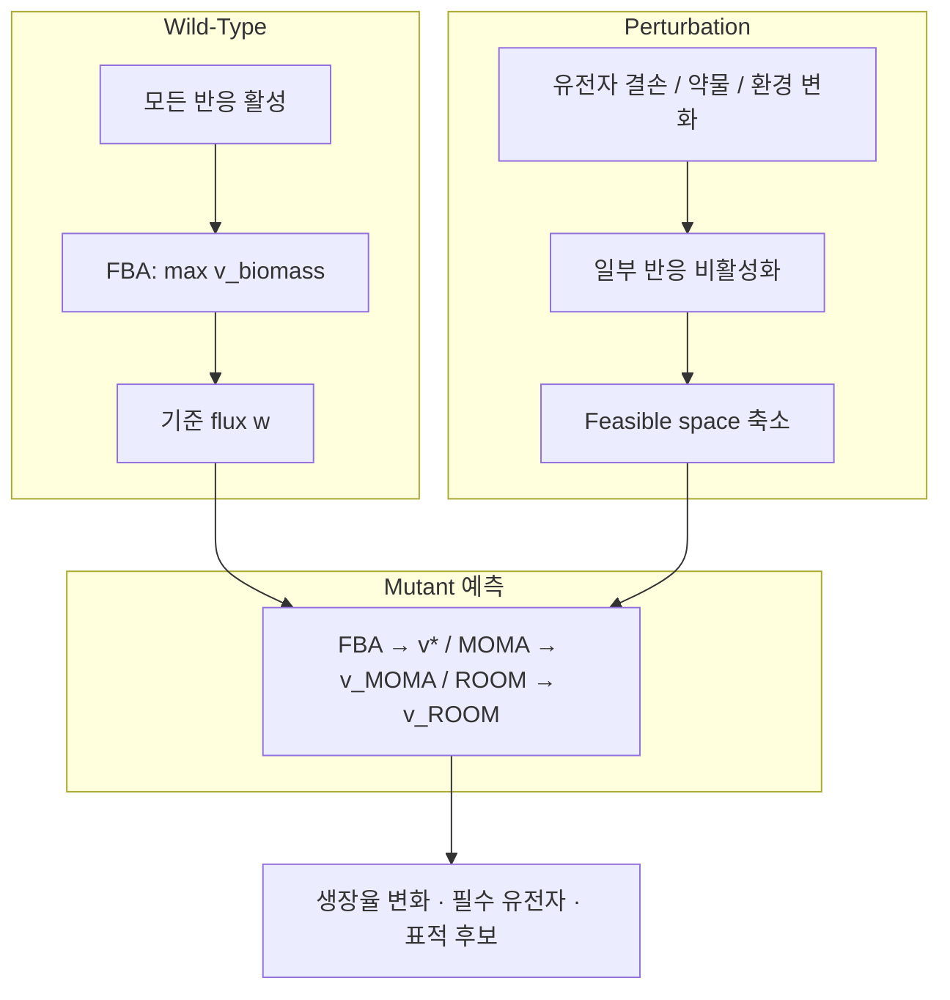

# 1. Perturbation 분석: 유전자 결손의 대수적·생물학적 기초

## 1.1 왜 배우나: perturbation이 만드는 "가능성의 축소"

**유전자 결손은 특정 반응을 비활성화하여 세포가 선택할 수 있는 플럭스 조합을 줄인다..** 여러분의 집에서 회사까지 가는 길이 세 갈래(A, B, C)라고 합시다. 평소에는 어느 길로 가든 도착만 하면 되므로, "오늘은 어떤 길로 갈 수 있는가?"라는 질문의 답은 "A, B, C 모두"입니다. 그런데 길 B가 공사로 막혔다고 합시다. 이제 답은 "A 또는 C"로 줄어듭니다 — 없던 길이 새로 생기지는 않고, 갈 수 있는 선택지만 줄어듭니다. 세포에게 **유전자 결손**이란 정확히 이런 "도로 봉쇄"입니다. 이 장 전체가 이 단순한 그림 하나에서 출발합니다.

**동기 먼저.** 균주를 설계하려면 "이 유전자를 끄면 세포가 어떻게 반응할까?"를 예측할 수 있어야 합니다. 그 예측의 출발점은 놀랍도록 단순한 관찰 하나입니다 — **유전자를 끄면 세포가 할 수 있는 일이 줄어든다.**

**Perturbation(섭동)**은 대사 네트워크에 가해지는 유전적·환경적·화학적 변화입니다. 유전자 결손, 과발현, 배지 조성 변화, 효소 저해제 처리가 모두 perturbation의 예입니다. [Chapter 4](../chapter-4/README.md)에서 다룬 FBA의 기본 제약에 perturbation을 추가하면, 가능한 flux distribution의 집합인 **feasible space(가능 영역)**가 다음 세 가지 제약의 교집합으로 정의됩니다.

$$\mathcal{P} = \{\mathbf{v} \in \mathbb{R}^n : \mathbf{S}\mathbf{v} = \mathbf{0}, \; \mathbf{v}^{\min} \leq \mathbf{v} \leq \mathbf{v}^{\max}, \; v_j = 0 \; \forall j \in \mathcal{A}\}$$

| 제약 | 의미 |
|:---|:---|
| **화학량론적 제약** $$\mathbf{S}\mathbf{v} = \mathbf{0}$$ | 각 대사물질의 steady-state 질량보존 (Chapter 2·4) |
| **열역학적/용량 제약** $$v_i^{\min} \leq v_i \leq v_i^{\max}$$ | 반응의 방향성과 최대 용량 |
| **Perturbation 제약** $$v_j = 0,\; j \in \mathcal{A}$$ | 결손·저해로 비활성화된 반응 집합 $$\mathcal{A}$$ |

Perturbation 전의 feasible space를 $$\mathcal{P}_{WT}$$(wild-type), 이후를 $$\mathcal{P}_{MUT}$$(mutant)라 하면

$$\mathcal{P}_{MUT} = \mathcal{P}_{WT} \cap \{\mathbf{v} : v_j = 0,\, j \in \mathcal{A}\} \subseteq \mathcal{P}_{WT}$$

입니다. 즉 **perturbation은 feasible space를 축소시키거나 그대로 유지할 뿐, 절대 확장하지 않습니다.**

> **잠깐, 생각해보기:** 유전자를 하나 끄면(반응 하나를 $$v_j=0$$으로 강제하면) 세포가 택할 수 있는 flux 조합의 "개수"는 늘어날까요, 줄어들까요? 답: 반드시 줄거나 그대로입니다. 제약을 하나 더 얹는 것은 선택지에 새 조건을 부과하는 것이므로, 원래 가능하던 해 중 "$$v_j=0$$을 만족하지 않던" 해들이 통째로 제거되기 때문입니다.

이 장 전체는 "축소된 feasible space 안에서 세포가 실제로 어떤 flux distribution을 택하는가"라는 질문에 대한 서로 다른 답변들 — FBA, MOMA, ROOM, 그리고 이들을 발판으로 한 균주 설계 — 을 다룹니다.



*그림 8.2. 대사 섭동 예측의 계산 흐름. 유전자 결손·약물·환경 변화가 GPR과 반응 경계를 통해 feasible space를 축소하고, 야생형 기준 플럭스와 축소된 공간을 입력으로 FBA·MOMA·ROOM이 서로 다른 상태 가정의 돌연변이 해를 선택합니다. 출처: 저자 자체 제작; 개념 근거: MOMA([Segrè et al., 2002](https://doi.org/10.1073/pnas.232349399))와 ROOM([Shlomi et al., 2005](https://doi.org/10.1073/pnas.0406346102)). 원 논문의 그림은 복제하거나 변형하지 않았습니다.*

## 1.2 Null space와 feasible space의 기하학

Chapter 2에서 배운 것을 잠시 떠올려 봅시다. [Stoichiometric matrix(화학량론 행렬)](../glossary.md) $$\mathbf{S}$$ ($$m$$개 대사물질 × $$n$$개 반응)에 대해 steady-state 조건 $$\mathbf{S}\mathbf{v} = \mathbf{0}$$을 만족하는 모든 $$\mathbf{v}$$의 집합이 **[null space(영공간)](../glossary.md)** $$\mathcal{N}(\mathbf{S})$$이며, 그 차원은

$$\dim(\mathcal{N}(\mathbf{S})) = n - \text{rank}(\mathbf{S})$$

입니다. COBRApy `load_model("textbook")`의 화학량론 행렬은 $$n=95$$, $$\operatorname{rank}(\mathbf{S})=67$$이므로 영공간 차원은 $$95-67=28$$입니다. 반응 상·하한과 knockout 제약이 추가되면 실제 feasible space의 차원은 더 낮아질 수 있습니다.

비유하자면, feasible space는 "세포가 살 수 있는 모든 방식을 담은 방"입니다. Knockout으로 반응 $$j$$의 $$v_j=0$$이 강제되면 그 방의 한 차원(벽)이 잘려나가 방의 부피가 줄어듭니다 — 이것이 1.1절의 $$\mathcal{P}_{MUT} \subseteq \mathcal{P}_{WT}$$ 관계의 기하학적 근거입니다.

**손으로 직접 null space 차원을 세어 봅시다.** 대사물질 2개($$A$$, $$B$$)와 반응 3개($$v_1$$: $$\varnothing \to A$$, $$v_2$$: $$A \to B$$, $$v_3$$: $$B \to \varnothing$$)로 이루어진 장난감 경로를 생각합니다. 화학량론 행렬은

$$
\mathbf{S} =
\begin{pmatrix}
1 & -1 & 0 \\
0 & 1 & -1
\end{pmatrix}
$$

이며, 행은 대사물($$A$$, $$B$$), 열은 반응($$v_1, v_2, v_3$$)입니다. $$\mathbf{S}\mathbf{v}=\mathbf{0}$$을 풀어 봅시다.

$$
v_1 - v_2 = 0, \qquad v_2 - v_3 = 0
$$

두 식을 연립하면 $$v_1 = v_2 = v_3$$입니다. 즉 이 사슬형 경로에서는 세 반응의 flux가 모두 같아야 정상상태가 유지됩니다(당연합니다 — 중간에 쌓이거나 사라지는 대사물이 없어야 하니까요). $$\operatorname{rank}(\mathbf{S})=2$$(두 행이 선형독립)이므로 null space 차원은 $$\dim(\mathcal{N}(\mathbf{S})) = n - \operatorname{rank}(\mathbf{S}) = 3 - 2 = 1$$입니다. 실제로 해집합은 $$\{(t,t,t) : t \in \mathbb{R}\}$$로, 자유도가 정확히 하나(스칼라 $$t$$ 하나)임이 확인됩니다.

이제 여기에 반응 $$v_2$$를 **knockout**($$v_2=0$$)한다고 합시다. 연립방정식에 $$v_2=0$$을 더하면 $$v_1=0, v_3=0$$도 강제되어 유일한 해는 $$(0,0,0)$$뿐입니다 — feasible space가 한 점으로 쪼그라들며, 이 사슬형 경로에서는 "생장"에 해당하는 $$v_3>0$$을 만드는 것이 원천적으로 불가능해집니다. 이것이 **선형 경로(linear pathway)의 중간 반응을 끄면 곧바로 필수(essential)가 되는** 이유이며, §1.4에서 다룰 "중복 경로가 없으면 취약하다"는 원리의 가장 작은 예입니다. 실제 genome-scale 모델은 이런 사슬이 아니라 여러 경로가 얽힌 그물망이므로, 하나의 반응을 꺼도 우회로가 남아있는 경우가 훨씬 많습니다 — 이것이 다음 절에서 볼 GPR의 `or` 분기가 하는 역할입니다.

## 1.3 GPR 규칙을 통한 반응 비활성화 — 손으로 해보기

유전자 결손을 반응 비활성화로 변환하는 절차가 **in silico gene deletion**이며, [Chapter 3](../chapter-3/README.md)에서 소개한 **GPR (Gene-Protein-Reaction)** 규칙의 Boolean 평가로 이루어집니다. 규칙은 두 가지 논리 연산으로 요약됩니다.

| GPR 표현 | 생물학적 의미 | 결손 시 반응 상태 |
|:---|:---|:---|
| `geneA` | 단일 유전자가 효소를 인코딩 | geneA 결손 → 비활성화 |
| `geneA or geneB` | Isozyme(동일 기능의 복수 효소) | **둘 다** 결손되어야 비활성화 |
| `geneA and geneB` | 헤테로다이머 효소(복합체) | **하나만** 결손해도 비활성화 |
| `(geneA and geneB) or geneC` | 복합 조합 | geneC가 살아있으면 활성 유지 |

평가 절차는 간단합니다. ① 결손된 유전자를 `False`, 나머지를 `True`로 치환 ② Boolean 식을 계산 ③ 결과가 `False`이면 $$v_j^{\min} = v_j^{\max} = 0$$으로 설정합니다.

**손으로 직접 계산해 봅시다.** 세 개의 반응과 다섯 개의 유전자로 이루어진 장난감 예제를 생각합니다.

- 반응 $$R_a$$: GPR = `g1 or g2` (isozyme)
- 반응 $$R_b$$: GPR = `g3 and g4` (복합체)
- 반응 $$R_c$$: GPR = `(g1 and g4) or g5`

**단일 결손 `g1`을 시험**해 봅시다. `g1=False`, 나머지 `True`를 대입합니다.

| 반응 | Boolean 식 대입 | 결과 | 반응 상태 |
|:---|:---|:---:|:---:|
| $$R_a$$ | `False or True` | `True` | ✅ 활성 (g2가 대신 수행) |
| $$R_b$$ | `True and True` | `True` | ✅ 활성 (g1 무관) |
| $$R_c$$ | `(False and True) or True` | `True` | ✅ 활성 (g5가 대신 수행) |

`g1` 하나를 껐지만 세 반응 모두 살아남았습니다 — 이것이 대사 네트워크가 **강건한(robust)** 유전적 이유입니다.

이번엔 **이중 결손 `g1`+`g2`**를 시험합니다.

| 반응 | Boolean 식 대입 | 결과 | 반응 상태 |
|:---|:---|:---:|:---:|
| $$R_a$$ | `False or False` | `False` | ❌ **비활성** ($$v_{R_a}=0$$) |
| $$R_b$$ | `True and True` | `True` | ✅ 활성 |
| $$R_c$$ | `(False and True) or True` | `True` | ✅ 활성 (g5 생존) |

두 isozyme을 모두 껐더니 비로소 $$R_a$$가 꺼집니다. 반대로 복합체 $$R_b$$는 `g3` **하나만** 꺼도 (`False and True = False`) 즉시 비활성화됩니다. 이 비대칭 — "isozyme은 둘 다, 복합체는 하나만" — 이 knockout 예측의 핵심 직관입니다.

**한 걸음 더 나아가 봅시다 — 삼중 결손 `g1`+`g2`+`g5`.** 이제 $$R_c$$의 안전망이었던 `g5`까지 제거하면 어떻게 될까요?

| 반응 | Boolean 식 대입 | 결과 | 반응 상태 |
|:---|:---|:---:|:---:|
| $$R_a$$ | `False or False` | `False` | ❌ 비활성 (변화 없음, 이미 꺼져 있었음) |
| $$R_b$$ | `True and True` | `True` | ✅ 활성 (g1, g2, g5 모두 무관) |
| $$R_c$$ | `(False and True) or False` | `False` | ❌ **새로 비활성** (g1도 g5도 없어 두 분기 모두 차단) |

이제 $$R_a$$와 $$R_c$$ 둘 다 꺼졌습니다. $$R_b$$만 살아남았는데, 이는 $$R_b$$의 GPR이 `g3 and g4`로 애초에 g1, g2, g5와 전혀 무관하기 때문입니다. 이 예는 GPR 평가가 **유전자별로 독립적**이 아니라 **반응별로 해당 GPR 식에만 좌우**된다는 점을 잘 보여줍니다 — 어떤 유전자를 아무리 많이 꺼도 그 유전자가 등장하지 않는 GPR을 가진 반응은 절대 영향받지 않습니다.


❓ **흔한 오해:** "유전자 하나가 여러 반응의 GPR에 등장하니, 그 유전자를 결손하면 등장하는 모든 반응이 다 꺼지는 것 아닌가?" — 아닙니다. 앞의 표에서 봤듯, `g1`이 등장하는 $$R_a$$(`g1 or g2`)와 $$R_c$$(`(g1 and g4) or g5`)는 g1 결손만으로는 **둘 다 켜진 채로 남습니다** — 각각 g2와 g5라는 백업이 있기 때문입니다. 유전자가 GPR에 "등장한다"는 것과 그 결손이 반응을 "비활성화한다"는 것은 전혀 다른 이야기입니다. 항상 해당 반응의 전체 Boolean 식을 끝까지 평가해야 합니다.



💡 **팁:** [COBRApy](https://opencobra.github.io/cobrapy/)에서는 `gene.knock_out()`이 이 Boolean 평가를 자동으로 수행해 연관된 모든 반응의 bound를 조정합니다. `with model:` 블록 안에서 실행하면 블록을 벗어날 때 원래 상태로 자동 복원되므로, 수백 개 유전자를 순차적으로 껐다 켜며 스크리닝할 때 매우 편리합니다.


> 💡 **실습: `e_coli_core`에서 실제 GPR 규칙 확인하고 손 계산과 대조하기**

```python
# 목적: 위에서 손으로 계산한 isozyme/복합체 패턴을 실제 모델 반응에서 확인한다
from cobra.io import load_model

model = load_model("textbook")

# PYK(pyruvate kinase)는 isozyme 패턴(or)의 대표 예다.
print(model.reactions.PYK.gene_reaction_rule)
# 기대 출력: b1854 or b1676  (pykA 또는 pykF 중 하나만 있어도 활성)

# SUCOAS(succinyl-CoA synthetase)는 복합체 패턴(and)의 대표 예다.
print(model.reactions.SUCOAS.gene_reaction_rule)
# 기대 출력: b0728 and b0729  (두 서브유닛이 모두 있어야 활성)

with model as mutant:
    mutant.genes.get_by_id("b1676").knock_out()   # pykF 하나만 결손
    print("PYK bounds after pykF KO:", mutant.reactions.PYK.bounds)
    # 기대 출력: (0.0, 1000.0) -> 결손 전과 동일, 반응이 죽지 않고 살아있다(pykA가 대신 수행)

with model as mutant:
    mutant.genes.get_by_id("b0728").knock_out()   # sucC 하나만 결손 (복합체 서브유닛)
    print("SUCOAS bounds after sucC KO:", mutant.reactions.SUCOAS.bounds)
    # 기대 출력: (0, 0) -> 서브유닛 하나만 없어도 반응 전체가 비활성화된다
```

이 결과는 §1.3에서 손으로 계산한 "isozyme은 하나만 남아도 산다, 복합체는 하나만 빠져도 죽는다"는 규칙이 실제 모델의 실제 유전자에서도 그대로 재현됨을 보여줍니다.

## 1.4 대사 네트워크의 강건성과 취약성

방금 손으로 확인했듯, 대부분의 단일 유전자 결손이 생장을 완전히 멈추지 않는 이유는 다음 세 가지 네트워크 구조 때문입니다.

| 특성 | 설명 |
|:---|:---|
| **중복성(redundancy)** | 동일 기능을 수행하는 여러 병렬 경로 존재 |
| **퇴화성(degeneracy)** | 구조적으로 다른 구성 요소가 유사 기능 수행 (isozyme) |
| **모듈성(modularity)** | 기능적으로 독립된 모듈 조직으로 손상 파급 제한 |

반대로 일부 유전자는 **[필수적(essential)](../glossary.md)**입니다 — 대체 경로가 없는 unique pathway, 핵심 대사물질을 잇는 hub metabolite(Chapter 2에서 본 ATP·NADH 같은 고연결 대사물), 또는 개별로는 비필수지만 조합되면 치명적인 **[합성 치사(synthetic lethality)](../glossary.md)**(§2.4) 때문입니다. 이 강건성/취약성의 경계를 정량화하는 것이 다음 절의 essentiality 분석입니다.

**Hub metabolite가 왜 취약점이 되는지 직관적으로 봅시다.** ATP를 만드는 반응은 해당계·TCA 회로·산화적 인산화 등 수십 개가 있어 어느 하나가 꺼져도 다른 경로가 대신할 여지가 큽니다. 그런데 ATP를 "소비"하는 방향은 사정이 다릅니다 — 세포 성장에 필요한 거의 모든 생합성 반응(아미노산·뉴클레오타이드·지질 합성)이 ATP를 기질로 요구합니다. 즉 ATP는 "만드는 길은 여럿이지만 그 자체가 병목이 되는 노드"입니다. 만약 ATP를 만드는 경로가 **전부** 막히면(예: 해당계와 산화적 인산화를 모두 저해), ATP 공급 자체가 끊겨 hub metabolite 하나의 결핍이 수십 개 하류 반응을 동시에 멈추게 만듭니다 — 개별 반응은 중복되어도 그들이 공유하는 하나의 대사물질은 단일 실패점(single point of failure)이 될 수 있는 것입니다. 이것이 "반응 수준의 중복성"과 "대사물 수준의 취약성"이 공존할 수 있는 이유이며, 네트워크를 반응의 목록이 아니라 그래프로 볼 때 비로소 드러나는 통찰입니다.

> **잠깐, 생각해보기:** 어떤 유전자가 essential로 예측되었는데, 여러분이 그 반응의 GPR을 확인해 보니 `geneX`(단일 유전자, `or`도 `and`도 없음)였습니다. 왜 필수일 가능성이 높을까요? 답: GPR에 대체 유전자가 전혀 등장하지 않으므로, `geneX`가 꺼지면 그 반응은 무조건 비활성화됩니다(§1.3의 평가 절차 그대로). 이때 그 반응이 만드는 대사물이 다른 경로로도 공급될 수 있는지가 실제 필수성을 가르는 마지막 변수입니다 — GPR만으로는 "반응이 꺼진다"까지만 알 수 있고, "그래서 세포가 죽는다"는 네트워크 전체(§1.2의 feasible space)를 봐야 압니다.

이 절에서 배운 세 가지 — feasible space의 축소(§1.1~1.2), GPR Boolean 평가(§1.3), 강건성/취약성의 네트워크적 근거(§1.4) — 를 조합하면, 다음 절에서 다룰 "유전자 하나하나를 실제로 꺼 보며 필수성을 지도화하는" 대규모 스크리닝으로 자연스럽게 이어집니다.


🔑 **핵심 개념 · 용어(English):** **Perturbation(섭동)** — 유전적·환경적·화학적 변화에 의해 대사 네트워크의 feasible space와 flux distribution이 재배치되는 과정. **GPR (Gene-Protein-Reaction)** — 유전자·단백질·반응의 관계를 Boolean logic으로 표현한 규칙. **Null space(영공간)** — $$\mathbf{Sv}=\mathbf{0}$$을 만족하는 모든 flux 벡터의 집합.


---
