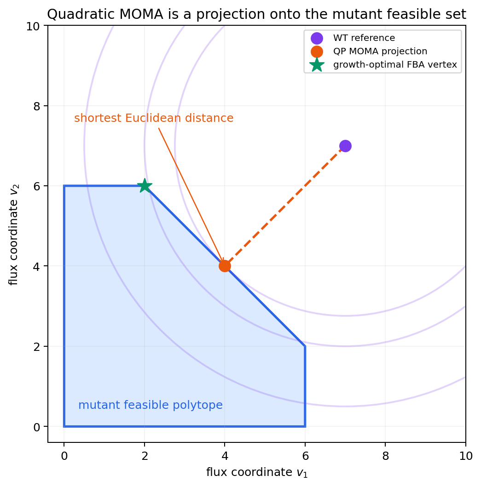

# 3. MOMA: Minimization of Metabolic Adjustment

## 3.1 근접성 원리(Proximity Principle)

**동기.** §2.3에서 FBA가 돌연변이 성장률을 낙관적으로 예측한다는 것을 봤습니다. 그렇다면 "최적화되지 않은 돌연변이 세포"는 실제로 어떤 flux를 택할까요?

**비유 먼저.** 매일 다니던 통근길이 공사로 막혔다고 합시다. 여러분은 지도를 펼쳐 "이론적으로 가장 빠른 완전히 새로운 경로"를 찾나요? 아니면 원래 길에서 **가능한 한 조금만 벗어난** 우회로를 택하나요? 대부분의 사람은 후자입니다. 세포도 마찬가지입니다.

**MOMA (Minimization of Metabolic Adjustment)**는 Segrè, Vitkup, Church (2002)가 제안한 방법으로, mutant가 곧바로 새 성장 최적점을 택하기보다 wild-type 상태에서 최소한만 벗어난다는 **근접성 원리(proximity principle)**를 가정합니다. 진화적으로 최적화되지 않은 돌연변이나 perturbation 초기 상태를 설명할 후보 가설로 자주 쓰이지만, 시간대만으로 타당성이 보장되지는 않으며 원 논문도 결손 직후를 시간분해 측정하지 않았습니다.

## 3.2 이차계획법(QP) 정형화

MOMA는 mutant flux $$\mathbf{v}$$가 wild-type 기준 flux $$\mathbf{w}$$(실측 플럭스 또는 계산한 대표 해)로부터 최소한의 **Euclidean distance(유클리드 거리)**만큼 떨어지도록 하는 이차계획법(quadratic programming, QP) 문제를 풉니다.

$$\min_{\mathbf{v}} \; \|\mathbf{v} - \mathbf{w}\|_2^2 = \sum_{i=1}^{n} (v_i - w_i)^2$$

$$\text{s.t.} \quad \mathbf{S}\mathbf{v} = \mathbf{0}, \quad \mathbf{v}^{\min} \leq \mathbf{v} \leq \mathbf{v}^{\max}, \quad v_j = 0 \; \forall j \in \mathcal{A}$$

목적함수의 Hessian은 $$\nabla^2 f(\mathbf{v}) = 2\mathbf{I}$$로 **positive definite**이며, 따라서 $$f$$는 **strictly convex(엄격 볼록)**입니다. 선형 제약 하에서 strictly convex QP는 feasible space가 비어있지 않은 한 **유일한 전역 최적해**를 갖습니다 — 이는 여러 대안 최적해(alternate optima)가 흔한 LP 기반 FBA와 대비되는 중요한 성질입니다. 기하학적으로 MOMA 해는 wild-type 점 $$\mathbf{w}$$를 mutant feasible space $$\mathcal{P}_{MUT}$$ 위로 **투영(projection)**한 것입니다.

$$\mathbf{v}^{MOMA} = \arg\min_{\mathbf{v} \in \mathcal{P}_{MUT}} \|\mathbf{v} - \mathbf{w}\|_2^2$$



*그림 8.1: 보라색 야생형 기준점에서 돌연변이 feasible polytope까지의 가장 짧은 유클리드 거리가 주황색 quadratic MOMA 해를 정합니다. 초록색 별은 같은 영역에서 성장을 최대화한 FBA 해로, MOMA 해와 일치할 필요가 없습니다. 이는 QP의 투영 원리를 설명하기 위한 2차원 모식도이며 `e_coli_core`를 계산해 축소 투영한 결과가 아닙니다.*

즉 "막힌 통근길에서 원래 경로와 가장 가까운 대안"을 수학적으로 정확히 찾는 것이 MOMA입니다.

## 3.3 Euclidean distance minimization의 의미

목적함수 $$(v_i - w_i)^2$$는 변화량이 클수록 **제곱으로 무겁게 penalize**됩니다. 그 결과 MOMA는 "여러 반응의 작은 조정"을 선호하고 "소수 반응의 큰 변화"를 회피합니다. 그러나 이 성질은 한계이기도 합니다 — 대안 경로로 우회하려면 그 경로에 속한 여러 반응이 동시에 크게 바뀌어야 하는데, Euclidean metric은 이런 **경로 재배선(pathway rerouting)**을 불필요하게 penalize합니다. 이 한계가 §4의 ROOM을 낳은 핵심 동기입니다.

계산 비용을 줄이기 위한 **lin_MOMA**는 $$L_2$$-norm 대신 $$L_1$$-norm을 최소화하는 LP로 근사합니다.

$$\min_{\mathbf{v}} \; \sum_i |v_i - w_i|$$

$$L_1$$-norm은 희소해(sparse solution)를 선호하여 소수 반응만 변하고 나머지는 정확히 $$w_i$$를 유지하는 경향을 보이며, MOMA와 ROOM의 중간적 성격을 갖습니다.

## 3.4 적용: 돌연변이 예측과 균주 설계


**꼭 알아야 할 논문 — MOMA.** Segrè, Vitkup & Church (2002), *Analysis of optimality in natural and perturbed metabolic networks* (doi: `10.1073/pnas.232349399`)는 mutant feasible space에서 야생형 flux와의 Euclidean 거리를 최소화하는 QP를 제안했습니다. `pykA/pykF` 이중 결손에서는 두 carbon-limited 조건의 absolute flux와 세 조건 모두의 상대 flux 변화가 FBA보다 잘 설명됐지만, 원 논문은 결손 직후를 시간분해 측정하지 않았습니다. 따라서 MOMA를 “초기 반응의 정답”이 아니라 실측 flux로 검증할 상태 선택 가설로 다뤄야 합니다.


대사공학적으로 설계된 균주는 진화적으로 최적화되지 않았을 수 있으므로, §6에서 다룰 **OptGene**은 MOMA를 시뮬레이션 레이어로 선택할 수 있습니다. 그러나 MOMA가 모든 결손·시간대에서 FBA보다 우월하다는 뜻은 아니며, 기준 flux와 실험 시점에 대한 민감도를 함께 확인해야 합니다.

> 💡 **실습: isozyme 함정을 확인하고 linear MOMA 실행**

```python
# COBRApy 0.30: moma(..., linear=True)가 기본값이다.
from cobra.flux_analysis import moma, pfba

biomass_id = "Biomass_Ecoli_core"
wt_reference = pfba(model)  # 한 대표 WT flux; pFBA도 유일성을 절대 보장하지는 않는다.

# pykF(b1676) 하나만 끄면 pykA(b1854)가 PYK를 대신하므로 성장 결손이 없다.
print(model.reactions.PYK.gene_reaction_rule)  # b1854 or b1676
with model as pykf_mutant:
    pykf_mutant.genes.get_by_id("b1676").knock_out()
    print("pykF KO FBA growth:", pykf_mutant.slim_optimize())  # WT와 사실상 동일

# 실제 flux 재배치를 보기 위해 tpiA(b3919) 결손을 예로 든다.
with model as mutant:
    mutant.genes.get_by_id("b3919").knock_out()
    fba_solution = mutant.optimize()
    lmoma_solution = moma(mutant, wt_reference, linear=True)

    print("FBA growth:", fba_solution.fluxes[biomass_id])
    print("linear MOMA distance:", lmoma_solution.objective_value)
    print("linear MOMA growth:", lmoma_solution.fluxes[biomass_id])

    # 원 논문의 quadratic MOMA는 QP 지원 솔버가 필요하다.
    # qmoma_solution = moma(mutant, wt_reference, linear=False)
```

`moma_solution.objective_value`는 성장률이 아니라 **WT와의 거리 목적값**입니다. 성장률은 반드시 바이오매스 반응의 flux에서 읽어야 합니다. 또한 quadratic MOMA와 linear MOMA는 서로 다른 목적함수를 풀므로 결과를 섞어 해석하면 안 됩니다.

---
