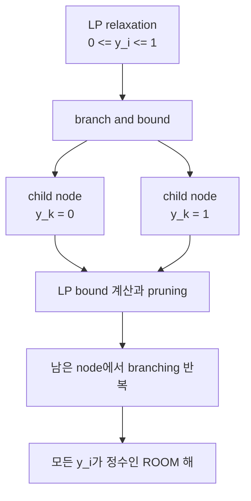

# 4. ROOM: Regulatory On/Off Minimization

## 4.1 규제 최소성 원리(Regulatory Parsimony)

**동기.** MOMA는 "모든 반응을 조금씩 바꾼다"고 봤습니다. 그런데 세포의 유전자 조절은 정말 그렇게 작동할까요?

**비유 먼저.** 100개의 전등이 있는 방에서 밝기를 바꿔야 한다고 합시다. MOMA는 모든 전등의 밝기 다이얼을 아주 조금씩 돌립니다. 하지만 실제 세포의 유전자 스위치는 다이얼보다 **on/off 스위치**에 가깝습니다 — 소수의 스위치만 딸깍 켜거나 끄는 것이죠.

**ROOM (Regulatory On/Off Minimization)**은 Shlomi, Berkman, Ruppin (2005)이 제안한 방법으로, "세포는 flux의 거리보다 **변경해야 하는 반응의 수**를 최소화하려 한다"는 가정에 기반합니다. 이는 transcriptional regulation이 본질적으로 on/off에 가깝고, operon 구조로 하나의 규제 신호가 여러 반응을 동시에 조절한다는 생물학적 관찰에 근거합니다.

## 4.2 혼합정수선형계획법(MILP) 정형화

ROOM은 각 반응 $$i$$에 대해 "wild-type 범위를 유의하게 벗어났는가"를 나타내는 이진 변수 $$y_i \in \{0,1\}$$를 도입해 다음 MILP를 풉니다.

$$\min_{\mathbf{v}, \mathbf{y}} \; \sum_{i=1}^{n} y_i$$

$$\text{s.t.} \quad \mathbf{S}\mathbf{v} = \mathbf{0}, \quad \mathbf{v}^{\min} \leq \mathbf{v} \leq \mathbf{v}^{\max}, \quad v_j = 0 \; \forall j \in \mathcal{A}$$

$$v_i - y_i(v_i^{\max} - w_i^{\mathrm{up}}) \leq w_i^{\mathrm{up}}, \qquad v_i - y_i(v_i^{\min} - w_i^{\mathrm{lo}}) \geq w_i^{\mathrm{lo}}$$

여기서 $$w_i^{\mathrm{up}} = w_i + \delta|w_i| + \varepsilon$$, $$w_i^{\mathrm{lo}} = w_i - \delta|w_i| - \varepsilon$$이며, $$\delta$$(상대 허용치)와 $$\varepsilon$$(절대 허용치)가 **tolerance threshold(허용 임계값)**입니다. $$y_i=0$$이면 $$v_i$$는 wild-type 근방 $$[w_i^{\mathrm{lo}}, w_i^{\mathrm{up}}]$$에 묶이고, $$y_i=1$$이면 자유롭게 벗어날 수 있습니다. 목적함수 $$\sum_i y_i$$는 "유의하게 변한 반응의 총 수"(켜진 스위치의 개수)를 최소화합니다.


*그림 8.2: 연한 파란 띠는 반응별 야생형 tolerance 구간이고, 초록 마름모는 구간 안에 남아 $$y_i=0$$인 돌연변이 flux, 주황 마름모는 구간을 벗어나 $$y_i=1$$인 flux입니다. ROOM은 주황 마름모의 거리 합이 아니라 그 **개수**를 최소화합니다. 수치를 임의로 정한 MILP 개념 모식도이며 COBRApy 계산 결과가 아닙니다.*

이 부등식은 **Big-M 방법**으로 논리 조건을 선형화한 것입니다. ROOM의 MILP는 이론적으로 NP-hard이지만, **branch-and-bound**(LP relaxation → branching → pruning)와 presolve·cutting plane 등 현대 solver 기법(Gurobi, CPLEX)으로 genome-scale 모델에서도 실용적 시간 내에 풀립니다.



*그림 8.3: ROOM MILP를 푸는 branch-and-bound의 개념 흐름입니다. 실제 solver는 presolve·cut·휴리스틱과 더 복잡한 node 선택을 함께 사용하므로, 이 도식은 특정 solver의 실행 로그나 성능 측정이 아닙니다.*


❓ **흔한 오해:** "MOMA와 ROOM은 둘 다 wild-type에 가깝게 유지하니까 결국 비슷한 답을 주지 않나요?" — 아닙니다. 목적함수의 **단위**가 완전히 다릅니다. MOMA는 flux 값의 **거리**(연속적 크기)를 최소화하고, ROOM은 허용 범위를 벗어난 반응의 **개수**(이산적 카운트)를 최소화합니다. 그 결과 MOMA는 많은 반응의 작은 변화를, ROOM은 소수 반응의 큰 재배선을 선호하는 경향이 있지만 실제 개수는 모델·기준 해·임계값에 따라 달라집니다.


## 4.3 Tolerance $$\delta$$의 역할과 방법 비교

| $$\delta$$ | 효과 |
|:---|:---|
| 작음 | 엄격 — 작은 변화도 허용 범위를 벗어나 $$y_i=1$$로 계산될 수 있음 |
| 중간 | 기준 flux의 측정·계산 오차를 어느 정도 허용 |
| 큼 | 느슨 — 큰 변화만 카운트되어 대안 ROOM 해가 늘 수 있음 |

COBRApy의 기본값은 $$\delta=0.03$$, $$\varepsilon=0.001$$입니다. 이 값이 모든 데이터에 보편적으로 맞는 것은 아니므로, 실측 오차와 flux 스케일을 고려해 민감도 분석을 수행해야 합니다.


**꼭 알아야 할 논문 — ROOM.** Shlomi, Berkman & Ruppin (2005), *Regulatory on/off minimization of metabolic flux changes after genetic perturbations* (doi: `10.1073/pnas.0406346102`)는 5개 결손 유전자를 여러 배지에서 측정한 9개 knockout–condition **flux 실험** 가운데 8개에서 ROOM이 기존 방법과 같거나 더 나은 flux 예측을 보였다고 보고했습니다. 평균 유의 변화 반응 수는 ROOM 12, FBA 119, MOMA 317이었고 최종 성장률 평균 상대오차는 ROOM 14%, FBA 15%, MOMA 31%였습니다. 별도의 6개 결손 적응진화 자료에서는 적응 전 **성장률**에 MOMA의 상관이 높았고($$r=0.834$$), 적응 후 성장률에는 ROOM($$r=0.727$$)과 FBA($$r=0.724$$)가 MOMA($$r=0.658$$)보다 높았습니다. 핵심은 **ROOM이 언제나 최고**가 아니라, 서로 다른 상태 가설을 별도 자료로 검증해야 한다는 점입니다.


> 💡 **실습: FBA·MOMA·ROOM 세 방법 한 번에 비교**

```python
# 목적: 같은 tpiA 결손에 대해 세 방법의 예측을 나란히 비교한다
from cobra.flux_analysis import room

with model as mutant:
    mutant.genes.get_by_id("b3919").knock_out()
    fba_sol = mutant.optimize()
    lmoma_sol = moma(mutant, wt_reference, linear=True)
    # COBRApy 0.30의 zero-tolerance linear ROOM 변형이다.
    # 원 ROOM MILP는 linear=False와 tolerance를 명시하며 더 오래 걸릴 수 있다.
    room_sol = room(mutant, wt_reference, linear=True)

    print("FBA objective (= growth):", fba_sol.objective_value)
    print("linear MOMA objective (= L1 distance):", lmoma_sol.objective_value)
    print("zero-tolerance linear ROOM objective:", room_sol.objective_value)
    print("growths:", {"FBA": fba_sol.fluxes[biomass_id],
                       "linear MOMA": lmoma_sol.fluxes[biomass_id],
                       "zero-tolerance linear ROOM": room_sol.fluxes[biomass_id]})
```

여기서는 기본 설치 환경에서 실행 시간을 줄이기 위해 COBRApy 0.30.0의 `linear=True` 변형을 사용했습니다. 이 구현은 $$y_i$$를 연속화하고 $$\delta=\varepsilon=0$$으로 재설정하므로 목적값을 “바뀐 반응 수” 또는 기본 tolerance ROOM MILP의 하한이라고 해석할 수 없습니다. 원 ROOM을 재현하려면 `linear=False, delta=0.03, epsilon=0.001`처럼 tolerance를 명시하고 MILP solver·시간 제한·optimality gap을 함께 기록하십시오.

---
