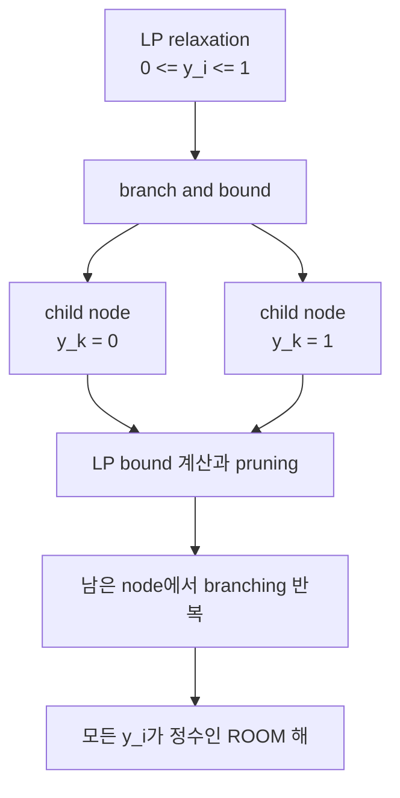

# 4. ROOM: Regulatory On/Off Minimization

## 4.1 규제 최소성 원리(Regulatory Parsimony)

§3의 MOMA는 돌연변이가 모든 반응의 flux를 조금씩 조정한다고 가정했다. 그러나 세포의 유전자 조절이 그런 연속적 미세 조정에 해당하는지는 따져볼 문제이다.

**[ROOM (Regulatory On/Off Minimization)](../landmark-papers.md)**은 Shlomi, Berkman, Ruppin (2005)이 제안한 방법이다. "세포는 flux의 거리보다 **변경해야 하는 반응의 수**를 최소화하려 한다"는 가정에 기반한다. 이는 transcriptional regulation이 본질적으로 on/off에 가깝고, operon 구조로 하나의 규제 신호가 여러 반응을 동시에 조절한다는 생물학적 관찰에 근거한다.

**비유.** 100개의 전등이 있는 방에서 밝기를 바꾸는 상황에 견주면, MOMA는 모든 전등의 다이얼을 조금씩 돌리는 쪽이고 ROOM은 소수의 on/off 스위치만 딸깍 바꾸는 쪽이다. 다만 이 비유는 변화의 이산성이라는 한 측면만 설명한다 — 실제 flux 변화는 스위치처럼 완전한 0/1이 아니라 연속적 크기를 가지며, ROOM의 이진 변수 $$y_i$$는 그 변화가 허용 구간을 벗어났는지만 표시한다.

## 4.2 혼합정수선형계획법(MILP) 정형화

ROOM은 각 반응 $$i$$에 대해 "wild-type 범위를 유의하게 벗어났는가"를 나타내는 이진 변수 $$y_i \in \{0,1\}$$를 도입해 다음 [MILP](../glossary.md)를 푼다.

$$\min_{\mathbf{v}, \mathbf{y}} \; \sum_{i=1}^{n} y_i$$

$$\text{s.t.} \quad \mathbf{S}\mathbf{v} = \mathbf{0}, \quad \mathbf{v}^{\min} \leq \mathbf{v} \leq \mathbf{v}^{\max}, \quad v_j = 0 \; \forall j \in \mathcal{A}$$

$$v_i - y_i(v_i^{\max} - w_i^{\mathrm{up}}) \leq w_i^{\mathrm{up}}, \qquad v_i - y_i(v_i^{\min} - w_i^{\mathrm{lo}}) \geq w_i^{\mathrm{lo}}$$

여기서 $$w_i^{\mathrm{up}} = w_i + \delta|w_i| + \varepsilon$$, $$w_i^{\mathrm{lo}} = w_i - \delta|w_i| - \varepsilon$$이며, $$\delta$$(상대 허용치)와 $$\varepsilon$$(절대 허용치)가 **tolerance threshold(허용 임계값)**이다. $$y_i=0$$이면 $$v_i$$는 wild-type 근방 $$[w_i^{\mathrm{lo}}, w_i^{\mathrm{up}}]$$에 묶이고, $$y_i=1$$이면 자유롭게 벗어날 수 있다. 목적함수 $$\sum_i y_i$$는 "유의하게 변한 반응의 총 수"(켜진 스위치의 개수)를 최소화한다.

**§3.2의 장난감 네트워크를 그대로 가져와 ROOM을 손으로 풀어 본다.** 반응 $$v_1$$(흡수), $$v_2$$(주경로, knockout으로 $$v_2=0$$ 강제), $$v_3$$(대체경로)에 wild-type 기준 $$\mathbf{w}=(10,10,0)$$을 그대로 쓰고, tolerance를 $$\delta=0.1$$, $$\varepsilon=1$$로 정한다. 먼저 각 반응의 허용 구간 $$[w_i^{\mathrm{lo}}, w_i^{\mathrm{up}}]$$을 계산한다.

| 반응 | $$w_i$$ | $$w_i^{\mathrm{up}}=w_i+0.1\lvert w_i\rvert+1$$ | $$w_i^{\mathrm{lo}}=w_i-0.1\lvert w_i\rvert-1$$ | 허용 구간 |
|:---:|:---:|:---:|:---:|:---:|
| $$v_1$$ | 10 | $$10+1+1=12$$ | $$10-1-1=8$$ | $$[8,12]$$ |
| $$v_2$$ | 10 | 12 | 8 | $$[8,12]$$ |
| $$v_3$$ | 0 | $$0+0+1=1$$ | $$0-0-1=-1$$ | $$[-1,1]$$ |

Knockout으로 $$v_2=0$$이 강제되는데, $$0 \notin [8,12]$$이므로 $$y_2=0$$은 애초에 불가능하다 — 반드시 $$y_2=1$$이다(결손된 반응은 항상 "유의하게 변한" 반응으로 카운트된다). 이제 남은 질문은 "$$v_1$$과 $$v_3$$ 중 몇 개를 추가로 허용 구간 밖으로 내보내야 하는가"이다. 질량보존 $$v_1-v_2-v_3=0$$에 $$v_2=0$$을 대입하면 $$v_1=v_3$$이므로, 두 반응은 **항상 같은 값**을 가져야 한다. 그런데 $$v_1$$의 허용 구간 $$[8,12]$$과 $$v_3$$의 허용 구간 $$[-1,1]$$은 서로 겹치지 않는다 — 따라서 $$v_1=v_3$$을 만족하면서 두 값을 동시에 각자의 허용 구간 안에 둘 수는 없고, 최소한 **하나는 반드시** $$y=1$$이 되어야 한다. 즉 이 예제의 ROOM 최적값은 $$\sum y_i = 2$$이며, 다음 두 대안 해가 동점으로 존재한다.

| 해                     | $$v_1$$ | $$v_2$$ | $$v_3$$ | $$y_1$$ | $$y_2$$ | $$y_3$$ | $$\sum y_i$$ |
| --------------------- | :-----: | :-----: | :-----: | :-----: | :-----: | :-----: | :----------: |
| 해 A ($$v_1$$을 WT 근처에) |  8\~10  |    0    |  8\~10  |    0    |    1    |    1    |       2      |
| 해 B ($$v_3$$를 WT 근처에) |   0\~1  |    0    |   0\~1  |    1    |    1    |    0    |       2      |

두 해 모두 "유의하게 변한 반응 수"는 2로 동일하지만, 실제 flux 값은 전혀 다르다 — 해 A는 대체경로($$v_3$$)가 WT 수준(10 안팎)까지 완전히 치고 올라가고, 해 B는 오히려 흡수 자체($$v_1$$)가 거의 멈춘다. ROOM은 **어느 반응이 바뀌는지의 개수만 최소화**할 뿐 "그중 어떤 조합이 더 그럴듯한가"는 가리지 않으므로, 실전에서는 이런 대안 최적해가 있는지 확인하고 필요하면 §3의 MOMA 등 다른 가설과 대조해야 한다. 이 손 계산은 4.2절 서두의 일반 공식이 실제로 어떻게 "적어도 하나는 스위치가 켜져야 한다"는 결론으로 이어지는지 구체적으로 보여준다.


_그림 8.4. ROOM의 반응별 tolerance 판정. 파란 점과 띠는 야생형 flux_ $$w_i$$_와 허용 구간, 마름모는 돌연변이 flux를 나타내며, 구간 안의 초록 마름모에는_ $$y_i=0$$_, 밖의 주황 마름모에는_ $$y_i=1$$_이 배정된다. ROOM은 거리의 합이 아니라_ $$\sum_i y_i$$_, 즉 허용 구간을 벗어난 반응 수를 최소화한다. 임의 수치의 MILP 개념 모식도이며 COBRApy 계산 결과가 아니다. 출처: 저자 자체 제작; 생성:_ [_`scripts/generate_optimization_figures.py`_](../scripts/generate_optimization_figures.py)_의 `draw_room_tolerance()`; 개념 근거:_ [_Shlomi et al. (2005)_](https://doi.org/10.1073/pnas.0406346102)_. ROOM 원 논문의 그림은 복제하거나 변형하지 않았다._

이 부등식은 **Big-M 방법**으로 논리 조건을 선형화한 것이다. 핵심 아이디어는 $$y_i$$가 곱해지는 계수 $$(v_i^{\max}-w_i^{\mathrm{up}})$$과 $$(v_i^{\min}-w_i^{\mathrm{lo}})$$가 $$y_i=1$$일 때 부등식을 사실상 무력화할 만큼 "충분히 크다(Big M)"는 데 있다. $$v_3$$(대체경로, $$0 \le v_3 \le 10$$, $$w_3^{\mathrm{up}}=1$$)를 예로 직접 대입해 본다.

$$
v_3 - y_3(10-1) \leq 1 \;\Longrightarrow\; v_3 - 9y_3 \leq 1
$$

$$y_3=0$$이면 $$v_3 \le 1$$로 원래 tolerance 상한이 그대로 적용되지만, $$y_3=1$$이면 $$v_3 \le 1+9=10$$이 되어 반응의 원래 상한(10)까지 완전히 풀린다 — 즉 $$y_3$$라는 이진 스위치 하나가 "타이트한 tolerance 제약"과 "사실상 무제약"을 스위칭하는 역할을 한다. ROOM의 MILP는 이론적으로 NP-hard이지만, **branch-and-bound**(LP relaxation → branching → pruning)와 presolve·cutting plane 등 현대 solver 기법([Gurobi](https://www.gurobi.com/), [CPLEX](https://www.ibm.com/products/ilog-cplex-optimization-studio))으로 genome-scale 모델에서도 실용적 시간 내에 풀린다.



_그림 8.5. ROOM MILP에 적용되는 branch-and-bound의 개념 흐름. 이진 변수의 LP relaxation에서 얻은 bound를 기준으로_ $$y_k=0$$_과_ $$y_k=1$$_인 자식 문제를 만들고, 가지치기와 분기를 반복해 정수해를 찾는다. 실제 solver는 presolve·cut·휴리스틱과 별도의 node 선택 규칙을 함께 사용하므로 특정 solver의 실행 로그나 성능 측정은 아니다. 출처: 저자 자체 제작; ROOM 정형화의 개념 근거:_ [_Shlomi et al. (2005)_](https://doi.org/10.1073/pnas.0406346102)_. 원 논문의 그림은 복제하거나 변형하지 않았다._


**해석상의 주의:** "MOMA와 ROOM은 둘 다 wild-type에 가깝게 유지하니까 결국 비슷한 답을 주지 않는가?"라는 물음의 답은 '그렇지 않다'이다. 목적함수의 **단위**가 완전히 다르다. MOMA는 flux 값의 **거리**(연속적 크기)를 최소화하고, ROOM은 허용 범위를 벗어난 반응의 **개수**(이산적 카운트)를 최소화한다. 그 결과 MOMA는 많은 반응의 작은 변화를, ROOM은 소수 반응의 큰 재배선을 선호하는 경향이 있지만 실제 개수는 모델·기준 해·임계값에 따라 달라진다.


## 4.3 Tolerance $$\delta$$의 역할과 방법 비교

| $$\delta$$ | 효과                                         |
| ---------- | ------------------------------------------ |
| 작음         | 엄격 — 작은 변화도 허용 범위를 벗어나 $$y_i=1$$로 계산될 수 있음 |
| 중간         | 기준 flux의 측정·계산 오차를 어느 정도 허용                |
| 큼          | 느슨 — 큰 변화만 카운트되어 대안 ROOM 해가 늘 수 있음         |

[COBRApy](https://opencobra.github.io/cobrapy/)의 기본값은 $$\delta=0.03$$, $$\varepsilon=0.001$$이다. 이 값이 모든 데이터에 보편적으로 맞는 것은 아니므로, 실측 오차와 flux 스케일을 고려해 민감도 분석을 수행해야 한다.

**§4.2의 예제로 COBRApy 기본값의 크기를 체감해 본다.** 앞의 손 계산에서는 $$\delta=0.1, \varepsilon=1$$이라는 상당히 느슨한 값을 썼다. 같은 $$v_1$$($$w_1=10$$)에 COBRApy 기본값을 대입하면

$$
w_1^{\mathrm{up}} = 10 + 0.03\times10 + 0.001 = 10.301, \qquad w_1^{\mathrm{lo}} = 10 - 0.03\times10 - 0.001 = 9.699
$$

로, 허용 폭이 겨우 $$\pm0.3$$ 남짓이다. 이 예제의 $$\pm2$$(즉 $$[8,12]$$)에 비하면 훨씬 엄격하며, flux가 아주 조금만 흔들려도 $$y_i=1$$로 판정될 수 있다. 이것이 "COBRApy 기본값이 거의 zero-tolerance에 가깝다"고 이야기하는 이유이며, 원 논문의 결과를 재현하려면 이 기본값을 그대로 신뢰하기보다 자신의 데이터 스케일에 맞게 조정해야 하는 근거이기도 하다.

반대로 $$\delta$$를 극단적으로 크게(예: $$\delta=10$$, 사실상 무한대) 잡으면 모든 반응의 허용 구간이 넓어져 거의 모든 $$v_i$$가 자기 구간 안에 들어가므로 $$y_i=0$$을 만족시키기 쉬워지고, 최적값 $$\sum y_i$$는 0에 가깝게 줄어든다. 이런 느슨한 tolerance는 "아무 반응도 유의하게 변하지 않았다"는 사실상 의미 없는 결론으로 이어지므로, 사용한 tolerance 값 자체를 결과와 함께 보고해야 한다.

수식과 COBRApy 결과 해석을 더 깊이 정리한 자료는 [유전자 교란 보충: MOMA와 ROOM](../supplements/perturbation-analysis.md)에서 확인할 수 있다.


**꼭 알아야 할 논문 — ROOM.** Shlomi, Berkman & Ruppin (2005), _Regulatory on/off minimization of metabolic flux changes after genetic perturbations_ (doi: `10.1073/pnas.0406346102`)는 5개 결손 유전자를 여러 배지에서 측정한 9개 knockout–condition **flux 실험** 가운데 8개에서 ROOM이 기존 방법과 같거나 더 나은 flux 예측을 보였다고 보고했다. 평균 유의 변화 반응 수는 ROOM 12, FBA 119, MOMA 317이었고 최종 성장률 평균 상대오차는 ROOM 14%, FBA 15%, MOMA 31%였다. 별도의 6개 결손 적응진화 자료에서는 적응 전 **성장률**에 MOMA의 상관이 높았고($$r=0.834$$), 적응 후 성장률에는 ROOM($$r=0.727$$)과 FBA($$r=0.724$$)가 MOMA($$r=0.658$$)보다 높았다. 핵심은 **ROOM이 언제나 최고**가 아니라, 서로 다른 상태 가설을 별도 자료로 검증해야 한다는 점이다.


> **실습: FBA·MOMA·ROOM 세 방법 한 번에 비교**

```python
# 목적: 같은 tpiA 결손에 대해 세 방법의 예측을 나란히 비교한다
from cobra.flux_analysis import room

with model as mutant:
    mutant.genes.get_by_id("b3919").knock_out()
    fba_sol = mutant.optimize()
    lmoma_sol = moma(mutant, wt_reference, linear=True)
    # COBRApy 0.30의 zero-tolerance linear ROOM 변형이다.
    # 원 ROOM MILP는 linear=False와 tolerance를 명시하며 더 오래 걸릴 수 있다.
    room_sol = room(mutant, wt_reference, linear=True)

    print("FBA objective (= growth):", fba_sol.objective_value)
    print("linear MOMA objective (= L1 distance):", lmoma_sol.objective_value)
    print("zero-tolerance linear ROOM objective:", room_sol.objective_value)
    print("growths:", {"FBA": fba_sol.fluxes[biomass_id],
                       "linear MOMA": lmoma_sol.fluxes[biomass_id],
                       "zero-tolerance linear ROOM": room_sol.fluxes[biomass_id]})
```

여기서는 기본 설치 환경에서 실행 시간을 줄이기 위해 COBRApy 0.30.0의 `linear=True` 변형을 사용했다. 이 구현은 $$y_i$$를 연속화하고 $$\delta=\varepsilon=0$$으로 재설정하므로 목적값을 “바뀐 반응 수” 또는 기본 tolerance ROOM MILP의 하한이라고 해석할 수 없다. 원 ROOM을 재현하려면 `linear=False, delta=0.03, epsilon=0.001`처럼 tolerance를 명시하고 MILP solver·시간 제한·optimality gap을 함께 기록해야 한다.

***
