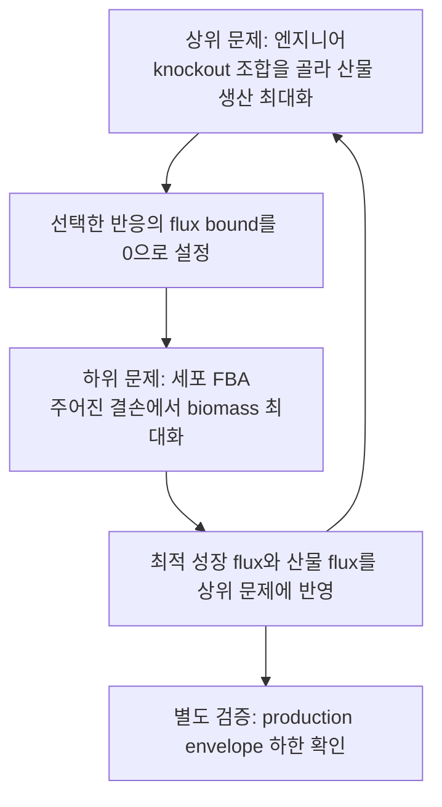

# 6. 균주 설계(Strain Design) 알고리듬

## 6.1 균주 설계의 문제 정의: 성장과 생산의 트레이드오프

**아주 쉬운 비유부터.** §2~5에서 우리는 "부품을 빼면 기계가 어떻게 되는지"를 관찰하는 정비공이었습니다. 이제 §6부터는 "원하는 성능을 내려면 어떤 부품을 빼거나 키워야 하는지"를 거꾸로 설계하는 엔지니어가 됩니다. 정비공과 엔지니어는 같은 기계·같은 도구(FBA)를 보지만, 질문의 방향이 정반대입니다 — 전자는 "결과 예측", 후자는 "원인 탐색(역설계)"입니다.

**동기.** §2~5의 도구들은 "이미 정해진 결손의 결과를 예측"했습니다. 하지만 세포 공장을 만들려면 반대로 물어야 합니다 — "목표 물질을 최대한 만들려면 **어떤 유전자를 껐다/켜야** 하는가?"

**균주 설계(strain design)**는 "어떤 유전적 개입이 생장을 유지하면서 목표 화합물로 대사 흐름을 돌릴 것인가?"라는 질문에 대한 계산적 답을 구합니다. 핵심 긴장은 세포와 엔지니어의 목적이 **다르다**는 데 있습니다 — 세포는 자기 몸집(biomass)을 불리고 싶어 하고, 엔지니어는 목표 물질을 팔고 싶어 합니다. 대표적인 네 계열 — **OptKnock, OptForce, OptGene, FSEOF** — 은 이 긴장을 각기 다르게 해소합니다.

이 긴장을 왜 "탐색 문제"로 풀어야 하는지 규모로 실감해 봅시다. `e_coli_core`의 유전자 137개에서 결손 5개 조합을 고르는 경우의 수는 $$\binom{137}{5} \approx 3.7 \times 10^8$$(약 3.7억)이며, genome-scale iML1515(유전자 1,516개)에서는 $$\binom{1516}{5} \approx 6.6 \times 10^{13}$$(약 66조)에 이릅니다. 각 조합마다 FBA를 풀어 전수 조사하는 것은 불가능하므로, OptKnock 같은 알고리듬은 이 방대한 조합 공간을 **하나씩 세어 보는 대신 최적화 문제로 정식화**해 solver가 유망한 조합으로 곧장 도달하게 만듭니다. 아래 네 알고리듬은 바로 이 "천문학적 탐색 공간을 어떻게 영리하게 좁히는가"에 대한 서로 다른 전략입니다.

| 알고리듬 | 한 줄 요약 | 개입 방향 |
|:---|:---|:---|
| **OptKnock** (§6.2) | 이중 레벨 MILP로 growth-coupled 결손 조합을 정확히 탐색 | 결손 |
| **OptForce** (§6.3) | FVA로 "반드시 바뀌어야 하는" 반응을 찾아 강제 조정 대상 식별 | 결손 + 상/하향 조절 |
| **OptGene** (§6.4) | 유전 알고리듬으로 비선형 목적(BPCY)까지 다루며 결손 탐색 | 결손 |
| **FSEOF** (§6.5) | 생산을 강제하며 함께 증가하는 반응을 증폭 표적으로 스캔 | 과발현(증폭) |

## 6.2 OptKnock: Growth-coupled 생산을 위한 이중 레벨 MILP

**OptKnock**(Burgard, Pharkya, Maranas, 2003)은 균주 설계의 시초격 알고리듬으로, 문제를 **이중 레벨 혼합정수선형계획법(bilevel MILP)**으로 정형화합니다. 상위 레벨(엔지니어)은 결손 조합(이진 변수 $$y_j$$)을 선택해 생산 flux $$v_{product}$$를 최대화하고, 하위 레벨(세포)은 그 제약 하에서 [FBA](../chapter-4/README.md)로 생장을 최대화한다고 가정합니다.

$$\max_{\mathbf{y}} \; v_{product} \quad \text{s.t.} \quad \max_{\mathbf{v}} \; v_{biomass}$$

$$\mathbf{S}\mathbf{v} = \mathbf{0}, \quad lb_j \leq v_j \leq ub_j, \quad v_j = 0 \text{ if } y_j=1, \quad \sum_j y_j \leq K$$

여기서 $$K$$는 허용 가능한 최대 결손 수입니다. 이 정형화의 핵심은 **strong duality(강 쌍대성)**를 이용해 이중 레벨 문제를 단일 레벨 MILP로 변환해 Gurobi·CPLEX 같은 solver로 풀 수 있다는 점입니다. OptKnock은 생산과 생장의 결합을 **지향**하지만, 표준 optimistic bilevel 해는 최대 성장 대안해 가운데 생산이 큰 해를 선택할 수 있습니다. 따라서 같은 최대 성장률에서 산물 flux가 0인 대안해가 남는지 production envelope의 하한으로 확인해야 합니다.



*그림 8.6. OptKnock의 이중 수준 최적화와 사후 검증. 상위 문제는 허용된 결손 수 안에서 산물 flux를 높일 반응 조합을 선택하고, 하위 문제는 그 결손 아래에서 세포의 biomass flux를 최대화합니다. 화살표는 논리적 의존 관계이며 두 문제가 실제로 번갈아 실행된다는 뜻은 아닙니다. 구현에서는 하위 LP의 쌍대성과 optimality 조건으로 단일 MILP를 구성하고, production-envelope 하한은 최대 성장 대안해에서 생산이 사라질 수 있는지를 별도로 검사합니다. 출처: 저자 자체 제작; 개념 근거: [Burgard et al. (2003)](https://doi.org/10.1002/bit.10803). OptKnock 원 논문의 그림은 복제하거나 변형하지 않았습니다.*

**아주 작은 장난감 네트워크로 OptKnock의 이중 레벨 구조를 손으로 풀어 봅시다.** 공통 전구체 $$A$$에서 갈라지는 두 경로를 생각합니다.

- $$v_1$$: 기질 흡수, $$\varnothing \to A$$, $$0 \le v_1 \le 10$$
- $$v_2$$: "효율적 성장" 경로, $$A \to$$ 바이오매스(단위 A당 바이오매스 1을 만들지만 산물은 전혀 안 만듦)
- $$v_3$$: "생산 결합" 경로, $$A \to$$ 바이오매스 + 산물(단위 A당 바이오매스 0.5, 산물 0.5를 함께 만듦)

질량보존은 $$v_1 = v_2 + v_3$$이고, 하위 문제(세포)는 $$\max\, (v_2 + 0.5v_3)$$(바이오매스), 상위 문제(엔지니어)는 그 위에서 산물 $$0.5v_3$$을 최대화합니다. knockout 후보는 $$v_2$$(효율적 성장 경로) 하나뿐이라고 합시다($$K=1$$).

**경우 1 — 결손 없음** ($$y=0$$). 세포는 바이오매스 계수가 더 큰 $$v_2$$(계수 1)를 $$v_3$$(계수 0.5)보다 선호하므로, 흡수 용량을 전부 $$v_2$$에 몰아줍니다 — $$v_2=10, v_3=0$$, 바이오매스 $$=10$$. 이때 산물 $$=0.5\times0=0$$으로, 세포가 최적으로 자라는 지점에서 산물이 전혀 없는 **non-coupled** 상태입니다.

**경우 2 — 효율 경로 결손** ($$v_2$$ knockout, $$y=1$$). 이제 세포에게 남은 선택지는 $$v_3$$뿐이므로 $$v_3=10$$(흡수 용량 전부), 바이오매스 $$=0.5\times10=5$$. 이때 산물 $$=0.5\times10=5$$로, 세포가 **최적으로 자라는 바로 그 지점에서** 산물이 필연적으로 5가 됩니다 — **growth-coupled** 상태입니다.

| $$y$$ (v2 결손 여부) | $$v_2$$ | $$v_3$$ | 바이오매스(하위 문제 최적값) | 산물(상위 문제 목적값) |
|:---:|:---:|:---:|:---:|:---:|
| 0 (결손 없음) | 10 | 0 | 10 | 0 |
| 1 (결손) | 0 | 10 | **5** | **5** |

OptKnock의 상위 문제는 $$y \in \{0,1\}$$ 중 하위 문제의 최적점에서 산물을 최대화하는 쪽을 고르므로 $$y=1$$을 선택합니다 — **절대적인 최대 생장률은 10에서 5로 줄었지만**, 그 대가로 "세포가 최적으로 행동하는 한 산물도 함께 나온다"는 성질을 얻었습니다. 이것이 성장과 생산이 근본적으로 충돌하는 상황에서 OptKnock이 내리는 전형적인 트레이드오프이며, 다음 절에서 다룰 production envelope(§7.1)에서 "최대 생장점의 산물 하한"으로 시각화되는 바로 그 성질입니다. 이 장난감 예제는 대안 경로가 정확히 둘뿐이라 하한 문제(같은 최댓값에서 산물이 0인 대안해)가 생기지 않지만, 실제 genome-scale 모델에서는 $$v_3$$처럼 보이는 경로가 여럿일 수 있어 §6.2 서두에서 강조한 production envelope 재검증이 필요합니다.

> **잠깐, 생각해보기:** 어떤 OptKnock 설계에서 최대 성장점의 산물 flux **하한이 0보다 크다면**, 세포는 목표 물질을 생산하지 않고 최적으로 자랄 수 없습니다. 이 성질이 왜 중요할까요? 발효조에서 생산을 포기한 돌연변이가 더 빨리 자라 집단을 장악할 위험을 줄이고, 성장 선택압이 생산 phenotype 유지에 기여할 수 있기 때문입니다. 반대로 하한이 0이면 표준 OptKnock의 선택된 해가 생산적이어도 강건한 growth coupling이 증명된 것은 아닙니다. 방금 손으로 푼 예제에서는 $$y=1$$일 때 $$v_3=10$$이 유일한 최적해였으므로(다른 대안 경로가 없음) 하한 문제가 발생하지 않았지만, 이는 이 장난감 예제가 단순하기 때문입니다.

## 6.3 OptForce: FVA 기반 MUST/FORCE 세트

OptKnock이 결손에만 초점을 둔다면, **OptForce**(Ranganathan et al., 2010)는 flux를 능동적으로 **증가**시켜야 하는 반응까지 식별합니다. 절차는 [FVA](../chapter-4/README.md)를 wild-type과 목표 과생산 조건 양쪽에서 수행해, flux가 반드시 변해야 하는 **MUST set**을 구하고, 이를 실제로 조작해야 하는 최소 집합인 **FORCE set**으로 정제하는 2단계로 진행됩니다. *E. coli* succinate 과생산 사례(iAF1260 모델, 혐기)에서 OptForce는 PPC(phosphoenolpyruvate carboxylase) 과발현, PFL·LDH 약화, glyoxylate shunt 활성화 등 기존에 알려진 전략을 재현하는 동시에 비직관적 개입도 발굴했습니다. 효소 kinetic 관계를 통합한 확장판 **k-OptForce**는 MINLP(혼합정수비선형계획법)로 재정형화되어 계산 비용은 늘지만 실험 적합도가 향상됩니다.

## 6.4 OptGene: 비선형 목적함수를 위한 유전 알고리듬

**OptGene**(Patil et al., 2005)은 MILP의 결정론적 최적화 대신 **유전 알고리듬(genetic algorithm)**을 사용합니다. 두 가지 이점이 있습니다. 첫째, 적합도 평가와 최적화 전략이 분리되어 **BPCY (Biomass-Product Coupled Yield)**(생장율과 생산 수율의 곱)처럼 비선형·비볼록 목적함수도 다룰 수 있습니다. 둘째, 시뮬레이션 레이어로 FBA뿐 아니라 §3~4의 **MOMA/ROOM**을 선택할 수 있어 서로 다른 mutant 행동 가설을 시험할 수 있습니다. 단, 유전 알고리듬은 전역 최적성을 보장하지 않아 지역 최적해에 수렴할 수 있으므로 여러 난수 시드로 반복 실행해야 합니다. OptGene은 효모의 세스퀴테르펜·바닐린 생산(MOMA를 시뮬레이션 레이어로 사용)과 growth-coupled succinate 설계에 적용되었습니다.

## 6.5 FSEOF/FVSEOF: 증폭 표적 스캐닝

OptKnock·OptForce·OptGene이 결손/강제 조정에 집중하는 반면, **FSEOF (Flux Scanning based on Enforced Objective Flux)**(Choi et al.)는 **과발현(증폭) 표적**을 찾습니다. 방법은 직관적입니다 — wild-type FBA 해에서 시작해 목표 생산 flux를 이론적 최대치까지 점진적으로 강제 증가시키면서 모든 반응의 flux를 관찰하고, 생산 flux와 함께 단조 증가하는 반응을 증폭 후보로 지정합니다. 확장판 **FVSEOF**는 FVA와 Grouping Reaction 제약을 결합해 세 지표로 후보를 세분화합니다. *E. coli* shikimate 사례에서 FVSEOF는 원래 FSEOF가 놓친 `pps`를 포함해 11개 반응 flux를 증폭 후보로 제시했습니다(DOI: [10.1186/1752-0509-6-106](https://doi.org/10.1186/1752-0509-6-106)). 별도의 *S. coelicolor* 연구에서는 FSEOF가 새 표적 BCDH(branched-chain α-keto acid dehydrogenase)를 발굴했고, 그 과발현 균주가 actinorhodin 생산을 52배 높였습니다(DOI: [10.1002/biot.201300539](https://doi.org/10.1002/biot.201300539)). 후보 목록과 실험 검증된 표적을 구분해서 읽어야 합니다.

> 💡 **실습: succinate 생산을 강제하며 FSEOF 후보 찾기**

```python
import numpy as np
import pandas as pd
from cobra.flux_analysis import pfba

target_id = "EX_succ_e"

# 1) 이론적 최대 생산량을 계산한다.
with model:
    model.objective = target_id
    max_product = model.slim_optimize()

# 2) 최대치의 10~90%를 차례로 강제하고, 각 단계에서 생장을 유지하는 pFBA 해를 구한다.
levels = np.linspace(0.1 * max_product, 0.9 * max_product, 9)
profiles = []
for enforced in levels:
    with model:
        model.reactions.get_by_id(target_id).lower_bound = float(enforced)
        sol = pfba(model)  # 원래 biomass 목적을 유지한 대표 해
        profiles.append(sol.fluxes)

flux_table = pd.DataFrame(profiles, index=levels)
flux_table.index.name = "enforced_succinate"

# 3) 생산 강제량이 커질수록 역행 없이 증가하고, 처음보다 충분히 커진 반응을 추린다.
tol = 1e-7
monotone = (flux_table.diff().iloc[1:] >= -tol).all(axis=0)
gain = flux_table.iloc[-1] - flux_table.iloc[0]
candidates = gain[monotone & (gain > tol)].sort_values(ascending=False)

# 교환·바이오매스·목표 반응은 공학적 효소 증폭 후보에서 제외한다.
exclude = {target_id, "Biomass_Ecoli_core"} | {r.id for r in model.exchanges}
candidates = candidates.drop(labels=list(exclude), errors="ignore")

for reaction_id, delta_flux in candidates.head(10).items():
    reaction = model.reactions.get_by_id(reaction_id)
    print(reaction_id, round(delta_flux, 3), reaction.gene_reaction_rule)
```

이 코드는 강의용 최소 구현입니다. 실제 FSEOF에서는 반응 방향, flux 정규화, 비단조 후보, GPR을 통한 유전자 매핑, 과발현 가능한 효소인지 여부를 추가로 큐레이션해야 합니다. `pFBA`를 쓴 이유는 각 강제 단계의 대안 최적해에 따른 임의성을 줄이기 위해서이며, pFBA도 유일성을 보장하지 않으므로 상위 후보는 FVA와 실험으로 재검증합니다.


**꼭 알아야 할 균주 설계 논문.** Burgard, Pharkya & Maranas (2003)의 **OptKnock**(doi: `10.1002/bit.10803`)은 세포의 성장 최적화를 내부 문제로 두고 결손을 고르는 이중 수준 최적화를 제시해, 생산을 성장과 결합하는 설계 원리를 확립했습니다. Choi et al. (2010)의 **FSEOF**(doi: `10.1128/AEM.00115-10`)는 목표 생산을 단계적으로 강제할 때 함께 증가하는 반응을 스캔해 **결손이 아니라 증폭 표적**을 찾는 간단하고 해석 가능한 전략을 제시했습니다. 두 논문의 차이는 "생존하려면 만들게 할 것인가"와 "더 만들려면 어느 경로를 키울 것인가"입니다. 이 절(§6.3~6.5)에서 다룬 OptForce·OptGene과 함께 네 알고리듬의 개입 유형·정형화·시뮬레이션 레이어 차이를 §6.6의 표로 비교하십시오.


## 6.6 확장 알고리듬과 통합 소프트웨어

기초 4개 알고리듬 이후 다양한 확장이 등장했습니다.

| 확장 | 핵심 아이디어 |
|:---|:---|
| **M-OptKnock** | 생산·생장·대사적 조정량($$L_1$$-distance)의 trade-off를 내부 목적에 넣어 최적 성장 가정의 편향을 완화; 보고된 사례에서 coupling 개선 |
| **RobustKnock** | $$\max_{\mathbf{y}} \min_{\mathbf{v}\in V^*} v_{product}$$ — 대안 최적해 중 **최악의 경우**를 최대화해 최적해 비유일성에 강건 |
| **OptCouple** | **최소 절단 집합(minimal cut set, MCS)** — 원치 않는 대사 모드를 모두 차단하는 최소 반응 집합 — 을 이용해 growth-coupled 생산을 강제 |
| **OptDesign** | 결손과 flux 상/하향 조절을 하나의 틀로 통합; succinate 사례에서 OptForce·OptReg보다 더 많은 새로운 개입을 발굴 |
| **StrainDesign (Python)** | OptKnock·RobustKnock·MCS 기반 방법을 하나의 인터페이스로 통합해 알고리듬 간 비교를 용이하게 함 |

M-OptKnock이 coupling을 개선한 한 계산 사례는 그 효과를 숫자로 보여줍니다. *E. coli* succinate 생산에서 결손 수 $$K=5$$, 생장율 하한 $$0.1\ \text{h}^{-1}$$ 조건일 때, 표준 OptKnock 설계의 대안 최적해 생산 flux는 **0–38.24 mmol/gDW/h**였지만, M-OptKnock 설계는 **38.06–38.21 mmol/gDW/h** 범위를 보였습니다(DOI: [10.3390/a18120786](https://doi.org/10.3390/a18120786)). 이는 해당 모델·배지·목적의 in silico 결과이며 모든 조건에서의 수학적 보장이나 보편적 성능 배수가 아닙니다. 핵심은 이름만 보고 강건성을 가정하지 말고 production envelope(§7.1)의 하한까지 검사하는 것입니다.

이들 알고리듬의 특징을 정리하면 다음과 같습니다.

| 알고리듬 | 정형화 | 개입 유형 | 전역 최적성 | 시뮬레이션 레이어 |
|:---|:---|:---|:---:|:---|
| OptKnock | Bilevel MILP | 결손 | 예 (정확 MILP) | FBA |
| OptForce | FVA 기반 MUST/FORCE | 결손 + 상/하향 조절 | 예 (FORCE set) | FVA |
| OptGene | 유전 알고리듬 | 결손 | 아니오 (휴리스틱) | FBA, MOMA, ROOM |
| FSEOF/FVSEOF | Flux scanning | 증폭 | 아니오 (순위화) | FBA/FVA |

## 6.7 실험 구현: CRISPR 다중 편집과 ML 결합

계산적으로 예측된 균주 설계는 **CRISPR-Cas** 기반 유전체 편집으로 실현됩니다. CRISPRa/i는 dCas9(dead Cas9)를 이용해 DNA를 절단하지 않고도 유전자 발현을 조절하며, 여러 sgRNA를 동시에 사용하는 **다중 편집(multiplexed editing)**은 여러 후보 조합을 한 주기에서 구현할 가능성을 넓힙니다. 실제 편집 수와 성공률은 숙주·편집 방식·표적 간 상호작용에 크게 의존하므로, 계산 후보 수를 곧바로 동시 편집 성능으로 읽어서는 안 됩니다. 최근에는 **AMN-Reservoir**(신경망-기계론적 하이브리드로 uptake flux bound 추정), **FlowGAT**와 **FluxGAT**(flux-informed 그래프로 유전자 필수성 예측)처럼 머신러닝이 제약 기반 모델링과 결합되고 있습니다 — 이 흐름은 [Chapter 9](../chapter-9/README.md)에서 더 자세히 다룹니다.


🔑 **핵심 개념 · 용어(English):** **Strain design(균주 설계)** — 목표 화합물 생산을 위해 유전적 개입을 계산적으로 탐색하는 과정. **Growth-coupled production(생장 결합 생산)** — 생산이 최적 생장의 필연적 부산물이 되도록 설계된 대사 상태. **Bilevel optimization(이중 레벨 최적화)** — 상위·하위 목적함수가 중첩된 최적화 구조.


---
