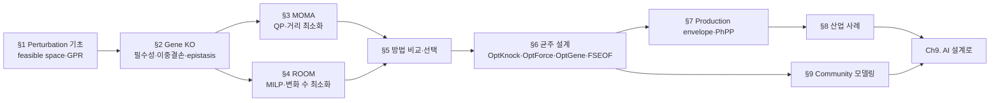
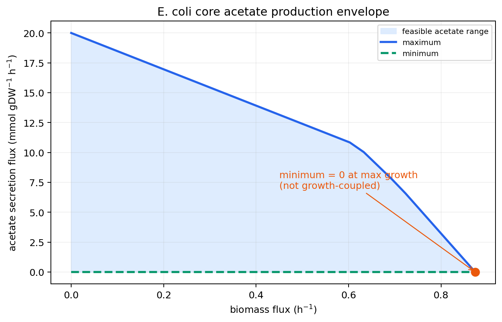

# Chapter 8. 미생물·세포공장·합성생물학 응용

> 이 장은 유전자 결손이 flux 가능 영역에 미치는 영향을 FBA·MOMA·ROOM으로 예측하고, 그 예측을 균주 설계와 커뮤니티 모델링에 연결한다. `e_coli_core`에서 단일·이중 결손, MOMA/ROOM, production envelope를 실행하며 방법별 가정과 해석 범위를 비교한다.


이 장은 [Chapter 4](../chapter-4/README.md)의 FBA/FVA와 [Chapter 3](../chapter-3/README.md)의 GPR 규칙을 이미 안다고 가정합니다. 기억이 가물가물하다면 두 장을 먼저 훑고 오는 것을 권합니다 — 특히 [화학량론 행렬](../glossary.md) $$\mathbf{S}$$, 정상상태 조건 $$\mathbf{S}\mathbf{v}=\mathbf{0}$$, 그리고 GPR의 Boolean 평가는 이 장 §1~2에서 곧바로 재사용됩니다.


## 표기와 읽기 원칙

이 책은 한국어 용어를 먼저 쓰고, 처음 등장할 때 영어 원어와 약어를 함께 표기한다. 이후에는 같은 장 안에서 한 표기를 일관되게 사용한다.

- **플럭스**(flux; 대사 통량), **반응**(reaction), **대사물**(metabolite)은 각각 단위 시간당 반응 진행률, 화학량론적 변환, 구획을 포함한 화학종을 뜻한다.
- **경계조건**(bounds), **목적함수**(objective function), **솔버**(solver)는 생물학적 사실이 아니라 모델에 부여한 계산 조건이다.
- 조건·가정·절차는 번호 목록으로, 결과의 범위와 예외는 `해석상의 주의` 상자로 구분한다.


본문의 “예측”은 명시된 모델·배지·경계조건·목적함수 아래의 계산 결과다. 실험 관찰이나 인과적 효과와 혼용하지 않는다.


## 범위와 선행 지식

[Chapter 4](../chapter-4/README.md)의 FBA/FVA와 [Chapter 3](../chapter-3/README.md)의 GPR 규칙을 전제로 한다. 유전자 결손 분석은 질병 모델에서 생장 억제 후보를 찾는 데도, 대사공학에서 생산 증대 후보를 찾는 데도 사용하지만 목적함수와 검증 기준이 다르다. 표준 FBA는 돌연변이가 지정한 목적을 즉시 재최적화한다고 가정한다. MOMA와 ROOM은 결손 직후 또는 제한된 재배선을 대안 가설로 두며, 어느 가설이 적절한지는 시간 해상도와 실험 자료로 평가해야 한다. 후반부에서는 이 예측법을 OptKnock, OptForce, OptGene, FSEOF 같은 균주 설계 알고리듬의 평가 층으로 확장한다. 실행 예제는 [Chapter 1](../chapter-1/README.md)의 `e_coli_core`(반응 95, 대사물 72, 유전자 137)이다.

이 장은 아래와 같은 순서로 진행됩니다. 앞부분(§1~5)은 "이미 일어난 결손의 결과를 예측"하고, 뒷부분(§6~9)은 "원하는 결과를 얻기 위해 어떤 결손을 골라야 하는지"를 계산합니다 — 예측에서 설계로의 전환이 이 장의 큰 줄기입니다.

*그림 8.1. 제8장의 전개: 섭동 뒤 가능한 플럭스 공간과 표현형을 예측하는 단계(§1–5)에서 결손·플럭스 조절을 설계 변수로 선택하고 생산 포락선과 커뮤니티 수준에서 검증하는 단계(§6–9)로 이동합니다. 출처: 저자 자체 제작; 개념 근거: MOMA([Segrè et al., 2002](https://doi.org/10.1073/pnas.232349399)), ROOM([Shlomi et al., 2005](https://doi.org/10.1073/pnas.0406346102)), OptKnock([Burgard et al., 2003](https://doi.org/10.1002/bit.10803)). 원 논문의 그림은 복제하거나 변형하지 않았습니다.*

---
## 대화형 도해: 핵심 가정과 결과 해석


아래 도해는 **교육용 개념·모의 데이터**를 조작하여 이 장의 핵심 가정과 해석 범위를 확인하는 보조 자료이다. 실제 GEM 결과로 인용할 수 없으며, 실제 계산은 모델 버전·배지·목적함수·solver·허용오차를 고정한 실습 코드로 재현해야 한다.




[새 창에서 대화형 도해 열기](https://jyryu3161.github.io/ebook_metabolic_modeling/interactive/index.html?chapter=8)

대화형 조작(슬라이더로 결손·tolerance를 바꾸는 등)은 이 GitBook 지면이 아니라 위 링크 또는 Jupyter 노트북에서만 작동한다. 아래는 §7에서 실제로 계산하는 production envelope의 정적 스냅샷이다.

_그림. `e_coli_core`의 아세테이트 production envelope(§7.1 그림 8.7과 동일 자산). 최대 생장점에서 하한이 0이므로 이 야생형 조건은 growth-coupled가 아니다 — 이 장 §6의 균주 설계 알고리듬들이 이 하한을 양수로 밀어 올리는 것을 목표로 한다._

## 이 장을 읽는 방법

섭동 분석은 야생형에서 가능한 플럭스 집합이 유전자 결손 뒤 어떻게 제한되는지 비교하는 방법이다. 생산 설계에서는 성장, 수율, 생산성의 trade-off를 한 값으로 축약하지 않는다.

1. 결손은 반응 경계를 바꾸어 실행 가능 영역을 제한한다.
2. FBA, MOMA, ROOM은 서로 다른 가정을 통해 섭동 후 상태를 선택한다.
3. 생산 포락선은 성장률과 생산 flux가 함께 가질 수 있는 범위를 보여 준다.
4. 탄소·전자·ATP 수지와 산소전달, 독성, 안정성은 별도로 검토한다.


연결 중심 대사물이나 높은 flux만으로 취약성·좋은 생산 표적을 단정하지 않는다. 대체 경로와 조건 변화에 대한 민감도를 함께 평가한다.


## 학습 목표

이 장을 마치면 학습자는 다음을 할 수 있게 됩니다.

**이론적 목표**
1. Perturbation(섭동) 분석의 대수적 기초 — null space, feasible space, 세 가지 제약(화학량론적·열역학적·perturbation-specific) — 을 설명할 수 있다.
2. **GPR (Gene-Protein-Reaction)** 규칙의 Boolean 평가를 통해 유전자 결손이 반응 비활성화로 이어지는 메커니즘을 손으로 추론하고, 단일/이중 결손 결과를 essential/growth-reduced/non-essential로 분류할 수 있다.
3. MOMA의 [이차계획법(QP)](../glossary.md) 정형화와 ROOM의 [혼합정수선형계획법(MILP)](../glossary.md) 정형화를 수식으로 설명하고 두 방법을 비교할 수 있다.
4. [OptKnock](../landmark-papers.md), [OptForce](../landmark-papers.md), [OptGene](../landmark-papers.md), [FSEOF](../landmark-papers.md) 등 균주 설계 알고리듬의 수학적 정형화와 적용 맥락의 차이를 설명할 수 있다.
5. [Production envelope](../glossary.md)와 [phenotype phase plane](../glossary.md)이 생산-생장 트레이드오프를 어떻게 시각화하는지 꼭짓점을 손으로 읽으며 설명할 수 있다.
6. 커뮤니티 대사 모델링의 개념(cross-feeding, competition, mutualism)과 대표 프레임워크(MICOM, SteadyCom, OptCom, COMETS)의 차이를 설명할 수 있다.

**실습적 목표**
7. COBRApy로 단일/이중 유전자 결손, `moma()`, `room()`을 실행하고 결과를 비교·시각화할 수 있다.
8. `production_envelope()`로 생산 포락선을 계산하고 growth-coupled 여부를 판정할 수 있다.
9. 두 개의 최소 모델을 이어 붙여 cross-feeding 커뮤니티 모델을 만들고 FBA로 분석할 수 있다.

**통합적 목표**
10. 연구 질문(과도 상태 vs. 안정 상태, 약물 표적 스크리닝 vs. 균주 설계, 단일 종 vs. 커뮤니티)에 따라 이 장에서 다룬 방법 중 적절한 것을 선택하는 기준을 제시할 수 있다.

---

## 시작 전 자가 점검

아래 세 문항에 막힘없이 답할 수 있다면 바로 §1로 넘어가도 좋습니다. 답이 가물가물하다면 괄호 안의 챕터를 먼저 훑고 오십시오.

- 화학량론 행렬 $$\mathbf{S}$$가 $$m \times n$$이고 정상상태 조건이 $$\mathbf{S}\mathbf{v}=\mathbf{0}$$일 때, 이 방정식이 의미하는 바를 한 문장으로 설명할 수 있는가? ([Chapter 2](../chapter-2/README.md))
- FBA가 선형계획법(LP)으로서 목적함수·제약·최적해를 어떻게 정의하는지, 그리고 대안 최적해(alternate optima)가 왜 생기는지 설명할 수 있는가? ([Chapter 4](../chapter-4/README.md))
- GPR 규칙에서 `and`와 `or`가 각각 무엇을 의미하는지 예를 들어 설명할 수 있는가? ([Chapter 3](../chapter-3/README.md))

이 점검을 통과했다면, 이제 "유전자를 끄면 무슨 일이 일어나는가"라는 이 장의 첫 질문으로 들어갈 준비가 된 것입니다.

---
