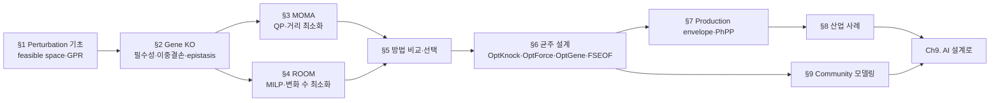

# Chapter 8. 미생물·세포공장·합성생물학 응용

> 유전자 하나를 껐을 때 세포는 무엇을 할까요? 이 장에서는 유전자 결손(gene knockout)이 대사 흐름에 미치는 영향을 예측하는 세 방법(FBA·MOMA·ROOM)을 손으로 계산하며 배우고, 이를 발판으로 미생물을 유용 물질 **세포 공장(cell factory)**으로 재설계하는 **균주 설계(strain design)** 알고리듬과 여러 미생물이 대사를 나누는 **커뮤니티(community) 모델링**까지 나아갑니다. 이 장을 마치면 여러분은 `e_coli_core`로 단일·이중 결손, MOMA/ROOM, production envelope를 직접 실행하고 그 결과를 해석할 수 있게 됩니다.


이 장은 [Chapter 4](../chapter-4/README.md)의 FBA/FVA와 [Chapter 3](../chapter-3/README.md)의 GPR 규칙을 이미 안다고 가정합니다. 기억이 가물가물하다면 두 장을 먼저 훑고 오는 것을 권합니다 — 특히 화학량론 행렬 $$\mathbf{S}$$, 정상상태 조건 $$\mathbf{S}\mathbf{v}=\mathbf{0}$$, 그리고 GPR의 Boolean 평가는 이 장 §1~2에서 곧바로 재사용됩니다.


## 이 장을 시작하며

여러분이 맥주 양조장을 운영한다고 상상해 봅시다. 효모는 포도당을 먹고 열심히 에탄올을 뱉어냅니다. 그런데 어느 날 이런 생각이 듭니다 — "효모가 에너지를 자기 몸집 불리는 데 그만 쓰고, 내가 팔고 싶은 물질을 더 많이 만들게 할 수는 없을까?" 좀 더 일상적인 비유를 들자면, 이는 회사 직원이 "자기 승진"만 신경 쓰는 대신 "회사가 팔고 싶은 상품"을 더 많이 만들도록 업무 배치를 바꾸는 것과 비슷합니다. 직원(세포)의 기본 동기는 바뀌지 않지만, 몇몇 부서(반응)를 없애거나 강화하면 전체 산출물의 구성이 달라집니다. 세포를 마치 **공장의 생산 라인처럼 개조**하는 것, 이것이 이 장의 핵심 질문입니다.

[Chapter 4](../chapter-4/README.md)에서 우리는 [FBA](../chapter-4/README.md)로 "세포가 최적으로 행동할 때 어떤 flux 분포를 택하는가"를 계산했습니다. [Chapter 7](../chapter-7/README.md)에서는 그 도구를 질병에 겨눠, "어떤 유전자를 **끄면**(knockout) 암세포를 굶겨 죽일 수 있는가"를 물었습니다. 이제 산업 현장으로 무대를 옮기면 질문의 방향이 정반대가 됩니다 — "어떤 유전자를 끄고 켜야 세포가 **더 많이 만들어낼까**?" MOMA·ROOM의 핵심만 먼저 복습하려면 [Perturbation 분석 보충](../supplements/perturbation-analysis.md)을 참고하십시오.

> **잠깐, 생각해보기:** 암 표적 발굴(Ch7)과 세포 공장 설계(Ch8)는 정반대의 목적을 가지는데, 왜 같은 유전자 결손·FBA 도구를 쓸 수 있을까요? 힌트: 두 경우 모두 "유전자를 껐을 때 대사 흐름이 어떻게 재배치되는가"라는 **동일한 예측 문제**를 풀며, 다만 그 예측을 "생장 억제"에 쓰느냐 "생산 증대"에 쓰느냐만 다릅니다.

하지만 곧바로 곤란한 사실과 마주합니다. Ch4의 FBA는 돌연변이도 지정한 목적을 재최적화한다고 가정하지만, 결손 직후 세포가 새 최적 상태에 도달한다는 보장은 없습니다. 이 차이를 시험하기 위해 **MOMA**와 **ROOM**이라는 두 대안 가설이 등장했습니다. 뒤에서는 FBA·FVA 또는 MOMA·ROOM을 평가 층으로 활용하는 균주 설계 알고리듬(OptKnock, OptForce, OptGene, FSEOF)으로 확장합니다. 실행 예제는 [Chapter 1](../chapter-1/README.md)의 `e_coli_core`(반응 95, 대사물 72, 유전자 137)를 사용합니다.

이 장은 아래와 같은 순서로 진행됩니다. 앞부분(§1~5)은 "이미 일어난 결손의 결과를 예측"하고, 뒷부분(§6~9)은 "원하는 결과를 얻기 위해 어떤 결손을 골라야 하는지"를 계산합니다 — 예측에서 설계로의 전환이 이 장의 큰 줄기입니다.

*예측(§1~5)에서 설계(§6~9)로: 결손의 결과를 이해해야 비로소 "어떤 결손을 고를지"를 최적화할 수 있습니다.*

---
## 학습 목표

이 장을 마치면 학습자는 다음을 할 수 있게 됩니다.

**이론적 목표**
1. Perturbation(섭동) 분석의 대수적 기초 — null space, feasible space, 세 가지 제약(화학량론적·열역학적·perturbation-specific) — 을 설명할 수 있다.
2. **GPR (Gene-Protein-Reaction)** 규칙의 Boolean 평가를 통해 유전자 결손이 반응 비활성화로 이어지는 메커니즘을 손으로 추론하고, 단일/이중 결손 결과를 essential/growth-reduced/non-essential로 분류할 수 있다.
3. MOMA의 이차계획법(QP) 정형화와 ROOM의 혼합정수선형계획법(MILP) 정형화를 수식으로 설명하고 두 방법을 비교할 수 있다.
4. OptKnock, OptForce, OptGene, FSEOF 등 균주 설계 알고리듬의 수학적 정형화와 적용 맥락의 차이를 설명할 수 있다.
5. Production envelope와 phenotype phase plane이 생산-생장 트레이드오프를 어떻게 시각화하는지 꼭짓점을 손으로 읽으며 설명할 수 있다.
6. 커뮤니티 대사 모델링의 개념(cross-feeding, competition, mutualism)과 대표 프레임워크(MICOM, SteadyCom, OptCom, COMETS)의 차이를 설명할 수 있다.

**실습적 목표**
7. COBRApy로 단일/이중 유전자 결손, `moma()`, `room()`을 실행하고 결과를 비교·시각화할 수 있다.
8. `production_envelope()`로 생산 포락선을 계산하고 growth-coupled 여부를 판정할 수 있다.
9. 두 개의 최소 모델을 이어 붙여 cross-feeding 커뮤니티 모델을 만들고 FBA로 분석할 수 있다.

**통합적 목표**
10. 연구 질문(과도 상태 vs. 안정 상태, 약물 표적 스크리닝 vs. 균주 설계, 단일 종 vs. 커뮤니티)에 따라 이 장에서 다룬 방법 중 적절한 것을 선택하는 기준을 제시할 수 있다.

---

## 시작 전 자가 점검

아래 세 문항에 막힘없이 답할 수 있다면 바로 §1로 넘어가도 좋습니다. 답이 가물가물하다면 괄호 안의 챕터를 먼저 훑고 오십시오.

- 화학량론 행렬 $$\mathbf{S}$$가 $$m \times n$$이고 정상상태 조건이 $$\mathbf{S}\mathbf{v}=\mathbf{0}$$일 때, 이 방정식이 의미하는 바를 한 문장으로 설명할 수 있는가? ([Chapter 2](../chapter-2/README.md))
- FBA가 선형계획법(LP)으로서 목적함수·제약·최적해를 어떻게 정의하는지, 그리고 대안 최적해(alternate optima)가 왜 생기는지 설명할 수 있는가? ([Chapter 4](../chapter-4/README.md))
- GPR 규칙에서 `and`와 `or`가 각각 무엇을 의미하는지 예를 들어 설명할 수 있는가? ([Chapter 3](../chapter-3/README.md))

이 점검을 통과했다면, 이제 "유전자를 끄면 무슨 일이 일어나는가"라는 이 장의 첫 질문으로 들어갈 준비가 된 것입니다.

---
