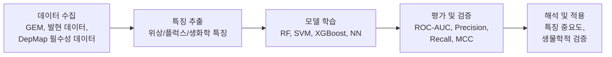
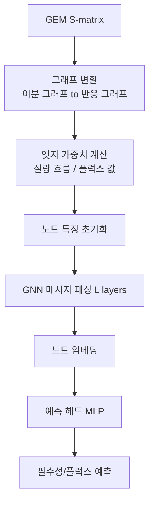
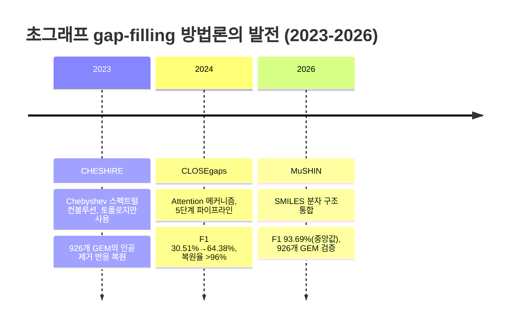
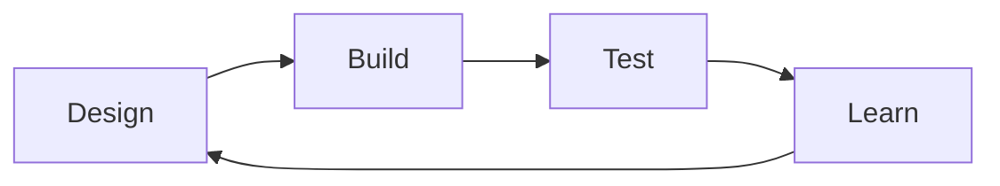

# Chapter 9. AI와 대사모델링

> 인공지능(Artificial Intelligence, AI)·기계학습(Machine Learning, ML)이 [FBA](chapter-4.-flux-balance-analysis-fba.md) 같은 전통적 제약 기반 방법의 한계를 어떻게 보완하는지 다룬다. 이 장을 마치면 그래프 특징을 추출해 유전자 필수성을 예측하고, 그래프·초그래프 신경망이 왜 플럭스 예측과 gap-filling을 개선하는지 설명하고, ML 서로게이트·강화학습·대형 언어 모델(LLM)·Foundation Model이 대사모델링의 어느 지점에 기여하는지 스스로 판단할 수 있게 된다.

> FBA·pFBA·MOMA·ROOM 등 이 장의 출발점이 된 고전 논문의 질문·핵심 결론·오독 주의점은 [대사모델링 랜드마크 논문 가이드](landmark-papers.md)에 모아 두었다.

## 이 장을 시작하며

[Chapter 8](chapter-8..md)에서 우리는 유전자 결손(gene knockout)·MOMA·ROOM으로 돌연변이의 행동을 예측하고, OptKnock 같은 알고리듬으로 균주를 설계했다. 이 모든 방법은 하나의 공통된 뼈대 위에 서 있다 — [Chapter 2](chapter-2..md)의 화학량론 행렬 $$\mathbf{S}$$, [Chapter 4](chapter-4.-flux-balance-analysis-fba.md)의 선형 계획법(Linear Programming, LP), 그리고 "세포는 무언가를 최적화한다"는 가정이다.

그런데 여기서 잠깐 멈춰서 질문해보자. 유전자가 수천 개인 게놈 규모 모델에서 모든 유전자 쌍의 이중 결손을 스크리닝하려면 얼마나 많은 LP를 풀어야 할까? 세포가 정말로 "생물량 최대화"만을 목표로 행동할까? 그리고 애초에 이 거대한 $$\mathbf{S}$$ 행렬 자체는 어떻게 만들어지고 고쳐지는가? [Chapter 5](chapter-5..md)에서 보았듯 재구축(reconstruction)과 gap-filling은 여전히 사람의 손이 많이 필요한 병목이다.

이 장에서는 Ch1~8의 제약 기반 방법들이 쌓아 올린 모델·데이터 위에 **머신러닝이 어떻게 결합되는지**를 본다. 이론·응용 서술을 마무리하는 장으로서, 개별 기법을 소개하는 데서 그치지 않고 마지막에는 아홉 개 장을 관통해 온 "대사모델링이란 무엇이었는가"를 함께 되짚어 본다. 이어지는 [Chapter 10](chapter-10.-cobrapy-tutorial.md)은 이 개념들을 하나의 실행 흐름으로 다시 검산하는 통합 실습입니다.

## 학습 목표

이 장을 마치면 다음을 할 수 있다.

- 지도학습·비지도학습·딥러닝의 3대 패러다임이 대사모델링(특히 유전자 필수성 예측)에 어떻게 적용되는지 설명할 수 있다.
- 대사 네트워크에서 위상적·플럭스·생화학적 특징을 코드로 추출하고, Random Forest 분류기를 학습·평가할 수 있다.
- ROC Curve, MCC 등으로 분류기 성능을 평가하고, 클래스 불균형 상황에서 왜 정확도(Accuracy)만으로는 부족한지 숫자로 논증할 수 있다.
- 그래프 신경망(GNN)과 초그래프 신경망(Hypergraph Neural Network)이 각각 어떤 문제(플럭스/필수성 예측, gap-filling)를 어떻게 개선하는지 설명할 수 있다.
- ML 서로게이트 모델, 강화학습, LLM, Foundation Model이 대사모델링의 어느 병목(속도, 목적함수 의존, 큐레이션)을 겨냥하는지 짝지을 수 있다.
- AI+GEM 통합이 여전히 안고 있는 도전과제(데이터 희소성, 화학량론적 타당성, 해석 가능성, 불확실성)를 비판적으로 평가할 수 있다.

> **핵심 개념 · 용어(English):** 이 장에서 다루는 응용 문제 자체 — 유전자 필수성의 생물학적 의미와 전통적 FBA 판정([Chapter 8](chapter-8..md)), 약물 표적 발굴([Chapter 7](chapter-7..md)), gap-filling의 전통적 MILP 방법과 모델 QC([Chapter 5](chapter-5..md)) — 는 해당 장에서 다룬다. 이 장은 오직 이 문제들에 **AI/ML이 어떻게 결합되는가**에 집중한다.

---

## 1. 왜 지금 AI인가: 두 접근의 만남

### 1.1 베테랑 택시기사와 정밀 지도

낯선 도시에서 최단 경로를 찾는 두 가지 방법을 생각해보자.

하나는 **정밀한 지도와 교통 법규집**이다. 모든 도로·신호·일방통행 규칙이 정확히 기록되어 있다면, 경로 탐색 알고리듬은 항상 수학적으로 최적인 경로를 계산해 낸다. 그러나 이 지도를 처음부터 그리는 일은 엄청난 노동이고(도로 하나하나를 실측해야 한다), 목적지가 10만 개로 늘어나면 매번 처음부터 경로를 다시 계산해야 해서 느리다.

다른 하나는 **그 도시에서 30년을 운전한 베테랑 택시기사의 직감**이다. 수십만 번의 운행 경험에서 "이 시간엔 이 길이 막힌다"는 패턴을 학습했기에 지도 없이도 순식간에 그럴듯한 경로를 제시한다. 그러나 이 직감은 가끔 틀린다 — 실제로는 없는 지름길이 있다고 착각하거나, 도로 공사로 사라진 길을 여전히 추천하기도 한다.

$$\mathbf{S}\mathbf{v}=\mathbf{0}$$에 기반한 [FBA](chapter-4.-flux-balance-analysis-fba.md)는 정밀한 지도에 해당한다 — 화학량론이라는 물리 법칙을 정확히 지키며 최적해를 계산하지만, 모델(지도) 구축은 느리고 노동집약적이며, 수백만 개의 시나리오를 일일이 다시 계산하려면 시간이 오래 걸린다. **머신러닝(ML)**은 베테랑 기사의 직감에 해당한다 — 과거 데이터에서 패턴을 학습해 즉각적으로 판단하지만, 가끔 화학적으로 불가능한 답을 "그럴듯하게" 내놓기도 한다(이 문제는 §10.2에서 숫자로 확인한다).

**이 장의 핵심 메시지는 하나다 — AI는 GEM을 대체하지 않고, GEM과 상생(相生)한다.** 메커니즘적 제약(지도)이 데이터 기반 모델(직감)을 생물학적 현실에 고정시키고, ML은 GEM의 계산적 한계와 큐레이션 병목을 극복한다.


💡 **잠깐, 생각해보기:** FBA가 "항상 옳은" 정밀한 지도라면 왜 굳이 부정확할 수 있는 ML이 필요할까? 답은 "정밀함"의 전제 조건에 있다 — FBA는 지도(모델)가 완전하고, 목적함수가 정확하고, 계산할 시간이 충분할 때만 정밀하다. 유전자 수천 개의 이중 결손처럼 계산량이 폭발하거나, 목적함수를 알 수 없는 비모델 생물을 다룰 때는 "빠르고 대략 맞는" 직감이 더 실용적일 수 있다.


### 1.2 전통적 방법의 네 가지 한계

[Chapter 4](chapter-4.-flux-balance-analysis-fba.md)의 FBA, pFBA, FVA, [Chapter 8](chapter-8..md)의 MOMA, OptKnock은 강력하지만 근본적인 한계를 가진다.

| 한계 | 구체적 문제 | AI/ML의 대응 | 관련 절 |
|:---|:---|:---|:---:|
| ① 계산 복잡성 | 유전자 $$G$$개 결손 스크린 = $$O(G)$$번의 LP; 이중 결손은 $$O(G^2)$$ | 학습 후에는 순전파(forward pass) 한 번으로 예측 — 수백~수만 배 가속 | §3, §6 |
| ② 목적함수 의존 | 생물량 최대화 가정이 항상 옳지는 않음("관찰자 편향") | 목적함수 없이 위상·샘플링 데이터로 학습 | §4 |
| ③ 비선형성 포착 불가 | LP는 선형 관계만 표현; 조절·동역학적 비선형성은 배제 | 딥러닝의 비선형 함수 근사 능력 활용 | §2, §6 |
| ④ 인간 큐레이션 병목 | GPR 정비·gap-filling은 여전히 수작업([Chapter 5](chapter-5..md)) | LLM·Foundation Model이 문헌·서열에서 지식 추출 | §5, §8, §9 |

이 장은 2023~2026년 사이 발표된 연구를 중심으로, 이 네 가지 한계에 대응하는 6개 방법론 영역 — ML 기초와 필수성 예측, 그래프·초그래프 신경망, 서로게이트 모델, 강화학습, LLM, Foundation Model — 을 차례로 살펴본다.

---

## 2. Machine Learning 기초: 지도학습·비지도학습·평가지표

### 2.1 지도학습(Supervised Learning): 교사가 답을 알려주며 가르치듯

**지도학습(Supervised Learning)**은 입력 $$X$$와 정답 레이블 $$Y$$의 쌍으로부터 매핑 함수 $$f: X \rightarrow Y$$를 학습하는 패러다임이다. 이름 그대로 교사가 문제와 정답을 함께 제시하며 학생을 가르치는 과정에 비유된다. 대사모델링에서 가장 대표적인 활용은 **유전자 필수성 예측(Gene Essentiality Prediction)**이다.

#### 분류(Classification): 필수 vs. 비필수

$$Y \in \{0, 1\}$$

여기서 $$Y=1$$은 유전자 제거 시 세포가 생존할 수 없는 **필수 유전자(Essential Gene)**, $$Y=0$$은 **비필수 유전자(Non-essential Gene)**를 뜻한다. [Chapter 8](chapter-8..md)에서 `e_coli_core` 137개 유전자를 `single_gene_deletion()`으로 계산하면 COBRApy 0.30 기본 배지·1% 성장 임계값에서 필수 유전자는 **7개**입니다. 이 값은 아래 교육용 레이블로 재사용하지만, 실험 ground truth가 아니라 특정 모델·배지·목적함수로 만든 **in silico label**임을 구분해야 합니다.

| 알고리즘 | 비선형성 | 해석 가능성 | 계산 비용 | 클래스 불균형 처리 | 권장 사용 상황 |
|:---|:---|:---|:---|:---|:---|
| Logistic Regression | 낮음 | 높음 | 낮음 | 낮음 | 기준선(baseline), 해석 중시 |
| SVM | 중간 | 중간 | 높음 | 중간 | 고차원 특징, 중간 크기 데이터 |
| Random Forest | 높음 | 중간 | 중간 | 높음 | **GEM 필수성 예측(권장)** |
| XGBoost | 높음 | 중간 | 중간 | 높음 | 대규모 데이터, 범주형 특징 多 |
| Neural Network | 매우 높음 | 낮음 | 매우 높음 | 중간 | 대량의 데이터가 있을 때 |

로지스틱 회귀는 필수성 확률을 $$P(Y=1|\mathbf{x}) = \dfrac{1}{1 + e^{-(\mathbf{w}^T \mathbf{x} + b)}}$$로 모델링한다. 여기서 $$\mathbf{x}$$는 유전자(또는 반응)의 특징 벡터, $$\mathbf{w}$$는 각 특징의 가중치, $$b$$는 편향(bias)이다. 해석 가능성이 높지만 특징 간 복잡한 비선형 상호작용은 포착하기 어렵다.

**랜덤 포레스트(Random Forest, RF)**는 여러 결정 트리(Decision Tree)의 앙상블로, 각 트리가 서로 다른 무작위 부분집합으로 학습한 뒤 다수결로 최종 예측을 낸다.

$$\hat{Y} = \text{majority\_vote}\{h_1(\mathbf{x}), h_2(\mathbf{x}), ..., h_B(\mathbf{x})\}$$

$$h_b$$는 $$b$$번째 결정 트리, $$B$$는 트리 개수(보통 100~500)다. RF가 GEM 필수성 예측의 표준 선택지가 된 이유는 (1) 비선형 관계 포착, (2) 과적합(overfitting) 강건성, (3) 특징 중요도(feature importance) 자동 계산, (4) 클래스 불균형 처리 용이성 때문이다.

#### 회귀(Regression): 플럭스 값 예측

연속값을 예측하는 회귀 문제의 대표 예는 반응 플럭스 값 $$\hat{v}_i = f(\mathbf{x}_i)$$ 예측이다. 평가 지표로는 $$\text{MSE} = \frac{1}{n}\sum (y_i-\hat{y}_i)^2$$, $$\text{RMSE}=\sqrt{\text{MSE}}$$, $$\text{MAE} = \frac{1}{n}\sum|y_i-\hat{y}_i|$$, 결정계수 $$R^2 = 1 - \frac{\sum(y_i-\hat{y}_i)^2}{\sum(y_i-\bar{y})^2}$$가 쓰인다.

### 2.2 대사 네트워크를 그래프로: 손으로 먼저 세어보기

ML 모델은 숫자로 된 특징 벡터를 입력받는다. 대사 네트워크에서 이 숫자를 어떻게 뽑아낼지 아주 작은 장난감 네트워크로 먼저 감을 잡아보자. 세 개의 반응으로 이루어진 가상의 경로를 생각한다.

```
R1: A -> B
R2: B -> C
R3: B -> D
```

두 반응이 대사물을 공유하면 그래프에서 연결한다고 하자. R1과 R2는 B를 공유하고, R1과 R3도 B를 공유하며, R2와 R3도 B를 공유한다. 즉 세 반응 모두가 B를 통해 서로 연결된 삼각형을 이룬다.

| 반응 | 직접 연결된 반응 | 연결 차수(degree) |
|:---:|:---|:---:|
| R1 | R2, R3 | 2 |
| R2 | R1, R3 | 2 |
| R3 | R1, R2 | 2 |

이제 R4: D → E를 추가해보자. R4는 D를 공유하는 R3하고만 연결된다.

| 반응 | 직접 연결된 반응 | 연결 차수 |
|:---:|:---|:---:|
| R1 | R2, R3 | 2 |
| R2 | R1, R3 | 2 |
| **R3** | R1, R2, R4 | **3** |
| R4 | R3 | 1 |

R3은 B를 소비해 D를 만들고, 그 D를 다시 R4가 이어받는 **분기점(branch point)**에 있다. 대사 네트워크에서 이렇게 연결 차수가 높은 반응은 대개 우회로가 마땅치 않은 병목일 가능성이 크다 — 이는 §3에서 다룰 "연결 차수가 높을수록 필수성 확률이 높다"는 직관의 가장 단순한 버전이다.

이제 이 개념을 실제 `e_coli_core`(1장에서 불러온 우리의 동반 모델, 95개 반응·72개 대사물·137개 유전자)에 그대로 적용해 보자.

```python
# 1장에서 불러온 것과 동일한 e_coli_core를 다시 사용한다
import cobra
import networkx as nx

model = cobra.io.load_model("textbook")
print(f"반응 {len(model.reactions)}개, 대사물 {len(model.metabolites)}개, "
      f"유전자 {len(model.genes)}개")
# 기대 출력: 반응 95개, 대사물 72개, 유전자 137개

# 반응-반응 그래프: 공통 대사물을 공유하는 두 반응을 연결한다
G = nx.Graph()
G.add_nodes_from(rxn.id for rxn in model.reactions)

met_to_rxns = {}
for rxn in model.reactions:
    for met in rxn.metabolites:
        met_to_rxns.setdefault(met.id, set()).add(rxn.id)

for met_id, rxn_ids in met_to_rxns.items():
    rxn_ids = list(rxn_ids)
    for i in range(len(rxn_ids)):
        for j in range(i + 1, len(rxn_ids)):
            if G.has_edge(rxn_ids[i], rxn_ids[j]):
                G[rxn_ids[i]][rxn_ids[j]]['weight'] += 1
            else:
                G.add_edge(rxn_ids[i], rxn_ids[j], weight=1)

# 2장에서 다룬 익숙한 PGI(포스포글루코스 이성질화효소) 반응의 연결 차수를 확인한다
print(f"반응 그래프: 노드 {G.number_of_nodes()}개, 엣지 {G.number_of_edges()}개")
print(f"PGI의 연결 차수(degree): {G.degree('PGI')}")
# 기대 출력: 노드 95개; 엣지·PGI degree 값은 실행 환경에서 직접 확인한다
```

이렇게 만든 그래프에서 뽑을 수 있는 대사 네트워크의 특징은 크게 세 범주로 나뉜다.

| 범주 | 예시 특징 | 계산 도구 |
|:---|:---|:---|
| 위상적 특징(Topological) | 연결 차수(Degree), 매개 중심성(Betweenness Centrality), 근접 중심성(Closeness Centrality) | NetworkX |
| 플럭스 특징(Flux) | WT/KO 플럭스, 플럭스 변화량, FVA 범위, 그림자 가격(Shadow Price) | COBRApy ([Chapter 4](chapter-4.-flux-balance-analysis-fba.md)) |
| 생화학적 특징(Biochemical) | 가역성(Reversibility), 소속 경로, EC 번호, 촉매 효소(아이소자임) 수 | KEGG/BiGG 주석 |

### 2.3 비지도학습(Unsupervised Learning): 정답 없이 구조를 찾기

비지도학습은 레이블 없이 데이터 구조 자체를 발견하는 패러다임으로, 대사모델링에서는 주로 **대사 표현형 클러스터링**에 쓰인다.

**K-Means 클러스터링**은 $$n$$개의 플럭스 분포 벡터 $$\mathbf{v} \in \mathbb{R}^m$$($$m$$=반응 개수)를 $$K$$개 그룹으로 묶는다.

$$
\arg\min_{\mathbf{C}} \sum_{k=1}^{K} \sum_{\mathbf{v} \in C_k} \|\mathbf{v} - \boldsymbol{\mu}_k\|^2
$$

식이 낯설다면 1차원 숫자 6개로 감을 잡아보자: $$\{1.0,\ 1.2,\ 0.9,\ 8.0,\ 8.5,\ 7.8\}$$. 눈으로만 봐도 이 숫자들은 "1 근처" 그룹과 "8 근처" 그룹으로 갈린다. K-Means($$K=2$$)는 정확히 이 직관을 수식화한 것으로, 각 그룹의 평균(중심, centroid)은 각각 $$\approx 1.03$$과 $$\approx 8.1$$이 되고, 모든 점은 자신과 가장 가까운 중심에 배정된다. 대사모델링에서는 이 "숫자"가 하나의 반응 플럭스가 아니라 95개(또는 수천 개) 반응 전체의 플럭스 벡터라는 점만 다르다.

대표적 활용은 (1) 서로 다른 탄소원(carbon source) 조건의 FBA 플럭스를 클러스터링해 발효/호흡 등 생물학적 대사 모드를 발견하는 것, (2) 암 세포주 패널의 대사 표현형을 대사적 유사성으로 그룹화하는 것이다. **계층적 클러스터링(Hierarchical Clustering)**은 대사 경로 간 기능적 유사성을 덴드로그램(Dendrogram)으로 시각화하는 데 유용하다.

차원 축소 기법으로는 분산을 최대 보존하는 선형 투영 **주성분분석(Principal Component Analysis, PCA)** ($$\mathbf{Z} = \mathbf{X}\mathbf{W}$$)과, 국소 구조를 보존하는 비선형 기법 **t-SNE**가 널리 쓰인다. 이 둘은 실습에서 K-Means 클러스터를 2차원 평면에 그려 눈으로 확인할 때 함께 사용한다.

### 2.4 딥러닝(Deep Learning): FCNN, CNN, RNN 한눈에 보기

**딥러닝(Deep Learning)**은 여러 은닉층(hidden layer)을 가진 신경망으로 데이터의 계층적 특징 표현을 자동으로 학습하는 ML의 하위 분야다.

**완전연결 신경망(Fully Connected Neural Network, FCNN)**은 $$\mathbf{z}^{[l]} = \mathbf{W}^{[l]} \mathbf{a}^{[l-1]} + \mathbf{b}^{[l]}$$, $$\mathbf{a}^{[l]} = \sigma(\mathbf{z}^{[l]})$$ 형태의 층을 쌓는다. 그러나 대사 네트워크의 **그래프 구조를 무시**한다는 치명적 단점이 있어 §4의 그래프 신경망(GNN)에 밀린다.

**합성곱 신경망(Convolutional Neural Network, CNN)**은 지역 패턴을 감지하는 합성곱 연산 $$(\mathbf{I} * \mathbf{K})_{i,j} = \sum_{m}\sum_{n} I_{i+m, j+n} K_{m,n}$$을 핵심으로 한다. Tschauner et al.(2023)은 화학량론 행렬을 2D 이미지로 취급하는 CNN 서로게이트로 발효기 실시간 모델 예측 제어(Model Predictive Control, MPC)에서 FBA를 대체했다(§6.4 참고).

**순환 신경망(Recurrent Neural Network, RNN)**은 $$\mathbf{h}_t = \sigma(\mathbf{W}_{hh}\mathbf{h}_{t-1} + \mathbf{W}_{xh}\mathbf{x}_t + \mathbf{b}_h)$$로 시간 의존적 대사 역학(배치 발효, 동적 FBA 서로게이트)을 예측하며, LSTM/GRU는 기울기 소실 문제를 완화한 변형이다.

### 2.5 ML 파이프라인: 데이터 → 특징 → 모델 → 평가



**1단계 — 데이터 수집**: GEM 데이터베이스(BiGG, KEGG, MetaCyc, ModelSEED), 필수성 데이터(DepMap, OGEE, Keio Collection — [Chapter 8](chapter-8..md)에서 이미 언급), [Omics 데이터](chapter-6.-omics.md)(전사체, 단백체, 대사체, 플럭소믹스), 문헌 데이터(PubMed, LLM용).

**2단계 — 특징 추출**: §2.2에서 본 위상·플럭스·생화학 특징.

**3단계 — 모델 학습 및 튜닝**: 실제 유전자 필수성 자료는 흔히 양성 클래스가 10~20% 수준으로 불균형하지만 생물종·배지·판정법에 따라 달라집니다. 이 장의 유전자 예제는 7/137(약 5.1%)이고, 뒤에서 직접 반응 결손으로 만든 반응 레이블은 18/95입니다. 어느 쪽도 표본이 매우 작으므로 Random Forest 예제는 API와 평가 절차를 배우는 장난감 실습이지 생물학적 성능 benchmark가 아닙니다. `class_weight='balanced'`, fold 내부 resampling, 임계값 튜닝과 Stratified K-Fold를 사용하고, 실제 연구에서는 독립 실험 자료로 검증해야 합니다.

**4단계 — 평가**: 다음 절에서 자세히 다룬다.

### 2.6 성능 평가: 혼동 행렬에서 MCC까지 — 손으로 계산해보기

분류기 성능은 **혼동 행렬(Confusion Matrix)**로 요약한다.

|  | 예측: 필수 | 예측: 비필수 |
|:---|:---:|:---:|
| **실제: 필수** | TP | FN |
| **실제: 비필수** | FP | TN |

$$\text{민감도(Sensitivity, Recall)} = \frac{TP}{TP+FN}, \quad \text{특이도(Specificity)} = \frac{TN}{TN+FP}$$

$$\text{정밀도(Precision)} = \frac{TP}{TP+FP}, \quad F1 = 2\times\frac{\text{Precision}\times\text{Recall}}{\text{Precision}+\text{Recall}}$$

$$\text{MCC} = \frac{TP\times TN - FP\times FN}{\sqrt{(TP+FP)(TP+FN)(TN+FP)(TN+FN)}}$$

이 지표들이 왜 필요한지 직접 숫자를 넣어보자. 100개의 유전자 중 10개가 실제 필수 유전자(10%, 전형적인 클래스 불균형)라고 하자.

**전략 A — "무조건 비필수라고 예측"**: $$TP=0,\ FN=10,\ FP=0,\ TN=90$$. $$\text{Accuracy}=\frac{0+90}{100}=90\%$$. 정확도만 보면 훌륭해 보이지만, 이 전략은 필수 유전자를 단 하나도 찾지 못한다($$\text{Recall}=0$$). MCC는 분모가 0이 되어 정의되지 않으며(관례적으로 0으로 처리), "이 예측은 아무 정보도 주지 않는다"는 사실을 정확히 반영한다. 이것이 §10.1에서 다룰 **게으른 학습(Lazy Learning)**의 전형이다.

**전략 B — 실제로 학습된 분류기**: $$TP=8,\ FN=2,\ FP=4,\ TN=86$$.

$$\text{Accuracy}=\frac{8+86}{100}=94\%,\quad \text{Recall}=\frac{8}{10}=0.80,\quad \text{Precision}=\frac{8}{12}\approx0.667$$

$$F1 = 2\times\frac{0.667\times0.80}{0.667+0.80}\approx0.727$$

$$\text{MCC}=\frac{8\times86-4\times2}{\sqrt{12\times10\times90\times88}}=\frac{680}{\sqrt{950{,}400}}\approx0.697$$

전략 A(90%)와 전략 B(94%)의 정확도 차이는 4%p뿐이지만, 실제 쓸모는 하늘과 땅 차이다 — 전략 B만 필수 유전자 10개 중 8개를 실제로 찾아낸다. **MCC(Matthew's Correlation Coefficient)**는 이런 클래스 불균형에 둔감하지 않은(-1~+1) 지표로, GEM 관련 ML 연구에서 가장 신뢰할 만한 단일 지표로 쓰인다.

**ROC Curve**(x축 1-Specificity, y축 Sensitivity)의 **AUC(Area Under Curve)**는 1에 가까울수록 좋고, 0.5는 무작위 예측과 동등함을 뜻한다.


❓ **흔한 오해:** "정확도(Accuracy)가 높으면 좋은 분류기다." — 클래스가 불균형할 때는 전혀 그렇지 않다. 위 전략 A처럼 소수 클래스(필수 유전자)를 통째로 무시해도 정확도는 얼마든지 높게 나올 수 있다. 클래스 불균형이 있는 문제에서는 항상 Recall·Precision·MCC를 함께 확인해야 한다.


```python
# 성능 평가와 ROC / Precision-Recall Curve 시각화 (일반형 코드)
from sklearn.metrics import (confusion_matrix, roc_curve, auc,
                             precision_recall_curve, matthews_corrcoef)
import matplotlib.pyplot as plt

cm = confusion_matrix(y_test, y_pred)
mcc = matthews_corrcoef(y_test, y_pred)
print("Confusion Matrix:\n", cm)
print(f"MCC: {mcc:.3f}")

fpr, tpr, _ = roc_curve(y_test, y_prob)
roc_auc = auc(fpr, tpr)

plt.plot(fpr, tpr, color='darkorange', lw=2, label=f'ROC (AUC={roc_auc:.2f})')
plt.plot([0, 1], [0, 1], color='navy', lw=2, linestyle='--')
plt.xlabel('False Positive Rate (1 - Specificity)')
plt.ylabel('True Positive Rate (Sensitivity)')
plt.legend(loc="lower right"); plt.title('ROC Curve'); plt.show()
```

---

## 3. 유전자 필수성 예측: ML과 GEM의 첫 만남

**유전자 필수성(Gene Essentiality)** 예측은 항생제 개발, 암 치료 표적 발굴([Chapter 7](chapter-7..md)), 대사공학([Chapter 8](chapter-8..md))에서 핵심적 역할을 한다. 필수성 자체의 생물학적 응용은 해당 장에서 다루며, 이 절은 **ML이 필수성 예측 정확도를 어떻게 끌어올리는가**에 집중한다.

### 3.1 전통적 FBA 기반 접근의 한계와 DepMap

[Chapter 8](chapter-8..md)에서 본 전통적 *in silico* 유전자 제거는 각 유전자 $$g$$를 제거해 FBA로 최대 생물량 $$Z_{KO}$$를 계산하고, $$Z_{KO} < \alpha \cdot Z_{WT}$$(보통 $$\alpha=0.1$$)이면 필수로 판정한다. 이 접근의 한계는 (1) 목적함수 의존, (2) 클래스 불균형(필수 유전자 10~20%), (3) 조건 의존성, (4) GPR 규칙 부정확성이다.

**Cancer Dependency Map(DepMap)**은 대규모 암 세포주 CRISPR-Cas9 스크린을 제공하는 대표 자료원입니다. DepMap의 Chronos gene-effect 원점수는 일반적으로 더 음수일수록 강한 의존성을 뜻합니다. 아래 Kim et al. 연구는 이를 별도의 0~1 **GDS/probabilistic lethality** 체계로 가공해 0.5 이상을 essential label로 사용했습니다. 서로 방향이 반대인 두 점수 체계를 같은 임계값 표에 섞지 말아야 합니다.

### 3.2 MOMA-RF 통합: 민감도 0.37→0.55 (Kim et al., 2026)

[Chapter 8](chapter-8..md)에서 배운 **MOMA(Minimization of Metabolic Adjustment)**는 유전자 제거 후 WT 상태에 가장 가까운 플럭스 분포를 찾는다("근접성 원칙").

$$\min \sum_i (v_i - v_i^{WT})^2 \quad \text{s.t. } \mathbf{S} \cdot \mathbf{v} = 0, \; \mathbf{v}_{lb} \leq \mathbf{v} \leq \mathbf{v}_{ub}$$

Kim et al. (2026)은 DepMap RNA-seq로 **50개 유방암 세포주**(luminal A 8, luminal B 7, HER2-positive 10, TNBC 25)의 모델을 tINIT + Recon2M.2로 재구성했습니다. 각 유전자 KO에 대해 MOMA가 만든 **반응 flux 벡터**를 ML 입력 특징으로, DepMap gene-dependency label을 정답으로 사용했습니다. 즉 실제 MOMA-RF 입력은 이 절의 교육용 degree/betweenness 특징 목록이 아니라, 세포주 특이적 MOMA flux 재분포입니다.

| 지표 | MOMA 단독 | MOMA-RF | 변화 |
|:---|:---:|:---:|:---:|
| Sensitivity | 0.37 | 0.55 | **+49%** |
| MCC | 0.27 | 0.33 | **+22%** |
| Accuracy | 0.86 | 0.84 | -2%p |
| Specificity | 0.92 | 0.87 | -5%p |
| Precision | 0.33 | 0.31 | -2%p |

민감도 증가는 **18 percentage points**, 상대값으로 약 49%입니다. MCC도 0.27에서 0.33으로 증가했지만 precision은 0.33에서 0.31로 낮아졌습니다. 따라서 “모든 면에서 정확해졌다”가 아니라, 불균형 자료에서 더 많은 참 의존성을 회수하는 대신 일부 거짓양성을 감수한 결과로 읽어야 합니다. 차이는 TNBC·HER2-positive 세포주에서 통계적으로 유의했고 luminal A/B에서는 유의하지 않은 경향이었습니다.


💡 **잠깐, 생각해보기:** Accuracy가 소폭 낮아졌는데(0.86→0.84) 왜 일부 측면의 개선이라 부를까? 민감도와 MCC는 증가했지만 precision은 감소했습니다. 따라서 단일 숫자로 “우월”하다고 말하지 말고, 표적 누락과 거짓양성의 비용을 함께 보고 용도에 맞는 지표를 선택해야 합니다.


### 3.3 분류기 선택은 어떻게 검증되었나

논문은 SVM·logistic regression·random forest(RF)·neural network를 비교하고, 클래스 불균형 처리로 oversampling, random undersampling, SMOTE-ENN을 시험했습니다. RF와 neural network가 대표 TNBC 모델에서 높은 민감도를 보였고, 25개 TNBC 세포주로 확장했을 때 RF의 세포주 간 분산이 더 작아 최종 분류기로 선택되었습니다. 정확한 비교값은 특정 학습/검증 분할과 undersampling에 종속되므로, 다른 연구에서 RF가 자동으로 최선이라는 결론은 아닙니다. 핵심 재현 항목은 **세포주 단위 외부 검증, fold 내부 특징 선택, hold-out test 격리, 불균형 처리와 임계값 기록**입니다.

### 3.4 e_coli_core로 특징 행렬과 반응 필수성 레이블 만들기

§2.2에서 만든 그래프 `G`를 이어받아, 이제 실제로 학습 가능한 특징 행렬을 완성해 보자.

```python
import numpy as np
import pandas as pd

# 위상 특징: 연결 차수와 매개 중심성 (95개 노드라 전체 계산도 빠르다)
degree = dict(G.degree())
betweenness = nx.betweenness_centrality(G)

# 플럭스 특징: 야생형 FBA (4장에서 배운 것과 동일)
wt = model.optimize()
print(f"야생형 성장률: {wt.objective_value:.3f} h^-1")
# 기대 출력: 야생형 성장률: 0.874 h^-1

rows = []
for rxn in model.reactions:
    rows.append({
        'reaction': rxn.id,
        'degree': degree[rxn.id],
        'betweenness': betweenness[rxn.id],
        'wt_flux': abs(wt.fluxes[rxn.id]),
    })
features = pd.DataFrame(rows).set_index('reaction')

# 특징의 관측 단위가 반응이므로 레이블도 반응 자체를 하나씩 제거해 만든다.
# "연결된 유전자가 모두 필수" 같은 proxy는 isozyme GPR을 잘못 처리할 수 있다.
from cobra.flux_analysis import single_reaction_deletion

reaction_ko = single_reaction_deletion(model, processes=1)
ko_growth = {
    next(iter(ids)): float(growth)
    for ids, growth in zip(reaction_ko["ids"], reaction_ko["growth"])
}
features["essential"] = [
    int(not np.isfinite(ko_growth[rid])
        or ko_growth[rid] < 0.01 * wt.objective_value)
    for rid in features.index
]
print(features['essential'].value_counts())
# 기대 출력: non-essential 77, essential 18
```

```python
# Random Forest로 반응 필수성 예측
from sklearn.model_selection import train_test_split
from sklearn.ensemble import RandomForestClassifier

X = features.drop(columns='essential')
y = features['essential']

X_train, X_test, y_train, y_test = train_test_split(
    X, y, test_size=0.3, random_state=42, stratify=y
)

rf = RandomForestClassifier(
    n_estimators=200, max_depth=8,
    class_weight='balanced', random_state=42
)
rf.fit(X_train, y_train)

for name, imp in sorted(zip(X.columns, rf.feature_importances_),
                         key=lambda x: x[1], reverse=True):
    print(f"{name}: {imp:.3f}")
```

이 코드는 §2.6에서 배운 ROC·MCC 평가, §2.3의 K-Means 클러스터링과 함께 이 장 끝의 "실습" 절에서 하나의 완결된 파이프라인으로 이어진다.

향후 확장 방향은 다중 오믹스 통합, 세포주 간 전이 학습(Transfer Learning), 데이터가 축적되면 GNN(§4)으로의 전환, 조건 의존 필수성 예측이다.

---

## 4. 그래프 신경망(GNN): 토폴로지로 필수성·플럭스 예측하기

[화학량론 행렬/네트워크](chapter-2..md)는 본질적으로 그래프 구조다. §2~3의 특징 공학이 위상적 특징을 "수작업으로" 뽑아 RF에 넣었다면, **그래프 신경망(Graph Neural Network, GNN)**은 그래프 구조 자체를 신경망에 직접 입력해 한 단계 더 나아간 예측을 수행한다.

### 4.1 GNN 기초: 메시지 패싱

대사 네트워크는 이분 그래프(bipartite graph, $$V = M \cup R$$, 대사물-반응) 또는 반응 그래프(두 반응이 공통 대사물을 공유하면 연결 — §2.2에서 이미 만들어 본 그래프)로 표현된다. GNN의 핵심은 **메시지 패싱(Message Passing)**이다: 각 노드가 이웃 노드로부터 "메시지"를 받아 자신의 표현을 갱신한다.

$$\mathbf{h}_v^{(l+1)} = \text{UPDATE}^{(l)}\left(\mathbf{h}_v^{(l)}, \text{AGGREGATE}^{(l)}\left(\{\mathbf{h}_u^{(l)} : u \in \mathcal{N}(v)\}\right)\right)$$

여기서 $$\mathbf{h}_v^{(l)}$$은 노드 $$v$$의 $$l$$번째 층 임베딩, $$\mathcal{N}(v)$$는 이웃 집합이다. 이를 $$L$$층 반복하면 각 노드는 $$L$$-hop 거리 내 모든 노드 정보를 담은 표현을 갖게 된다.

**Graph Convolutional Network(GCN)**은 $$\mathbf{H}^{(l+1)} = \sigma\left(\tilde{\mathbf{D}}^{-1/2} \tilde{\mathbf{A}} \tilde{\mathbf{D}}^{-1/2} \mathbf{H}^{(l)} \mathbf{W}^{(l)}\right)$$로 이웃을 균등하게 취급하지만, **Graph Attention Network(GAT)**는 이웃마다 주의력(Attention) 가중치 $$\alpha_{vu}$$를 부여해 대사적으로 더 관련 있는 이웃에 더 큰 영향력을 준다.

$$\mathbf{h}_v^{(l+1)} = \sigma\left(\sum_{u \in \mathcal{N}(v)} \alpha_{vu}^{(l)} \mathbf{W}^{(l)} \mathbf{h}_u^{(l)}\right), \quad
\alpha_{vu} = \frac{\exp(\text{LeakyReLU}(\mathbf{a}^T [\mathbf{W}\mathbf{h}_v \| \mathbf{W}\mathbf{h}_u]))}{\sum_{k \in \mathcal{N}(v)} \exp(\text{LeakyReLU}(\mathbf{a}^T [\mathbf{W}\mathbf{h}_v \| \mathbf{W}\mathbf{h}_k]))}$$

```python
# PyTorch Geometric 기반 GAT (FlowGAT 개념 구현)
import torch
import torch.nn.functional as F
from torch_geometric.nn import GATConv

class FlowGAT(torch.nn.Module):
    """Mass Flow Graph를 처리하는 Graph Attention Network"""
    def __init__(self, in_channels, hidden_channels, out_channels,
                 num_heads=4, num_layers=3):
        super().__init__()
        self.convs = torch.nn.ModuleList()
        self.convs.append(GATConv(in_channels, hidden_channels,
                                   heads=num_heads, concat=True, dropout=0.2,
                                   edge_dim=1))
        for _ in range(num_layers - 2):
            self.convs.append(GATConv(hidden_channels * num_heads, hidden_channels,
                                       heads=num_heads, concat=True, dropout=0.2,
                                       edge_dim=1))
        self.convs.append(GATConv(hidden_channels * num_heads, out_channels,
                                   heads=1, concat=False, dropout=0.2,
                                   edge_dim=1))

    def forward(self, x, edge_index, edge_weight=None):
        # GATConv는 edge_weight가 아니라 [num_edges, edge_dim] edge_attr를 받는다.
        edge_attr = None if edge_weight is None else edge_weight.reshape(-1, 1)
        for conv in self.convs[:-1]:
            x = F.elu(conv(x, edge_index, edge_attr=edge_attr))
            x = F.dropout(x, p=0.2, training=self.training)
        return self.convs[-1](x, edge_index, edge_attr=edge_attr)  # 로짓
```

### 4.2 필수성·플럭스 예측: FlowGAT, FluxGAT, MGNN

| 방법 | 입력 그래프 구성 | 핵심 결과 |
|:---|:---|:---|
| **FlowGAT**(2024) | FBA 플럭스 → 질량 흐름 그래프(공유 대사물 기반 가중치) → GAT | Precision >75%, Recall >90%, FBA가 놓친 유전자 평균 19개 정정 |
| **FluxGAT**(2026) | 목적함수 없는 flux sampling → flux-informed 반응 그래프 → GAT | iCHO2291과 Mouse1에서 FBA보다 sensitivity를 높이면서 높은 precision·specificity를 유지 |
| **MGNN**(2024) | 대사 네트워크 토폴로지 = 신경망 구조(뉴런=대사물, 연결=반응) | *B. pertussis* 산화스트레스의 in-silico 동역학 사례에서 완전연결망보다 적은 파라미터와 낮은 오차를 보임 |

FlowGAT의 **질량 흐름 그래프(Mass Flow Graph, MFG)**에서는 반응 $$i$$가 생산한 대사물 $$X_k$$의 흐름을 그 대사물을 소비하는 반응들의 소비량 비율로 나눕니다.

$$
\mathrm{Flow}_{i\to j}(X_k)
=\mathrm{Flow}^{+}_{R_i}(X_k)
\frac{\mathrm{Flow}^{-}_{R_j}(X_k)}
{\sum_{\ell\in C_k}\mathrm{Flow}^{-}_{R_\ell}(X_k)},
\qquad
w_{ij}=\sum_k\mathrm{Flow}_{i\to j}(X_k)
$$

여기서 $$C_k$$는 $$X_k$$를 소비하는 반응 집합이고, 생산·소비 흐름은 화학량론 계수와 해당 flux로부터 계산합니다. 따라서 단순히 두 반응 flux의 곱을 edge weight로 쓰는 것이 아닙니다. 0-flux 반응은 edge weight가 0이 되어 그래프에서 끊기기 쉬우며, 이 때문에 비필수 유전자 class의 예측이 약해질 수 있습니다.

FluxGAT는 명시적 단일 목적함수 대신 **플럭스 샘플링(Flux Sampling)**을 사용해 목적함수 선택 의존성을 줄입니다. 다만 배지 경계, 가역성, 샘플링 알고리즘과 학습 데이터 선택에 대한 분석자 의존성까지 제거되는 것은 아닙니다. MGNN은 신경망 구조를 대사 네트워크에 대응시키는 **귀납적 편향(Inductive Bias)**으로 파라미터를 생물학적 요소에 추적하기 쉽게 하지만, 구조적 대응만으로 인과적·완전한 해석 가능성이 보장되지는 않습니다.


💡 **잠깐, 생각해보기:** FlowGAT는 왜 "FBA 플럭스가 필요"하고, FluxGAT는 왜 "목적함수 없이" 학습할 수 있을까? FlowGAT의 질량 흐름 그래프는 한 wild-type FBA 해의 flux를 쓰지만, FluxGAT는 bounds와 $$\mathbf{S}\mathbf{v}=\mathbf{0}$$이 정한 feasible space에서 여러 flux를 샘플링합니다. 이는 목적함수 선택 의존성을 줄이는 대안이지, 가능한 모든 해를 열거하거나 배지·bounds·sampling 수렴·학습 label의 편향을 없애는 방법은 아닙니다.




---

## 5. 초그래프 신경망 기반 Gap-filling

[Chapter 5](chapter-5..md)에서 전통적 gap-filling 방법(SMILEY, GapFind/GapFill, growMatch, FastGapFill)의 MILP 정형화와, 딥러닝 기반 gap-filling(CHESHIRE, CLOSEgaps, DNNGIOR, GHCN-SE)의 개요를 이미 소개했다. 여기서는 그 딥러닝 방법들이 **왜, 어떻게** 후보 반응의 우선순위를 학습하는지 한 단계 더 깊이 들여다보고, 2026년 MuSHIN까지 확장한다.

### 5.1 초그래프가 필요한 이유: 대사 반응은 "다대다" 관계다

대사 반응의 본질적 특성은 **다대다(Many-to-many)** 관계다. 예를 들어 포도당 6-인산 탈수소화 반응은

$$\text{Glucose-6-P} + \text{NADP}^+ + \text{H}_2\text{O} \rightarrow \text{6-P-Glucono-}\delta\text{-lactone} + \text{NADPH} + \text{H}^+$$

와 같이 6개의 대사물이 동시에 참여하는 6차 관계다. §2.2에서 우리가 만든 그래프(엣지가 두 노드만 연결)로는 이 반응을 정확히 표현할 수 없다 — "공유 대사물이 있으면 연결"이라는 규칙은 대사물이 여러 개일 때 정보를 뭉개버린다.

> **핵심 개념 · 용어(English):** **초그래프(Hypergraph)** $$H = (V, \mathcal{E})$$, $$\mathcal{E} \subseteq 2^V$$는 하나의 **초엣지(hyperedge)**가 임의의 수의 노드를 동시에 연결할 수 있는 그래프의 일반화다. 대사 반응 하나가 정확히 하나의 초엣지가 된다 — 6개 대사물이 참여하는 반응은 6개 노드를 한 번에 묶는 초엣지 하나로 정보 손실 없이 표현된다.

### 5.2 CHESHIRE → CLOSEgaps → MuSHIN: 복원율의 진화



| 특징 | CHESHIRE(2023) | CLOSEgaps(2024 preprint) | MuSHIN(2026) |
|:---|:---|:---|:---|
| 아키텍처 | Chebyshev 스펙트럴 컨볼루션 | 초그래프 컨볼루션 + Attention | SMILES + 다중 방향 Attention 초그래프 |
| 대사물 특징 | 토폴로지만 | 토폴로지만 | **SMILES 분자 구조 + 토폴로지** |
| 내부 검증 | 926개 GEM의 인공 제거 반응 | 인위적 갭 96%+ 복구 | BiGG median F1 **93.69%**, precision **93.98%**, recall **93.49%** |
| 외부·phenotype 검증 | 49개 draft GEM | 24개 CarveMe draft GEM | 24개 발효 관련 draft GEM |
| 핵심 주의점 | 토폴로지 기반 synthetic-gap 성능 | 2024년 사전출판 | negative reaction 생성과 인공 제거 평가를 실제 미지 반응 발견과 구분 |

CHESHIRE는 초그래프 라플라시안(Hypergraph Laplacian)을 Chebyshev 다항식으로 필터링하는 순수 토폴로지 기반 방법으로, 108개 BiGG와 818개 AGORA 모델에서 인위적으로 제거한 반응을 복원하고 49개 draft GEM의 phenotype 예측을 개선했습니다. CLOSEgaps는 초그래프 매핑 → negative sampling → 특징 초기화 → attention 기반 특징 정제 → 예측의 5단계 파이프라인을 제안했고, 사전출판물에서 인공 갭 복원과 24개 draft GEM의 phenotype 개선을 보고했습니다.

**MuSHIN**(Multi-way SMILES-based Hypergraph Interface Network, 2026)은 대사물과 반응의 **SMILES(Simplified Molecular Input Line Entry System)** 표현을 ChemBERTa와 RXNFP로 인코딩하고, hypergraph topology와 결합합니다. 108개 BiGG 모델에서 median F1은 93.69%였고, 논문은 CLOSEgaps보다 F1이 17.01% 높았다고 보고했습니다(보정하지 않은 paired $$P = 4.3\times10^{-25}$$). 예컨대 연결 패턴만 비슷한 대사물도 화학 구조 표현으로 구별할 수 있다는 장점이 있지만, 이 수치는 합성 negative와 인위적 반응 제거를 사용한 내부 benchmark이므로 실제 미지 생화학 발견의 정확도로 일반화하면 안 됩니다.


💡 **잠깐, 생각해보기:** 인공적으로 지운 반응을 잘 복원했다고 해서 자연계의 미지 반응도 같은 정확도로 찾을 수 있을까요? 훈련 모델의 큐레이션 편향, synthetic negative 생성법, 후보 reaction pool이 평가 난이도를 결정합니다. 따라서 내부 복원율과 독립 phenotype·유전자·생화학 검증을 분리해서 읽어야 합니다.


이들 방법의 공통 프레임워크는 $$N$$개의 고품질 모델로부터 학습한 신경망 $$f_\theta$$가, 주어진 초안 모델에서 각 후보 반응이 누락된 초엣지일 확률 $$P(r \in \mathcal{E}_{missing} \mid \mathcal{M}) = f_\theta(\mathcal{H}_\mathcal{M}, r)$$을 예측하는 것이다. [Chapter 5](chapter-5..md)의 전통적 MILP 방법이 "생물량을 생산 가능하게 만드는 최소 반응 집합"을 매번 처음부터 최적화로 찾는 반면, 이 신경망들은 수백~수천 개의 이미 완성된 GEM에서 "정상적인 대사 네트워크는 어떻게 생겼는가"를 미리 학습해 두었다가 순전파 한 번으로 답한다 — §1.2의 "지도 vs. 직감" 비유가 여기서도 그대로 적용된다.

---

## 6. ML 서로게이트 모델: FBA를 수천 배 가속하기

### 6.1 서로게이트 모델의 개념과 필요성

[Chapter 4](chapter-4.-flux-balance-analysis-fba.md)의 FBA는 $$\max Z = \mathbf{c}^T \mathbf{v}$$, s.t. $$\mathbf{S} \cdot \mathbf{v} = 0$$, $$\mathbf{v}_{lb} \leq \mathbf{v} \leq \mathbf{v}_{ub}$$ 형태의 LP다. 대규모 KO 스크린([Chapter 8](chapter-8..md)), 실시간 제어 루프, 진화적 최적화, 앙상블 시뮬레이션은 수천~수만 번의 LP 반복 호출을 요구해 계산 병목이 발생한다.

**서로게이트 모델(Surrogate Model)**은 $$\hat{f}_{\text{surrogate}}(\mathbf{x}) \approx f_{FBA}(\mathbf{x})$$를 만족하는 빠른 근사 함수로, **오프라인 학습·온라인 추론(Offline Training, Online Inference)** 전략을 취한다 — 베테랑 택시기사가 "미리" 도시를 익혀두었다가 즉시 답하는 것과 같다. 장점은 속도, 미분 가능성, GPU 병렬화이며, 단점은 근사 오차, 학습 범위 밖 일반화 한계, 화학량론적 타당성 미보장(§10.2)이다.

### 6.2 미분 가능한 mechanistic layer와 AMN

표준 FBA의 Simplex 호출은 그대로는 자동미분 그래프에 들어가지 않으며, 최적 flux가 여러 개이거나 활성 제약 집합이 바뀌는 지점에서는 최적해의 미분도 잘 정의되지 않을 수 있습니다. 일반적인 **미분 가능 최적화 층**은 KKT(Karush-Kuhn-Tucker) 조건의 암시적 미분 등을 이용하지만, 아래의 AMN은 그 구현과 동일한 방법이 아닙니다. 또한 여기서 말하는 미분 가능 계층은 시간에 따른 농도를 적분하는 **dynamic FBA(dFBA)**와 구별해야 합니다.

Faure et al. (2023)의 **AMN(Artificial Metabolic Network)**은 Simplex를 대신해 반복적으로 정상상태 flux를 계산하면서 역전파할 수 있는 세 가지 mechanistic layer—Wt-solver, LP-solver, QP-solver—를 제안했습니다. 신경망은 배지의 uptake bound 또는 배지 조성에서 초기 flux $$\mathbf{v}^{(0)}$$를 만들고, 뒤의 layer는 **solver마다 다른 반복식**으로 $$\mathbf{v}^{out}$$을 계산합니다. AMN 학습에서는 기준 flux와의 오차 및 대사 제약 만족도를 평가하지만, 세 solver의 내부 계산이 모두 같은 constraint-loss gradient descent인 것은 아닙니다.

- **AMN-Wt**는 학습된 flux 분기 비율을 이용해 대사물 생산량과 반응 flux를 갱신하지만, 정확한 uptake flux를 고정하는 조건에는 일반적으로 적용할 수 없다는 제한이 있습니다.
- **AMN-LP**는 고전 FBA의 생장 최대화 목적을 포함하고 flux와 쌍대 변수(shadow price)를 반복 갱신합니다.
- **AMN-QP**는 생장 목적을 두지 않고, 일부 기준 flux와의 제곱오차·flux bound·화학량론이라는 세 손실의 gradient로 flux를 보정합니다.

따라서 AMN-QP를 “FBA 목적함수에 작은 L2 항을 더해 유일해를 만드는 일반 KKT-QP 층”으로 해석하면 안 됩니다. 논문의 핵심은 신경층과 반복 mechanistic layer를 사용자 정의 손실로 함께 학습해, 적은 자료에서도 대사 제약을 활용한다는 데 있습니다. 연쇄 법칙은 개념적으로

$$\theta \leftarrow \theta-\eta\,
\frac{\partial \mathcal{L}}{\partial \mathbf{v}^{out}}
\frac{\partial \mathbf{v}^{out}}{\partial \mathbf{v}^{(0)}}
\frac{\partial \mathbf{v}^{(0)}}{\partial \theta}$$

처럼 작동합니다. **AMN-Reservoir**에서는 먼저 FBA 모의 자료로 AMN을 학습한 뒤 그 가중치를 고정하고, 앞단 신경망만 실험 자료로 학습해 배지 조성에서 uptake bound를 추정합니다. 그 추정치는 고전 FBA에 다시 입력할 수도 있습니다. 다만 제약은 유한 반복과 수치 허용오차 안에서 만족되므로, 결과를 사용할 때 $$\|S\mathbf{v}\|$$와 bound 위반을 직접 확인해야 합니다.

### 6.3 속도 향상과 정확도-속도 트레이드오프

| 서로게이트 유형 | 문헌에서 보고된 가속의 예 | 비교 전 확인할 점 |
|:---|:---:|:---|
| CNN 서로게이트(발효기 MPC) | 수백 배로 보고된 사례 | 하드웨어, batch 크기, 원 solver와 예측 horizon |
| GNN 서로게이트 | 단일·batch 실행에서 수백~수천 배 사례 | 학습 시간 포함 여부, 테스트 조건의 분포 범위 |
| 장기 반복 시뮬레이션 | 반복 수가 클 때 더 큰 누적 가속 사례 | 오차 누적과 상태 drift |
| Kinetic+GEM 하이브리드 | 특정 동적 모델에서 큰 가속 사례 | 동일 오차 허용치와 제약 위반률 |

가속 배수는 모델·하드웨어·batching·solver tolerance에 종속됩니다. 원 FBA도 생물학적 “정확도 100%”가 아니라 주어진 수학 문제의 최적해를 계산할 뿐이며, 서로게이트 정확도 역시 평균 오차 하나로 충분하지 않습니다. 최악 조건 오차, 제약 위반률, 분포 밖 조건을 함께 평가해야 합니다.

| 응용 시나리오 | 권장 모델 | 이유 |
|:---|:---|:---|
| 발효기 실시간 MPC | CNN 서로게이트 | 밀리초 단위 응답 |
| 유전자 제거 스크리닝 | GNN 서로게이트 | 대규모 일괄 처리 |
| 배지 조건 학습·최적화 | AMN-LP/AMN-QP | 대사 제약을 둔 end-to-end 학습 가능 |
| uptake bound 역추정 | AMN-Reservoir + 고전 FBA | 배지 조성을 uptake bound로 연결하고 원 solver로 재검산 가능 |
| 후보 재검산 | 원본 FBA/실험 | 수학적 근사 오차와 생물학적 오차를 분리 |

한 실용적 전략은 서로게이트로 후보를 줄인 뒤 원 최적화 문제로 재계산하는 것입니다. 재검산 비율(예: 상위 1%)은 고정 규칙이 아니라 false-negative 허용도와 calibration 결과로 정해야 하며, 마지막 생물학적 검증은 여전히 실험입니다.

---

## 7. 강화학습 기반 균주 설계

균주 설계의 생물학적 목표와 전통적 OptKnock·OptForce 등은 [Chapter 8](chapter-8..md)에서 다룬다. 여기서는 **강화학습(Reinforcement Learning, RL)**이 어떻게 모델-자유(Model-free) 최적화를 가능하게 하는지 다룬다.

### 7.1 RL 기초: MDP로서의 균주 설계

RL은 **마르코프 결정 과정(Markov Decision Process, MDP)** $$\mathcal{M} = (\mathcal{S}, \mathcal{A}, \mathcal{P}, \mathcal{R}, \gamma)$$로 정의되며, 목표는 $$\max_{\pi} \mathbb{E}\left[\sum_{t=0}^{T} \gamma^t R(s_t, a_t) \mid \pi\right]$$를 만족하는 정책 $$\pi(a|s)$$를 찾는 것이다.

| MDP 요소 | 대사 모델링에서의 대응 |
|:---|:---|
| 상태 $$s_t$$ | 현재 대사물 농도, 효소 수준, 생장률 |
| 행동 $$a_t$$ | 효소 발현 수준 조정(상향/하향/유지) |
| 보상 $$r_t$$ | 목표 대사물 생산율 개선량 |
| 상태 전이 | Kinetic Model 또는 GEM의 동적 반응 |

대표 알고리즘은 Q-Learning($$Q(s, a) \leftarrow Q(s, a) + \alpha [r + \gamma \max_{a'} Q(s', a') - Q(s, a)]$$), Policy Gradient($$\nabla_{\theta} J(\theta) = \mathbb{E}_{\pi_{\theta}}\left[\nabla_{\theta} \log \pi_{\theta}(a|s) \cdot Q^{\pi_{\theta}}(s,a)\right]$$), Actor-Critic이다.

### 7.2 MARL: 효소 수준 최적화

**Multi-Agent RL(MARL)**은 경로의 각 효소를 독립 에이전트로 모델링한다($$N$$개 에이전트 ↔ $$N$$개 효소). 각 에이전트는 지역 관찰(자신과 연결된 대사물 농도)을 받아 행동(발현 조정)을 취하고, 전체 경로가 공유 보상을 받는다.

$$R_t = \alpha \cdot \Delta \text{Product}_t - \beta \cdot \text{GrowthPenalty}_t - \gamma \cdot \text{ModificationCost}_t$$

**Model-free RL**은 전이함수를 명시적으로 미분하거나 식으로 알고 있을 필요가 없다는 뜻이지, 생물학적 사전 지식과 모델이 전혀 필요 없다는 뜻이 아닙니다. 학습에는 상태를 반환하는 환경(실험, kinetic model 또는 surrogate), 보상 정의와 안전한 행동 범위가 필요합니다. 가상 GEM/kinetic environment에서 학습했다면 그 모델의 누락과 편향을 그대로 물려받습니다.

### 7.3 시뮬레이션·기존 자료 벤치마크와 실제 DBTL의 차이

한 연구는 *E. coli* kinetic model을 **가상 환경**으로 사용해 MARL과 Bayesian optimization을 비교했습니다. 그 환경에서 MARL이 더 적은 반복으로 좋은 해에 접근했지만, 이는 실제 균주 제작·배양 10~15회를 수행한 결과가 아닙니다.

| 특성 | MARL | BO-GP |
|:---|:---|:---|
| 수렴 속도 | 해당 가상 벤치마크에서 10-15 iterations | 해당 설정에서 19+ iterations |
| 노이즈 내성 | 해당 시뮬레이션에서 더 완만 | 해당 시뮬레이션에서 더 민감 |
| 병렬 실험 | 자연스럽게 대응 | 제한적 |
| 사전 지식 | 불필요 | 커널 함수 선택 필요 |

기존 L-tryptophan 조합 균주 라이브러리를 환경으로 삼은 벤치마크에서는 12회 반복 안에 그 데이터에서 알려진 최고값의 95% 수준에 도달했다고 보고했습니다. 이는 제한된 라이브러리에서의 **retrospective/surrogate 평가**이며, 새로운 균주를 12번 실제 제작해 검증한 전향적 자율 실험 결과로 읽으면 안 됩니다.

RL 반복이 실제 **Design-Build-Test-Learn(DBTL)** 사이클이 되려면 설계가 유전적 조작으로 변환되고, 균주를 제작·배양·측정한 결과가 정책에 다시 입력되어야 합니다. 가상 환경의 `step()` 호출은 DBTL을 모사할 뿐 물리적 Build/Test를 수행하지 않습니다.



```python
# MARL 균주 최적화 개념 구현 (단순화된 Policy Gradient)
import numpy as np

class MARLStrainOptimizer:
    def __init__(self, n_enzymes, action_space=3, learning_rate=0.01):
        self.n_enzymes = n_enzymes        # 효소 수 = 에이전트 수
        self.action_space = action_space  # {0: down, 1: maintain, 2: up}
        self.lr = learning_rate
        self.policies = np.ones((n_enzymes, action_space)) / action_space

    def select_actions(self, observations):
        actions = []
        for i, obs in enumerate(observations):
            probs = np.exp(self.policies[i]) / np.sum(np.exp(self.policies[i]))
            actions.append(np.random.choice(self.action_space, p=probs))
        return np.array(actions)

    def update(self, observations, actions, rewards):
        for i in range(self.n_enzymes):
            advantage = rewards[i] - np.mean(rewards)
            for a in range(self.action_space):
                if a == actions[i]:
                    self.policies[i, a] += self.lr * advantage
                else:
                    self.policies[i, a] -= self.lr * advantage / (self.action_space - 1)
            self.policies[i] = np.clip(self.policies[i], 0.01, 10)
# 사용: optimizer.select_actions(obs) -> env.step(actions) -> optimizer.update(...)
```

---

## 8. LLM 기반 GEM 큐레이션과 지식 추출

[GEM 구조](chapter-3.-genome-scale-metabolic-model-gem.md)의 GPR 규칙 정비, [모델 QC](chapter-5..md)는 여전히 수작업 병목이 크다. **대형 언어 모델(Large Language Model, LLM)**은 Transformer의 Self-Attention $$\text{Attention}(Q, K, V) = \text{softmax}\left(\frac{QK^T}{\sqrt{d_k}}\right)V$$을 기반으로 PubMed 초록, 생물학 교과서 등에서 사전 학습된 지식을 활용해 큐레이션·주석·지식 추출·질의응답에 기여한다.

### 8.1 Human2: 26,246개 유전자-반응 쌍 LLM 큐레이션

**Human2**는 Luo et al.이 2026년 PNAS에 발표한 Human-GEM 2세대 모델입니다(DOI: 10.1073/pnas.2516511123). UniProt·Human Protein Atlas의 기능 설명과 Human1 GPR을 LLM 보조 검토에 넣어 26,246개 gene-reaction pair를 **consistent 7,774개, inconsistent 2,195개, inconclusive 16,277개**로 분류했습니다. 전문가 검토에서는 inconsistent 후보 중 210개가 모호한 설명 때문에 생긴 false negative였고, **1,985개가 실제 불일치**로 확인되었습니다. 그 결과 1,135개 GPR을 갱신하고 대사와 무관한 유전자 203개를 제거했습니다.

LLM 검토 외에도 반응·대사물·구획·GPR을 전문가와 커뮤니티가 정비했습니다. Human2 정식 모델은 **2,848 genes, 12,931 reactions, 8,461 compartment-specific metabolites**로 구성되며, Human-GEM v1→v2 사이에는 총 1,864개 GPR과 775개 반응이 변경되었습니다.

| 검증 항목 | Human2 논문에서 보고한 결과 | 올바른 해석 |
|:---|:---:|:---|
| MEMOTE | 81% | 한 종합 QC 결과이며 모든 생물학적 예측의 정확도는 아님 |
| ec-Human2의 112개 선천성 대사이상 시뮬레이션 | 65.4% | **효소 제약 파생 모델**의 질환 과제 결과 |
| NCI-60 flux consistency | ec-Human1 약 79% → ec-Human2 약 81% | 특정 세포주·효소 제약 평가의 비교 |

GitHub Actions는 pull request와 release 때 구조·중복·dead-end·대사 작업·필수성 검사를 자동 실행해 회귀 오류를 막습니다. “새 논문이 나오면 모든 GPR이 자동으로 정답으로 갱신된다”는 시스템은 아닙니다. 같은 LLM 보조 점검을 iML1515에 적용해 1,089개 후보 불일치를 **검토 대상으로 플래그**했지만, 자동 수정이나 사실 확정을 의미하지 않습니다.

또한 generic Human2 자체는 정적 GEM입니다. 논문이 제시한 연령·성별 organ-specific models, whole-body models와 enzyme-constrained/dynamic simulations는 Human2에서 파생된 **별도 생태계**입니다. “Human2는 곧 동적 전신 모델”이라고 합쳐 부르면 모델 층위가 뒤섞입니다.

### 8.2 D2Cell: 29,006개 대사공학 데이터 추출

**D2Cell**은 Li et al.이 2026년 발표한, 대사공학 문헌에서 구조화된 데이터를 추출하는 3단계 파이프라인입니다.

1. **NER(Named Entity Recognition)**: 유기체·유전자·생산물·역가(Titer) 등 개체 인식(Qwen-LoRA)
2. **RE(Relation Extraction)**: 개체 간 관계를 구조화(예: `overexpression(aroG)`)(Qwen1.5-110B-Chat)
3. **ER(Entity Resolution)**: UniProt API 등으로 표준 데이터베이스 ID에 정규화

PubMed 초록 10,000편 이상과 전문 텍스트 1,340편에서 **29,006개** 데이터 항목, 751개 미생물 균주, 1,210개 고유 생산물을 추출했다. D2Cell-pred는 GEM(생물학적 타당성) + GNN(패턴 학습) + RAG 챗봇을 결합해 새로운 균주-생산물 조합에 대한 공학 전략을 제안한다.

D2Cell의 4개 LLM(GPT-4, Claude, Llama-3, Qwen1.5) 벤치마크에서 공통적으로 **Recall은 높으나 Precision은 낮음**이 확인되었으며, 직접 프롬프팅보다 NER→RE→ER **작업 분해(Task Decomposition)**가 정밀도를 크게 높이는 핵심 전략임이 드러났다. 그림·표·Supplementary Information 등 멀티모달 처리는 여전히 한계로 남는다.

### 8.3 한계: 환각과 검증의 필요성

**환각(Hallucination)** — 존재하지 않는 반응, 잘못된 EC 번호, 열역학적으로 불가능한 경로, 가상의 대사물 생성 — 은 LLM+GEM의 큰 리스크입니다. Human2에서 2,195개 “inconsistent” 후보 중 1,985개가 전문가 검토로 확인된 것은 **해당 프롬프트·데이터·선별 집합의 양성예측도**이지 LLM 큐레이션 전체 정확도 90%가 아닙니다. 특히 16,277개가 inconclusive였다는 사실이 자동화 범위의 한계를 보여 줍니다. LLM은 검토 우선순위 지정에 유용하지만 전문가 승인과 독립 QC를 대체하지 못하며, 모델·프롬프트·데이터베이스 버전을 고정해 기록해야 합니다.


LLM이 생성한 GPR 규칙이나 반응을 **검증 없이 GEM에 바로 반영하지 말 것.** [Chapter 5](chapter-5..md)의 MEMOTE 같은 품질 관리 절차, 그리고 §10.2에서 다룰 화학량론적 타당성 검사를 반드시 거쳐야 한다.


현실적 로드맵은 인간-AI **상생적(Symbiotic)** 협업 — AI가 패턴 인식·대규모 스크리닝·지식 종합을, 인간이 메커니즘적 해석과 전략적 결정을 담당 — 이다.

---

## 9. Foundation Model과 Virtual Cell

**Foundation Model**은 방대한 생물학 데이터(서열, 구조, 화합물)로 사전 학습되어 다양한 하위 작업에 전이되는 대규모 모델이다. 이들은 개별적으로는 단백질 구조·기능·효소 동역학을 예측하지만, 총합적으로는 GEM·오믹스·실험 로봇을 하나로 잇는 **가상 세포(Virtual Cell)** — 세포 전체의 상태를 실시간으로 시뮬레이션하는 통합 디지털 표현 — 를 향한 구성 요소로 조립되고 있다.

### 9.1 AlphaFold3: 단백질-리간드 구조 예측

DeepMind의 **AlphaFold3**(2024)는 디퓨전 기반 생성 모델(Diffusion-based Generative Model)로 단백질뿐 아니라 DNA, RNA, 리간드, 이온, 번역 후 변형(PTM)을 포함한 모든 생물 복합체의 원자적 구조를 통합 예측한다. PoseBusters 벤치마크에서 리간드 RMSD < 2Å 성공률 **76%**(기존 물리 기반 도킹 ~38% 대비 2배)를 달성했다. GEM 재구성에서는 (1) Orphan Enzyme(기능은 알려졌으나 구조 미상)의 구조·활성 부위 예측, (2) GPR 규칙의 구조적 검증, (3) 효소-기질 방향성 기반 반응 방향성(reversibility) 예측에 기여한다.

### 9.2 ESM-3: 단백질 언어 모델

**ESM-3**(2024)는 980억 파라미터(오픈소스 버전 14억)로 27.8억 서열, 7,710억 토큰을 학습한 **멀티모달(서열+구조+기능)** 단백질 언어 모델이다. 기능 미상 유전자의 서열/구조 생성 및 EC 번호 추론, 변이체 효능 평가(Variant Scoring), 그리고 새로운 형광 단백질 설계(GFP 대비 서열 동일성 58%, 자연 진화 시간으로 환산 시 **약 5억 년** 단축)와 같은 *De novo* 효소 설계에 활용된다.

### 9.3 효소 동역학 Foundation Model: GECKO 3.0, HIT-EC

**GECKO(효소 제약 모델, ecModel)**는 $$v_i \leq k_{cat,i} \cdot [E_i]$$ 형태의 효소 동역학 제약을 GEM에 추가한다. 여기서 $$k_{cat,i}$$는 효소 $$i$$의 회전수(turnover number), $$[E_i]$$는 효소 농도다. GECKO 3.0은 **DLKcat**(아미노산 서열 + 기질 SMILES → $$k_{cat}$$ 예측하는 딥러닝 모델) 등을 통합해 효모 ecModel 재구성 시간을 수일에서 **~5시간**으로 단축했으며, ECMpy 2.0은 AutoPACMEN/DLKcat/TurNuP 세 가지 kcat 예측 방법을 파이썬으로 자동화했다.

**HIT-EC**(Hierarchical Information Transformer)는 EC 번호의 4단계 계층 구조(반응 클래스→화학기→보조인자→기질 특이성)를 반영한 계층적 Transformer로 EC 번호를 예측하며, Micro-averaged F1 **0.93**(DeepECT 0.79, CLEAN 0.88 대비 우수)을 달성했다. 대표성이 부족한 EC 클래스에서도 F1 0.77로 우수해 [Chapter 5](chapter-5..md)에서 다룬 draft GEM의 반응 커버리지 향상에 직접 기여한다.


🧭 **개념적 API · 외부 자산 필요:** 아래 코드는 효소 제약 모델 구축의 입력과 출력 관계를 설명하는 의사코드입니다. 이 저장소에는 `yeast-GEM.xml`과 `proteomics.csv`가 없으며, 실제 ECMpy 버전의 공개 API가 아래 이름과 같다고 보장하지 않습니다. 설치한 버전의 공식 예제에 맞춰 함수·인자를 바꾸고, 결과 생성에는 사용한 모델·예측기·$$k_{cat}$$ 데이터 버전을 함께 기록하십시오.


```python
# PSEUDOCODE ONLY — ECMpy 2.0을 이용한 ecModel 자동 구성의 개념적 API
from ecmpy import build_ec_model
import cobra

model_yeast = cobra.io.read_sbml_model("yeast-GEM.xml")
ec_model = build_ec_model(
    model_yeast,
    kcat_predictor='dlkcat',            # 'dlkcat' | 'turnup' | 'autopacmen'
    proteomics_data='proteomics.csv',   # 선택적 프로테오믹스 통합
    organism='yeast'
)
solution = ec_model.optimize()
print(f"Growth rate: {solution.objective_value}")
```

### 9.4 Self-Driving Lab과 디지털 트윈: Virtual Cell을 향한 통합

**자율 연구소(Self-Driving Laboratory, SDL)**는 설계-실험-측정-학습의 일부를 로봇과 최적화 알고리즘으로 반복하는 시스템입니다. 특정 단백질 공학·재료·공정 과제에서 폐쇄 루프 실험이 시연되었지만, 이것을 “GEM이 스스로 가설을 만들고 세포를 편집해 임상적으로 검증하는 완전자율 실험실”과 동일시하면 안 됩니다. 계획 단계의 대규모 플랫폼 목표와 이미 달성된 실험 결과도 구분해야 합니다.

**디지털 트윈(Digital Twin, DT)**은 측정값으로 계속 갱신되는 공정·개체의 계산 모델을 뜻합니다. dFBA, ODE와 ML을 결합한 세포배양·발효 공정 모델은 유망하지만, 한 공정에서 보고된 개선율을 다른 제품·세포주·스케일에 옮길 수 없습니다. 단순 시뮬레이터, 실시간 상태 추정기, 폐쇄 루프 제어까지 검증된 twin은 서로 다른 성숙도입니다.

**Virtual Cell**은 서열·구조·오믹스·GEM·동역학·실험을 연결하려는 장기 연구 의제입니다. 현재 도구들은 각기 제한된 하위 과제를 해결하며, 하나의 검증된 실시간 전세포 예측기로 결합된 상태가 아닙니다. 따라서 “구성 요소가 존재한다”와 “end-to-end 자율 순환이 실증되었다”를 구분해 기술해야 합니다.

---

## 10. 불확실성 인지 모델링과 AI+GEM의 도전과제

### 10.1 데이터 희소성과 클래스 불균형

*E. coli*, *S. cerevisiae*를 제외한 대부분의 생물은 성장 스크린(Growth Screen) 데이터가 부재하고, 플럭소믹스(Fluxomics) 실험은 고비용·고시간이며, §2.6에서 계산해 본 것처럼 필수 유전자 비율(10-20%)의 극심한 클래스 불균형은 "모두 비필수"라고 예측해도 80-90% 정확도를 얻는 **게으른 학습(Lazy Learning)**을 유도한다. SMOTE, Focal Loss, Cost-sensitive Learning으로 완화하며, FAIR 원칙과 FROG(FAIR for GEMs), [Chapter 5](chapter-5..md)의 MEMOTE 표준이 데이터 품질·재사용성을 높인다.

### 10.2 화학량론적 타당성(Stoichiometric Feasibility): 순수 생성 모델의 실패

한 GAN 기반 flux 생성 실험에서는 사용한 허용오차와 테스트 조건에서 **생성 표본 중 화학량론 제약을 통과한 것이 없었습니다**. 이는 그 연구 설정의 결과이며 모든 GAN의 보편적 “0% 법칙”은 아닙니다. 다만 $$Sv=0$$과 flux bounds를 아키텍처나 투영 단계에서 강제하지 않으면, 연속 공간의 임의 벡터가 낮은 차원의 feasible polytope에 정확히 놓일 가능성이 매우 작다는 일반 교훈은 분명합니다.

| 방법 | 원리 | 화학량론적 타당성 |
|:---|:---|:---:|
| 순수 생성 모델(제약 미내장) | 통계적 패턴 모방 | 일반적으로 보장하지 않음 |
| AMN mechanistic layer | 네트워크에서 유도한 solver별 반복식 사용; QP는 reference·bound·화학량론 손실을 직접 최소화 | 수치적으로 유도; 반복 후 잔차 확인 필요 |
| MINN(GEM 정규화) | GEM 제약을 정규화 항으로 추가 | 근사적 보장 |
| FBA→GNN(FlowGAT류) | 타당한 FBA flux로 그래프를 만들고 GNN은 필수성 같은 label을 예측 | 입력 flux에만 해당; 새 flux를 출력하는 방식이 아님 |

**핵심 교훈**: 손실함수에 질량수지 위반 페널티를 넣는 것, feasible-space로 투영하는 것, 최적화 층으로 제약을 정확히 강제하는 것은 서로 다른 수준의 보장입니다. “GEM+ML”이라는 이름만으로 화학량론적 타당성이 자동 보장되지는 않습니다.


💡 **잠깐, 생각해보기:** 제약을 모르는 생성기가 만든 연속 벡터가 왜 $$Sv=0$$과 모든 bounds를 동시에 만족하기 어려울까요? 그리고 손실 페널티로 위반을 줄이는 것과 feasible-space 투영으로 정확히 만족시키는 것은 어떤 차이가 있을까요?


### 10.3 해석 가능성: Attention 시각화와 MGNN

딥러닝의 "블랙 박스" 문제는 "왜 이 유전자가 필수인가"에 답하기 어렵게 만듭니다. Attention 가중치는 모델이 어디에 가중치를 뒀는지 보여 주지만 인과 설명과 동일하지 않습니다. MGNN의 뉴런↔대사물 대응도 추적성을 높이는 설계이지 **완전한 해석 가능성의 증명**은 아닙니다. 예측은 독립 perturbation 자료, 제약 기반 재분석, 문헌과 경로 분석으로 교차 검증해야 합니다.

### 10.4 불확실성 정량화(Uncertainty Quantification)와 일반화

대부분의 AI+GEM 모델은 점 추정만 출력하며, 독립 자료에서 calibration이 확인된 예측 구간은 드뭅니다. Flux sampling의 분산은 **feasible space가 넓다는 뜻**이지 ML 예측오차의 보정된 확률과 동일하지 않습니다. 이를 신뢰도 지표로 쓰려면 실제 오차와 분산의 관계를 별도 calibration set에서 검증해야 합니다. 인간 검토 라우팅, 능동학습과 분포 외 탐지는 유망한 후속 설계이지만 sampling 분산만으로 자동 달성되는 기능은 아닙니다.

종 간 일반화 역시 미해결 과제다. 보존적 중심 탄소 대사(해당과정, TCA 회로, PPP)는 전이 학습이 용이하지만 GPR·수송체·조절 네트워크의 종 특이성은 Pan-reactome/Pan-Draft 기반 접근으로도 완전히 해소되지 않는다.

| 도전과제 | 핵심 문제 | 현재 해결 수준 | 완화 전략 |
|:---|:---|:---:|:---|
| 데이터 희소성 | 비모델 종 데이터 부재, 클래스 불균형 | 중간 | SMOTE, Focal Loss, Transfer Learning |
| 화학량론적 타당성 | ML 출력이 $$S \cdot v = 0$$ 위반 | 높음 | 하이브리드 아키텍처(AMN, MINN) |
| 해석 가능성 | 딥러닝 블랙 박스 | 중간 | Attention 시각화, MGNN, SHAP |
| 불확실성/일반화 | 신뢰도 미제공, 종 간 전이 어려움 | 낮음-중간 | 분산 기반 신뢰도, Pan-reactome, Continual Learning |

---

## 11. 미래 연구 의제: 예측이 아니라 검증 기준으로 읽기

연도·시장 규모·정확도를 단정하는 로드맵은 기술 전망과 과학적 증거를 혼동하기 쉽습니다. 이 분야의 진전을 평가할 때는 다음 질문이 더 유용합니다.

| 연구 방향 | 필요한 검증 | 실패하기 쉬운 지점 |
|:---|:---|:---|
| 미분 가능 대사 모델 | 독립 조건의 flux·성장 예측, 정확한 제약 만족 | 빠른 근사가 원 LP/MILP의 해와 달라짐 |
| 실시간 다중 오믹스 통합 | 시간 정렬 자료와 전향적 공정 예측 | 서로 다른 시간척도·배치 효과를 정적 모델에 합침 |
| 종·세포주 간 전이학습 | 학습에 없던 종/계통을 완전히 격리한 외부 검증 | 가까운 계통·공통 반응의 데이터 누출 |
| LLM 보조 큐레이션 | 후보 recall뿐 아니라 전문가 확인 precision, 출처 추적 | inconclusive를 사실로 바꾸거나 잘못된 DB 설명을 반복 |
| 자율 DBTL | 사전 정의된 목표·안전 한계 아래 실제 폐쇄 루프 성능 | 시뮬레이션 제안과 자동 실험 검증을 같은 단계로 서술 |
| 표준 벤치마크 | 모델·배지·solver·데이터 split·평가지표 버전 고정 | 서로 다른 조건의 최고 수치만 비교 |

Human2가 보여 준 현실적인 방향은 “전문가가 사라지는 자동화”가 아니라 **후보 선별 + 출처가 남는 검토 + 자동 회귀검사 + 커뮤니티 승인**입니다. AI+GEM 연구도 같은 원칙으로, 성능 숫자보다 외부 검증·불확실성·재현 가능한 버전 기록을 우선해야 합니다.

---

## 💡 실습: e_coli_core로 완성하는 특징추출 → RF → ROC → K-Means 파이프라인

> 💡 **실습:** 아래 코드는 §2~3에서 조각조각 만들어 온 것을 하나의 완결된 파이프라인으로 잇는다. 1장에서 불러온 `e_coli_core`(95개 반응·72개 대사물·137개 유전자)만으로 그래프 특징 추출→필수성 레이블→Random Forest→ROC 평가→K-Means 대사상태 클러스터링까지 전부 실행할 수 있다. 더 큰 규모(iML1515)의 완전한 파이프라인과 5-fold 교차검증, Permutation Importance, Mann-Whitney U 검정 등 심화 내용은 합성 대사 네트워크 기반 특징 공학을 다루는 `raw_data/GEM_lecture_notes/gem9_w09_lab.ipynb` 노트북을 참고한다.

### 1단계 — 모델 로드와 그래프 특징 추출

```python
import cobra
import networkx as nx
import numpy as np
import pandas as pd

model = cobra.io.load_model("textbook")
print(f"반응 {len(model.reactions)}개, 대사물 {len(model.metabolites)}개, "
      f"유전자 {len(model.genes)}개")
# 기대 출력: 반응 95개, 대사물 72개, 유전자 137개

G = nx.Graph()
G.add_nodes_from(rxn.id for rxn in model.reactions)
met_to_rxns = {}
for rxn in model.reactions:
    for met in rxn.metabolites:
        met_to_rxns.setdefault(met.id, set()).add(rxn.id)
for rxn_ids in met_to_rxns.values():
    rxn_ids = list(rxn_ids)
    for i in range(len(rxn_ids)):
        for j in range(i + 1, len(rxn_ids)):
            if G.has_edge(rxn_ids[i], rxn_ids[j]):
                G[rxn_ids[i]][rxn_ids[j]]['weight'] += 1
            else:
                G.add_edge(rxn_ids[i], rxn_ids[j], weight=1)

degree = dict(G.degree())
betweenness = nx.betweenness_centrality(G)
print(f"그래프: 노드 {G.number_of_nodes()}개, 엣지 {G.number_of_edges()}개")
```

### 2단계 — 플럭스 특징과 필수성 레이블

```python
wt = model.optimize()
print(f"야생형 성장률: {wt.objective_value:.4f} h^-1")
# 기대 출력: 야생형 성장률: 0.8739 h^-1

from cobra.flux_analysis import single_reaction_deletion

reaction_ko = single_reaction_deletion(model, processes=1)
ko_growth = {
    next(iter(ids)): float(growth)
    for ids, growth in zip(reaction_ko["ids"], reaction_ko["growth"])
}

rows = []
for rxn in model.reactions:
    rows.append({
        'reaction': rxn.id,
        'degree': degree[rxn.id],
        'betweenness': betweenness[rxn.id],
        'wt_flux': abs(wt.fluxes[rxn.id]),
        'essential': int(not np.isfinite(ko_growth[rxn.id])
                         or ko_growth[rxn.id] < 0.01 * wt.objective_value),
    })
features = pd.DataFrame(rows).set_index('reaction')
print(features['essential'].value_counts())
# 기대 출력: non-essential 77, essential 18
```

### 3단계 — Random Forest 학습과 ROC 평가

```python
from sklearn.model_selection import train_test_split
from sklearn.ensemble import RandomForestClassifier
from sklearn.metrics import roc_curve, auc, matthews_corrcoef, classification_report
import matplotlib.pyplot as plt

X = features.drop(columns='essential')
y = features['essential']
X_train, X_test, y_train, y_test = train_test_split(
    X, y, test_size=0.3, random_state=42, stratify=y
)

rf = RandomForestClassifier(
    n_estimators=200, max_depth=8, min_samples_leaf=2,
    class_weight='balanced', random_state=42
)
rf.fit(X_train, y_train)
y_pred = rf.predict(X_test)
y_prob = rf.predict_proba(X_test)[:, 1]

print(classification_report(y_test, y_pred, target_names=['Non-essential', 'Essential']))
print(f"MCC: {matthews_corrcoef(y_test, y_pred):.3f}")

fpr, tpr, _ = roc_curve(y_test, y_prob)
print(f"AUC-ROC: {auc(fpr, tpr):.3f}")
plt.plot(fpr, tpr, label=f'RF (AUC={auc(fpr, tpr):.3f})')
plt.plot([0, 1], [0, 1], '--', color='gray')
plt.xlabel('False Positive Rate'); plt.ylabel('True Positive Rate')
plt.legend(); plt.title('Reaction Essentiality ROC Curve (e_coli_core)'); plt.show()
```

`e_coli_core`는 반응이 95개뿐이라 학습 표본이 매우 적다 — §3.3에서 다룬 편향-분산 트레이드오프를 몸소 체험하기 좋은 조건이다. 표본이 적을수록 `max_depth`를 낮추고 `class_weight='balanced'`를 유지하는 것이 과적합을 막는 데 중요하다.

### 4단계 — 여러 배양 조건의 FBA 플럭스를 K-Means로 클러스터링

$$\mathbf{S}\mathbf{v}=\mathbf{0}$$을 그대로 둔 채 교환 반응(exchange reaction)의 하한만 바꾸면, 같은 `e_coli_core`로 산소·탄소원이 다른 여러 "대사 상태"의 플럭스 벡터를 만들 수 있다.

```python
from sklearn.cluster import KMeans
from sklearn.decomposition import PCA

# 4장에서 배운 것처럼 교환 반응의 하한(lower_bound)만 바꿔 여러 조건을 만든다
conditions = {
    'aerobic_glucose':      {'EX_glc__D_e': -10, 'EX_o2_e': -20},
    'anaerobic_glucose':    {'EX_glc__D_e': -10, 'EX_o2_e': 0},
    'microaerobic_glucose': {'EX_glc__D_e': -10, 'EX_o2_e': -2},
    'aerobic_low_glucose':  {'EX_glc__D_e': -2,  'EX_o2_e': -20},
    'aerobic_acetate':      {'EX_glc__D_e': 0,   'EX_ac_e': -10, 'EX_o2_e': -20},
    'aerobic_succinate':    {'EX_glc__D_e': 0,   'EX_succ_e': -10, 'EX_o2_e': -20},
}

flux_rows, names = [], []
for name, bounds in conditions.items():
    with model:
        for ex_id, lb in bounds.items():
            model.reactions.get_by_id(ex_id).lower_bound = lb
        sol = model.optimize()
        flux_rows.append(sol.fluxes.values)
        names.append(name)

flux_matrix = np.array(flux_rows)  # (조건 수, 95)

kmeans = KMeans(n_clusters=2, random_state=42, n_init=10)
labels = kmeans.fit_predict(flux_matrix)

pca = PCA(n_components=2)
flux_2d = pca.fit_transform(flux_matrix)

for name, label in zip(names, labels):
    print(f"{name:>22s}  ->  cluster {label}")
# 기대 경향: 무산소(anaerobic_glucose)는 발효 대사 모드로,
#           나머지 호기 조건들과 다른 클러스터에 속할 가능성이 높다.

plt.scatter(flux_2d[:, 0], flux_2d[:, 1], c=labels, cmap='viridis', s=100)
for i, name in enumerate(names):
    plt.annotate(name, (flux_2d[i, 0], flux_2d[i, 1]))
plt.xlabel('PC1'); plt.ylabel('PC2')
plt.title('e_coli_core 배양 조건별 대사 상태 클러스터링'); plt.show()
```

이 4단계는 그래프 특징과 분류 평가를 익히는 교육용 파이프라인입니다. §3.2의 실제 MOMA-RF는 50개 유방암 세포주의 **MOMA flux vectors**를 특징으로 사용했고, FlowGAT/FluxGAT는 별도의 그래프 표현과 학습 설계를 사용했습니다. 문제 유형은 비슷하지만 입력과 검증 설계가 동일하지 않습니다.

---

## 한 장 요약

- 전통적 [FBA](chapter-4.-flux-balance-analysis-fba.md) 기반 방법은 계산 확장성, 목적함수 의존, 비선형성 포착 불가, 큐레이션 병목의 한계를 가지며, AI/ML은 각각에 대응하는 방법론(서로게이트, 모델-자유 RL, GNN/딥러닝, LLM)으로 발전했다 — "정밀한 지도"(GEM)와 "베테랑의 직감"(ML)의 상생 관계다.
- Kim et al. (2026)의 MOMA-RF는 50개 유방암 세포주에서 민감도를 0.37→0.55, MCC를 0.27→0.33으로 높였지만 precision은 0.33→0.31로 낮아졌습니다. 이는 모든 지표의 일괄 향상이 아니라 recall-precision 절충입니다.
- GNN과 토폴로지 제약 신경망은 목적함수 의존성을 줄이거나 네트워크 구조를 학습에 넣을 수 있지만, 배지·샘플링·데이터 선택 의존성과 외부 검증의 필요성은 남습니다.
- 서로게이트의 가속 배수는 하드웨어·batch·solver·예측 horizon에 종속됩니다. 후보 선별 뒤 원 최적화로 재검산하고 제약 위반과 분포 밖 오차를 따로 측정해야 합니다.
- MARL의 12회·95% 결과는 기존 L-tryptophan 라이브러리를 이용한 가상/retrospective 벤치마크입니다. 실제 물리적 DBTL 폐쇄 루프 검증과 구분해야 합니다.
- Human2는 LLM이 전문가 검토 후보를 선별하고 GitHub Actions가 회귀검사를 수행하는 **인간 참여형 큐레이션** 사례입니다. generic Human2와 그로부터 파생한 organ/whole-body/dynamic models를 구분해야 합니다.
- Virtual Cell·디지털 트윈·자율 연구소는 현재 제한된 구성 요소와 특정 과제의 시연이 존재하는 장기 연구 의제입니다. end-to-end 자율 전세포 모델이 이미 완성된 것으로 서술해서는 안 됩니다.
- `e_coli_core`(95개 반응)만으로도 그래프 특징 추출 → RF 필수성 예측 → ROC 평가 → K-Means 클러스터링의 전체 파이프라인을 직접 실행하고 눈으로 확인할 수 있다.

## 스스로 점검

1. **개념**: FBA 기반 필수성 예측의 목적함수 의존성이 무엇이며, flux sampling이 이를 어떻게 줄이되 어떤 분석자 선택은 남기는지 설명하라.
   > *힌트*: 단일 biomass optimum에 묶이지 않지만 배지 경계·가역성·샘플링 방법과 학습 자료 선택에는 여전히 의존합니다.

2. **계산**: 어떤 분류기가 총 100개 반응(그중 10개가 실제 필수) 중 $$TP=8,\ FN=2,\ FP=6,\ TN=84$$로 예측했다. Accuracy, Recall, Precision, MCC를 계산하고, "모든 반응을 비필수로 예측"하는 전략의 Accuracy(90%)와 비교했을 때 어느 지표가 더 신뢰할 만한지 논하라.
   > *힌트*: Accuracy $$=\frac{8+84}{100}=92\%$$, Recall $$=\frac{8}{10}=0.8$$, Precision $$=\frac{8}{14}\approx0.571$$, MCC $$=\frac{8\times84-6\times2}{\sqrt{14\times10\times90\times92}}\approx0.61$$. 두 전략 모두 Accuracy는 90% 안팎으로 비슷해 보이지만 "모두 비필수" 전략은 Recall=0으로 아무 표적도 찾지 못한다 — MCC·Recall이 목적에 맞는 지표다.

3. **개념**: 초그래프(Hypergraph)가 일반 그래프보다 대사 반응 표현에 적합한 이유를 반응 하나를 예로 들어 설명하라.
   > *힌트*: §5.1의 6개 대사물이 참여하는 반응 예시를 참고하라. 일반 그래프의 엣지는 두 노드만 연결한다.

4. **분석**: 다음 세 상황 — (a) 발효기 실시간 제어, (b) 배지 조성의 gradient 기반 최적화, (c) 논문 제출 전 최종 검증 — 에 각각 가장 적합한 서로게이트/방법을 §6.3의 표에서 골라 이유와 함께 제시하라.

5. **비판적 사고**: 제약을 내장하지 않은 한 생성 실험에서 flux 표본이 화학량론 검사를 통과하지 못한 결과가 시사하는 바를 설명하고, 페널티·투영·정확한 최적화 층의 보장 수준을 비교하라.
   > *힌트*: §10.2와 §1.1의 "지도와 직감" 비유를 연결해 보라.

## 다음 장: 이론을 실행으로 검산하기

이 책의 이론 여정은 아홉 개 장에 걸쳐 하나의 길을 걸어왔다. [Chapter 1](chapter-1..md)에서 대사라는 현상 자체의 복잡성에서 출발해, [Chapter 2](chapter-2..md)에서 그 복잡성을 화학량론 행렬 $$\mathbf{S}$$와 $$\mathbf{S}\mathbf{v}=\mathbf{0}$$이라는 숫자와 방정식으로 옮겼다. [Chapter 3](chapter-3.-genome-scale-metabolic-model-gem.md)에서 GPR·구획·바이오매스 반응으로 그 뼈대에 생물학적 살을 입혔고, [Chapter 4](chapter-4.-flux-balance-analysis-fba.md)에서 마침내 그 모델로 세포의 행동(FBA)을 예측했다. [Chapter 5](chapter-5..md)는 그 모델 자체가 어떻게 만들어지고 검증되는지를, [Chapter 6](chapter-6.-omics.md)은 범용 모델을 특정 맥락에 맞추는 법을, [Chapter 7](chapter-7..md)과 [Chapter 8](chapter-8..md)은 그렇게 완성된 모델을 질병 이해·약물 표적 발굴·세포공장 설계라는 실전 문제에 적용하는 법을 보여주었다.

그리고 이 장에서 우리는 그 모든 것 위에 머신러닝이 어떻게 포개어지는지 보았다 — 지도와 직감이 함께 일할 때 무엇이 가능해지는지를. `e_coli_core`라는 작은 모델 하나가 1장의 첫 `cobra.io.load_model("textbook")` 한 줄에서 시작해, 9장의 그래프 신경망·Random Forest·K-Means 클러스터링에 이르기까지 아홉 개 장 내내 우리 곁에 있었다는 사실이, 이 책이 전하고 싶었던 가장 중요한 메시지를 함축한다: **대사모델링은 하나의 고정된 기법이 아니라, 화학량론이라는 단단한 뼈대 위에 점점 더 많은 데이터와 방법론을 쌓아 올리는 살아있는 과정**이라는 것이다.

AI+GEM 분야는 빠르게 변하므로 연도별 수치 예측보다 모델·데이터·solver 버전을 고정하고 독립 자료로 재검증하는 습관이 중요합니다. 먼저 [Chapter 10의 완전 실행형 COBRApy 튜토리얼](chapter-10.-cobrapy-tutorial.md)에서 FBA·pFBA·FVA·결손·MOMA·ROOM·작은 MILP·SBML 왕복을 같은 모델로 직접 검산하십시오. 그다음 [랜드마크 논문 가이드](landmark-papers.md)에서 각 방법의 원 질문을 확인하고, 자신의 생물종·질병·공정에서 외부 검증이 가능한 작은 문제로 옮기는 것이 좋습니다.

## 핵심 용어 정리

| 용어(한글) | English | 정의 |
|:---|:---|:---|
| 지도학습 | Supervised Learning | 입력-정답 쌍으로부터 매핑 함수를 학습하는 ML 패러다임 |
| 랜덤 포레스트 | Random Forest | 다수 결정 트리를 앙상블하는 분류/회귀 알고리즘 |
| 매튜 상관계수 | Matthews Correlation Coefficient(MCC) | 클래스 불균형에 강건한 이진 분류 성능 지표 |
| 그래프 신경망 | Graph Neural Network(GNN) | 메시지 패싱으로 그래프 구조 데이터를 처리하는 신경망 |
| 그래프 어텐션 네트워크 | Graph Attention Network(GAT) | 이웃별 주의력 가중치를 학습하는 GNN 변형 |
| 관찰자 편향 | Observer Bias | 예측 결과가 연구자가 선택한 목적함수에 의존하는 문제 |
| 초그래프 | Hypergraph | 하나의 엣지가 임의 수의 노드를 연결할 수 있는 그래프의 일반화 |
| 서로게이트 모델 | Surrogate Model | 계산 비용이 높은 원본 함수(FBA 등)를 근사하는 빠른 모델 |
| 미분 가능 대사 최적화 계층 | Differentiable metabolic optimization layer | 최적화 또는 반복 mechanistic 계산을 학습 그래프에 넣어 역전파할 수 있게 한 계층; dynamic FBA와는 다른 개념 |
| 강화학습 | Reinforcement Learning(RL) | 에이전트가 보상을 최대화하는 행동을 학습하는 패러다임 |
| 다중 에이전트 강화학습 | Multi-Agent RL(MARL) | 여러 에이전트가 동시에 학습·상호작용하는 RL 설정 |
| 대형 언어 모델 | Large Language Model(LLM) | Transformer 기반 대규모 사전학습 언어 모델 |
| 환각 | Hallucination | LLM이 사실과 다른 그럴듯한 정보를 생성하는 현상 |
| Foundation Model | Foundation Model | 방대한 데이터로 사전학습되어 다양한 과제에 전이되는 대규모 모델 |
| 가상 세포 | Virtual Cell | 여러 생물학적 모델과 데이터를 연결해 세포 상태를 예측하려는 장기 연구 의제 |
| 디지털 트윈 | Digital Twin(DT) | 물리적 대상의 측정값으로 상태를 갱신하며 예측·제어를 지원하는 계산 모델 |
| 자율 연구소 | Self-Driving Laboratory(SDL) | 설계-실험-측정-학습 순환의 일부 또는 전부를 자동화하는 시스템; 자동화 범위를 명시해야 함 |
| 화학량론적 타당성 | Stoichiometric Feasibility | 예측된 플럭스가 질량 보존 제약 $$S \cdot v = 0$$을 만족하는 성질 |
| 불확실성 정량화 | Uncertainty Quantification | 예측값과 함께 신뢰도·분산 정보를 제공하는 것 |
| Design-Build-Test-Learn | DBTL | 대사공학의 반복적 실험 설계 프레임워크 |

## 참고문헌

1. Kim BK, Gu C, Farh MEA, Ryu JY (2026). "Integrating Genome-Scale Metabolic Modeling with Machine Learning Improves Gene Essentiality Prediction in Triple-Negative Breast Cancer." *International Journal of Molecular Sciences* 27(11):5059. DOI: 10.3390/ijms27115059.
2. Hasibi R, Michoel T, Oyarzún DA (2024). ["Integration of graph neural networks and genome-scale metabolic models for predicting gene essentiality."](https://doi.org/10.1038/s41540-024-00348-2) *npj Systems Biology and Applications* 10:24.
3. Chen C, Liao C, Liu Y-Y (2023). ["Teasing out missing reactions in genome-scale metabolic networks through hypergraph learning."](https://doi.org/10.1038/s41467-023-38110-7) *Nature Communications* 14:2375.
4. Liu X et al. (2024). ["A generalizable framework for unlocking missing reactions in genome-scale metabolic networks using deep learning."](https://arxiv.org/abs/2409.13259) arXiv:2409.13259 (CLOSEgaps preprint).
5. Zhao Y et al. (2026). ["A multi-way SMILES-based hypergraph inference network for metabolic model reconstruction."](https://doi.org/10.1038/s42003-026-09761-1) *Communications Biology* 9:531.
6. Sabzevari M, Szedmak S, Penttilä M, Jouhten P, Rousu J (2022). ["Strain design optimization using reinforcement learning."](https://doi.org/10.1371/journal.pcbi.1010177) *PLoS Computational Biology* 18:e1010177.
7. Luo J, Wang H, Moyer D, et al. (2026). "Reconstruction of human metabolic models with large language models." *PNAS* 123(15):e2516511123. DOI: 10.1073/pnas.2516511123.
8. Li X et al. (2026). ["Leveraging large language models for metabolic engineering design."](https://doi.org/10.1016/j.tibtech.2026.03.026) *Trends in Biotechnology*. — D2Cell.
9. DeepMind (2024). "AlphaFold 3: Predicting the structure and interactions of all of life's molecules." *Nature*.
10. EvolutionaryScale (2024). "ESM-3: Simulating 500 million years of evolution with a language model."
11. Tschauner et al. (2023). "Model predictive control of a fermenter using dynamic flux balance analysis coupled with convolutional neural networks." *Computers & Chemical Engineering*.
12. Aghaee M, Krau S, Tamer M, Budman H (2024). ["Graph Neural Network Representation of State Space Models of Metabolic Pathways."](https://doi.org/10.1016/j.ifacol.2024.08.380) *IFAC-PapersOnLine* 58:464–469.
13. Sharma K, Marucci L, Abdallah ZS (2026). ["Flux sampling and graph neural networks for improved gene essentiality prediction in mammalian genome-scale metabolic models."](https://doi.org/10.1038/s41540-026-00738-8) *npj Systems Biology and Applications*.
14. Huang Y, Liang X, Lin T, Liu J (2025). ["Multi-HGNN: Multi-modal hypergraph neural networks for predicting missing reactions in metabolic networks."](https://doi.org/10.1016/j.ins.2025.121960) *Information Sciences* 704:121960.
15. Faure L, Mollet B, Liebermeister W, et al. (2023). ["A neural-mechanistic hybrid approach improving the predictive power of genome-scale metabolic models."](https://doi.org/10.1038/s41467-023-40380-0) *Nature Communications* 14:4669. — AMN.
16. COBRApy: https://github.com/opencobra/cobrapy · DepMap: https://depmap.org/portal/ · MEMOTE: https://github.com/opencobra/memote
17. GECKO 3.0: https://github.com/SysBioChalmers/GECKO · ECMpy 2.0: https://github.com/synbio-eecmp/ECMpy
18. Palsson, B.O. (2015). *Systems Biology: Constraint-based Reconstruction and Analysis*, 2nd ed. Cambridge University Press.
19. Lewis, N.E. et al. (2012). "Constraining the metabolic genotype-phenotype relationship using a phylogeny of in silico methods." *Nature Reviews Microbiology*, 10(4), 291-305.

> 본 장의 원 강의자료(9주차, `gem9_w09/week9_ebook.md`)는 2025년 7월 작성되었으며, 인용된 연구는 2023-2026년 사이 발표분을 중심으로 한다. AI+GEM 분야는 빠르게 발전하므로 최신 문헌을 지속적으로 추적할 것을 권장한다.
