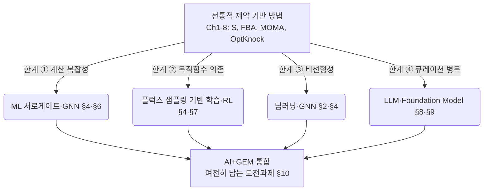

# 1. 지금 AI가 부상한 이유: 두 접근의 만남

## 1.1 제약 기반 모델과 머신러닝의 역할

대사모델링에서 [FBA](../chapter-4/README.md)와 **머신러닝(machine learning, ML)**은 서로 다른 정보를 이용한다. FBA는 $$\mathbf{S}\mathbf{v}=\mathbf{0}$$과 플럭스 경계처럼 알려진 화학량론 제약을 지키면서 해를 계산한다. 따라서 모델에 들어간 반응과 제약의 범위에서는 생물학적으로 해석 가능한 결과를 제공한다. 반면 모델을 구축하고 조건마다 최적화 문제를 다시 푸는 데에는 시간과 근거 정리가 필요하다.

ML은 과거의 실험·시뮬레이션 데이터에서 입력과 결과의 패턴을 학습해 빠르게 예측한다. 하지만 학습 데이터에 없던 조건에서는 오차가 커질 수 있고, 화학량론 제약을 모델 안에 넣지 않으면 물질수지를 만족하지 않는 값을 낼 수도 있다. 따라서 이 장에서는 ML을 GEM의 대체물이 아니라, 후보를 빠르게 좁히고 모델 구축을 보조하는 도구로 다룬다.

**이 장의 핵심 메시지는 하나다 — AI는 GEM을 대체하는 도구가 아니라, GEM의 계산·큐레이션 한계를 보완하는 도구다.** GEM의 화학량론 제약은 데이터 기반 예측이 생물학적으로 가능한 범위를 벗어나지 않게 돕고, ML은 GEM의 계산량과 큐레이션 부담을 줄이는 데 활용될 수 있다.


**해석상의 주의:** FBA도 항상 실제 세포 상태를 그대로 재현하지는 않는다. 모델에 빠진 반응이 있거나 목적함수·배지 조건이 부적절하면 예측이 달라질 수 있다. 반면 ML은 대규모 후보를 빠르게 추릴 수 있지만, 최종 해석에는 화학량론 검산과 독립 실험 검증이 필요하다.


### 1.1.1 "학습한다"는 것의 의미: 아주 쉬운 정의부터

이 장 전체에서 "ML이 학습한다"는 표현이 반복해서 나온다. 처음 접한다면 이 말이 무엇을 뜻하는지 짚고 넘어가자. 머신러닝이 하는 일은 결국 다음 두 단계로 요약된다.

1. 입력 $$\mathbf{x}$$(예: 반응의 연결 차수, 플럭스 값)를 출력 $$y$$(예: 필수 여부)로 바꾸는 함수 $$f_\theta(\mathbf{x})$$를 고른다. 여기서 $$\theta$$는 함수의 모양을 결정하는 조절 손잡이, 즉 **파라미터(parameter)**다.
2. 이미 답을 알고 있는 예제들(훈련 데이터)에 대해 $$f_\theta$$의 예측이 틀린 정도(손실, loss)를 최소화하도록 $$\theta$$를 조금씩 조정한다.

$$
\theta^\star = \arg\min_{\theta} \frac{1}{n}\sum_{i=1}^{n} L\big(y_i,\ f_\theta(\mathbf{x}_i)\big)
$$

여기서 $$n$$은 훈련 예제 수, $$L$$은 손실함수(예측이 정답과 얼마나 다른지를 숫자 하나로 재는 잣대)다. "학습"이란 결국 이 식의 우변, 즉 평균 손실을 가장 작게 만드는 $$\theta$$를 찾는 최적화 문제일 뿐이다 — [Chapter 4](../chapter-4/README.md)에서 $$Z=\mathbf{c}^T\mathbf{v}$$를 최대화하는 $$\mathbf{v}$$를 찾던 것과 "무언가를 최적화한다"는 점에서 구조적으로 닮았다. 다른 점은 FBA가 화학량론이라는 물리 제약 안에서 최적해를 찾는 반면, ML은 데이터에 가장 잘 들어맞는 함수 모양을 찾는다는 것이다. 이 최적화를 실제로 어떻게 수행하는지(경사하강법)와 손실함수의 구체적 형태는 [§2](02.md)에서 로지스틱 회귀를 예로 손 계산까지 해본다.

### 1.1.2 계산량으로 실감하는 한계 ①: 이중 결손 스크리닝

§1.2의 표에 나올 "계산 복잡성" 한계를 숫자로 먼저 체감해 보자. `e_coli_core`는 유전자가 $$G=137$$개다. 유전자 하나씩 제거하는 단일 결손 스크리닝은 $$G=137$$번의 FBA(LP)면 충분하다 — 노트북에서도 수 초 안에 끝난다. 그런데 두 유전자를 동시에 제거하는 **이중 결손(double knockout)** 스크리닝은 서로 다른 두 유전자의 조합의 수, 즉

$$
\binom{G}{2} = \frac{G(G-1)}{2} = \frac{137 \times 136}{2} = 9{,}316
$$

번의 LP가 필요하다. `e_coli_core`도 9천 번을 넘는데, 유전자 1,516개인 [iML1515](../chapter-5/README.md)([Monk et al., 2017](https://doi.org/10.1038/nbt.3956))로 가면 $$\binom{1516}{2} = 1{,}148{,}370$$번, 즉 백만 번이 넘는 LP를 풀어야 한다. 삼중 결손이라면 $$\binom{1516}{3} \approx 5.8\times10^{8}$$번으로 다시 500배 이상 불어난다. 이것이 §1.2에서 "①계산 복잡성"이라 부르는 한계의 실체다 — 학습이 끝난 ML 모델은 이 수백만 개의 조합 각각에 대해 수 밀리초의 순전파(forward pass) 한 번이면 근사값을 내놓을 수 있다(§6에서 다시 다룬다).


**해석상의 주의:** "ML이 FBA보다 훨씬 빠르니 이제 FBA는 필요 없다." — 그렇지 않다. ML은 FBA가 이미 계산해 둔 (혹은 실험으로 측정한) 정답 데이터로부터 패턴을 배운 것일 뿐, 그 정답 데이터 자체는 여전히 FBA나 실험이 만들어낸다. 게다가 §10.2에서 보듯 ML의 출력이 화학량론을 스스로 지키리라는 보장은 없다. "ML이 빠르게 후보를 추리고, FBA/실험이 최종 확인한다"는 §6.3의 전략이 훨씬 현실적이다.


[Chapter 4](../chapter-4/README.md)의 FBA, pFBA, FVA, [Chapter 8](../chapter-8/README.md)의 MOMA, OptKnock은 강력하지만 근본적인 한계를 가진다.

| 한계 | 구체적 문제 | AI/ML의 대응 | 관련 절 |
|:---|:---|:---|:---:|
| ① 계산 복잡성 | 유전자 $$G$$개 결손 스크린 = $$O(G)$$번의 LP; 이중 결손은 $$O(G^2)$$ | 학습 후에는 순전파(forward pass) 한 번으로 예측 — 수백~수만 배 가속 | §3, §6 |
| ② 목적함수 의존 | 생물량 최대화 가정이 항상 옳지는 않음("관찰자 편향") | 목적함수 없이 위상·샘플링 데이터로 학습 | §4 |
| ③ 비선형성 포착 불가 | LP는 선형 관계만 표현; 조절·동역학적 비선형성은 배제 | 딥러닝의 비선형 함수 근사 능력 활용 | §2, §6 |
| ④ 인간 큐레이션 병목 | [GPR](../chapter-3/README.md) 정비·gap-filling은 여전히 수작업([Chapter 5](../chapter-5/README.md)) | LLM·Foundation Model이 문헌·서열에서 지식 추출 | §5, §8, §9 |

②의 "목적함수 의존"이 낯설다면 이렇게 생각해보자. FBA는 "세포가 생물량(biomass) 생산을 최대화하도록 행동한다"는 가정 위에서만 답을 낸다. 실험실에서 빠르게 증식하도록 진화·선택된 미생물에는 이 가정이 꽤 잘 맞지만, 스트레스 상황의 병원균이나 정상 상태가 아닌 조직 세포에서는 "무엇을 최대화하는지" 자체가 불분명하다. §4에서 다룰 FluxGAT는 이 문제를 정면으로 겨냥해, 단일 목적함수 대신 가능한 플럭스 분포 전체를 샘플링한 데이터로 학습한다.

③의 "비선형성"도 예를 하나 들어보자. 두 효소가 함께 있을 때 생산량이 각각을 더한 것보다 훨씬 크거나 작아지는 상승/상쇄 효과(시너지·길항작용)는 선형 방정식 $$\mathbf{S}\mathbf{v}=\mathbf{0}$$만으로는 표현되지 않는다. 딥러닝의 비선형 활성화 함수(§2.4)는 이런 관계를 원리상 근사할 수 있다.

*그림 9.1. AI와 GEM을 결합하는 문제–방법 대응 지도. 제약 기반 모델의 계산 확장성·목적함수·표현력·큐레이션 병목에 대해 서로게이트·플럭스 샘플링·GNN·LLM 계열이 각각 보완 경로를 제공하지만, 어느 경로도 화학량론 검산과 외부 실험 검증을 대체하지는 않는다. 출처: 저자 자체 제작; 개념 근거: AMN([Faure et al., 2023](https://doi.org/10.1038/s41467-023-40380-0)), FlowGAT([Hasibi et al., 2024](https://doi.org/10.1038/s41540-024-00348-2)), CHESHIRE([Chen et al., 2023](https://doi.org/10.1038/s41467-023-38110-7)). 외부 논문의 그림은 복제하거나 변형하지 않았다.*

이 장은 2023~2026년 사이 발표된 연구를 중심으로, 이 네 가지 한계에 대응하는 6개 방법론 영역 — ML 기초와 필수성 예측, 그래프·초그래프 신경망, 서로게이트 모델, 강화학습, LLM, Foundation Model — 을 차례로 살펴본다. 각 방법론은 한 가지 한계만 해결하는 "만능 열쇠"가 아니라, §10에서 다시 정리하듯 저마다 새로운 트레이드오프(정확도 vs. 속도, 유연성 vs. 해석 가능성)를 함께 가져온다는 점을 염두에 두고 읽어나가자.

---
