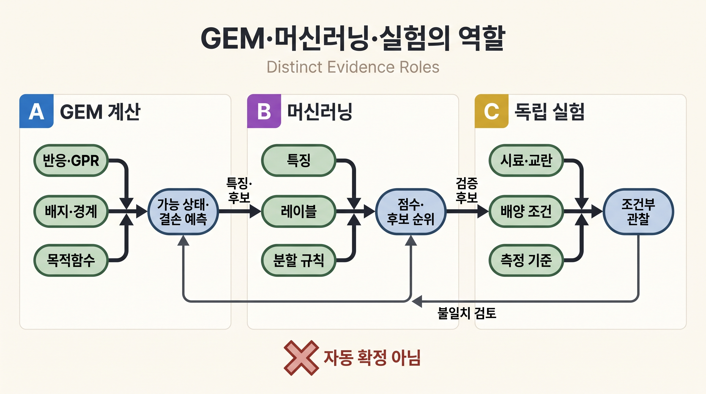

# 1. GEM·머신러닝·실험은 서로 다른 역할을 맡는다

## 1.1 세 접근이 사용하는 근거

게놈 규모 대사 모델(GEM)은 알려진 반응과 [화학량론](../chapter-2/README.md), [GPR](../chapter-3/README.md), 배지와 경계조건을 이용한다. [FBA](../chapter-4/README.md)는 이 조건에서 가능한 상태 가운데 목적함수에 맞는 해를 계산한다. 따라서 GEM의 강점은 물질수지와 반응 범위를 명시적으로 검사할 수 있다는 점이다. 반응 누락, 잘못된 GPR 또는 부적절한 배지·목적함수는 계산 결과에 그대로 반영된다.

머신러닝(ML)은 각 표본을 설명하는 **특징(feature)**과 예측하려는 **레이블(label)**의 관계를 자료에서 찾는다. 유전자 필수성 분류에서는 유전자와 연결된 반응 수, 관련 반응의 플럭스, 발현량 등이 특징이 될 수 있고, 필수·비필수 판정이 레이블이 된다. 학습이 끝난 분류기는 새 표본에 필수성 점수나 범주를 빠르게 제시하지만, 학습 자료와 다른 생물종·세포주·배지에 자동으로 일반화되지는 않는다.

실험은 계산 또는 ML이 제시한 후보를 관찰과 비교한다. 유전자 제거 실험도 배양 조건, 측정 시점, 기술적 실패와 판정 임계값의 영향을 받으므로 무조건적인 진리표는 아니다. 다만 계산과 독립된 실험 자료는 모델이 학습한 패턴이 실제 조건에서도 유지되는지 평가하는 핵심 근거다.

| 접근 | 주된 입력 | 주된 출력 | 대표 한계 |
|:---|:---|:---|:---|
| GEM 계산 | 반응·GPR·배지·경계·목적함수 | 조건부 플럭스·성장·결손 예측 | 구조와 계산 조건에 의존 |
| 머신러닝 | 특징·레이블·분할 규칙 | 점수·분류·후보 순위 | 자료 분포와 레이블 품질에 의존 |
| 실험 | 생물학적 시료·처리·측정 절차 | 조건부 관찰 | 잡음·실패·실험 범위에 의존 |

## 1.2 보완 관계의 핵심

세 접근은 다음 순환에서 서로 보완한다.

```mermaid
flowchart LR
    A[GEM<br/>계산 가능한 후보와 특징] --> B[머신러닝<br/>패턴 학습과 후보 순위]
    B --> C[독립 실험<br/>조건을 맞춘 관찰]
    C --> D[불일치 원인 검토<br/>GPR·배지·특징·레이블]
    D --> A
    D --> B
```

_그림 9.1:_ GEM은 명시한 모델·배지·목적함수 아래에서 계산 특징과 후보를 만들고, 머신러닝은 정의한 레이블을 예측하도록 자료의 패턴을 학습하며, 독립 실험은 조건을 맞춘 관찰로 후보를 평가한다. 불일치는 실패로만 처리하지 않고 GPR·배지·특징·레이블 정의를 다시 검토하는 근거로 사용한다. 실제 계산값이나 실험 수치를 사용하지 않은 교육용 Mermaid 모식도다. 저자 작성; 개념 근거: [Orth et al. (2010)](https://doi.org/10.1038/nbt.1614), [Edwards and Palsson (2000)](https://doi.org/10.1021/bp0000712).

이 순환에서 ML은 GEM을 대체하지 않는다. 예를 들어 수천 개 결손 후보의 우선순위를 빠르게 정할 수는 있지만, 최종 후보에는 다시 GEM의 물질수지·경계조건을 적용하고 실험 자료와 비교해야 한다. 반대로 GEM이 만든 계산 레이블만으로 분류기를 학습하면 분류기는 주로 GEM의 판정 규칙을 흉내 낸다. 이 결과는 계산 가속에는 유용할 수 있으나 실험적 필수성 예측 성능과는 구분해야 한다.

_그림 9.2:_ GEM 계산은 반응·GPR·배지·경계와 목적함수에서 가능한 상태와 결손 예측을 만들고, 머신러닝은 특징·레이블·분할 규칙에서 점수와 후보 순위를 학습하며, 독립 실험은 시료·교란·배양·측정 조건 아래의 관찰을 제공한다. 세 출력은 서로 자동으로 확정되지 않으며 불일치는 모델 구조·특징·레이블과 실험 조건을 다시 검토하는 근거가 된다. 실제 GEM 계산값이나 실험 자료를 사용하지 않은 교육용 모식도다. 저자 작성; 개념 근거: [Orth et al. (2010)](https://doi.org/10.1038/nbt.1614), [Edwards and Palsson (2000)](https://doi.org/10.1021/bp0000712).

## 1.3 먼저 기록할 다섯 항목

AI와 GEM을 결합한 결과를 읽을 때에는 알고리듬 이름보다 다음 기록을 먼저 확인한다.

1. **표본 단위:** 유전자, 반응, 세포주, 생물종 또는 배양 조건 가운데 무엇이 한 행인가.
2. **특징 출처:** GEM 계산, 오믹스 측정, 서열·주석 또는 이들의 조합 가운데 무엇인가.
3. **레이블 출처:** FBA·MOMA·ROOM 계산인지, 유전자 제거 실험인지 구분한다.
4. **분할 단위:** 같은 세포주·생물종·유사 조건이 훈련과 테스트에 걸쳐 중복되는지 확인한다.
5. **최종 검증:** 원 GEM의 제약 검사와 독립 실험 평가를 수행했는지 확인한다.

[Chapter 4 §5](../chapter-4/05.md)의 유전자 결손은 GPR을 거쳐 반응 경계를 바꾸며, [MOMA](../chapter-4/11.md)와 [ROOM](../chapter-4/12.md)은 교란 뒤 상태를 선택하는 서로 다른 가정이다. 따라서 이들 방법에서 파생한 플럭스나 성장값을 하나의 동질한 “정답”으로 합치지 않는다. 사용한 계산 방법과 목적값·성장값의 의미를 따로 기록해야 한다.


높은 ML 성능은 입력 특징, 레이블과 분할 규칙을 재현하는 능력을 뜻한다. 계산 레이블로만 평가한 높은 성능은 실험 레이블에 대한 외부 검증을 대신하지 않는다.


## 1.4 다음 절로 이어지는 질문

[§2](02.md)는 분류 자료를 어떻게 나누고 어떤 지표로 평가하는지 설명한다. [§3](03.md)는 같은 절차를 유전자 필수성에 적용하면서 계산 레이블과 실험 레이블을 끝까지 분리한다. 이 두 구분을 지키면 복잡한 신경망 수식을 모르더라도 AI+GEM 연구의 증거 수준을 평가할 수 있다.

---
