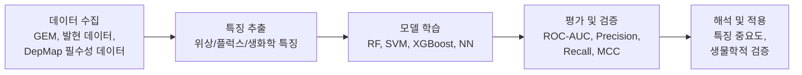
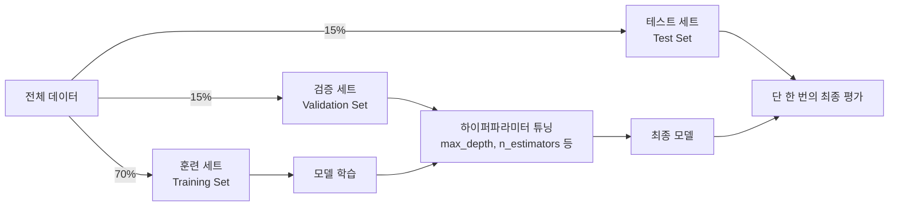
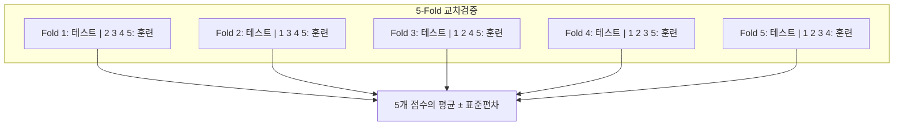

# 2. Machine Learning 기초: 지도학습·비지도학습·평가지표

이 절은 머신러닝을 처음 접하는 학부 저학년도 따라올 수 있도록, "모델이 데이터에서 어떻게 배우는가"라는 가장 기초적인 질문부터 시작해 [§3](03.md)에서 바로 쓸 Random Forest, [§4](04.md)에서 쓸 그래프 신경망까지 이어지는 다리를 놓는다. [§1.1.1](01.md)에서 본 것처럼 학습은 결국 "손실을 최소화하는 파라미터 찾기"라는 최적화 문제였다. 이 절에서는 그 최적화를 구체적인 알고리듬(경사하강법)과 손 계산 예제로 직접 확인한다.

## 2.1 지도학습(Supervised Learning): 교사가 답을 알려주며 가르치듯

**지도학습(Supervised Learning)**은 입력 $$X$$와 정답 레이블 $$Y$$의 쌍으로부터 매핑 함수 $$f: X \rightarrow Y$$를 학습하는 패러다임이다. 이름 그대로 교사가 문제와 정답을 함께 제시하며 학생을 가르치는 과정에 비유된다. 대사모델링에서 가장 대표적인 활용은 **유전자 필수성 예측(Gene Essentiality Prediction)**이다.

### 분류(Classification): 필수 vs. 비필수

$$Y \in \{0, 1\}$$

여기서 $$Y=1$$은 유전자 제거 시 세포가 생존할 수 없는 **필수 유전자(Essential Gene)**, $$Y=0$$은 **비필수 유전자(Non-essential Gene)**를 뜻한다. [Chapter 8](../chapter-8/README.md)에서 `e_coli_core` 137개 유전자를 `single_gene_deletion()`으로 계산하면 COBRApy 0.30 기본 배지·1% 성장 임계값에서 필수 유전자는 **7개**입니다. 이 값은 아래 교육용 레이블로 재사용하지만, 실험 ground truth가 아니라 특정 모델·배지·목적함수로 만든 **in silico label**임을 구분해야 합니다.

| 알고리즘 | 비선형성 | 해석 가능성 | 계산 비용 | 클래스 불균형 처리 | 권장 사용 상황 |
|:---|:---|:---|:---|:---|:---|
| Logistic Regression | 낮음 | 높음 | 낮음 | 낮음 | 기준선(baseline), 해석 중시 |
| SVM | 중간 | 중간 | 높음 | 중간 | 고차원 특징, 중간 크기 데이터 |
| Random Forest | 높음 | 중간 | 중간 | 높음 | **GEM 필수성 예측(권장)** |
| XGBoost | 높음 | 중간 | 중간 | 높음 | 대규모 데이터, 범주형 특징 多 |
| Neural Network | 매우 높음 | 낮음 | 매우 높음 | 중간 | 대량의 데이터가 있을 때 |

로지스틱 회귀는 필수성 확률을 $$P(Y=1|\mathbf{x}) = \dfrac{1}{1 + e^{-(\mathbf{w}^T \mathbf{x} + b)}}$$로 모델링한다. 여기서 $$\mathbf{x}$$는 유전자(또는 반응)의 특징 벡터, $$\mathbf{w}$$는 각 특징의 가중치, $$b$$는 편향(bias)이다. 해석 가능성이 높지만 특징 간 복잡한 비선형 상호작용은 포착하기 어렵다.

### 손실함수와 경사하강법: 로지스틱 회귀를 손으로 학습시켜 보기

$$\mathbf{w}, b$$는 어떻게 정해질까? §1.1.1에서 본 일반식을 로지스틱 회귀에 대입하면, 흔히 쓰는 손실함수는 **교차 엔트로피(Cross-Entropy, 로그 손실)**다.

$$
L(y, \hat{y}) = -\big[y\log \hat{y} + (1-y)\log(1-\hat{y})\big], \qquad \hat{y} = P(Y=1\mid \mathbf{x})
$$

이 식이 왜 "틀린 정도"를 재는지 숫자로 확인해보자. 실제 정답이 필수 유전자($$y=1$$)인데 모델이 $$\hat{y}=0.9$$(90% 확신)로 맞혔다면 $$L = -\log(0.9) \approx 0.105$$로 손실이 작다. 반대로 같은 정답인데 모델이 $$\hat{y}=0.1$$로 자신 있게 틀렸다면 $$L = -\log(0.1) \approx 2.303$$으로 손실이 22배 이상 커진다 — "자신 있게 틀릴수록 훨씬 크게 벌점을 받는다"는 것이 로그 손실의 핵심 성질이다.

전체 훈련 데이터에 대한 평균 손실 $$\mathcal{L}(\mathbf{w}, b) = \frac{1}{n}\sum_i L(y_i, \hat{y}_i)$$을 최소화하는 표준 방법이 **경사하강법(Gradient Descent)**이다. 파라미터를 손실이 감소하는 방향(그래디언트의 반대 방향)으로 조금씩 이동시킨다.

$$
\mathbf{w} \leftarrow \mathbf{w} - \eta\,\frac{\partial \mathcal{L}}{\partial \mathbf{w}}, \qquad b \leftarrow b - \eta\,\frac{\partial \mathcal{L}}{\partial b}
$$

여기서 $$\eta$$(에타)는 **학습률(Learning Rate)** — 한 걸음의 보폭이다. 로지스틱 회귀는 $$\dfrac{\partial \mathcal{L}}{\partial \mathbf{w}} = \frac{1}{n}\sum_i (\hat{y}_i - y_i)\mathbf{x}_i$$라는 비교적 단순한 형태로 정리된다("예측 오차 $$\times$$ 입력"의 평균).

**손 계산 예제**: 특징이 1개(연결 차수를 정규화한 값)뿐인 아주 작은 문제를 생각하자. 데이터 2개, 현재 파라미터 $$w=0.5,\ b=0$$, 학습률 $$\eta=0.1$$이라 하자.

| 예제 | $$x$$ | $$y$$(정답) | $$z=wx+b$$ | $$\hat{y}=\sigma(z)$$ | 오차 $$\hat{y}-y$$ |
|:---:|:---:|:---:|:---:|:---:|:---:|
| 1 | 2.0 | 1 | 1.0 | 0.731 | -0.269 |
| 2 | -1.0 | 0 | -0.5 | 0.378 | +0.378 |

그래디언트는 $$\frac{\partial \mathcal{L}}{\partial w} = \frac{1}{2}\big[(-0.269)(2.0) + (0.378)(-1.0)\big] = \frac{1}{2}(-0.538 - 0.378) = -0.458$$이다. 갱신하면 $$w \leftarrow 0.5 - 0.1\times(-0.458) = 0.546$$ — $$w$$가 조금 커졌다. 이 한 걸음만으로 예제 1($$y=1$$, 큰 양수 특징)의 예측 확률이 더 높아지는 방향으로 움직였다는 뜻이다. 실제 학습은 이 과정을 수백~수천 번 반복(epoch)하며 손실이 더 이상 줄지 않을 때까지 계속한다.


💡 **잠깐, 생각해보기:** 학습률 $$\eta$$가 너무 크면 어떻게 될까? 손실이 감소하는 방향은 맞더라도 한 걸음이 너무 커서 최솟값을 지나쳐 반대편으로 넘어가 버리고, 심하면 손실이 오히려 발산할 수 있다. 반대로 $$\eta$$가 너무 작으면 한 걸음이 너무 작아 수렴에 매우 오랜 시간이 걸린다. 실무에서는 $$\eta=0.01\sim0.1$$ 근처에서 시작해 학습 곡선을 보며 조정하는 경우가 많다.


**랜덤 포레스트(Random Forest, RF)**는 여러 결정 트리(Decision Tree)의 앙상블로, 각 트리가 서로 다른 무작위 부분집합으로 학습한 뒤 다수결로 최종 예측을 낸다.

$$\hat{Y} = \text{majority\_vote}\{h_1(\mathbf{x}), h_2(\mathbf{x}), ..., h_B(\mathbf{x})\}$$

$$h_b$$는 $$b$$번째 결정 트리, $$B$$는 트리 개수(보통 100~500)다. RF가 GEM 필수성 예측의 표준 선택지가 된 이유는 (1) 비선형 관계 포착, (2) 과적합(overfitting) 강건성, (3) 특징 중요도(feature importance) 자동 계산, (4) 클래스 불균형 처리 용이성 때문이다.


💡 **파라미터(parameter) vs. 하이퍼파라미터(hyperparameter):** 로지스틱 회귀의 $$\mathbf{w}, b$$처럼 훈련 데이터로부터 경사하강법 등이 자동으로 값을 찾아내는 숫자를 **파라미터**라 부른다. 반면 RF의 트리 개수 $$B$$(`n_estimators`)나 트리 최대 깊이(`max_depth`)처럼, 학습을 시작하기 *전에* 사람이 미리 정해야 하는 설정값은 **하이퍼파라미터**라 부른다. [§3.5](03.md)에서 다룰 편향-분산 트레이드오프는 바로 이 하이퍼파라미터를 어떻게 고르느냐의 문제다.


### 회귀(Regression): 플럭스 값 예측

연속값을 예측하는 회귀 문제의 대표 예는 반응 플럭스 값 $$\hat{v}_i = f(\mathbf{x}_i)$$ 예측이다. 가장 단순한 형태인 **선형 회귀(Linear Regression)**는 $$\hat{y} = \mathbf{w}^T\mathbf{x} + b$$처럼 입력의 가중합으로 출력을 예측한다. 로지스틱 회귀와 모양은 비슷하지만 마지막에 시그모이드 $$\sigma(\cdot)$$를 씌우지 않는다는 점이 다르다 — 확률(0~1)이 아니라 임의의 실수값(플럭스 등)을 그대로 출력해야 하기 때문이다.

선형 회귀의 손실함수는 **평균제곱오차(Mean Squared Error, MSE)**다.

$$
\mathcal{L}(\mathbf{w}, b) = \frac{1}{n}\sum_{i=1}^n (y_i - \hat{y}_i)^2, \qquad \frac{\partial \mathcal{L}}{\partial \mathbf{w}} = \frac{2}{n}\sum_i (\hat{y}_i - y_i)\mathbf{x}_i
$$

오차를 제곱하는 이유는 (1) 부호가 다른 오차끼리 서로 상쇄되지 않게 하고, (2) 큰 오차에 더 큰 벌점을 주기 위해서다. 경사하강법 갱신식은 로지스틱 회귀와 형태가 똑같다: $$\mathbf{w} \leftarrow \mathbf{w} - \eta \frac{\partial \mathcal{L}}{\partial \mathbf{w}}$$.

**손 계산 예제**: 참값 플럭스 $$y=\{2.0,\ 4.0\}$$, 현재 모델의 예측이 $$\hat{y}=\{2.5,\ 3.0\}$$이라 하자. $$\text{MSE} = \frac{1}{2}\big[(2.0-2.5)^2 + (4.0-3.0)^2\big] = \frac{1}{2}(0.25+1.00)=0.625$$, $$\text{RMSE}=\sqrt{0.625}\approx0.791$$, $$\text{MAE}=\frac{1}{2}(0.5+1.0)=0.75$$. RMSE가 MAE보다 큰 것은 우연이 아니다 — 제곱을 거치므로 큰 오차(여기서는 1.0)의 영향이 상대적으로 더 크게 반영되기 때문이다.

이 밖에 결정계수 $$R^2 = 1 - \dfrac{\sum(y_i-\hat{y}_i)^2}{\sum(y_i-\bar{y})^2}$$도 널리 쓰인다. 분모는 "평균만 예측했을 때의 오차", 분자는 "모델이 실제로 낸 오차"이므로, $$R^2=1$$이면 완벽한 예측, $$R^2=0$$이면 평균을 그냥 예측하는 것과 다를 바 없다는 뜻이다(음수도 가능하며, 이 경우 평균보다도 못한 예측이다).


❓ **흔한 오해:** "회귀 문제는 분류 문제와 완전히 다른 세계다." — 사실 §2.1의 로지스틱 회귀와 선형 회귀는 "가중합 $$\mathbf{w}^T\mathbf{x}+b$$을 계산한다"는 골격이 동일하고, 마지막에 시그모이드를 씌우는지 여부와 손실함수(교차 엔트로피 vs. MSE)만 다르다. §2.4에서 볼 딥러닝도 이 가중합-비선형 활성화 조합을 여러 층 쌓은 것에 지나지 않는다.


## 2.2 대사 네트워크를 그래프로: 손으로 먼저 세어보기

ML 모델은 숫자로 된 특징 벡터를 입력받는다. 대사 네트워크에서 이 숫자를 어떻게 뽑아낼지 아주 작은 장난감 네트워크로 먼저 감을 잡아보자. 세 개의 반응으로 이루어진 가상의 경로를 생각한다.

```
R1: A -> B
R2: B -> C
R3: B -> D
```

두 반응이 대사물을 공유하면 그래프에서 연결한다고 하자. R1과 R2는 B를 공유하고, R1과 R3도 B를 공유하며, R2와 R3도 B를 공유한다. 즉 세 반응 모두가 B를 통해 서로 연결된 삼각형을 이룬다.

| 반응 | 직접 연결된 반응 | 연결 차수(degree) |
|:---:|:---|:---:|
| R1 | R2, R3 | 2 |
| R2 | R1, R3 | 2 |
| R3 | R1, R2 | 2 |

이제 R4: D → E를 추가해보자. R4는 D를 공유하는 R3하고만 연결된다.

| 반응 | 직접 연결된 반응 | 연결 차수 |
|:---:|:---|:---:|
| R1 | R2, R3 | 2 |
| R2 | R1, R3 | 2 |
| **R3** | R1, R2, R4 | **3** |
| R4 | R3 | 1 |

R3은 B를 소비해 D를 만들고, 그 D를 다시 R4가 이어받는 **분기점(branch point)**에 있다. 대사 네트워크에서 이렇게 연결 차수가 높은 반응은 대개 우회로가 마땅치 않은 병목일 가능성이 크다 — 이는 §3에서 다룰 "연결 차수가 높을수록 필수성 확률이 높다"는 직관의 가장 단순한 버전이다.

이제 이 개념을 실제 `e_coli_core`(1장에서 불러온 우리의 동반 모델, 95개 반응·72개 대사물·137개 유전자)에 그대로 적용해 보자.

```python
# 1장에서 불러온 것과 동일한 e_coli_core를 다시 사용한다
import cobra
import networkx as nx

model = cobra.io.load_model("textbook")
print(f"반응 {len(model.reactions)}개, 대사물 {len(model.metabolites)}개, "
      f"유전자 {len(model.genes)}개")
# 기대 출력: 반응 95개, 대사물 72개, 유전자 137개

# 반응-반응 그래프: 공통 대사물을 공유하는 두 반응을 연결한다
G = nx.Graph()
G.add_nodes_from(rxn.id for rxn in model.reactions)

met_to_rxns = {}
for rxn in model.reactions:
    for met in rxn.metabolites:
        met_to_rxns.setdefault(met.id, set()).add(rxn.id)

for met_id, rxn_ids in met_to_rxns.items():
    rxn_ids = list(rxn_ids)
    for i in range(len(rxn_ids)):
        for j in range(i + 1, len(rxn_ids)):
            if G.has_edge(rxn_ids[i], rxn_ids[j]):
                G[rxn_ids[i]][rxn_ids[j]]['weight'] += 1
            else:
                G.add_edge(rxn_ids[i], rxn_ids[j], weight=1)

# 2장에서 다룬 익숙한 PGI(포스포글루코스 이성질화효소) 반응의 연결 차수를 확인한다
print(f"반응 그래프: 노드 {G.number_of_nodes()}개, 엣지 {G.number_of_edges()}개")
print(f"PGI의 연결 차수(degree): {G.degree('PGI')}")
# 기대 출력: 노드 95개; 엣지·PGI degree 값은 실행 환경에서 직접 확인한다
```

이렇게 만든 그래프에서 뽑을 수 있는 대사 네트워크의 특징은 크게 세 범주로 나뉜다.

| 범주 | 예시 특징 | 계산 도구 |
|:---|:---|:---|
| 위상적 특징(Topological) | 연결 차수(Degree), 매개 중심성(Betweenness Centrality), 근접 중심성(Closeness Centrality) | NetworkX |
| 플럭스 특징(Flux) | WT/KO 플럭스, 플럭스 변화량, FVA 범위, 그림자 가격(Shadow Price) | COBRApy ([Chapter 4](../chapter-4/README.md)) |
| 생화학적 특징(Biochemical) | 가역성(Reversibility), 소속 경로, EC 번호, 촉매 효소(아이소자임) 수 | KEGG/BiGG 주석 |

## 2.3 비지도학습(Unsupervised Learning): 정답 없이 구조를 찾기

비지도학습은 레이블 없이 데이터 구조 자체를 발견하는 패러다임으로, 대사모델링에서는 주로 **대사 표현형 클러스터링**에 쓰인다.

**K-Means 클러스터링**은 $$n$$개의 플럭스 분포 벡터 $$\mathbf{v} \in \mathbb{R}^m$$($$m$$=반응 개수)를 $$K$$개 그룹으로 묶는다.

$$
\arg\min_{\mathbf{C}} \sum_{k=1}^{K} \sum_{\mathbf{v} \in C_k} \|\mathbf{v} - \boldsymbol{\mu}_k\|^2
$$

식이 낯설다면 1차원 숫자 6개로 감을 잡아보자: $$\{1.0,\ 1.2,\ 0.9,\ 8.0,\ 8.5,\ 7.8\}$$. 눈으로만 봐도 이 숫자들은 "1 근처" 그룹과 "8 근처" 그룹으로 갈린다. K-Means($$K=2$$)는 정확히 이 직관을 수식화한 것으로, 각 그룹의 평균(중심, centroid)은 각각 $$\approx 1.03$$과 $$\approx 8.1$$이 되고, 모든 점은 자신과 가장 가까운 중심에 배정된다. 대사모델링에서는 이 "숫자"가 하나의 반응 플럭스가 아니라 95개(또는 수천 개) 반응 전체의 플럭스 벡터라는 점만 다르다.

K-Means가 이 두 중심을 어떻게 "찾아내는지" 알고리듬(Lloyd's algorithm)을 한 단계만 손으로 밟아보자. 초기 중심을 임의로 $$\mu_1=1.0,\ \mu_2=9.0$$이라 두면(무작위 초기화),

1. **배정 단계**: 각 점을 더 가까운 중심에 배정한다. $$1.0, 1.2, 0.9$$는 $$\mu_1=1.0$$에, $$8.0, 8.5, 7.8$$은 $$\mu_2=9.0$$에 더 가까우므로 각각 그룹 1, 그룹 2가 된다(예: $$8.0$$은 $$|8.0-1.0|=7.0$$보다 $$|8.0-9.0|=1.0$$이 작다).
2. **갱신 단계**: 각 그룹의 새 중심을 그룹 평균으로 다시 계산한다. $$\mu_1 = \frac{1.0+1.2+0.9}{3}\approx1.033$$, $$\mu_2=\frac{8.0+8.5+7.8}{3}\approx8.1$$.

이 두 단계(배정→갱신)를 중심이 더 이상 움직이지 않을 때까지 반복하는 것이 K-Means 전체다. 위 예제는 한 번의 반복만으로 이미 최종 중심 근처에 도달했지만, 실제 고차원 데이터(반응 95개짜리 플럭스 벡터)에서는 보통 수십 번의 반복이 필요하다.

대표적 활용은 (1) 서로 다른 탄소원(carbon source) 조건의 FBA 플럭스를 클러스터링해 발효/호흡 등 생물학적 대사 모드를 발견하는 것, (2) 암 세포주 패널의 대사 표현형을 대사적 유사성으로 그룹화하는 것이다. **계층적 클러스터링(Hierarchical Clustering)**은 대사 경로 간 기능적 유사성을 덴드로그램(Dendrogram)으로 시각화하는 데 유용하다.

차원 축소 기법으로는 분산을 최대 보존하는 선형 투영 **주성분분석(Principal Component Analysis, PCA)** ($$\mathbf{Z} = \mathbf{X}\mathbf{W}$$)과, 국소 구조를 보존하는 비선형 기법 **t-SNE**가 널리 쓰인다. 이 둘은 실습에서 K-Means 클러스터를 2차원 평면에 그려 눈으로 확인할 때 함께 사용한다.

## 2.4 딥러닝(Deep Learning): FCNN, CNN, RNN 한눈에 보기

**딥러닝(Deep Learning)**은 여러 은닉층(hidden layer)을 가진 신경망으로 데이터의 계층적 특징 표현을 자동으로 학습하는 ML의 하위 분야다.

**완전연결 신경망(Fully Connected Neural Network, FCNN)**은 $$\mathbf{z}^{[l]} = \mathbf{W}^{[l]} \mathbf{a}^{[l-1]} + \mathbf{b}^{[l]}$$, $$\mathbf{a}^{[l]} = \sigma(\mathbf{z}^{[l]})$$ 형태의 층을 쌓는다. 여기서 위 첨자 $$[l]$$은 층 번호, $$\mathbf{a}^{[l-1]}$$은 이전 층의 출력(활성값), $$\sigma$$는 비선형 **활성화 함수(Activation Function)**다. 활성화 함수가 없다면 층을 아무리 쌓아도 결국 하나의 선형 함수와 동일해져 버린다는 점이 핵심이다 — 여러 개의 가중합을 이어붙여도 가중합은 가중합일 뿐이기 때문이다.

**손 계산 예제**: 입력 $$\mathbf{a}^{[0]} = [1.0,\ 0.5]$$(예: 정규화한 연결 차수, 정규화한 플럭스)가 은닉층 뉴런 1개짜리 층을 거쳐 로지스틱 회귀와 같은 시그모이드 출력으로 이어진다고 하자. 가중치 $$\mathbf{W}^{[1]}=[0.8,\ -0.6]$$, 편향 $$b^{[1]}=0.1$$이면 $$z^{[1]} = 0.8\times1.0 + (-0.6)\times0.5 + 0.1 = 0.6$$이고, ReLU 활성화 $$\sigma(z)=\max(0,z)$$를 쓰면 $$a^{[1]} = \max(0, 0.6) = 0.6$$이다. 이 $$a^{[1]}$$이 다음 층(출력층)의 입력이 되어 다시 §2.1의 시그모이드 계산으로 이어진다. 결국 딥러닝은 §2.1의 "가중합 → 비선형 함수"라는 한 단위 연산을 여러 번 중첩한 것에 지나지 않으며, 파라미터 학습도 같은 경사하강법을 층마다 연쇄 법칙(chain rule)으로 확장한 **역전파(Backpropagation)**로 이뤄진다. 그러나 대사 네트워크의 **그래프 구조를 무시**한다는 치명적 단점이 있어 §4의 그래프 신경망(GNN)에 밀린다.

**합성곱 신경망(Convolutional Neural Network, CNN)**은 지역 패턴을 감지하는 합성곱 연산 $$(\mathbf{I} * \mathbf{K})_{i,j} = \sum_{m}\sum_{n} I_{i+m, j+n} K_{m,n}$$을 핵심으로 한다. Tschauner et al.(2023)은 화학량론 행렬을 2D 이미지로 취급하는 CNN 서로게이트로 발효기 실시간 모델 예측 제어(Model Predictive Control, MPC)에서 FBA를 대체했다(§6.4 참고).

**순환 신경망(Recurrent Neural Network, RNN)**은 $$\mathbf{h}_t = \sigma(\mathbf{W}_{hh}\mathbf{h}_{t-1} + \mathbf{W}_{xh}\mathbf{x}_t + \mathbf{b}_h)$$로 시간 의존적 대사 역학(배치 발효, 동적 FBA 서로게이트)을 예측하며, LSTM/GRU는 기울기 소실 문제를 완화한 변형이다.

## 2.5 ML 파이프라인: 데이터 → 특징 → 모델 → 평가



**1단계 — 데이터 수집**: GEM 데이터베이스(BiGG, KEGG, MetaCyc, ModelSEED), 필수성 데이터(DepMap, OGEE, Keio Collection — [Chapter 8](../chapter-8/README.md)에서 이미 언급), [Omics 데이터](../chapter-6/README.md)(전사체, 단백체, 대사체, 플럭소믹스), 문헌 데이터(PubMed, LLM용).

**2단계 — 특징 추출**: §2.2에서 본 위상·플럭스·생화학 특징.

**3단계 — 모델 학습 및 튜닝**: 실제 유전자 필수성 자료는 흔히 양성 클래스가 10~20% 수준으로 불균형하지만 생물종·배지·판정법에 따라 달라집니다. 이 장의 유전자 예제는 7/137(약 5.1%)이고, 뒤에서 직접 반응 결손으로 만든 반응 레이블은 18/95입니다. 어느 쪽도 표본이 매우 작으므로 Random Forest 예제는 API와 평가 절차를 배우는 장난감 실습이지 생물학적 성능 benchmark가 아닙니다. `class_weight='balanced'`, fold 내부 resampling, 임계값 튜닝과 Stratified K-Fold를 사용하고, 실제 연구에서는 독립 실험 자료로 검증해야 합니다.

**4단계 — 평가**: 다음 절에서 자세히 다룬다.

### 왜 데이터를 나눠야 하나: 훈련·검증·테스트 분할과 K-Fold

앞의 손 계산 예제에서는 "훈련 데이터"만 이야기했지만, 실전에서는 데이터를 최소 두 조각(훈련·테스트) 이상으로 나눠야 한다. 이유는 간단하다 — 시험 문제를 미리 알고 공부한 학생의 100점이 진짜 실력을 보여주지 못하듯, 모델을 학습시킨 바로 그 데이터로 성능을 평가하면 실제보다 훨씬 좋아 보이는 착시(과적합, overfitting)가 생긴다.



훈련 세트로 파라미터($$\mathbf{w}, b$$, 각 트리의 분기 규칙)를 학습하고, 검증 세트로 하이퍼파라미터(트리 개수, 최대 깊이 등)를 고른 뒤, 테스트 세트는 정말 마지막 한 번만 사용해 "실전에서 이 정도 성능이 나오겠구나"를 가늠한다. §3.4의 코드에서 `train_test_split(..., test_size=0.3, stratify=y)`가 하는 일이 정확히 이것이다. `stratify=y`는 나눌 때 필수/비필수 비율을 훈련·테스트 세트 모두에서 원본과 동일하게 유지하라는 뜻이다 — 그렇지 않으면 운이 나쁠 경우 테스트 세트에 필수 유전자가 하나도 안 들어가는 극단적 상황이 생길 수 있다.

`e_coli_core`처럼 데이터가 아주 적을 때(반응 95개, 그중 필수 18개)는 데이터를 세 조각으로 쪼개면 각 조각이 너무 작아진다. 이때 널리 쓰는 대안이 **K-Fold 교차검증(K-Fold Cross-Validation)**이다. 데이터를 $$K$$개(흔히 $$K=5$$ 또는 10) 조각으로 나눈 뒤, 매번 한 조각을 테스트용으로 남기고 나머지 $$K-1$$개로 학습하기를 $$K$$번 반복해 $$K$$개의 성능 점수를 평균 낸다. 클래스 불균형이 있을 때는 각 조각의 클래스 비율을 유지하는 **Stratified K-Fold**를 쓴다.



이렇게 하면 데이터 전체를 훈련에도, 테스트에도 (서로 다른 시점에) 활용하면서 "운 좋은 한 번의 분할" 때문에 성능이 과대·과소평가될 위험을 줄인다. 이 장의 심화 노트북(`raw_data/GEM_lecture_notes/gem9_w09_lab.ipynb`)은 5-fold 교차검증으로 RF 성능의 평균과 분산을 함께 보고한다.

## 2.6 성능 평가: 혼동 행렬에서 MCC까지 — 손으로 계산해보기

분류기 성능은 **혼동 행렬(Confusion Matrix)**로 요약한다.

|  | 예측: 필수 | 예측: 비필수 |
|:---|:---:|:---:|
| **실제: 필수** | TP | FN |
| **실제: 비필수** | FP | TN |

$$\text{민감도(Sensitivity, Recall)} = \frac{TP}{TP+FN}, \quad \text{특이도(Specificity)} = \frac{TN}{TN+FP}$$

$$\text{정밀도(Precision)} = \frac{TP}{TP+FP}, \quad F1 = 2\times\frac{\text{Precision}\times\text{Recall}}{\text{Precision}+\text{Recall}}$$

$$\text{MCC} = \frac{TP\times TN - FP\times FN}{\sqrt{(TP+FP)(TP+FN)(TN+FP)(TN+FN)}}$$

이 지표들이 왜 필요한지 직접 숫자를 넣어보자. 100개의 유전자 중 10개가 실제 필수 유전자(10%, 전형적인 클래스 불균형)라고 하자.

**전략 A — "무조건 비필수라고 예측"**: $$TP=0,\ FN=10,\ FP=0,\ TN=90$$. $$\text{Accuracy}=\frac{0+90}{100}=90\%$$. 정확도만 보면 훌륭해 보이지만, 이 전략은 필수 유전자를 단 하나도 찾지 못한다($$\text{Recall}=0$$). MCC는 분모가 0이 되어 정의되지 않으며(관례적으로 0으로 처리), "이 예측은 아무 정보도 주지 않는다"는 사실을 정확히 반영한다. 이것이 §10.1에서 다룰 **게으른 학습(Lazy Learning)**의 전형이다.

**전략 B — 실제로 학습된 분류기**: $$TP=8,\ FN=2,\ FP=4,\ TN=86$$.

$$\text{Accuracy}=\frac{8+86}{100}=94\%,\quad \text{Recall}=\frac{8}{10}=0.80,\quad \text{Precision}=\frac{8}{12}\approx0.667$$

$$F1 = 2\times\frac{0.667\times0.80}{0.667+0.80}\approx0.727$$

$$\text{MCC}=\frac{8\times86-4\times2}{\sqrt{12\times10\times90\times88}}=\frac{680}{\sqrt{950{,}400}}\approx0.697$$

전략 A(90%)와 전략 B(94%)의 정확도 차이는 4%p뿐이지만, 실제 쓸모는 하늘과 땅 차이다 — 전략 B만 필수 유전자 10개 중 8개를 실제로 찾아낸다. **MCC(Matthew's Correlation Coefficient)**는 이런 클래스 불균형에 둔감하지 않은(-1~+1) 지표로, GEM 관련 ML 연구에서 가장 신뢰할 만한 단일 지표로 쓰인다.

**ROC Curve**(x축 1-Specificity, y축 Sensitivity)의 **AUC(Area Under Curve)**는 1에 가까울수록 좋고, 0.5는 무작위 예측과 동등함을 뜻한다. ROC Curve는 분류 임계값(threshold)을 1(모두 비필수로 예측)부터 0(모두 필수로 예측)까지 조금씩 낮추면서, 그때마다 달라지는 (1-특이도, 민감도) 점을 이어 그린 곡선이다 — 임계값 하나만 고정한 §2.6의 전략 A·B 계산과 달리, 모든 임계값에서의 성능을 한 곡선으로 요약한다.

**손 계산 예제**: 임계값을 3단계만 움직였을 때 다음 (FPR, TPR) 점 4개를 얻었다고 하자(양 끝 점 $$(0,0)$$과 $$(1,1)$$은 항상 포함된다).

| 임계값 | FPR (1-특이도) | TPR (민감도) |
|:---:|:---:|:---:|
| (시작) | 0.00 | 0.00 |
| 높음 | 0.10 | 0.60 |
| 중간 | 0.30 | 0.85 |
| 낮음 | 0.60 | 0.95 |
| (끝) | 1.00 | 1.00 |

AUC는 이 점들을 잇는 곡선 아래 면적으로, 사다리꼴 공식(Trapezoidal Rule) $$\text{AUC} \approx \sum_k \frac{(FPR_{k+1}-FPR_k)(TPR_{k+1}+TPR_k)}{2}$$로 근사한다.

$$
\text{AUC} \approx \frac{(0.10-0)(0.60+0)}{2} + \frac{(0.30-0.10)(0.85+0.60)}{2} + \frac{(0.60-0.30)(0.95+0.85)}{2} + \frac{(1-0.60)(1+0.95)}{2}
$$

$$
= 0.030 + 0.145 + 0.270 + 0.390 = 0.835
$$

AUC $$\approx 0.835$$는 무작위 예측(대각선, AUC=0.5)보다 훨씬 우수하고 완벽한 예측(AUC=1)에는 못 미치는, 실제 연구에서 흔히 보고되는 "꽤 쓸만한" 분류기 수준이다. 대각선 위쪽 면적이 넓을수록(즉 곡선이 왼쪽 위 모서리에 가까울수록) 같은 FPR에서 더 높은 TPR을 낸다는 뜻이므로 AUC가 커진다.


❓ **흔한 오해:** "정확도(Accuracy)가 높으면 좋은 분류기다." — 클래스가 불균형할 때는 전혀 그렇지 않다. 위 전략 A처럼 소수 클래스(필수 유전자)를 통째로 무시해도 정확도는 얼마든지 높게 나올 수 있다. 클래스 불균형이 있는 문제에서는 항상 Recall·Precision·MCC를 함께 확인해야 한다.


```python
# 성능 평가와 ROC / Precision-Recall Curve 시각화 (일반형 코드)
from sklearn.metrics import (confusion_matrix, roc_curve, auc,
                             precision_recall_curve, matthews_corrcoef)
import matplotlib.pyplot as plt

cm = confusion_matrix(y_test, y_pred)
mcc = matthews_corrcoef(y_test, y_pred)
print("Confusion Matrix:\n", cm)
print(f"MCC: {mcc:.3f}")

fpr, tpr, _ = roc_curve(y_test, y_prob)
roc_auc = auc(fpr, tpr)

plt.plot(fpr, tpr, color='darkorange', lw=2, label=f'ROC (AUC={roc_auc:.2f})')
plt.plot([0, 1], [0, 1], color='navy', lw=2, linestyle='--')
plt.xlabel('False Positive Rate (1 - Specificity)')
plt.ylabel('True Positive Rate (Sensitivity)')
plt.legend(loc="lower right"); plt.title('ROC Curve'); plt.show()
```

---
