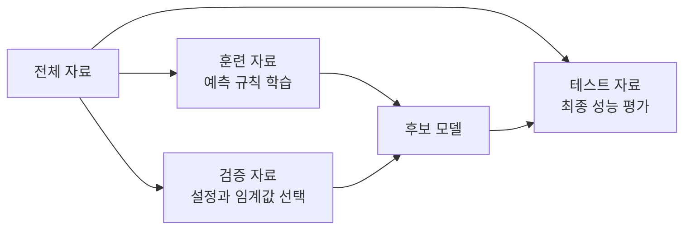
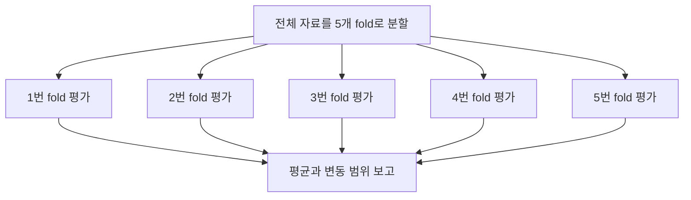

# 2. 머신러닝 기초는 자료 설계와 평가에서 시작한다

## 2.1 분류 문제의 네 요소

**지도학습(Supervised Learning)**은 입력 특징과 레이블이 함께 있는 표본에서 예측 규칙을 학습하는 방법이다. 이 장의 중심 과제는 유전자를 필수와 비필수로 나누는 **분류(classification)**다. 분류 문제를 정의하려면 다음 네 요소가 필요하다.

1. **표본:** 표의 한 행이 무엇인지 정한다. 예를 들어 한 유전자, 한 유전자–세포주 쌍 또는 한 유전자–배지 쌍이 될 수 있다.
2. **특징:** 예측 전에 이용할 수 있는 정보를 정한다. 연결 반응 수, 야생형 플럭스, 발현량 등이 예다.
3. **레이블:** 필수와 비필수를 어떤 자료와 임계값으로 판정했는지 정한다.
4. **적용 대상:** 같은 생물종의 새 유전자를 예측할지, 새로운 세포주나 생물종으로 확장할지 정한다.

같은 유전자도 세포주와 배지가 달라지면 레이블이 달라질 수 있다. 따라서 “유전자 137개”와 “137개 유전자 × 여러 조건”은 서로 다른 자료 구조다. 행의 수만 보고 독립 표본 수를 판단해서는 안 된다.

### 분류·회귀·군집화의 구분

| 문제 | 출력 | 대사모델링 예 |
|:---|:---|:---|
| 분류 | 필수/비필수 같은 범주 | 유전자 결손 뒤 생존 여부 |
| 회귀 | 성장률·플럭스 같은 연속값 | 특정 배지의 성장률 예측 |
| 군집화 | 레이블 없이 찾은 유사 집단 | 플럭스 패턴이 비슷한 조건 묶기 |

이 장은 분류에 집중한다. 회귀와 군집화는 출력 형식이 다르므로 같은 지표를 그대로 적용하지 않는다.

## 2.2 특징과 레이블을 섞지 않는다

유전자 필수성 자료의 한 행은 다음과 같이 구성할 수 있다.

| 열 | 예시 | 출처와 주의점 |
|:---|:---|:---|
| `gene_id` | `b1779` | 모델 릴리스와 식별자 체계를 기록 |
| `condition_id` | `glucose_aerobic` | 배지·산소·세포주를 식별 |
| `reaction_count` | 2 | GPR에서 연결된 반응 수 |
| `mean_wt_flux` | 3.1 | 특정 GEM 계산에서 얻은 특징 |
| `expression` | 5.7 | 정규화법이 명시된 실험 특징 |
| `label` | 필수 | 계산 또는 실험 가운데 출처를 명시 |

레이블을 만들 때 사용한 정보를 특징에 다시 넣으면 모델이 답을 미리 보게 된다. 예를 들어 “결손 뒤 성장률이 기준의 1% 미만이면 필수”라고 레이블을 만든 뒤, 같은 결손 성장률을 특징에 포함하면 분류기는 생물학적 패턴이 아니라 판정 규칙을 그대로 읽는다. 이를 **표적 누출(target leakage)**이라 한다.

반면 야생형 상태의 플럭스나 GPR 구조는 결손 결과 자체가 아니므로 후보 특징이 될 수 있다. 그래도 모두 같은 GEM에서 파생되었다면 계산 모델의 구조적 편향을 공유한다는 한계는 남는다.

## 2.3 훈련·검증·테스트 자료의 역할

자료를 학습과 평가에 함께 사용하면 과적합을 구분할 수 없다. 따라서 자료를 다음 역할로 분리한다.

```mermaid
flowchart LR
    A[전체 자료] --> B[훈련 자료<br/>예측 규칙 학습]
    A --> C[검증 자료<br/>설정과 임계값 선택]
    A --> D[테스트 자료<br/>최종 성능 평가]
    B --> E[후보 모델]
    C --> E
    E --> D
```

_그림 9.3:_ 훈련 자료는 예측 규칙을 학습하고, 검증 자료는 모델 설정과 분류 임계값을 선택하며, 테스트 자료는 모든 선택을 마친 뒤 최종 성능을 평가한다. 세 집합의 비율은 자료 규모에 따라 달라지지만, 테스트 자료를 반복해 보며 설정을 고르면 테스트 자료가 사실상 검증 자료로 바뀐다. 실제 자료 수치를 사용하지 않은 교육용 Mermaid 모식도다. 저자 작성; 개념 근거: [scikit-learn model selection guide](https://scikit-learn.org/stable/model_selection.html).

### 무작위 분할이 위험한 생물학적 사례

한 세포주에서 수천 유전자를 측정하면 행은 많아 보이지만 그 행들은 같은 유전적 배경과 배양 이력을 공유한다. 유전자 행을 무작위로 나누면 같은 세포주의 일부 유전자가 훈련 자료에, 다른 유전자가 테스트 자료에 들어간다. 이때 성능은 새로운 세포주에 대한 일반화보다 “이미 본 세포주의 다른 유전자”를 맞히는 능력을 반영한다.

이 문제를 **자료 누출(data leakage)**이라 한다. 새로운 세포주에 적용하려는 연구라면 세포주 전체를 한 그룹으로 묶어 분할한다. 새로운 생물종을 예측하려면 생물종 단위로, 새로운 배지를 예측하려면 배지 또는 조건 묶음 단위로 분할한다. 분할 단위는 최종 적용 질문과 같아야 한다.


클래스 비율을 맞추는 층화 분할만으로 그룹 누출이 해결되지는 않는다. 같은 세포주를 묶어야 한다면 `GroupKFold` 또는 그룹 정보를 함께 쓰는 층화 분할이 필요하다.


## 2.4 교차검증은 한 번의 우연한 분할을 줄인다

표본이 적으면 테스트 집합에 들어간 몇 개의 필수 유전자만 바뀌어도 점수가 크게 달라진다. **K-fold 교차검증(K-fold cross-validation)**은 자료를 K개 묶음으로 나누고, 매번 한 묶음을 평가용으로 바꾸어 K번 점수를 계산한다.

```mermaid
flowchart TD
    A[전체 자료를 5개 fold로 분할] --> B1[1번 fold 평가]
    A --> B2[2번 fold 평가]
    A --> B3[3번 fold 평가]
    A --> B4[4번 fold 평가]
    A --> B5[5번 fold 평가]
    B1 & B2 & B3 & B4 & B5 --> C[평균과 변동 범위 보고]
```

_그림 9.4:_ 5-fold 교차검증은 매 반복에서 서로 다른 한 fold를 평가하고 나머지 네 fold로 학습하여 다섯 점수의 평균과 변동을 보고한다. 필수·비필수 비율은 층화하고, 세포주·생물종 같은 공유 배경은 같은 fold에 유지한다. 특징 선택·표준화·결측값 처리·과표집도 각 훈련 fold 안에서만 적합해야 한다. 실제 자료 수치를 사용하지 않은 교육용 Mermaid 모식도다. 저자 작성; 개념 근거: [scikit-learn cross-validation guide](https://scikit-learn.org/stable/modules/cross_validation.html).

교차검증은 독립 외부 검증을 대신하지 않는다. 같은 데이터셋 안에서 여러 분할을 반복한 내부 평가이며, 다른 실험실·세포주·생물종의 자료에서도 같은 성능이 유지되는지는 별도로 시험해야 한다.

## 2.5 클래스 불균형은 정확도를 부풀릴 수 있다

필수 유전자가 100개 중 10개뿐인 자료를 생각한다. 모든 유전자를 비필수라고 예측하면 90개를 맞히므로 정확도는 90%다. 그러나 실제 필수 유전자는 하나도 찾지 못한다.

```mermaid
flowchart LR
    A[유전자 100개<br/>필수 10 · 비필수 90] --> B[모두 비필수로 예측]
    B --> C[정확도 90%]
    B --> D[재현율 0%]
    C --> E[정확도만 보면 양호]
    D --> F[필수 유전자는 전부 누락]
```

_그림 9.5:_ 필수 유전자가 10%인 교육용 자료에서 모든 표본을 비필수로 예측하면 정확도는 90%지만 필수 유전자 재현율은 0%다. 클래스 불균형에서는 다수 범주를 반복하는 전략도 높은 정확도를 얻을 수 있으므로 정밀도·재현율·매튜 상관계수를 함께 보고해야 한다. 실제 생물종의 비율이나 모델 계산 결과가 아닌 개념 예시다. 저자 작성.

분류 결과는 **혼동 행렬(confusion matrix)**의 네 칸으로 정리한다.

|  | 예측 필수 | 예측 비필수 |
|:---|:---:|:---:|
| 실제 필수 | 참양성(TP) | 거짓음성(FN) |
| 실제 비필수 | 거짓양성(FP) | 참음성(TN) |

- **정확도(accuracy)**는 전체 가운데 맞힌 비율이다.
- **재현율(recall)**은 실제 필수 가운데 찾아낸 비율인 $$TP/(TP+FN)$$이다.
- **정밀도(precision)**는 필수라고 예측한 것 가운데 실제 필수인 비율인 $$TP/(TP+FP)$$이다.
- **매튜 상관계수(Matthews Correlation Coefficient, MCC)**는 네 칸을 모두 사용하며, 완전 일치는 1, 무작위 수준은 0 부근, 반대 예측은 -1에 가깝다.

MCC의 계산식은 다음과 같다. 식을 유도할 필요는 없으며 네 칸의 값을 정확히 대입하면 된다.

$$
\mathrm{MCC}=
\frac{TP\times TN-FP\times FN}
{\sqrt{(TP+FP)(TP+FN)(TN+FP)(TN+FN)}}
$$

예를 들어 $$TP=8$$, $$FN=2$$, $$FP=4$$, $$TN=86$$이면 정확도는 94%, 재현율은 80%, 정밀도는 약 67%, MCC는 약 0.70이다. 어떤 지표를 우선할지는 용도에 따라 다르다. 후속 실험 비용이 매우 크면 거짓양성을 줄이는 정밀도가 중요하고, 놓치면 안 되는 표적을 넓게 찾는 1차 선별에서는 재현율이 중요할 수 있다.

확률 점수를 평가할 때에는 임계값 전체의 순위 성능을 보는 ROC-AUC와 정밀도–재현율 곡선(PR curve)을 함께 사용할 수 있다. 양성 범주가 드물면 많은 참음성 때문에 ROC-AUC가 낙관적으로 보일 수 있으므로 PR-AUC와 양성 비율을 함께 기록한다.

## 2.6 초급 분석의 최소 점검표

1. 한 행의 생물학적 단위를 적는다.
2. 특징과 레이블의 출처를 각각 적는다.
3. 적용하려는 대상과 같은 단위로 자료를 나눈다.
4. 모든 전처리를 훈련 fold 안에서만 수행한다.
5. 정확도·정밀도·재현율·MCC와 혼동 행렬을 함께 보고한다.
6. 계산 레이블 평가와 실험 레이블 평가를 별도 표로 제시한다.

이 점검표를 지키는 것이 복잡한 알고리듬을 추가하는 것보다 우선한다. [§3](03.md)는 같은 원칙을 유전자 필수성 자료에 적용한다.

---
