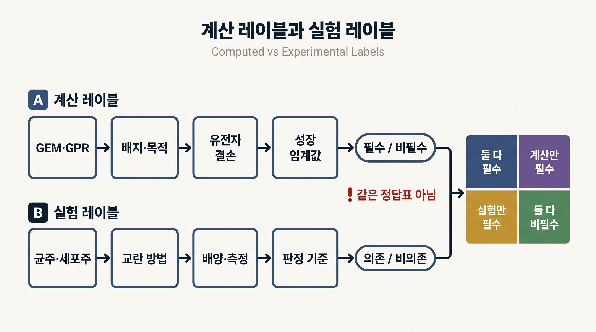
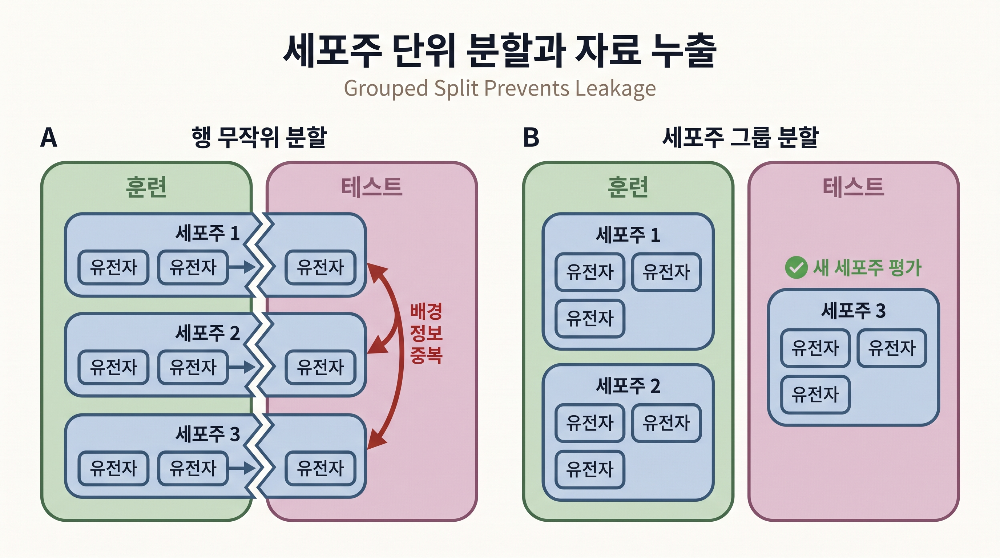

# 3. 유전자 필수성 예측은 레이블의 출처에서 시작한다

## 3.1 필수성은 조건부 판정이다

**유전자 필수성(gene essentiality)**은 특정 조건에서 한 유전자의 기능을 잃었을 때 정한 생물학적 기능을 유지하지 못하는 성질이다. “기능”은 성장, 생존 또는 특정 산물 생성처럼 연구 질문에 따라 달라질 수 있다. 같은 유전자도 탄소원, 산소, 세포주와 관찰 시간에 따라 필수·비필수 판정이 바뀔 수 있다.

[Chapter 4 §5](../chapter-4/05.md)는 유전자 결손이 GPR의 AND·OR 규칙을 거쳐 하나 이상의 반응 경계를 바꾼다고 설명했다. 따라서 유전자 필수성과 반응 필수성은 동의어가 아니다. 동위효소가 있으면 한 유전자를 제거해도 반응이 유지될 수 있고, 효소 복합체의 소단위 유전자 하나를 제거하면 반응 전체가 막힐 수 있다.

## 3.2 모델 계산으로 만든 레이블

GEM 기반 계산 레이블은 다음 절차로 만든다.

1. 모델 릴리스, 배지, 경계조건, 목적함수와 솔버를 고정한다.
2. 결손 전 기준 성장값을 계산한다.
3. 한 유전자를 제거하고 GPR에 따라 영향을 받는 반응을 갱신한다.
4. 결손 뒤 성장값을 계산하고 미리 정한 임계값으로 필수·비필수를 판정한다.

예를 들어 결손 뒤 성장값이 기준 성장값의 1% 미만이면 필수로 정할 수 있다. 1%는 자연 법칙이 아니라 분석자가 정한 판정 규칙이다. 임계값을 5% 또는 10%로 바꾸거나 배지를 바꾸면 경계에 있는 유전자의 레이블도 달라질 수 있다.


`single_gene_deletion()`의 출력은 실험 레이블이 아니다. 특정 GEM·GPR·배지·목적함수·솔버와 임계값이 만든 계산 레이블이다.


[MOMA](../chapter-4/11.md)와 [ROOM](../chapter-4/12.md)은 결손 뒤 플럭스 상태를 고르는 별도 가정이다. MOMA 목적값과 ROOM 목적값은 성장률이 아니므로, 이 값을 곧바로 필수성 레이블로 사용하지 않는다. 필수성 판정에 성장 또는 다른 기능값을 사용했다면 그 값을 별도로 읽고 임계값을 적용한다.

## 3.3 실험으로 만든 레이블

실험 레이블은 유전자 제거·억제 뒤 성장이나 생존을 측정해 만든다. 미생물 결손 라이브러리, CRISPR-Cas9 선별과 RNA 간섭 등이 대표적이다. 암 세포주에서는 [Cancer Dependency Map](https://depmap.org/portal/)과 같은 자료가 유전자 의존성 점수를 제공한다.

실험 레이블에는 다음 조건을 함께 기록한다.

| 기록 항목 | 예 |
|:---|:---|
| 생물학적 배경 | 균주, 세포주, 유전적 배경 |
| 배양 조건 | 배지, 산소, 약물, 배양 시간 |
| 교란 방법 | 완전 결손, 발현 억제, CRISPR 시약 |
| 측정값 | 성장, 생존율, gene-effect 점수 |
| 판정 규칙 | 필수 범주의 임계값과 결측 처리 |
| 품질 관리 | 반복 수, 대조군, 기술 실패 제외 기준 |

실험 점수의 방향도 자료마다 다를 수 있다. 예를 들어 DepMap의 Chronos gene-effect 원점수는 일반적으로 더 음수일수록 강한 의존성을 뜻한다. 다른 연구가 이를 0에서 1 사이의 확률형 점수로 변환했다면 임계값과 방향을 새로 기록해야 한다. 서로 다른 점수 체계를 같은 열에 섞으면 레이블 의미가 사라진다.

## 3.4 계산 레이블과 실험 레이블의 관계

두 레이블은 경쟁하는 정답표가 아니라 서로 다른 근거다.

| 상황 | 가능한 원인 | 다음 점검 |
|:---|:---|:---|
| 계산 필수·실험 필수 | 강한 취약성 후보 | 다른 배지·세포주에서도 재현되는지 확인 |
| 계산 필수·실험 비필수 | 모델의 대체 경로 누락, 배지 불일치, 동위효소 오주석 | GPR·반응 누락·실험 조건 점검 |
| 계산 비필수·실험 필수 | 조절·효소 용량·독성처럼 GEM에 없는 제약 | 오믹스·효소·조절 자료 점검 |
| 계산 비필수·실험 비필수 | 현재 조건에서 일치 | 다른 기능과 조건에서는 재평가 |

_그림 9.6:_ 계산 레이블은 GEM·GPR·배지·목적함수·유전자 결손과 성장 임계값에서 만들고, 실험 레이블은 균주 또는 세포주·교란법·배양·측정과 판정 기준에서 만든다. 두 경로는 생성 근거를 합치지 않은 채 계산·실험 모두 필수, 계산만 필수, 실험만 필수와 모두 비필수의 네 범주에서 비교한다. 실제 모델 계산값이나 실험 빈도를 사용하지 않은 교육용 모식도다. 저자 작성; 개념 근거: [Edwards and Palsson (2000)](https://doi.org/10.1021/bp0000712), [Cancer Dependency Map](https://depmap.org/portal/).

불일치는 ML로 지워야 할 잡음만은 아니다. 모델 구조 또는 실험 조건의 결손을 찾는 진단 신호가 될 수 있다. 특히 계산 레이블을 실험 레이블에 맞추기 위해 근거 없이 반응을 추가하거나 임계값을 반복 조정하면 테스트 자료에 과적합된다.

## 3.5 머신러닝이 맡는 일

ML 분류기는 여러 특징을 결합해 실험 레이블 또는 계산 레이블을 예측한다. 사용 목적에 따라 학습 과제를 분리한다.

- **계산 가속:** GEM 계산 레이블을 학습해 많은 후보를 빠르게 근사한다. 최종 후보는 원 GEM 계산으로 다시 확인한다.
- **실험 후보 순위화:** GEM 특징과 오믹스 특징으로 실험 레이블을 예측한다. 다른 세포주·생물종의 독립 실험 자료로 평가한다.
- **모델 진단:** 계산과 실험이 불일치하는 유전자를 모아 GPR·배지·반응 누락을 검토한다.

랜덤 포레스트(Random Forest, RF)는 여러 결정 트리의 결과를 합치는 분류기다. 작은 표형 자료에서 기준선으로 쓰기 쉽고 비선형 관계를 다룰 수 있지만, 복잡한 모델이라는 이유만으로 자료 누출이나 레이블 오류가 해결되지는 않는다. 로지스틱 회귀처럼 단순한 기준선과 함께 비교하고, [§2](02.md)의 교차검증·그룹 분할·불균형 지표를 동일하게 적용한다.

### 특징 설계의 최소 원칙

유전자 한 개를 표본으로 삼을 때 후보 특징은 연결 반응 수, 야생형에서 연결 반응의 절대 플럭스 요약, GPR 형태, 발현량 등이 될 수 있다. 결손 뒤 성장값으로 계산 레이블을 만들었다면 그 성장값 자체는 특징에서 제외한다. 같은 세포주의 유전자 행을 여러 조건에서 반복 측정했다면 세포주와 조건을 그룹으로 관리한다.

_그림 9.7:_ 같은 세포주에서 얻은 유전자 행을 무작위로 나누면 세포주 고유의 배경 정보가 훈련과 테스트에 중복되어 새로운 세포주에 대한 성능이 부풀려질 수 있다. 세포주 일반화를 평가하려면 한 세포주의 모든 유전자 행을 같은 그룹에 유지하고, 학습에 쓰지 않은 세포주 전체를 평가 fold에 둔다. 특정 데이터셋의 성능이나 표본 수를 나타내지 않은 교육용 분할 모식도다. 저자 작성; 구현 근거: [scikit-learn grouped cross-validation guide](https://scikit-learn.org/stable/modules/cross_validation.html#cross-validation-iterators-for-grouped-data).

## 3.6 사례: MOMA 특징과 실험 레이블의 결합

[Kim et al. (2026)](https://doi.org/10.3390/ijms27115059)은 50개 유방암 세포주의 맥락별 대사 모델에서 유전자 교란 뒤 MOMA 플럭스 재분포를 특징으로 만들고, DepMap에서 가공한 유전자 의존성 레이블을 RF로 예측했다. 이 연구의 입력은 단순한 반응 연결 차수가 아니라 세포주별 MOMA 플럭스 벡터였다.

| 지표 | MOMA 단독 | MOMA-RF |
|:---|:---:|:---:|
| 재현율 | 0.37 | 0.55 |
| MCC | 0.27 | 0.33 |
| 정확도 | 0.86 | 0.84 |
| 정밀도 | 0.33 | 0.31 |

재현율과 MCC는 증가했지만 정확도와 정밀도는 낮아졌다. 따라서 결과는 “모든 지표가 개선되었다”가 아니라 더 많은 실험 의존성 후보를 회수하는 대신 거짓양성이 늘어난 절충으로 읽는다. 또한 세포주별 모델, MOMA 설정, 불균형 처리와 분할 방식에 종속된 결과이므로 다른 생물종에 그대로 적용할 수 없다.

## 3.7 결과표에 남길 항목

유전자 필수성 ML 결과에는 다음 항목을 함께 보고한다.

1. 모델 ID·릴리스, 배지·목적함수·솔버·허용오차
2. 표본 단위와 특징 목록
3. 계산 레이블과 실험 레이블의 생성 규칙
4. 세포주·생물종·조건 단위의 분할 규칙
5. fold 안에서 수행한 전처리와 불균형 처리
6. 혼동 행렬, 정밀도, 재현율, MCC와 불확실성
7. 독립 실험 평가와 계산 제약 재검산

이 기록이 있어야 높은 성능이 계산 규칙 재현인지, 새로운 생물학적 조건에 대한 예측인지 판단할 수 있다.

---
