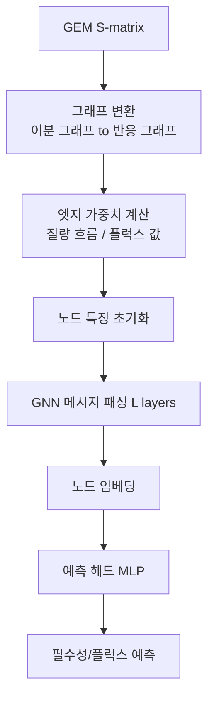

# 4. 그래프 신경망(GNN): 토폴로지로 필수성·플럭스 예측하기

[화학량론 행렬/네트워크](../chapter-2/README.md)는 본질적으로 그래프 구조다. §2~3의 특징 공학이 위상적 특징을 "수작업으로" 뽑아 RF에 넣었다면, **그래프 신경망(Graph Neural Network, GNN)**은 그래프 구조 자체를 신경망에 직접 입력해 한 단계 더 나아간 예측을 수행한다.

## 4.1 GNN 기초: 메시지 패싱

대사 네트워크는 이분 그래프(bipartite graph, $$V = M \cup R$$, 대사물-반응) 또는 반응 그래프(두 반응이 공통 대사물을 공유하면 연결 — §2.2에서 이미 만들어 본 그래프)로 표현된다. GNN의 핵심은 **메시지 패싱(Message Passing)**이다: 각 노드가 이웃 노드로부터 "메시지"를 받아 자신의 표현을 갱신한다.

$$\mathbf{h}_v^{(l+1)} = \text{UPDATE}^{(l)}\left(\mathbf{h}_v^{(l)}, \text{AGGREGATE}^{(l)}\left(\{\mathbf{h}_u^{(l)} : u \in \mathcal{N}(v)\}\right)\right)$$

여기서 $$\mathbf{h}_v^{(l)}$$은 노드 $$v$$의 $$l$$번째 층 임베딩, $$\mathcal{N}(v)$$는 이웃 집합이다. 이를 $$L$$층 반복하면 각 노드는 $$L$$-hop 거리 내 모든 노드 정보를 담은 표현을 갖게 된다.

**Graph Convolutional Network(GCN)**은 $$\mathbf{H}^{(l+1)} = \sigma\left(\tilde{\mathbf{D}}^{-1/2} \tilde{\mathbf{A}} \tilde{\mathbf{D}}^{-1/2} \mathbf{H}^{(l)} \mathbf{W}^{(l)}\right)$$로 이웃을 균등하게 취급하지만, **Graph Attention Network(GAT)**는 이웃마다 주의력(Attention) 가중치 $$\alpha_{vu}$$를 부여해 대사적으로 더 관련 있는 이웃에 더 큰 영향력을 준다.

$$\mathbf{h}_v^{(l+1)} = \sigma\left(\sum_{u \in \mathcal{N}(v)} \alpha_{vu}^{(l)} \mathbf{W}^{(l)} \mathbf{h}_u^{(l)}\right), \quad
\alpha_{vu} = \frac{\exp(\text{LeakyReLU}(\mathbf{a}^T [\mathbf{W}\mathbf{h}_v \| \mathbf{W}\mathbf{h}_u]))}{\sum_{k \in \mathcal{N}(v)} \exp(\text{LeakyReLU}(\mathbf{a}^T [\mathbf{W}\mathbf{h}_v \| \mathbf{W}\mathbf{h}_k]))}$$

```python
# PyTorch Geometric 기반 GAT (FlowGAT 개념 구현)
import torch
import torch.nn.functional as F
from torch_geometric.nn import GATConv

class FlowGAT(torch.nn.Module):
    """Mass Flow Graph를 처리하는 Graph Attention Network"""
    def __init__(self, in_channels, hidden_channels, out_channels,
                 num_heads=4, num_layers=3):
        super().__init__()
        self.convs = torch.nn.ModuleList()
        self.convs.append(GATConv(in_channels, hidden_channels,
                                   heads=num_heads, concat=True, dropout=0.2,
                                   edge_dim=1))
        for _ in range(num_layers - 2):
            self.convs.append(GATConv(hidden_channels * num_heads, hidden_channels,
                                       heads=num_heads, concat=True, dropout=0.2,
                                       edge_dim=1))
        self.convs.append(GATConv(hidden_channels * num_heads, out_channels,
                                   heads=1, concat=False, dropout=0.2,
                                   edge_dim=1))

    def forward(self, x, edge_index, edge_weight=None):
        # GATConv는 edge_weight가 아니라 [num_edges, edge_dim] edge_attr를 받는다.
        edge_attr = None if edge_weight is None else edge_weight.reshape(-1, 1)
        for conv in self.convs[:-1]:
            x = F.elu(conv(x, edge_index, edge_attr=edge_attr))
            x = F.dropout(x, p=0.2, training=self.training)
        return self.convs[-1](x, edge_index, edge_attr=edge_attr)  # 로짓
```

## 4.2 필수성·플럭스 예측: FlowGAT, FluxGAT, MGNN

| 방법 | 입력 그래프 구성 | 핵심 결과 |
|:---|:---|:---|
| **FlowGAT**(2024) | FBA 플럭스 → 질량 흐름 그래프(공유 대사물 기반 가중치) → GAT | Precision >75%, Recall >90%, FBA가 놓친 유전자 평균 19개 정정 |
| **FluxGAT**(2026) | 목적함수 없는 flux sampling → flux-informed 반응 그래프 → GAT | iCHO2291과 Mouse1에서 FBA보다 sensitivity를 높이면서 높은 precision·specificity를 유지 |
| **MGNN**(2024) | 대사 네트워크 토폴로지 = 신경망 구조(뉴런=대사물, 연결=반응) | *B. pertussis* 산화스트레스의 in-silico 동역학 사례에서 완전연결망보다 적은 파라미터와 낮은 오차를 보임 |

FlowGAT의 **질량 흐름 그래프(Mass Flow Graph, MFG)**에서는 반응 $$i$$가 생산한 대사물 $$X_k$$의 흐름을 그 대사물을 소비하는 반응들의 소비량 비율로 나눕니다.

$$
\mathrm{Flow}_{i\to j}(X_k)
=\mathrm{Flow}^{+}_{R_i}(X_k)
\frac{\mathrm{Flow}^{-}_{R_j}(X_k)}
{\sum_{\ell\in C_k}\mathrm{Flow}^{-}_{R_\ell}(X_k)},
\qquad
w_{ij}=\sum_k\mathrm{Flow}_{i\to j}(X_k)
$$

여기서 $$C_k$$는 $$X_k$$를 소비하는 반응 집합이고, 생산·소비 흐름은 화학량론 계수와 해당 flux로부터 계산합니다. 따라서 단순히 두 반응 flux의 곱을 edge weight로 쓰는 것이 아닙니다. 0-flux 반응은 edge weight가 0이 되어 그래프에서 끊기기 쉬우며, 이 때문에 비필수 유전자 class의 예측이 약해질 수 있습니다.

FluxGAT는 명시적 단일 목적함수 대신 **플럭스 샘플링(Flux Sampling)**을 사용해 목적함수 선택 의존성을 줄입니다. 다만 배지 경계, 가역성, 샘플링 알고리즘과 학습 데이터 선택에 대한 분석자 의존성까지 제거되는 것은 아닙니다. MGNN은 신경망 구조를 대사 네트워크에 대응시키는 **귀납적 편향(Inductive Bias)**으로 파라미터를 생물학적 요소에 추적하기 쉽게 하지만, 구조적 대응만으로 인과적·완전한 해석 가능성이 보장되지는 않습니다.


💡 **잠깐, 생각해보기:** FlowGAT는 왜 "FBA 플럭스가 필요"하고, FluxGAT는 왜 "목적함수 없이" 학습할 수 있을까? FlowGAT의 질량 흐름 그래프는 한 wild-type FBA 해의 flux를 쓰지만, FluxGAT는 bounds와 $$\mathbf{S}\mathbf{v}=\mathbf{0}$$이 정한 feasible space에서 여러 flux를 샘플링합니다. 이는 목적함수 선택 의존성을 줄이는 대안이지, 가능한 모든 해를 열거하거나 배지·bounds·sampling 수렴·학습 label의 편향을 없애는 방법은 아닙니다.




---
