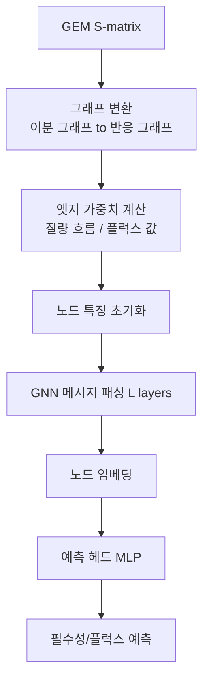

# 4. 그래프 신경망(GNN): 토폴로지로 필수성·플럭스 예측하기

[화학량론 행렬/네트워크](../chapter-2/README.md)는 본질적으로 그래프 구조다. §2~3의 특징 공학이 위상적 특징을 "수작업으로" 뽑아 RF에 넣었다면, **그래프 신경망(Graph Neural Network, GNN)**은 그래프 구조 자체를 신경망에 직접 입력해 한 단계 더 나아간 예측을 수행한다.

## 4.0 메시지 패싱은 이웃 정보를 단계적으로 통합한다

**메시지 패싱(message passing)**은 각 노드가 이웃 노드의 표현을 모아 자신의 표현을 갱신하는 연산을 $$L$$번 반복해, $$L$$단계 이내에 도달 가능한 이웃 전체의 정보를 각 노드에 담는 절차다(§4.1에서 정식화한다). 직관적으로는 친구 관계망에서 소문이 퍼지는 과정과 닮았다 — 각 사람(노드)은 처음에 자신만의 정보(초기 특징)를 갖고, 하루(1개 층)마다 직접 친구들과 정보를 섞으며, $$L$$일 뒤에는 $$L$$단계 이내 인맥의 정보를 희석된 형태로 갖는다. 여기서 "사람"은 노드(대사물 또는 반응), "친구 관계"는 그래프의 엣지(§2.2에서 만든, 공통 대사물을 공유하는 두 반응 사이의 연결), "정보를 섞는 규칙"은 아래의 AGGREGATE·UPDATE 함수에 대응한다. 다만 이 비유는 소문이 무작위로 퍼지는 것과 달리 통합 규칙이 학습된 가중치로 정해지고, 층 수가 지나치게 크면 모든 노드의 표현이 서로 비슷해지는 과평활(over-smoothing)이 나타난다는 점에서는 성립하지 않는다.

## 4.1 GNN 기초: 메시지 패싱

대사 네트워크는 이분 그래프(bipartite graph, $$V = M \cup R$$, 대사물-반응) 또는 반응 그래프(두 반응이 공통 대사물을 공유하면 연결 — §2.2에서 이미 만들어 본 그래프)로 표현된다. GNN의 핵심은 **메시지 패싱(Message Passing)**이다: 각 노드가 이웃 노드로부터 "메시지"를 받아 자신의 표현을 갱신한다.

$$\mathbf{h}_v^{(l+1)} = \text{UPDATE}^{(l)}\left(\mathbf{h}_v^{(l)}, \text{AGGREGATE}^{(l)}\left(\{\mathbf{h}_u^{(l)} : u \in \mathcal{N}(v)\}\right)\right)$$

여기서 $$\mathbf{h}_v^{(l)}$$은 노드 $$v$$의 $$l$$번째 층 임베딩(embedding; 노드를 요약해 담은 숫자 벡터)이고, $$\mathcal{N}(v)$$는 이웃 집합이다. 이를 $$L$$층 반복하면 각 노드는 $$L$$-hop 거리 내 모든 노드 정보를 담은 표현을 갖게 된다.

### 손 계산 예제: 삼각형 그래프에서 한 단계 메시지 패싱

§2.2에서 만든 R1(A→B), R2(B→C), R3(B→D)의 작은 반응 그래프를 그대로 가져온다. R1·R2·R3는 모두 대사물 B를 공유해 서로 연결된 삼각형을 이뤘다. 각 반응 노드에 스칼라 초기 특징(예: 정규화한 플럭스 값) $$h_{R1}^{(0)}=1.0,\ h_{R2}^{(0)}=2.0,\ h_{R3}^{(0)}=3.0$$을 주고, 가장 단순한 GCN 스타일로 "이웃의 평균을 더한 뒤 가중치를 곱한다"는 규칙을 손으로 적용한다. AGGREGATE를 이웃 평균, UPDATE를 자기 자신과 이웃 평균을 더한 뒤 가중치 $$w=1$$과 ReLU를 적용하는 것으로 단순화하면,

$$
h_v^{(1)} = \text{ReLU}\Big(w \cdot \big(h_v^{(0)} + \text{mean}_{u\in\mathcal{N}(v)} h_u^{(0)}\big)\Big)
$$

R1의 이웃은 R2, R3이므로 $$\text{mean}(h_{R2}^{(0)}, h_{R3}^{(0)}) = \frac{2.0+3.0}{2}=2.5$$이고, $$h_{R1}^{(1)} = \text{ReLU}(1.0+2.5) = 3.5$$다. 같은 방식으로 R2의 이웃은 R1, R3이므로 $$h_{R2}^{(1)} = \text{ReLU}\big(2.0 + \frac{1.0+3.0}{2}\big) = \text{ReLU}(2.0+2.0)=4.0$$, R3의 이웃은 R1, R2이므로 $$h_{R3}^{(1)} = \text{ReLU}\big(3.0+\frac{1.0+2.0}{2}\big)=\text{ReLU}(3.0+1.5)=4.5$$다.

| 노드 | 초기값 $$h^{(0)}$$ | 이웃 평균 | 1층 갱신 후 $$h^{(1)}$$ |
|:---:|:---:|:---:|:---:|
| R1 | 1.0 | 2.5 | 3.5 |
| R2 | 2.0 | 2.0 | 4.0 |
| R3 | 3.0 | 1.5 | 4.5 |

한 층을 더 쌓으면(2층) 각 노드는 이제 "이웃의 이웃"(2-hop) 정보까지 반영한 값을 갖게 된다. 실제 GNN은 스칼라가 아니라 수십~수백 차원의 벡터 $$\mathbf{h}_v$$를 다루고, 가중치도 스칼라가 아니라 행렬 $$\mathbf{W}^{(l)}$$이지만, "이웃 정보를 모아(AGGREGATE) 자신의 표현과 합친다(UPDATE)"는 골격은 이 손 계산 예제와 완전히 같다.

**Graph Convolutional Network(GCN)**([Kipf & Welling, 2017](https://doi.org/10.48550/arXiv.1609.02907))은 $$\mathbf{H}^{(l+1)} = \sigma\left(\tilde{\mathbf{D}}^{-1/2} \tilde{\mathbf{A}} \tilde{\mathbf{D}}^{-1/2} \mathbf{H}^{(l)} \mathbf{W}^{(l)}\right)$$로 이웃을 균등하게 취급하지만, **Graph Attention Network(GAT)**([Veličković et al., 2018](https://doi.org/10.48550/arXiv.1710.10903))는 이웃마다 주의력(Attention) 가중치 $$\alpha_{vu}$$를 부여해 대사적으로 더 관련 있는 이웃에 더 큰 영향력을 준다.

$$\mathbf{h}_v^{(l+1)} = \sigma\left(\sum_{u \in \mathcal{N}(v)} \alpha_{vu}^{(l)} \mathbf{W}^{(l)} \mathbf{h}_u^{(l)}\right), \quad
\alpha_{vu} = \frac{\exp(\text{LeakyReLU}(\mathbf{a}^T [\mathbf{W}\mathbf{h}_v \| \mathbf{W}\mathbf{h}_u]))}{\sum_{k \in \mathcal{N}(v)} \exp(\text{LeakyReLU}(\mathbf{a}^T [\mathbf{W}\mathbf{h}_v \| \mathbf{W}\mathbf{h}_k]))}$$

여기서 $$\|$$는 두 벡터를 이어붙이는 연결(concatenation) 연산이고, $$\mathbf{a}$$는 "두 노드가 서로 얼마나 관련 있는지"를 하나의 점수로 압축하는 학습 가능한 벡터다. 분자·분모 모두에 지수함수와 정규화가 들어간 형태는 §2.1에서 본 시그모이드를 여러 항목으로 일반화한 **소프트맥스(Softmax)** 함수와 같은 구조다.

### 손 계산 예제: 이웃 2개에 대한 attention 가중치

위 삼각형 그래프의 R1 노드가 이웃 R2, R3로부터 원시 점수(raw attention score, $$\text{LeakyReLU}(\mathbf{a}^T[\cdots])$$의 결과) $$e_{R1,R2}=2.0$$, $$e_{R1,R3}=0.5$$를 얻었다고 하자. 소프트맥스로 정규화하면,

$$
\alpha_{R1,R2} = \frac{e^{2.0}}{e^{2.0}+e^{0.5}} = \frac{7.389}{7.389+1.649} = \frac{7.389}{9.038} \approx 0.818, \qquad
\alpha_{R1,R3} = \frac{e^{0.5}}{9.038} \approx 0.182
$$

두 가중치의 합은 정확히 1이 된다($$0.818+0.182=1.0$$) — GAT의 attention 가중치는 항상 "이웃들에게 나눠주는 몫"으로 해석할 수 있다. R2에 대한 원시 점수가 R3보다 훨씬 커서(2.0 vs. 0.5), R1은 자신의 표현을 갱신할 때 R2의 정보를 R3보다 약 4.5배(0.818/0.182) 더 크게 반영한다. §4.1의 GCN이 모든 이웃을 "1/이웃수"로 균등하게 평균 냈던 것과 달리, GAT는 이렇게 이웃마다 다른 가중치를 학습해 "대사적으로 더 관련 있는 이웃"에 더 큰 목소리를 실어줄 수 있다.

아래는 [PyTorch Geometric](https://pytorch-geometric.readthedocs.io/)의 `GATConv`로 FlowGAT 개념을 간단히 구현한 코드다.

```python
# PyTorch Geometric 기반 GAT (FlowGAT 개념 구현)
import torch
import torch.nn.functional as F
from torch_geometric.nn import GATConv

class FlowGAT(torch.nn.Module):
    """Mass Flow Graph를 처리하는 Graph Attention Network"""
    def __init__(self, in_channels, hidden_channels, out_channels,
                 num_heads=4, num_layers=3):
        super().__init__()
        self.convs = torch.nn.ModuleList()
        self.convs.append(GATConv(in_channels, hidden_channels,
                                   heads=num_heads, concat=True, dropout=0.2,
                                   edge_dim=1))
        for _ in range(num_layers - 2):
            self.convs.append(GATConv(hidden_channels * num_heads, hidden_channels,
                                       heads=num_heads, concat=True, dropout=0.2,
                                       edge_dim=1))
        self.convs.append(GATConv(hidden_channels * num_heads, out_channels,
                                   heads=1, concat=False, dropout=0.2,
                                   edge_dim=1))

    def forward(self, x, edge_index, edge_weight=None):
        # GATConv의 입력은 edge_weight가 아니라 [num_edges, edge_dim] edge_attr
        edge_attr = None if edge_weight is None else edge_weight.reshape(-1, 1)
        for conv in self.convs[:-1]:
            x = F.elu(conv(x, edge_index, edge_attr=edge_attr))
            x = F.dropout(x, p=0.2, training=self.training)
        return self.convs[-1](x, edge_index, edge_attr=edge_attr)  # 로짓
```

## 4.2 필수성·플럭스 예측: FlowGAT, FluxGAT, MGNN

| 방법 | 입력 그래프 구성 | 핵심 결과 |
|:---|:---|:---|
| **[FlowGAT](https://doi.org/10.1038/s41540-024-00348-2)**(2024) | FBA 플럭스 → 질량 흐름 그래프(공유 대사물 기반 가중치) → GAT | Precision >75%, Recall >90%, FBA가 놓친 유전자 평균 19개 정정 |
| **[FluxGAT](https://doi.org/10.1038/s41540-026-00738-8)**(2026) | 목적함수 없는 flux sampling → flux-informed 반응 그래프 → GAT | iCHO2291과 Mouse1에서 FBA보다 sensitivity를 높이면서 높은 precision·specificity를 유지 |
| **[MGNN](https://doi.org/10.1016/j.ifacol.2024.08.380)**(2024) | 대사 네트워크 토폴로지 = 신경망 구조(뉴런=대사물, 연결=반응) | *B. pertussis* 산화스트레스의 in-silico 동역학 사례에서 완전연결망보다 적은 파라미터와 낮은 오차를 보임 |

FlowGAT의 **질량 흐름 그래프(Mass Flow Graph, MFG)**에서는 반응 $$i$$가 생산한 대사물 $$X_k$$의 흐름을 그 대사물을 소비하는 반응들의 소비량 비율로 나눈다.

$$
\mathrm{Flow}_{i\to j}(X_k)
=\mathrm{Flow}^{+}_{R_i}(X_k)
\frac{\mathrm{Flow}^{-}_{R_j}(X_k)}
{\sum_{\ell\in C_k}\mathrm{Flow}^{-}_{R_\ell}(X_k)},
\qquad
w_{ij}=\sum_k\mathrm{Flow}_{i\to j}(X_k)
$$

여기서 $$C_k$$는 $$X_k$$를 소비하는 반응 집합이고, 생산·소비 흐름은 화학량론 계수와 해당 flux로부터 계산한다. 따라서 단순히 두 반응 flux의 곱을 edge weight로 쓰는 것이 아니다. 0-flux 반응은 edge weight가 0이 되어 그래프에서 끊기기 쉬우며, 이 때문에 비필수 유전자 class의 예측이 약해질 수 있다.

**손 계산 예제**: §2.2의 R1(A→B), R2(B→C), R3(B→D) 네트워크로 다시 돌아간다. R1이 B를 생산하는 flux가 $$\text{Flow}^+_{R1}(B)=10$$이고, B를 소비하는 반응이 R2(소비 flux 6)와 R3(소비 flux 4)뿐이라 하자. 그러면 $$C_B=\{R2, R3\}$$이고 총 소비량은 $$6+4=10$$이다. 위 식에 대입하면

$$
w_{R1\to R2} = 10 \times \frac{6}{10} = 6, \qquad w_{R1\to R3} = 10 \times \frac{4}{10} = 4
$$

즉 R1이 생산한 B의 흐름 10 중 60%는 R2로, 40%는 R3로 나뉘어 흘러간다고 엣지 가중치를 매긴다 — "R1과 R2가 함께 활성화된 flux 값을 그냥 곱한다"가 아니라 "B라는 공통 대사물의 흐름이 실제로 어느 소비처로 얼마나 갔는가"를 화학량론적으로 추적한 값이라는 점이 이 예제에서 분명해진다.

FluxGAT는 명시적 단일 목적함수 대신 **플럭스 샘플링(Flux Sampling)**을 사용해 목적함수 선택 의존성을 줄인다. 다만 배지 경계, 가역성, 샘플링 알고리즘과 학습 데이터 선택에 대한 분석자 의존성까지 제거되는 것은 아니다. MGNN은 신경망 구조를 대사 네트워크에 대응시킨다. 이렇게 모델 구조에 미리 심어 두는 가정을 **귀납적 편향(Inductive Bias)**이라 하며, 덕분에 각 파라미터를 생물학적 요소에 연결해 추적하기 쉬워진다. 다만 이런 구조적 대응만으로 인과적·완전한 해석 가능성이 보장되지는 않는다.


**잠깐, 생각해보기:** FlowGAT는 "FBA 플럭스가 필요"한 반면 FluxGAT는 "목적함수 없이" 학습할 수 있는 이유를 설명하고, 후자가 제거하는 의존성과 제거하지 못하는 의존성을 구분하라. 두 방법이 그래프의 엣지 가중치를 각각 무엇으로부터 만드는지 §4.2 표와 위 질량 흐름 그래프 식을 견주면 방향을 잡을 수 있다. 풀이는 [마무리](summary.md)의 「답안」 절에 있다.




*그림 9.5. GEM을 GNN 예측기로 변환하는 일반 흐름. 화학량론 행렬과 선택한 flux 표현에서 반응 그래프·노드 특징·엣지 가중치를 만들고, 메시지 패싱으로 얻은 반응 임베딩을 예측 헤드에 입력한다. 그래프 변환과 레이블 정의가 달라지면 같은 GAT 구조라도 답하는 질문이 달라진다. 출처: 저자 자체 제작; 개념 근거: FlowGAT([Hasibi et al., 2024](https://doi.org/10.1038/s41540-024-00348-2))와 FluxGAT([Sharma et al., 2026](https://doi.org/10.1038/s41540-026-00738-8)). 두 논문의 그림은 복제하거나 변형하지 않았다.*

---
