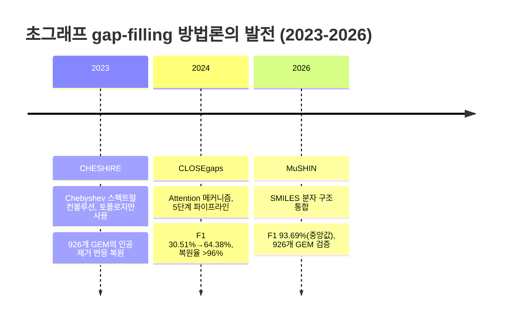

# 5. 초그래프 신경망 기반 Gap-filling

[Chapter 5](../chapter-5/README.md)에서 전통적 gap-filling 방법(SMILEY, GapFind/GapFill, growMatch, FastGapFill)의 MILP 정형화와, 딥러닝 기반 gap-filling(CHESHIRE, CLOSEgaps, DNNGIOR, GHCN-SE)의 개요를 이미 소개했다. 여기서는 그 딥러닝 방법들이 **왜, 어떻게** 후보 반응의 우선순위를 학습하는지 한 단계 더 깊이 들여다보고, 2026년 MuSHIN까지 확장한다.

## 5.1 초그래프가 필요한 이유: 대사 반응은 "다대다" 관계다

대사 반응의 본질적 특성은 **다대다(Many-to-many)** 관계다. 예를 들어 포도당 6-인산 탈수소화 반응은

$$\text{Glucose-6-P} + \text{NADP}^+ + \text{H}_2\text{O} \rightarrow \text{6-P-Glucono-}\delta\text{-lactone} + \text{NADPH} + \text{H}^+$$

와 같이 6개의 대사물이 동시에 참여하는 6차 관계다. §2.2에서 우리가 만든 그래프(엣지가 두 노드만 연결)로는 이 반응을 정확히 표현할 수 없다 — "공유 대사물이 있으면 연결"이라는 규칙은 대사물이 여러 개일 때 정보를 뭉개버린다.

> **핵심 개념 · 용어(English):** **초그래프(Hypergraph)** $$H = (V, \mathcal{E})$$, $$\mathcal{E} \subseteq 2^V$$는 하나의 **초엣지(hyperedge)**가 임의의 수의 노드를 동시에 연결할 수 있는 그래프의 일반화다. 대사 반응 하나가 정확히 하나의 초엣지가 된다 — 6개 대사물이 참여하는 반응은 6개 노드를 한 번에 묶는 초엣지 하나로 정보 손실 없이 표현된다.

## 5.2 CHESHIRE → CLOSEgaps → MuSHIN: 복원율의 진화

| 특징 | CHESHIRE(2023) | CLOSEgaps(2024 preprint) | MuSHIN(2026) |
|:---|:---|:---|:---|
| 아키텍처 | Chebyshev 스펙트럴 컨볼루션 | 초그래프 컨볼루션 + Attention | SMILES + 다중 방향 Attention 초그래프 |
| 대사물 특징 | 토폴로지만 | 토폴로지만 | **SMILES 분자 구조 + 토폴로지** |
| 내부 검증 | 926개 GEM의 인공 제거 반응 | 인위적 갭 96%+ 복구 | BiGG median F1 **93.69%**, precision **93.98%**, recall **93.49%** |
| 외부·phenotype 검증 | 49개 draft GEM | 24개 CarveMe draft GEM | 24개 발효 관련 draft GEM |
| 핵심 주의점 | 토폴로지 기반 synthetic-gap 성능 | 2024년 사전출판 | negative reaction 생성과 인공 제거 평가를 실제 미지 반응 발견과 구분 |

CHESHIRE는 초그래프 라플라시안(Hypergraph Laplacian)을 Chebyshev 다항식으로 필터링하는 순수 토폴로지 기반 방법으로, 108개 BiGG와 818개 AGORA 모델에서 인위적으로 제거한 반응을 복원하고 49개 draft GEM의 phenotype 예측을 개선했습니다. CLOSEgaps는 초그래프 매핑 → negative sampling → 특징 초기화 → attention 기반 특징 정제 → 예측의 5단계 파이프라인을 제안했고, 사전출판물에서 인공 갭 복원과 24개 draft GEM의 phenotype 개선을 보고했습니다.

**MuSHIN**(Multi-way SMILES-based Hypergraph Interface Network, 2026)은 대사물과 반응의 **SMILES(Simplified Molecular Input Line Entry System)** 표현을 ChemBERTa와 RXNFP로 인코딩하고, hypergraph topology와 결합합니다. 108개 BiGG 모델에서 median F1은 93.69%였고, 논문은 CLOSEgaps보다 F1이 17.01% 높았다고 보고했습니다(보정하지 않은 paired $$P = 4.3\times10^{-25}$$). 예컨대 연결 패턴만 비슷한 대사물도 화학 구조 표현으로 구별할 수 있다는 장점이 있지만, 이 수치는 합성 negative와 인위적 반응 제거를 사용한 내부 benchmark이므로 실제 미지 생화학 발견의 정확도로 일반화하면 안 됩니다.


💡 **잠깐, 생각해보기:** 인공적으로 지운 반응을 잘 복원했다고 해서 자연계의 미지 반응도 같은 정확도로 찾을 수 있을까요? 훈련 모델의 큐레이션 편향, synthetic negative 생성법, 후보 reaction pool이 평가 난이도를 결정합니다. 따라서 내부 복원율과 독립 phenotype·유전자·생화학 검증을 분리해서 읽어야 합니다.


이들 방법의 공통 프레임워크는 $$N$$개의 고품질 모델로부터 학습한 신경망 $$f_\theta$$가, 주어진 초안 모델에서 각 후보 반응이 누락된 초엣지일 확률 $$P(r \in \mathcal{E}_{missing} \mid \mathcal{M}) = f_\theta(\mathcal{H}_\mathcal{M}, r)$$을 예측하는 것이다. [Chapter 5](../chapter-5/README.md)의 전통적 MILP 방법이 "생물량을 생산 가능하게 만드는 최소 반응 집합"을 매번 처음부터 최적화로 찾는 반면, 이 신경망들은 수백~수천 개의 이미 완성된 GEM에서 "정상적인 대사 네트워크는 어떻게 생겼는가"를 미리 학습해 두었다가 순전파 한 번으로 답한다 — §1.2의 "지도 vs. 직감" 비유가 여기서도 그대로 적용된다.

---
