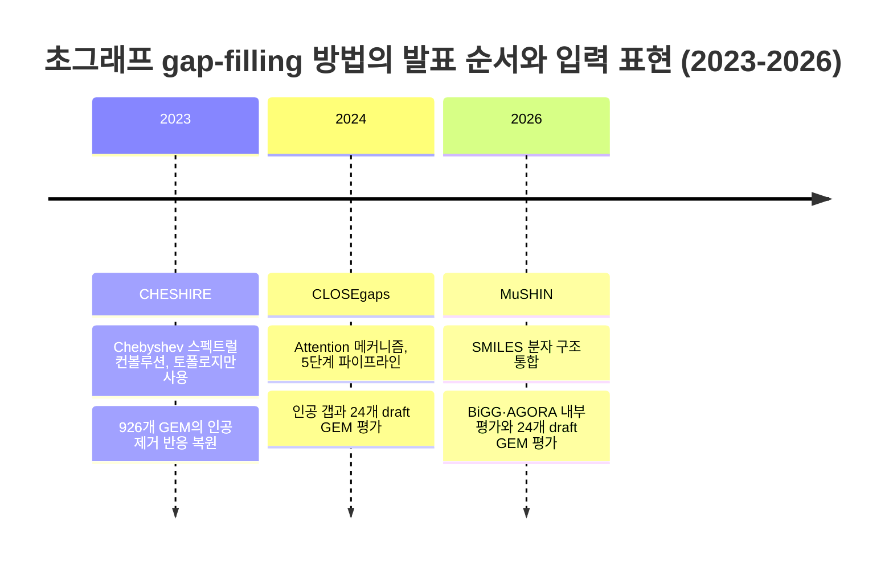

# 5. 초그래프 신경망 기반 Gap-filling

[Chapter 5](../chapter-5/README.md)에서 전통적 gap-filling 방법(SMILEY, GapFind/GapFill, growMatch, FastGapFill)의 MILP 정형화와, 딥러닝 기반 gap-filling(CHESHIRE, CLOSEgaps, DNNGIOR, GHCN-SE)의 개요를 이미 소개했다. 여기서는 그 딥러닝 방법들이 **왜, 어떻게** 후보 반응의 우선순위를 학습하는지 한 단계 더 깊이 들여다보고, 2026년 MuSHIN까지 확장한다.

## 5.0 초엣지는 다대다 관계를 하나의 대상으로 표현한다

일반 그래프의 엣지는 정확히 두 노드만 연결하지만, **초그래프의 초엣지(hyperedge)**는 임의 개수의 노드를 하나의 대상으로 묶는다(§5.1에서 정식화한다). 이 차이는 스마트폰 메신저에 비유할 수 있다 — **1:1 문자**는 두 사람만 연결하므로 그래프의 엣지와 같고, 여섯 명이 함께 저녁 약속을 잡는 **단체 채팅방**은 하나의 초엣지와 같다. 단체 채팅방을 1:1 문자로 흉내 내려면 $$\binom{6}{2}=15$$번의 대화가 필요하고, 그렇게 쪼개는 순간 "이 15번이 사실은 하나의 약속을 정하는 대화였다"는 사실이 사라진다. 초엣지는 여섯 명이 동시에 참여한다는 사실 자체를 보존한다. 다만 이 비유는 대사 반응의 초엣지가 참여 대사물을 기질과 생성물로 구분하고 화학량론 계수·방향성까지 담는다는 점에서는 단순한 단체 채팅방을 넘어선다.

## 5.1 초그래프가 필요한 이유: 대사 반응은 "다대다" 관계다

대사 반응의 본질적 특성은 **다대다(Many-to-many)** 관계다. 예를 들어 포도당 6-인산 탈수소화 반응은

$$\text{Glucose-6-P} + \text{NADP}^+ + \text{H}_2\text{O} \rightarrow \text{6-P-Glucono-}\delta\text{-lactone} + \text{NADPH} + \text{H}^+$$

와 같이 6개의 대사물이 동시에 참여하는 6차 관계다. §2.2에서 우리가 만든 그래프(엣지가 두 노드만 연결)로는 이 반응을 정확히 표현할 수 없다 — "공유 대사물이 있으면 연결"이라는 규칙은 대사물이 여러 개일 때 정보를 뭉개버린다.

> **핵심 개념 · 용어(English):** **초그래프(Hypergraph)** $$H = (V, \mathcal{E})$$, $$\mathcal{E} \subseteq 2^V$$는 하나의 **초엣지(hyperedge)**가 임의의 수의 노드를 동시에 연결할 수 있는 그래프의 일반화다. 대사 반응 하나가 정확히 하나의 초엣지가 된다 — 6개 대사물이 참여하는 반응은 6개 노드를 한 번에 묶는 초엣지 하나로 정보 손실 없이 표현된다.

### 초그래프를 숫자로 적어보기: 배속 행렬

초그래프는 흔히 **접속 행렬(incidence matrix)** $$\mathbf{B} \in \{0,1\}^{|V|\times|\mathcal{E}|}$$로 표현한다. 행은 대사물(노드), 열은 반응(초엣지)이며, $$B_{ik}=1$$은 대사물 $$i$$가 반응 $$k$$에 참여함을 뜻한다. §2.2에서 쓴 작은 예제 R1(A→B), R2(B→C), R3(B→D)를 배속 행렬로 적으면 다음과 같다.

| 대사물 \ 반응 | R1 | R2 | R3 |
|:---:|:---:|:---:|:---:|
| A | 1 | 0 | 0 |
| B | 1 | 1 | 1 |
| C | 0 | 1 | 0 |
| D | 0 | 0 | 1 |

B 행(대사물 B)에 1이 세 개나 있다는 것은 B가 세 반응 모두에 참여한다는 뜻이며, 이는 §2.2에서 "B를 공유하는 반응끼리 연결"해 만든 삼각형 그래프와 정보량 면에서 동등하다. 그러나 방금 살펴본 6개 대사물이 참여하는 포도당 6-인산 탈수소화 반응처럼 한 반응에 대사물이 여러 개 몰리는 경우, 배속 행렬은 "이 6개가 정확히 한 반응에 함께 참여했다"는 사실을 열(column) 하나로 온전히 보존하지만, §2.2식 반응-반응 그래프로 바꾸는 순간 $$\binom{6}{2}=15$$개의 개별 엣지로 흩어져 "원래 하나의 반응이었다"는 정보가 사라진다 — 앞서 든 단체 채팅방 비유의 수학적 실체가 바로 이 배속 행렬이다.

## 5.2 CHESHIRE·CLOSEgaps·MuSHIN: 방법과 검증 설정 비교

*그림 9.6. CHESHIRE·CLOSEgaps·MuSHIN의 발표 순서와 입력 표현 변화. 연도 축은 토폴로지 기반 초그래프에서 attention과 화학 구조 표현을 추가한 방법론적 순서만 나타내며, 성능이 시간에 따라 단조 향상했다는 뜻이 아니다. 논문마다 negative sampling, 분할, reaction pool과 집계 방식이 다르므로 서로 다른 benchmark의 F1을 하나의 시계열로 연결할 수 없다. 출처: 저자 자체 제작; 일차 문헌: CHESHIRE([Chen et al., 2023](https://doi.org/10.1038/s41467-023-38110-7)), CLOSEgaps([Liu et al., 2024](https://doi.org/10.48550/arXiv.2409.13259)), MuSHIN([Zhao et al., 2026](https://doi.org/10.1038/s42003-026-09761-1)). 외부 논문의 그림은 복제하거나 변형하지 않았다.*

아래 수치는 각 논문이 정의한 내부 평가를 요약한 것이며, **열 사이의 절대 순위나 2023→2026의 향상량으로 해석해서는 안 된다.** 직접 비교는 동일 데이터·negative set·분할·threshold를 모든 방법에 적용한 연구 안에서만 유효하다.

| 특징 | CHESHIRE(2023) | CLOSEgaps(2024 preprint) | MuSHIN(2026) |
|:---|:---|:---|:---|
| 아키텍처 | Chebyshev 스펙트럴 컨볼루션 | 초그래프 컨볼루션 + Attention | SMILES + 다중 방향 Attention 초그래프 |
| 대사물 특징 | 토폴로지만 | 토폴로지만 | **SMILES 분자 구조 + 토폴로지** |
| 논문별 내부 검증(직접 비교 불가) | 926개 GEM의 인공 제거 반응 | 해당 사전출판물 설정에서 인위적 갭 96%+ 복구 | 해당 논문 설정에서 BiGG median F1 **93.69%**, precision **93.98%**, recall **93.49%** |
| 외부·phenotype 검증 | 49개 draft GEM | 24개 CarveMe draft GEM | 24개 발효 관련 draft GEM |
| 핵심 주의점 | 토폴로지 기반 synthetic-gap 성능 | 2024년 사전출판 | negative reaction 생성과 인공 제거 평가를 실제 미지 반응 발견과 구분 |

[CHESHIRE](https://doi.org/10.1038/s41467-023-38110-7)는 초그래프 라플라시안(Hypergraph Laplacian)을 Chebyshev 다항식으로 필터링하는 순수 토폴로지 기반 방법으로, 108개 BiGG와 818개 AGORA 모델에서 인위적으로 제거한 반응을 복원하고 49개 draft GEM의 phenotype 예측을 개선했다. [CLOSEgaps](https://doi.org/10.48550/arXiv.2409.13259)는 초그래프 매핑 → negative sampling → 특징 초기화 → attention 기반 특징 정제 → 예측의 5단계 파이프라인을 제안했고, 사전출판물에서 인공 갭 복원과 24개 draft GEM의 phenotype 개선을 보고했다.

**[MuSHIN](https://doi.org/10.1038/s42003-026-09761-1)**(Multi-way SMILES-based Hypergraph Interface Network, 2026)은 대사물과 반응의 **SMILES(Simplified Molecular Input Line Entry System)** 표현을 ChemBERTa와 RXNFP로 인코딩하고, hypergraph topology와 결합한다. 108개 BiGG 모델에서 median F1은 93.69%였다. MuSHIN 논문이 네 기준 방법을 **같은 split과 synthetic-negative protocol로 다시 평가한 연구 내 비교**에서는 CLOSEgaps 대비 F1 17.01%p 차이를 보고했다(보정하지 않은 paired $$P = 4.3\times10^{-25}$$). 이는 CLOSEgaps 원 논문의 수치와 연도순으로 이어 붙인 비교가 아니다. 또한 합성 negative와 인위적 반응 제거를 사용한 내부 benchmark이므로 실제 미지 생화학 발견의 정확도로 일반화하면 안 된다.

**F1 93.69%는 무엇을 뜻하는가**: [§2.6](02.md)에서 배운 $$F1 = 2\times\dfrac{\text{Precision}\times\text{Recall}}{\text{Precision}+\text{Recall}}$$ 공식을 그대로 적용한다. Precision 93.98%, Recall 93.49%라는 논문 수치를 대입하면

$$
F1 = 2\times\frac{0.9398\times0.9349}{0.9398+0.9349} = 2\times\frac{0.8786}{1.8747} \approx 0.9373
$$

로, 보고된 93.69%와 거의 일치한다(반올림·개별 모델 단위 median 계산 방식의 차이로 소수점 아래 값은 정확히 같지 않을 수 있다). CLOSEgaps의 30.51%와 64.38%는 그 사전출판물 안에서 기본 구성과 attention을 추가한 구성을 비교한 값이다. 이처럼 **같은 연구 안의 통제된 ablation**은 구성 요소의 효과를 평가할 수 있지만, 서로 다른 논문의 대표 F1을 연도순으로 나열해 향상 곡선으로 만드는 근거는 되지 않는다. 두 연구의 수치 모두 인위적으로 제거한 반응을 복원하는 내부 benchmark이므로 실제 미지 반응 발견 성능과도 구분해야 한다.

같은 시기에 제안된 [Multi-HGNN](https://doi.org/10.1016/j.ins.2025.121960)(Huang et al., 2025)은 멀티모달 표현을 결합한 또 다른 초그래프 기반 반응 예측 접근으로, 위 세 방법과 마찬가지로 자체 정의한 평가 설정 안에서만 성능이 비교 가능하다는 점에 유의한다.


**잠깐, 생각해보기:** 인공적으로 지운 반응을 잘 복원했다고 해서 자연계의 미지 반응도 같은 정확도로 찾을 수 있을까? 훈련 모델의 큐레이션 편향, synthetic negative 생성법, 후보 reaction pool이 평가 난이도를 결정한다. 따라서 내부 복원율과 독립 phenotype·유전자·생화학 검증을 분리해서 읽어야 한다.


이들 방법의 공통 프레임워크는 $$N$$개의 고품질 모델로부터 학습한 신경망 $$f_\theta$$가, 주어진 초안 모델에서 각 후보 반응이 누락된 초엣지일 확률 $$P(r \in \mathcal{E}_{missing} \mid \mathcal{M}) = f_\theta(\mathcal{H}_\mathcal{M}, r)$$을 예측하는 것이다. [Chapter 5](../chapter-5/README.md)의 전통적 MILP 방법이 "생물량을 생산 가능하게 만드는 최소 반응 집합"을 매번 처음부터 최적화로 찾는 반면, 이 신경망들은 수백~수천 개의 이미 완성된 GEM에서 "정상적인 대사 네트워크는 어떻게 생겼는가"를 미리 학습해 두었다가 순전파 한 번으로 답한다 — §1.2의 "지도 vs. 직감" 비유가 여기서도 그대로 적용된다.

**"negative sampling"이 왜 필요한가**: [§2.1](02.md)의 지도학습은 양성(존재하는 반응)과 음성(존재하지 않는 반응) 예제가 모두 있어야 분류기를 학습시킬 수 있다. 그런데 완성된 GEM에는 "실제로 있는 반응"만 기록되어 있고 "있을 법하지만 실제로는 없는 반응" 목록은 어디에도 없다. 그래서 CLOSEgaps·MuSHIN 같은 방법은 실제 존재하지 않는 대사물 조합을 인위적으로 만들어(negative sampling) 음성 예제로 삼는다. 이때 음성 예제를 완전히 무작위로 만들면 너무 쉬운 문제(진짜 반응과 확연히 다른 조합)가 되어 분류기가 실전에서는 못 미더운 성능을 보일 수 있고, 반대로 진짜 반응과 지나치게 비슷하게 만들면 학습 자체가 어려워진다. §5.2 표의 "핵심 주의점"에 적힌 대로, 이 negative sampling 설계 자체가 보고된 F1 값에 큰 영향을 미치는 숨은 변수다.

---
