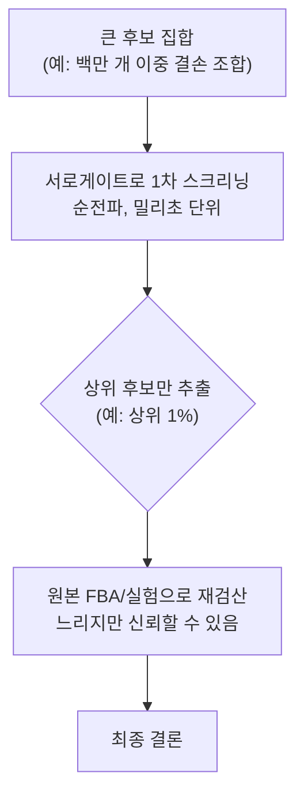

# 6. ML 서로게이트 모델: FBA를 수천 배 가속하기

## 6.0 아주 쉬운 시작: 일기예보 앱은 매번 대기 시뮬레이션을 처음부터 돌리지 않는다

스마트폰 일기예보 앱을 켤 때마다, 지구 대기 전체의 유체역학 방정식을 처음부터 다시 계산하는 슈퍼컴퓨터 시뮬레이션이 실시간으로 돌아가는 것은 아니다. 실제로는 슈퍼컴퓨터가 하루 몇 차례 미리 계산해 둔 결과를, 훨씬 가벼운 모델이 사용자의 위치·시간에 맞게 빠르게 보여주는 경우가 많다. 이 장에서 다룰 **서로게이트 모델(Surrogate Model)**도 비슷한 발상이다 — 무거운 원본 계산(FBA의 LP)을 그때그때 다시 푸는 대신, 미리 그 계산 결과들을 잔뜩 학습해 둔 가벼운 근사 함수가 즉석에서 비슷한 답을 내놓는다.

## 6.1 서로게이트 모델의 개념과 필요성

[Chapter 4](../chapter-4/README.md)의 FBA는 $$\max Z = \mathbf{c}^T \mathbf{v}$$, s.t. $$\mathbf{S} \cdot \mathbf{v} = 0$$, $$\mathbf{v}_{lb} \leq \mathbf{v} \leq \mathbf{v}_{ub}$$ 형태의 LP다. 대규모 KO 스크린([Chapter 8](../chapter-8/README.md)), 실시간 제어 루프, 진화적 최적화, 앙상블 시뮬레이션은 수천~수만 번의 LP 반복 호출을 요구해 계산 병목이 발생한다.

**서로게이트 모델(Surrogate Model)**은 $$\hat{f}_{\text{surrogate}}(\mathbf{x}) \approx f_{FBA}(\mathbf{x})$$를 만족하는 빠른 근사 함수로, **오프라인 학습·온라인 추론(Offline Training, Online Inference)** 전략을 취한다 — 베테랑 택시기사가 "미리" 도시를 익혀두었다가 즉시 답하는 것과 같다. 장점은 속도, 미분 가능성, GPU 병렬화이며, 단점은 근사 오차, 학습 범위 밖 일반화 한계, 화학량론적 타당성 미보장(§10.2)이다.

서로게이트를 학습시키는 절차 자체는 [§2.1](02.md)에서 배운 회귀와 다르지 않다. 입력 $$\mathbf{x}$$(배지 조성, uptake bound 등)를 주고 FBA가 계산한 실제 플럭스 $$\mathbf{v}_{FBA}$$를 정답으로 삼아, 서로게이트의 예측 $$\hat{\mathbf{v}}$$와의 평균제곱오차

$$
\mathcal{L}(\theta) = \frac{1}{n}\sum_{i=1}^n \left\|\mathbf{v}_{FBA}^{(i)} - \hat{\mathbf{v}}^{(i)}_\theta\right\|^2
$$

를 [§2.1](02.md)의 경사하강법으로 최소화하도록 파라미터 $$\theta$$를 학습한다. 즉 "FBA가 이미 계산해 둔 수많은 시나리오의 정답"을 훈련 데이터 삼아, 다음에 비슷한 상황이 오면 LP를 다시 풀지 않고도 순전파 한 번으로 답을 내놓는 회귀 모델을 만드는 것이 서로게이트의 핵심이다.

**속도 차이를 숫자로 체감해보기**: 하나의 LP를 푸는 데 평균 20 ms가 걸리고, 학습된 서로게이트의 순전파 한 번이 0.05 ms(GPU에서 배치 처리 시)가 걸린다고 하자. §1.1.2에서 계산한 iML1515의 이중 결손 스크리닝(1,148,370번의 LP)을 생각하면,

$$
\text{원본 FBA 총 소요 시간} \approx 1{,}148{,}370 \times 20\text{ ms} \approx 6.4\text{ 시간}
$$

$$
\text{서로게이트 총 소요 시간} \approx 1{,}148{,}370 \times 0.05\text{ ms} \approx 57\text{ 초}
$$

가속 배수는 $$20/0.05 = 400$$배다. 이는 §6.3의 표에 나오는 "수백~수천 배" 가속이 어디서 나오는 수치인지 감을 잡기 위한 예시 계산일 뿐, 실제 논문의 보고값과는 하드웨어·배치 크기·모델 구조에 따라 다를 수 있다는 점을 다시 강조해 둔다.

## 6.2 미분 가능한 mechanistic layer와 AMN

### 왜 하필 "미분 가능"해야 하는가

§2.1에서 경사하강법은 손실을 파라미터로 미분한 그래디언트 $$\partial \mathcal{L}/\partial \theta$$를 계산해 그 반대 방향으로 파라미터를 옮기는 절차였다. 신경망 층을 아무리 깊게 쌓아도 각 층이 미분 가능한 함수(행렬곱, 시그모이드, ReLU 등)로 이루어져 있으면 연쇄 법칙으로 처음부터 끝까지 미분을 전달할 수 있다. 문제는 [Chapter 4](../chapter-4/README.md)의 FBA가 사용하는 Simplex 알고리듬은 "if-then" 분기와 꼭짓점 이동을 반복하는 절차여서, 입력이 아주 조금 바뀌어도 출력이 뚝뚝 끊기듯 변하거나 아예 미분이 정의되지 않는 지점이 많다는 점이다. 신경망 뒤에 곧바로 FBA solver를 붙여 "신경망이 배지 조성을 정하면 FBA가 성장률을 계산하고, 그 오차로 신경망을 학습시키자"는 자연스러운 아이디어가 표준 Simplex로는 바로 실현되지 않는 이유가 여기에 있다. AMN은 이 문제를, Simplex 대신 미분 가능한 반복 연산만으로 정상상태 flux에 근사적으로 도달하는 layer를 설계해 우회한다.

표준 FBA의 Simplex 호출은 그대로는 자동미분 그래프에 들어가지 않으며, 최적 flux가 여러 개이거나 활성 제약 집합이 바뀌는 지점에서는 최적해의 미분도 잘 정의되지 않을 수 있습니다. 일반적인 **미분 가능 최적화 층**은 KKT(Karush-Kuhn-Tucker) 조건의 암시적 미분 등을 이용하지만, 아래의 AMN은 그 구현과 동일한 방법이 아닙니다. 또한 여기서 말하는 미분 가능 계층은 시간에 따른 농도를 적분하는 **dynamic FBA(dFBA)**와 구별해야 합니다.

[Faure et al. (2023)](https://doi.org/10.1038/s41467-023-40380-0)의 **AMN(Artificial Metabolic Network)**은 Simplex를 대신해 반복적으로 정상상태 flux를 계산하면서 역전파할 수 있는 세 가지 mechanistic layer—Wt-solver, LP-solver, QP-solver—를 제안했습니다. 신경망은 배지의 uptake bound 또는 배지 조성에서 초기 flux $$\mathbf{v}^{(0)}$$를 만들고, 뒤의 layer는 **solver마다 다른 반복식**으로 $$\mathbf{v}^{out}$$을 계산합니다. AMN 학습에서는 기준 flux와의 오차 및 대사 제약 만족도를 평가하지만, 세 solver의 내부 계산이 모두 같은 constraint-loss gradient descent인 것은 아닙니다.

- **AMN-Wt**는 학습된 flux 분기 비율을 이용해 대사물 생산량과 반응 flux를 갱신하지만, 정확한 uptake flux를 고정하는 조건에는 일반적으로 적용할 수 없다는 제한이 있습니다.
- **AMN-LP**는 고전 FBA의 생장 최대화 목적을 포함하고 flux와 쌍대 변수(shadow price)를 반복 갱신합니다.
- **AMN-QP**는 생장 목적을 두지 않고, 일부 기준 flux와의 제곱오차·flux bound·화학량론이라는 세 손실의 gradient로 flux를 보정합니다.

따라서 AMN-QP를 “FBA 목적함수에 작은 L2 항을 더해 유일해를 만드는 일반 KKT-QP 층”으로 해석하면 안 됩니다. 논문의 핵심은 신경층과 반복 mechanistic layer를 사용자 정의 손실로 함께 학습해, 적은 자료에서도 대사 제약을 활용한다는 데 있습니다. 연쇄 법칙은 개념적으로

$$\theta \leftarrow \theta-\eta\,
\frac{\partial \mathcal{L}}{\partial \mathbf{v}^{out}}
\frac{\partial \mathbf{v}^{out}}{\partial \mathbf{v}^{(0)}}
\frac{\partial \mathbf{v}^{(0)}}{\partial \theta}$$

처럼 작동합니다. **AMN-Reservoir**에서는 먼저 FBA 모의 자료로 AMN을 학습한 뒤 그 가중치를 고정하고, 앞단 신경망만 실험 자료로 학습해 배지 조성에서 uptake bound를 추정합니다. 그 추정치는 고전 FBA에 다시 입력할 수도 있습니다. 다만 제약은 유한 반복과 수치 허용오차 안에서 만족되므로, 결과를 사용할 때 $$\|S\mathbf{v}\|$$와 bound 위반을 직접 확인해야 합니다.

## 6.3 속도 향상과 정확도-속도 트레이드오프

| 서로게이트 유형 | 문헌에서 보고된 가속의 예 | 비교 전 확인할 점 |
|:---|:---:|:---|
| CNN 서로게이트(발효기 MPC) | 수백 배로 보고된 사례 | 하드웨어, batch 크기, 원 solver와 예측 horizon |
| GNN 서로게이트 | 단일·batch 실행에서 수백~수천 배 사례 | 학습 시간 포함 여부, 테스트 조건의 분포 범위 |
| 장기 반복 시뮬레이션 | 반복 수가 클 때 더 큰 누적 가속 사례 | 오차 누적과 상태 drift |
| Kinetic+GEM 하이브리드 | 특정 동적 모델에서 큰 가속 사례 | 동일 오차 허용치와 제약 위반률 |

가속 배수는 모델·하드웨어·batching·solver tolerance에 종속됩니다. 원 FBA도 생물학적 “정확도 100%”가 아니라 주어진 수학 문제의 최적해를 계산할 뿐이며, 서로게이트 정확도 역시 평균 오차 하나로 충분하지 않습니다. 최악 조건 오차, 제약 위반률, 분포 밖 조건을 함께 평가해야 합니다.

| 응용 시나리오 | 권장 모델 | 이유 |
|:---|:---|:---|
| 발효기 실시간 MPC | CNN 서로게이트 | 밀리초 단위 응답 |
| 유전자 제거 스크리닝 | GNN 서로게이트 | 대규모 일괄 처리 |
| 배지 조건 학습·최적화 | AMN-LP/AMN-QP | 대사 제약을 둔 end-to-end 학습 가능 |
| uptake bound 역추정 | AMN-Reservoir + 고전 FBA | 배지 조성을 uptake bound로 연결하고 원 solver로 재검산 가능 |
| 후보 재검산 | 원본 FBA/실험 | 수학적 근사 오차와 생물학적 오차를 분리 |

한 실용적 전략은 서로게이트로 후보를 줄인 뒤 원 최적화 문제로 재계산하는 것입니다. 재검산 비율(예: 상위 1%)은 고정 규칙이 아니라 false-negative 허용도와 calibration 결과로 정해야 하며, 마지막 생물학적 검증은 여전히 실험입니다.

*그림 9.7. 서로게이트 선별과 원모델 재검산의 2단계 의사결정. 빠른 근사 모델은 큰 후보 집합의 순위를 정하는 데 사용하고, 사전에 정한 통과 규칙을 만족한 후보만 원래 FBA·동역학 모델과 실험으로 다시 평가합니다. “상위 1%”는 예시이며 실제 비율은 false-negative 비용과 calibration 결과로 정해야 합니다. 출처: 저자 자체 제작; neural–mechanistic 결합의 개념 근거: [Faure et al. (2023)](https://doi.org/10.1038/s41467-023-40380-0). 원 논문의 그림은 복제하거나 변형하지 않았습니다.*

이 "서로게이트로 거르고 원본으로 확인한다"는 전략은 §1.1의 "지도와 직감" 비유를 실제 워크플로로 옮긴 것이다 — 직감(서로게이트)이 유망한 길 몇 개를 빠르게 골라주면, 정밀한 지도(FBA)가 그 길들만 자세히 확인해 최종 결정을 내리는 셈이다.

---
