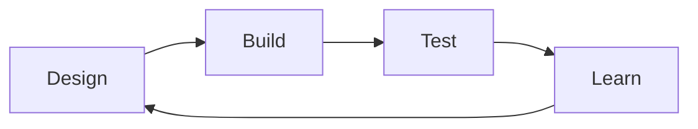

# 7. 강화학습 기반 균주 설계

균주 설계의 생물학적 목표와 전통적 OptKnock·OptForce 등은 [Chapter 8](../chapter-8/README.md)에서 다룬다. 여기서는 강화학습(Reinforcement Learning, RL)이 **전이 방정식을 미리 알지 못해도** 보상 신호를 바탕으로 설계를 탐색하는 방법을 다룬다. 다만 목표 산물 생산·성장 손실·편집 비용을 어떤 보상으로 둘지는 연구자가 정해야 한다.

## 7.0 아주 쉬운 시작: 강아지 훈련과 시행착오 학습

강화학습을 처음 접한다면 반려동물을 훈련시키는 상황을 떠올려보자. 강아지에게 "앉아"라는 말과 손동작의 정확한 의미를 문장으로 설명해줄 수는 없다. 대신 강아지가 우연히 앉는 행동을 했을 때 간식(보상)을 주고, 아무 행동도 하지 않거나 다른 행동을 하면 간식을 주지 않는다. 이 과정을 수십~수백 번 반복하면 강아지는 "앉으면 간식이 나온다"는 규칙, 즉 **정책(Policy)**을 스스로 터득한다. 이때 (1) 강아지가 처한 상황(주인이 손을 든 자세)이 **상태(State)**, (2) 강아지가 할 수 있는 여러 행동(앉기·짖기·가만히 있기)이 **행동(Action)**, (3) 간식 여부가 **보상(Reward)**에 해당한다.

[§2.1](02.md)의 지도학습은 "이 사진은 고양이다"처럼 매 예제마다 정답을 미리 알려주지만, 강화학습은 정답을 알려주는 대신 결과가 좋았는지 나빴는지(보상)만 알려준다는 점이 근본적으로 다르다. 균주 설계에서는 "이 유전자 조합이 정답이다"를 미리 아는 사람이 없으므로, 이러한 시행착오 기반 학습이 자연스러운 대안이 된다.

## 7.1 RL 기초: MDP로서의 균주 설계

RL은 **마르코프 결정 과정(Markov Decision Process, MDP)** $$\mathcal{M} = (\mathcal{S}, \mathcal{A}, \mathcal{P}, \mathcal{R}, \gamma)$$로 정의되며, 목표는 $$\max_{\pi} \mathbb{E}\left[\sum_{t=0}^{T} \gamma^t R(s_t, a_t) \mid \pi\right]$$를 만족하는 정책 $$\pi(a|s)$$를 찾는 것이다.

| MDP 요소 | 대사 모델링에서의 대응 |
|:---|:---|
| 상태 $$s_t$$ | 현재 대사물 농도, 효소 수준, 생장률 |
| 행동 $$a_t$$ | 효소 발현 수준 조정(상향/하향/유지) |
| 보상 $$r_t$$ | 목표 대사물 생산율 개선량 |
| 상태 전이 | Kinetic Model 또는 GEM의 동적 반응 |

대표 알고리즘은 Q-Learning($$Q(s, a) \leftarrow Q(s, a) + \alpha [r + \gamma \max_{a'} Q(s', a') - Q(s, a)]$$), Policy Gradient($$\nabla_{\theta} J(\theta) = \mathbb{E}_{\pi_{\theta}}\left[\nabla_{\theta} \log \pi_{\theta}(a|s) \cdot Q^{\pi_{\theta}}(s,a)\right]$$), Actor-Critic이다.

### Q-Learning을 손으로 한 단계 갱신해보기

$$Q(s,a)$$는 "상태 $$s$$에서 행동 $$a$$를 택했을 때, 이후로 기대할 수 있는 누적 보상"을 저장해 두는 표(table)라고 생각하면 된다. 갱신식의 대괄호 안 $$r + \gamma\max_{a'}Q(s',a') - Q(s,a)$$을 **시간차 오차(Temporal-Difference Error, TD Error)**라 부르는데, 이는 "이번에 실제로 겪어보니 예상했던 것(기존 $$Q(s,a)$$)보다 얼마나 더/덜 좋았는가"를 뜻한다. §2.1의 경사하강법에서 (예측-정답) 오차만큼 파라미터를 옮겼던 것과 정확히 같은 구조다.

숫자로 확인해보자. 효소 발현을 "낮춤(down)"으로 조정하는 행동의 현재 추정값이 $$Q(s,\text{down})=2.0$$이고, 학습률 $$\alpha=0.1$$, 할인율(먼 미래 보상을 얼마나 깎아서 볼지) $$\gamma=0.9$$라 하자. 이 행동을 실제로 취했더니 즉시 보상 $$r=1.0$$(생산물 소폭 증가)을 받았고, 다음 상태 $$s'$$에서 가장 좋은 행동의 추정값이 $$\max_{a'}Q(s',a')=3.0$$이라면,

$$
Q(s,\text{down}) \leftarrow 2.0 + 0.1\times\big[1.0 + 0.9\times3.0 - 2.0\big] = 2.0 + 0.1\times(1.0+2.7-2.0) = 2.0+0.1\times1.7 = 2.17
$$

TD 오차가 $$+1.7$$로 양수였다는 것은 "이 행동이 기존에 생각했던 것보다 더 좋은 결과로 이어졌다"는 뜻이고, 그래서 $$Q(s,\text{down})$$이 2.0에서 2.17로 상향 조정된다. 이런 갱신을 수천~수만 번 반복하면 각 상태에서 어떤 행동이 장기적으로 가장 이득인지에 대한 추정치 $$Q(s,a)$$가 점점 정확해지고, 최종 정책은 각 상태에서 $$Q$$값이 가장 큰 행동을 선택하는 것으로 정해진다.

Policy Gradient는 이와 결이 조금 다르다. Q-Learning이 "각 행동의 가치를 표로 기억한다"면, Policy Gradient는 "행동을 선택하는 확률 분포 $$\pi_\theta(a|s)$$ 자체"를 신경망 파라미터 $$\theta$$로 직접 표현하고, 보상이 높았던 행동의 확률은 높이고 보상이 낮았던 행동의 확률은 낮추는 방향으로 $$\theta$$를 §2.1과 같은 경사 상승법(gradient *ascent*, 손실을 최소화하는 대신 기대 보상을 최대화하므로 부호가 반대)으로 갱신한다. §7.2의 MARL 코드에서 `self.policies[i, a] += self.lr * advantage`가 바로 이 규칙을 가장 단순화한 구현이다.

## 7.2 MARL: 효소 수준 최적화

**Multi-Agent RL(MARL)**은 경로의 각 효소를 독립 에이전트로 모델링한다($$N$$개 에이전트 ↔ $$N$$개 효소). 각 에이전트는 지역 관찰(자신과 연결된 대사물 농도)을 받아 행동(발현 조정)을 취하고, 전체 경로가 공유 보상을 받는다.

$$R_t = \alpha \cdot \Delta \text{Product}_t - \beta \cdot \text{GrowthPenalty}_t - \gamma \cdot \text{ModificationCost}_t$$

**Model-free RL**은 전이함수를 명시적으로 미분하거나 식으로 알고 있을 필요가 없다는 뜻이지, 생물학적 사전 지식과 모델이 전혀 필요 없다는 뜻이 아니다. 학습에는 상태를 반환하는 환경(실험, kinetic model 또는 surrogate), 보상 정의와 안전한 행동 범위가 필요하다. 가상 GEM/kinetic environment에서 학습했다면 그 모델의 누락과 편향을 그대로 물려받는다.

## 7.3 시뮬레이션·기존 자료 벤치마크와 실제 DBTL의 차이

한 연구([Sabzevari et al., 2022](https://doi.org/10.1371/journal.pcbi.1010177))는 *E. coli* kinetic model을 **가상 환경**으로 사용해 MARL과 Bayesian optimization을 비교했다. 그 환경에서 MARL이 더 적은 반복으로 좋은 해에 접근했지만, 이는 실제 균주 제작·배양 10~15회를 수행한 결과가 아니다.

| 특성 | MARL | BO-GP |
|:---|:---|:---|
| 수렴 속도 | 해당 가상 벤치마크에서 10-15 iterations | 해당 설정에서 19+ iterations |
| 노이즈 내성 | 해당 시뮬레이션에서 더 완만 | 해당 시뮬레이션에서 더 민감 |
| 병렬 실험 | 자연스럽게 대응 | 제한적 |
| 사전 지식 | 불필요 | 커널 함수 선택 필요 |

기존 L-tryptophan 조합 균주 라이브러리를 환경으로 삼은 벤치마크에서는 12회 반복 안에 그 데이터에서 알려진 최고값의 95% 수준에 도달했다고 보고했다. 이는 제한된 라이브러리에서의 **retrospective/surrogate 평가**이며, 새로운 균주를 12번 실제 제작해 검증한 전향적 자율 실험 결과로 읽으면 안 된다.

RL 반복이 실제 **Design-Build-Test-Learn(DBTL)** 사이클이 되려면 설계가 유전적 조작으로 변환되고, 균주를 제작·배양·측정한 결과가 정책에 다시 입력되어야 한다. 가상 환경의 `step()` 호출은 DBTL을 모사할 뿐 물리적 Build/Test를 수행하지 않는다.



*그림 9.8. 폐쇄형 design–build–test–learn(DBTL) 순환. 계산 또는 학습 모델이 설계를 제안하고, 실제 제작·측정 결과가 다음 학습 단계의 새 자료로 되돌아와야 한 주기가 닫힌다. 가상 환경의 `step()`만 반복한 retrospective RL 평가는 Build와 Test를 물리적으로 수행한 폐쇄형 DBTL이 아니다. 출처: 저자 자체 제작; 균주 설계 RL의 개념 근거: [Sabzevari et al. (2022)](https://doi.org/10.1371/journal.pcbi.1010177). 원 논문의 그림은 복제하거나 변형하지 않았다.*

```python
# MARL 균주 최적화 개념 구현 (단순화된 Policy Gradient)
import numpy as np

class MARLStrainOptimizer:
    def __init__(self, n_enzymes, action_space=3, learning_rate=0.01):
        self.n_enzymes = n_enzymes        # 효소 수 = 에이전트 수
        self.action_space = action_space  # {0: down, 1: maintain, 2: up}
        self.lr = learning_rate
        self.policies = np.ones((n_enzymes, action_space)) / action_space

    def select_actions(self, observations):
        actions = []
        for i, obs in enumerate(observations):
            probs = np.exp(self.policies[i]) / np.sum(np.exp(self.policies[i]))
            actions.append(np.random.choice(self.action_space, p=probs))
        return np.array(actions)

    def update(self, observations, actions, rewards):
        for i in range(self.n_enzymes):
            advantage = rewards[i] - np.mean(rewards)
            for a in range(self.action_space):
                if a == actions[i]:
                    self.policies[i, a] += self.lr * advantage
                else:
                    self.policies[i, a] -= self.lr * advantage / (self.action_space - 1)
            self.policies[i] = np.clip(self.policies[i], 0.01, 10)
# 사용: optimizer.select_actions(obs) -> env.step(actions) -> optimizer.update(...)
```

---
