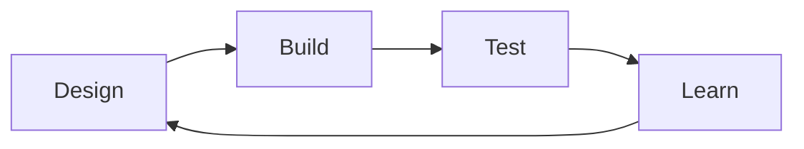

# 7. 강화학습 기반 균주 설계

균주 설계의 생물학적 목표와 전통적 OptKnock·OptForce 등은 [Chapter 8](../chapter-8/README.md)에서 다룬다. 여기서는 **강화학습(Reinforcement Learning, RL)**이 어떻게 모델-자유(Model-free) 최적화를 가능하게 하는지 다룬다.

## 7.1 RL 기초: MDP로서의 균주 설계

RL은 **마르코프 결정 과정(Markov Decision Process, MDP)** $$\mathcal{M} = (\mathcal{S}, \mathcal{A}, \mathcal{P}, \mathcal{R}, \gamma)$$로 정의되며, 목표는 $$\max_{\pi} \mathbb{E}\left[\sum_{t=0}^{T} \gamma^t R(s_t, a_t) \mid \pi\right]$$를 만족하는 정책 $$\pi(a|s)$$를 찾는 것이다.

| MDP 요소 | 대사 모델링에서의 대응 |
|:---|:---|
| 상태 $$s_t$$ | 현재 대사물 농도, 효소 수준, 생장률 |
| 행동 $$a_t$$ | 효소 발현 수준 조정(상향/하향/유지) |
| 보상 $$r_t$$ | 목표 대사물 생산율 개선량 |
| 상태 전이 | Kinetic Model 또는 GEM의 동적 반응 |

대표 알고리즘은 Q-Learning($$Q(s, a) \leftarrow Q(s, a) + \alpha [r + \gamma \max_{a'} Q(s', a') - Q(s, a)]$$), Policy Gradient($$\nabla_{\theta} J(\theta) = \mathbb{E}_{\pi_{\theta}}\left[\nabla_{\theta} \log \pi_{\theta}(a|s) \cdot Q^{\pi_{\theta}}(s,a)\right]$$), Actor-Critic이다.

## 7.2 MARL: 효소 수준 최적화

**Multi-Agent RL(MARL)**은 경로의 각 효소를 독립 에이전트로 모델링한다($$N$$개 에이전트 ↔ $$N$$개 효소). 각 에이전트는 지역 관찰(자신과 연결된 대사물 농도)을 받아 행동(발현 조정)을 취하고, 전체 경로가 공유 보상을 받는다.

$$R_t = \alpha \cdot \Delta \text{Product}_t - \beta \cdot \text{GrowthPenalty}_t - \gamma \cdot \text{ModificationCost}_t$$

**Model-free RL**은 전이함수를 명시적으로 미분하거나 식으로 알고 있을 필요가 없다는 뜻이지, 생물학적 사전 지식과 모델이 전혀 필요 없다는 뜻이 아닙니다. 학습에는 상태를 반환하는 환경(실험, kinetic model 또는 surrogate), 보상 정의와 안전한 행동 범위가 필요합니다. 가상 GEM/kinetic environment에서 학습했다면 그 모델의 누락과 편향을 그대로 물려받습니다.

## 7.3 시뮬레이션·기존 자료 벤치마크와 실제 DBTL의 차이

한 연구는 *E. coli* kinetic model을 **가상 환경**으로 사용해 MARL과 Bayesian optimization을 비교했습니다. 그 환경에서 MARL이 더 적은 반복으로 좋은 해에 접근했지만, 이는 실제 균주 제작·배양 10~15회를 수행한 결과가 아닙니다.

| 특성 | MARL | BO-GP |
|:---|:---|:---|
| 수렴 속도 | 해당 가상 벤치마크에서 10-15 iterations | 해당 설정에서 19+ iterations |
| 노이즈 내성 | 해당 시뮬레이션에서 더 완만 | 해당 시뮬레이션에서 더 민감 |
| 병렬 실험 | 자연스럽게 대응 | 제한적 |
| 사전 지식 | 불필요 | 커널 함수 선택 필요 |

기존 L-tryptophan 조합 균주 라이브러리를 환경으로 삼은 벤치마크에서는 12회 반복 안에 그 데이터에서 알려진 최고값의 95% 수준에 도달했다고 보고했습니다. 이는 제한된 라이브러리에서의 **retrospective/surrogate 평가**이며, 새로운 균주를 12번 실제 제작해 검증한 전향적 자율 실험 결과로 읽으면 안 됩니다.

RL 반복이 실제 **Design-Build-Test-Learn(DBTL)** 사이클이 되려면 설계가 유전적 조작으로 변환되고, 균주를 제작·배양·측정한 결과가 정책에 다시 입력되어야 합니다. 가상 환경의 `step()` 호출은 DBTL을 모사할 뿐 물리적 Build/Test를 수행하지 않습니다.



```python
# MARL 균주 최적화 개념 구현 (단순화된 Policy Gradient)
import numpy as np

class MARLStrainOptimizer:
    def __init__(self, n_enzymes, action_space=3, learning_rate=0.01):
        self.n_enzymes = n_enzymes        # 효소 수 = 에이전트 수
        self.action_space = action_space  # {0: down, 1: maintain, 2: up}
        self.lr = learning_rate
        self.policies = np.ones((n_enzymes, action_space)) / action_space

    def select_actions(self, observations):
        actions = []
        for i, obs in enumerate(observations):
            probs = np.exp(self.policies[i]) / np.sum(np.exp(self.policies[i]))
            actions.append(np.random.choice(self.action_space, p=probs))
        return np.array(actions)

    def update(self, observations, actions, rewards):
        for i in range(self.n_enzymes):
            advantage = rewards[i] - np.mean(rewards)
            for a in range(self.action_space):
                if a == actions[i]:
                    self.policies[i, a] += self.lr * advantage
                else:
                    self.policies[i, a] -= self.lr * advantage / (self.action_space - 1)
            self.policies[i] = np.clip(self.policies[i], 0.01, 10)
# 사용: optimizer.select_actions(obs) -> env.step(actions) -> optimizer.update(...)
```

---
