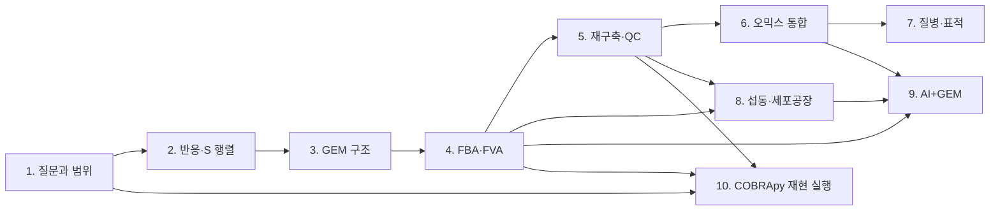

# 학습 경로와 장간 연결 지도

이 책은 대사 모델링을 독립된 기법 목록이 아니라, **표현 → 제약 기반 계산 → 재구축·검증 → 맥락화·응용 → 재현 가능한 실행**이라는 한 개의 연구 흐름으로 구성한다. 각 장을 읽을 때에는 이전 장에서 무엇을 이미 가정했는지, 다음 장에서 어떤 형태로 다시 쓰이는지를 함께 확인한다.

*그림 P.1. 장간 의존 관계. 화살표는 “반드시 선행 장을 모두 암기해야 한다”는 뜻이 아니라, 이후 장에서 재사용되는 핵심 개념의 흐름을 뜻한다. 저자 작성.*

## 제1부. 공통 언어 만들기: Chapters 1–3

### Chapter 1 → Chapter 2

Chapter 1은 대사물, 반응, 플럭스와 계산 결과의 해석 범위를 정의한다. Chapter 2에서는 이 세 요소를 화학량론 행렬 $$\mathbf S$$와 플럭스 벡터 $$\mathbf v$$로 옮긴다.

- **이어지는 질문:** “반응별 생성·소비를 모두 더하면 대사물의 순축적은 어떻게 계산되는가?”
- **Chapter 2에서 다시 쓰는 개념:** 대사물 종, 반응 방향, 플럭스 단위, 의사 정상 상태.
- **확인 문제:** Chapter 1의 한 반응을 골라 Chapter 2의 부호 규약으로 $$\mathbf S$$의 한 열을 작성한다.

### Chapter 2 → Chapter 3

Chapter 2의 $$\mathbf S$$는 화학량론적 뼈대다. Chapter 3은 행렬만으로 빠진 생물학적 정체성, 즉 GPR, 구획, 수송, 경계 반응, 바이오매스 반응을 붙인다.

- **이어지는 질문:** “같은 화학물질이 세포질과 미토콘드리아에 있으면 행렬에서 어떻게 구별되는가?”
- **주의:** $$\mathbf S$$의 형태가 맞아도 GPR·구획·경계 반응이 잘못되면 생물학적 해석은 달라질 수 있다.

## 제2부. 계산 가능한 모델 만들기: Chapters 3–5

### Chapter 3 → Chapter 4

Chapter 3이 모델의 구성요소와 경계를 정했다면, Chapter 4는 그 정보를 제약식과 목적함수로 묶어 FBA를 수행한다.

1. 내부 반응의 화학량론은 $$\mathbf S\mathbf v=\mathbf0$$으로 제한한다.
2. 교환·수송·유전자 상태와 배지는 플럭스 경계에 반영한다.
3. 바이오매스 또는 대사 과제는 목적함수나 최소 요구조건으로 정의한다.

**점검:** FBA 결과가 예상과 다르면 먼저 solver가 아니라 모델 경계, 배지, 목적함수와 단위를 확인한다.

### Chapter 4 → Chapter 5

Chapter 4는 주어진 모델에서 해를 계산한다. Chapter 5는 **그 모델을 왜 믿을 수 있는가**를 다룬다. FBA의 `infeasible`, 비현실적 에너지 생성, 잘못된 성장 예측은 재구축·주석·갭 필링·품질 관리로 되돌아가 점검할 신호다.

- **연결 개념:** reaction bounds, GPR, biomass objective, metabolic task, FVA.
- **검증 원칙:** 갭 필링에 사용한 조건과 성능 평가 조건을 분리한다.

## 제3부. 맥락을 부여하고 가설을 시험하기: Chapters 5–8

### Chapter 5 → Chapter 6

Chapter 5의 범용 GEM은 가능한 반응의 넓은 집합이다. Chapter 6은 RNA-seq, 단백질체, 대사체 등으로 특정 세포·조직·환경에 맞는 제약을 부여한다.

- 오믹스는 모델에 **근거 또는 제약 후보**를 주며 플럭스 자체가 아니다.
- 조직 특이 모델은 task 보존, threshold 감도, 독립 자료 검증을 함께 보고한다.

### Chapter 6 → Chapter 7

Chapter 7의 질병 모델은 Chapter 6의 맥락 특이 모델링을 질병–정상 비교와 표적 우선순위화에 적용한다.

1. 질병/정상 모델의 데이터 처리·배지·목적함수 차이를 기록한다.
2. 조건부 필수성은 모델 조건 아래의 가설로 해석한다.
3. knockout, 부분 억제, 약물 노출, 정상 조직 독성을 구분한다.

### Chapter 4·5 → Chapter 8

Chapter 8의 유전자 결손, MOMA, ROOM, 균주 설계와 production envelope는 Chapter 4의 feasible region/FBA를 직접 재사용한다. 동시에 재구축 품질이 낮으면 설계 후보의 신뢰도도 낮아지므로 Chapter 5의 QC와 provenance가 전제다.

- **질병 모델과의 차이:** Chapter 7은 질병–정상 선택성과 번역 가능성에, Chapter 8은 성장–생산–수율 trade-off와 공정 제약에 초점을 둔다.

## 제4부. 확장과 재현성: Chapters 9–10

### Chapters 4–8 → Chapter 9

AI는 GEM의 대체물이 아니다. Chapter 9의 AI 방법은 FBA 결과, 재구축 근거, 오믹스 특징, 설계 후보를 다룰 때도 화학량론 제약과 데이터 분할 규칙을 유지해야 한다.

- 모델에서 파생된 label과 feature를 무작위로 나누면 데이터 누출이 생길 수 있다.
- AI가 제안한 flux는 $$\mathbf S\mathbf v=\mathbf0$$, bounds, feasibility, 불확실성 보정을 별도로 검사한다.

### Chapters 1–9 → Chapter 10

Chapter 10은 앞 장의 분석을 COBRApy로 재현 가능한 형태로 구현한다. 단순한 코드 예제가 아니라 모델 파일, 버전, checksum, 환경, solver 상태, tolerance, medium, objective, 결과 QC를 함께 남기는 실천 장이다.

## 어느 장에서든 사용하는 공통 점검 순서

계산 결과를 해석하거나 다음 장으로 넘어가기 전에 아래를 확인한다.

1. **모델:** 어떤 SBML/JSON 파일과 릴리스를 사용했는가?
2. **조건:** 배지, 교환 반응, 플럭스 경계, 구획 규약은 무엇인가?
3. **목표:** 목적함수 또는 대사 과제는 무엇인가?
4. **계산:** solver 상태와 허용오차는 무엇인가?
5. **검산:** $$\max|\mathbf S\mathbf v|$$, 경계 위반, 대안 최적해 또는 FVA를 확인했는가?
6. **검증:** 계산에 쓰지 않은 실험·문헌·다른 조건으로 가설을 평가했는가?


이 흐름의 어느 단계가 빠져도, 모델 산출값을 생물학적 사실이나 임상·산업적 결론으로 단정해서는 안 된다.

