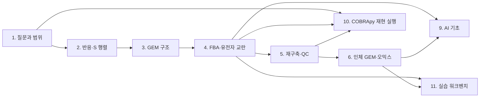

# 학습 경로와 장간 연결 지도

이 책은 대사 모델링을 독립된 기법 목록이 아니라, **표현 → 제약 기반 계산 → 재구축·검증 → 인체 모델·오믹스 맥락화 → AI 기초 → 재현 가능한 실행**이라는 연구 흐름으로 구성한다. 각 장을 읽을 때에는 이전 장에서 무엇을 가정했는지, 다음 장에서 어떤 형태로 다시 쓰이는지를 함께 확인한다.

```mermaid
flowchart LR
  C1[1. 질문과 범위] --> C2[2. 반응·S 행렬]
  C2 --> C3[3. GEM 구조]
  C3 --> C4[4. FBA·유전자 교란]
  C4 --> C5[5. 재구축·QC]
  C5 --> C6[6. 인체 GEM·오믹스]
  C4 --> C9[9. AI 기초]
  C6 --> C9
  C1 --> C10[10. COBRApy 재현 실행]
  C4 --> C10
  C5 --> C10
  C4 --> C11[11. 실습 워크벤치]
  C6 --> C11
```

*그림 P.1. 장간 의존 관계. 화살표는 선행 장을 모두 암기해야 한다는 뜻이 아니라, 이후 장에서 재사용되는 핵심 개념의 흐름을 뜻한다. 저자 작성.*

## 제1부. 공통 언어 만들기: Chapters 1–3

### Chapter 1 → Chapter 2

Chapter 1은 대사물, 반응, 플럭스와 계산 결과의 해석 범위를 정의한다. Chapter 2에서는 이 세 요소를 화학량론 행렬 $$\mathbf S$$와 플럭스 목록 $$\mathbf v$$로 옮긴다.

- **이어지는 질문:** “반응별 생성·소비를 모두 더하면 대사물의 순축적은 어떻게 계산되는가?”
- **Chapter 2에서 다시 쓰는 개념:** 대사물 종, 반응 방향, 플럭스 단위, 의사정상상태.
- **확인 문제:** Chapter 1의 한 반응을 골라 Chapter 2의 부호 규약으로 화학량론 행렬의 한 열을 작성한다.

### Chapter 2 → Chapter 3

Chapter 2의 $$\mathbf S$$는 화학량론적 뼈대다. Chapter 3은 행렬만으로 빠진 생물학적 정체성, 즉 GPR, 구획, 수송, 경계 반응과 바이오매스 반응을 붙인다.

- **이어지는 질문:** “같은 화학물질이 세포질과 미토콘드리아에 있으면 모델에서 어떻게 구별되는가?”
- **주의:** 반응 계수가 맞아도 GPR·구획·경계 반응이 잘못되면 생물학적 해석은 달라질 수 있다.

## 제2부. 계산 가능한 모델 만들기: Chapters 3–5

### Chapter 3 → Chapter 4

Chapter 3이 모델의 구성요소와 경계를 정했다면, Chapter 4는 이를 배지·반응 경계·목적함수로 묶어 FBA를 수행한다. 같은 장에서 유전자 결손이 GPR을 거쳐 반응 경계를 바꾸는 과정과, 교란 뒤 상태를 고르는 FBA·MOMA·ROOM의 서로 다른 가정을 비교한다.

1. 내부 대사물마다 생성과 소비가 맞도록 한다.
2. 교환·수송·유전자 상태와 배지는 반응의 허용 범위에 반영한다.
3. 바이오매스 또는 대사 과제는 계산에서 묻는 질문으로 정한다.
4. 결손 뒤 최적 성장, 기준 상태와 가까운 변화, 크게 바뀌는 반응 수 가운데 필요한 질문을 선택한다.

**점검:** 계산 결과가 예상과 다르면 먼저 솔버가 아니라 모델 경계, 배지, 목적함수와 단위를 확인한다.

### Chapter 4 → Chapter 5

Chapter 4는 주어진 모델에서 조건부 예측을 계산한다. Chapter 5는 **그 모델을 왜 믿을 수 있는가**를 다룬다. 계산 불능, 비현실적 에너지 생성과 잘못된 성장 예측은 재구축·주석·갭 필링·품질관리로 되돌아가 점검할 신호다.

- **연결 개념:** 반응 경계, GPR, 바이오매스 반응, 대사 과제, FVA.
- **검증 원칙:** 갭 필링에 사용한 조건과 성능 평가 조건을 분리한다.

## 제3부. 인체 모델과 오믹스로 맥락을 부여하기: Chapters 5–6

### Chapter 5 → Chapter 6

Chapter 5는 미생물 중심의 재구축·갭 필링·품질관리 원칙을 세운다. Chapter 6은 이 원칙이 인체 GEM의 계보와 버전 관리에 어떻게 이어지는지 살펴본 뒤, RNA-seq 등으로 특정 세포·조직·환경에 맞는 모델을 만드는 과정을 설명한다.

- 인체 모델을 비교할 때에는 릴리스, 식별자와 반응 범위를 함께 기록한다.
- 오믹스는 모델에 **근거 또는 제약 후보**를 주며 플럭스 자체가 아니다.
- 맥락 특이 모델은 대사 과제 보존, 임계값 민감도와 독립 자료 검증을 함께 보고한다.

## 제4부. AI 기초와 재현성: Chapters 9–11

### Chapters 4·6 → Chapter 9

AI는 GEM의 대체물이 아니다. Chapter 9의 1–3절은 지도학습·비지도학습·평가지표를 소개하고, GEM에서 만든 특징으로 유전자 필수성을 예측하는 입문 사례를 다룬다.

- 같은 모델이나 유전자에서 파생된 표본이 학습·평가 세트에 함께 들어가지 않도록 분할 단위를 정한다.
- 정확도 하나만 보지 않고 클래스 불균형, 기준 모델과 외부 검증을 함께 확인한다.
- 모델에서 계산한 레이블은 실험 관찰과 구분한다.

### Chapters 1–6·9 → Chapters 10–11

Chapter 10은 앞 장의 분석을 COBRApy로 재현 가능한 형태로 구현한다. Chapter 11은 여러 도구의 설치·실행·결과 해석을 워크벤치 형태로 연결한다. 두 장 모두 단순한 코드 예제가 아니라 모델 파일, 버전, checksum, 환경, 솔버 상태, 허용오차, 배지, 목적함수와 결과 검산을 함께 남기는 실천 장이다.

## 어느 장에서든 사용하는 공통 점검 순서

계산 결과를 해석하거나 다음 장으로 넘어가기 전에 아래를 확인한다.

1. **모델:** 어떤 SBML/JSON 파일과 릴리스를 사용했는가?
2. **조건:** 배지, 교환 반응, 플럭스 경계와 구획 규약은 무엇인가?
3. **목표:** 목적함수 또는 대사 과제는 무엇인가?
4. **계산:** 솔버 상태와 허용오차는 무엇인가?
5. **검산:** 대사물별 생성·소비 불일치, 경계 위반, 대안 최적해 또는 FVA를 확인했는가?
6. **검증:** 계산에 쓰지 않은 실험·문헌·다른 조건으로 가설을 평가했는가?


이 흐름의 어느 단계가 빠져도, 모델 산출값을 생물학적 사실이나 임상·산업적 결론으로 단정해서는 안 된다.

