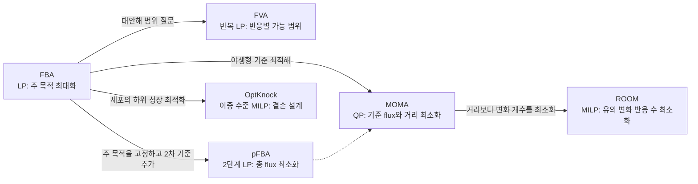

# 필독 논문 가이드: GEM 분야의 질문과 결론

> 방법 이름과 수식을 외우는 대신, 각 논문이 어떤 문제를 풀었고 어떤 데이터로 무엇을 입증했으며 어디까지 일반화할 수 있는지를 읽기 위한 안내서입니다.

## 이 가이드의 읽는 법

각 논문을 다음 다섯 질문으로 정리합니다.

1. 당시 해결하려던 문제는 무엇이었는가?
2. 핵심 수학 또는 알고리즘은 무엇인가?
3. 실제로 어떤 모델·실험 데이터로 검증했는가?
4. 지금 독자가 기억할 결론은 무엇인가?
5. 논문이 보여주지 못한 것은 무엇인가?

## 먼저 보는 30초 비교표

| 방법 | 최적화가 답하는 질문 | 반드시 기억할 논문 결론 | 자주 하는 오해 |
|:---|:---|:---|:---|
| FBA | 주어진 제약에서 목적함수의 최대 가능값은? | 특정 성장 조건에서 exchange와 성장 phenotype을 정량 예측했고, 적응 진화 뒤 계산 optimum으로 접근한 사례가 있다. | 모든 세포가 매 순간 최대 성장하며 한 개의 실제 flux 벡터를 돌려준다고 생각함 |
| FVA | 목적값을 일정 수준 유지할 때 각 반응의 최소·최대는? | 같은 최적 성장률에도 내부 flux가 크게 달라질 수 있다. | 범위를 통계적 신뢰구간으로 보거나, 좁은 범위를 곧바로 필수 반응으로 부름 |
| pFBA | 주 목적을 유지하는 해 중 $$\sum|v_j|$$가 가장 작은 것은? | glycerol·lactate 조건의 특정 활성 반응 집합이 transcript/protein 증거와 높은 일관성을 보였다. | 97.7%를 보편적 flux 예측 정확도로 읽거나 $$\sum|v|$$를 실제 효소 질량으로 부름 |
| MOMA | mutant feasible space에서 기준 flux에 가장 가까운 상태는? | *E. coli* `pykA/pykF` 이중 결손의 일부 실측 flux는 mutant 성장 최대화보다 최소 거리 가정으로 더 잘 설명됐다. | 결손 직후를 직접 측정한 결과로 읽거나, 거리 objective를 성장률로 읽고 선형 MOMA를 원래 QP와 같다고 봄 |
| ROOM | 기준에서 유의하게 바뀌는 반응 수가 가장 적은 상태는? | 5개 결손의 9개 조건별 flux 실험 중 8개에서 ROOM이 기존 방법과 같거나 더 나은 flux 예측을 보였다. | 실제 조절망을 직접 학습한 모델 또는 언제나 MOMA/FBA보다 우월한 방법으로 봄 |
| OptKnock | 어떤 결손이 세포의 성장 최적화와 엔지니어의 생산 목표를 결합하는가? | bilevel 최적화로 알려진 전략을 재현하고 비직관적 결손 후보를 제안하는 설계 틀을 확립했다. | 표준 optimistic 해 하나만 보고 모든 최대성장 대안해에서 생산이 강제된다고 생각함 |

이 여섯 방법은 우열표가 아니라 **서로 다른 생물학적 질문**입니다. 같은 knockout에도 목적함수와 reference state가 다르면 결과가 달라지는 것이 정상입니다.

*방법 계보 도식: FBA를 공통 LP 기반으로 두되, FVA와 pFBA는 대안해를 서로 다른 방식으로 다루고, MOMA와 ROOM은 perturbation 뒤 상태 선택 가설을 바꾸며, OptKnock은 FBA를 하위 세포 문제로 포함해 결손 자체를 설계 변수로 올립니다. 화살표는 논문 간 단일 직계 계보를 단정하는 것이 아니라 계산적 의존성과 핵심 문제의 확장을 요약합니다. MOMA의 기준 flux는 FBA/pFBA 해뿐 아니라 실측 flux일 수도 있습니다.*

## 1. FBA가 “가능한 능력”을 계산하는 도구가 되기까지

### 1.1 Savinell & Palsson (1992): 선형최적화 형식의 출발

**논문**: Savinell, J. M., & Palsson, B. O. [Network analysis of intermediary metabolism using linear optimization. I. Development of mathematical formalism](https://doi.org/10.1016/S0022-5193(05)80161-4). *Journal of Theoretical Biology*, 154, 421–454.

- **질문**: 모든 효소 동역학을 몰라도 화학량론·영양분 제약만으로 성장 능력과 제한 요인을 계산할 수 있는가?
- **방법**: $$\max\mathbf c^\mathsf T\mathbf v$$, $$\mathbf S\mathbf v=0$$, flux bounds를 갖는 LP와 쌍대 변수 해석을 제시했습니다.
- **결과**: 작은 hybridoma 대사망에서 최적 nutrient ratio와 제한 대사물·반응을 계산했습니다.
- **기억할 결론**: FBA는 실제 세포 상태를 자동 복원하는 것이 아니라 **명시한 목적과 제약 아래 가능한 최적 능력**을 계산합니다.
- **한계**: 현대 genome-scale 모델 이전의 작은 네트워크이며, 목적함수와 uptake bound에 결론이 의존합니다.

### 1.2 Varma & Palsson (1994): 성장·섭취·분비의 정량 검증

**논문**: Varma, A., & Palsson, B. O. [Stoichiometric flux balance models quantitatively predict growth and metabolic by-product secretion in wild-type *Escherichia coli* W3110](https://doi.org/10.1128/AEM.60.10.3724-3731.1994). *Applied and Environmental Microbiology*, 60, 3724–3731.

- **질문**: 독립적으로 측정한 uptake와 maintenance 조건을 넣으면 flux-balance 모델이 성장·부산물 분비를 정량 예측하는가?
- **방법**: 산소·포도당 이용률과 GAM/NGAM을 독립적으로 측정해 모델 제약으로 사용했습니다.
- **결과**: chemostat의 glucose/oxygen uptake와 acetate secretion을 재현하고 batch·fed-batch 거동을 설명했습니다.
- **기억할 결론**: FBA의 예측력은 “parameter-free”라는 구호보다 **독립적으로 측정해 지정한 경계·유지 에너지 제약**에서 나옵니다.
- **한계**: 특정 균주·조건에서 측정한 파라미터를 사용한 검증이며 모든 환경의 보편적 증거가 아닙니다.

### 1.3 Edwards, Ibarra & Palsson (2001): genome-scale 전향적 검증

**논문**: Edwards, J. S., Ibarra, R. U., & Palsson, B. O. [In silico predictions of *Escherichia coli* metabolic capabilities are consistent with experimental data](https://doi.org/10.1038/84379). *Nature Biotechnology*, 19, 125–130.

- **질문**: genome-scale 모델이 먼저 예측한 phenotype phase plane을 새 배양 실험이 확인하는가?
- **방법**: 탄소원·산소 uptake를 두 축으로 phase plane을 계산하고 acetate·succinate 조건을 실험했습니다.
- **결과**: 외부 exchange flux와 성장률의 piecewise-linear 관계가 실험과 잘 맞았습니다.
- **기억할 결론**: 특정 최소배지·지수성장 조건에서는 최대 성장 가정이 교환 flux와 성장률을 유용하게 예측합니다.
- **한계**: 주된 검증은 intracellular flux 전체가 아니라 외부 교환 flux였습니다.

### 1.4 Ibarra, Edwards & Palsson (2002): 적응 진화와 최적점

**논문**: Ibarra, R. U., Edwards, J. S., & Palsson, B. O. [*Escherichia coli* K-12 undergoes adaptive evolution to achieve in silico predicted optimal growth](https://doi.org/10.1038/nature01149). *Nature*, 420, 186–189.

- **질문**: 초기에는 계산 최적값보다 느린 세포가 성장 선택압 아래 FBA optimum으로 진화하는가?
- **결과**: glycerol 조건에서 약 700세대의 적응 진화 후 성장률이 계산된 최적값으로 수렴했습니다.
- **기억할 결론**: FBA optimum은 모든 순간의 실제 상태보다 **특정 선택압 아래 도달 가능한 진화적 종착점**으로 해석할 수 있습니다.
- **한계**: 단일 균주·탄소원 사례로, 모든 세포 상태가 성장률을 최대화한다는 증거가 아닙니다.

## 2. 하나의 FBA 해를 과신하지 않기

### 2.1 Mahadevan & Schilling (2003): FVA

**논문**: Mahadevan, R., & Schilling, C. H. [The effects of alternate optimal solutions in constraint-based genome-scale metabolic models](https://doi.org/10.1016/j.ymben.2003.09.002). *Metabolic Engineering*, 5, 264–276.

- **질문**: 같은 최적 성장률을 내는 여러 flux 해가 예측 해석과 mutant 분석에 얼마나 영향을 주는가?
- **방법**:

$$
v_j^{min}=\min v_j,\qquad v_j^{max}=\max v_j
$$

$$
\text{s.t. }\mathbf S\mathbf v=0,\;\mathbf l\le\mathbf v\le\mathbf u,\;
\mathbf c^\mathsf T\mathbf v\ge fZ^*
$$

- **결과**: flux variability가 탄소원·환경·네트워크에 크게 의존하고, reference optimum의 variability가 크면 QP mutant 예측도 달라질 수 있음을 보였습니다.
- **기억할 결론**: **최적 목적값이 유일해도 내부 flux 벡터는 유일하지 않을 수 있습니다.**
- **한계**: 반응별 최소·최대는 서로 다른 해에서 얻은 주변 범위입니다. 한 flux 벡터가 모든 끝점을 동시에 달성한다는 뜻이 아니며 통계적 신뢰구간도 아닙니다.

### 2.2 Lewis et al. (2010): pFBA

**논문**: Lewis, N. E. et al. [Omic data from evolved *E. coli* are consistent with computed optimal growth from genome-scale models](https://doi.org/10.1038/msb.2010.47). *Molecular Systems Biology*, 6, 390.

- **질문**: 최적 성장을 유지하면서 총 flux를 최소화한 경로 사용이 transcriptome/proteome과 적응 진화에 부합하는가?
- **방법**: 성장 최적값을 고정한 뒤 원 논문에서는 **gene-associated reaction flux**의 합을 최소화하는 lexicographic optimization과 반응 효율성 분류를 사용했습니다. 현대의 일반적 pFBA 정의와 COBRApy 구현은 보통 모델의 전체 반응 flux에 $$\min\sum_j|v_j|$$를 적용하므로, 원 논문 구현과 소프트웨어 구현의 범위를 구분해야 합니다.
- **결과**: glycerol·lactate 조건에서 pFBA-optima에 속한 **non-essential active gene-associated reactions의 97.7%**가 WT와 적응 균주에서 모은 transcript·protein 증거의 합집합으로 지지됐습니다. 별도로 700–1,000세대 적응 과정에서는 pFBA-optima 유전자가 유의하게 상향되고, 조건상 no-flux 유전자가 대체로 억제됐습니다.
- **기억할 결론**: pFBA는 같은 주 목적값을 갖는 해 중 **효소 부담의 거친 대리량인 총 flux가 작은 대표 해**를 고르는 유용한 2차 기준입니다.
- **한계**: $$\sum|v|$$는 실제 효소 질량이 아니며 $$k_{cat}$$·효소 크기·포화도·조절을 무시합니다. pFBA도 비유일할 수 있고, 이 논문은 모든 조건에서 FBA보다 pFBA가 우월하다는 정확도 대결이 아닙니다.


COBRApy 0.30.0 `textbook` 모델에서는 solver가 반환한 표준 FBA 해와 pFBA 해의 $$\sum|v|$$가 모두 약 518.42로 같을 수 있습니다. pFBA는 첫 FBA 해보다 “항상 15–20% 작다”는 방법이 아니라, 가능한 최적해 중 최소값을 정의하는 방법입니다.


## 3. 유전자 교란 후 세포는 어디로 가는가

### 3.1 Segrè, Vitkup & Church (2002): MOMA

**논문**: Segrè, D., Vitkup, D., & Church, G. M. [Analysis of optimality in natural and perturbed metabolic networks](https://doi.org/10.1073/pnas.232349399). *PNAS*, 99, 15112–15117.

- **질문**: 진화적으로 최적화되지 않은 knockout의 상태를 mutant 최대 성장보다 wild-type과의 근접성으로 더 잘 설명할 수 있는가?
- **방법**: $$\min_{\mathbf v\in\Phi_{mut}}\lVert\mathbf v-\mathbf w\rVert_2^2$$인 QP로 wild-type flux를 mutant feasible space에 투영했습니다.
- **결과**: PB25 `pykA/pykF` 이중 결손에서 MOMA의 absolute intracellular-flux 상관은 두 carbon-limited 조건에서 FBA보다 높았고, knockout–wild-type 상대 flux-change 상관은 측정한 세 조건 모두에서 FBA보다 높았습니다. 또한 47개 중심대사 결손 중 7개에서는 FBA와 MOMA의 예측 성장수율 차이가 50%를 넘었습니다.
- **기억할 결론**: 장기 진화적 최적화가 보장되지 않은 knockout을 곧바로 mutant 성장 최적점에 놓는 가정은 지나치게 낙관적일 수 있습니다.
- **한계**: 원 논문은 결손 직후를 시간분해 측정하지 않았습니다. MOMA를 “초기 반응의 정답”이 아니라 별도 자료로 검증할 상태 선택 가설로 다뤄야 하며, 결과는 reference $$\mathbf w$$와 동일 가중 Euclidean metric에도 의존합니다.

### 3.2 Shlomi, Berkman & Ruppin (2005): ROOM

**논문**: Shlomi, T., Berkman, O., & Ruppin, E. [Regulatory on/off minimization of metabolic flux changes after genetic perturbations](https://doi.org/10.1073/pnas.0406346102). *PNAS*, 102, 7695–7700.

- **질문**: 전체 flux 거리 대신 유의하게 바뀌는 반응 수를 최소화하면 적응한 mutant를 더 잘 설명하는가?
- **방법**: wild-type 허용구간을 벗어났는지 나타내는 이진 변수로 $$\min\sum_i y_i$$인 MILP를 풉니다.
- **결과**: 5개 결손 유전자를 여러 배지에서 측정한 9개 knockout–condition flux 실험 중 8개에서 ROOM의 **flux 예측**이 FBA/MOMA와 같거나 더 나았습니다. 이 benchmark의 평균 significant changes는 ROOM 12, FBA 119, MOMA 317이었고 최종 성장률 상대오차는 각각 14%, 15%, 31%였습니다. 별도의 6개 결손 적응진화 자료에서는 적응 전 성장률에 MOMA($$r=0.834$$), 적응 후 성장률에 ROOM($$r=0.727$$)과 FBA($$r=0.724$$)가 더 높은 상관을 보였습니다(MOMA $$r=0.658$$).
- **기억할 결론**: 실제 조절망을 모두 모델링하지 않아도 “소수의 큰 조정”이라는 가정이 유용할 수 있습니다.
- **한계**: ROOM은 전사조절망을 직접 포함하지 않고 threshold와 reference flux, MILP 대안해에 의존합니다. 보편적인 시간 시계를 제시한 논문은 아닙니다.

자세한 수식과 올바른 COBRApy 결과 해석은 [유전자 교란 보충](supplements/perturbation-analysis.md)을 참고하십시오.

## 4. 생산을 성장에 결합하기

### 4.1 Burgard, Pharkya & Maranas (2003): OptKnock

**논문**: Burgard, A. P., Pharkya, P., & Maranas, C. D. [OptKnock: A bilevel programming framework for identifying gene knockout strategies for microbial strain optimization](https://doi.org/10.1002/bit.10803). *Biotechnology and Bioengineering*, 84, 647–657.

- **질문**: 공학자의 생산 목표를 세포의 성장 목표에 결손 설계로 강제 결합할 수 있는가?
- **방법**:

$$
\max_{\mathbf y}v_{product}
\quad\text{s.t.}\quad
\mathbf v\in\arg\max_{\mathbf v}v_{biomass}
$$

상위 문제는 knockout, 하위 문제는 세포의 최적 성장을 선택합니다. 하위 LP의 primal–dual 조건과 strong duality로 하나의 MILP로 변환합니다.

- **결과**: succinate, lactate, 1,3-propanediol 전략이 기존 문헌 mutant와 부합했고 비직관적 결손 조합도 제안했습니다.
- **기억할 결론**: 생산과 성장을 결합할 결손 설계 틀을 확립하고 문헌 균주와 부합하는 전략 및 비직관적 후보를 제안했습니다. production-envelope 하한까지 양수인 설계라면 성장 선택압을 생산성 유지에 이용할 수 있습니다.
- **한계**: 새 wet-lab 검증은 하지 않았고, 하위 성장 최적해가 여러 개면 낮은 생산 대안해가 남는 optimistic bilevel 문제가 있습니다. production envelope 하한 또는 RobustKnock류 검증이 필요합니다.

### 4.2 후속 균주 설계 필독 논문

| 방법 | 대표 논문 | 핵심 확장 |
|:---|:---|:---|
| OptGene | Patil et al. (2005), [DOI 10.1186/1471-2105-6-308](https://doi.org/10.1186/1471-2105-6-308) | 유전 알고리즘으로 비선형 목적과 큰 조합 공간 탐색 |
| OptForce | Ranganathan et al. (2010), [DOI 10.1371/journal.pcbi.1000744](https://doi.org/10.1371/journal.pcbi.1000744) | FVA 기반 MUST/FORCE flux 변화 집합 |
| FSEOF | Choi et al. (2010), [DOI 10.1128/AEM.00115-10](https://doi.org/10.1128/AEM.00115-10) | 목표 산물 flux를 단계적으로 강제해 증폭 후보 탐색 |

## 5. 재구축을 논문 부록에서 소프트웨어 자산으로

### 5.1 Thiele & Palsson (2010): 96-step protocol

**논문**: Thiele, I., & Palsson, B. Ø. [A protocol for generating a high-quality genome-scale metabolic reconstruction](https://doi.org/10.1038/nprot.2009.203). *Nature Protocols*, 5, 93–121.

- **질문**: genome annotation에서 시작해 추적 가능한 고품질 reconstruction과 simulation model을 어떻게 만드는가?
- **네 단계**:
  - Stage 1, Steps 1–5: draft reconstruction
  - Stage 2, Steps 6–37: manual refinement
  - Stage 3, Steps 38–42: mathematical model로 변환
  - Stage 4, Steps 43–96: evaluation/debugging과 결과 조립
- **confidence 0–4**: 4 직접 biochemical evidence, 3 genetic evidence, 2 physiological/sequence evidence, 1 modeling 가설, 0 미평가입니다.
- **기억할 결론**: 증거를 정리한 **reconstruction**과 bounds·objective가 붙은 **model**을 구분해야 합니다.
- **한계**: 절차 준수가 phenotype 정확도를 자동 보장하지 않으며 당시 도구 일부는 낡았습니다. 증거 추적·질량수지·GPR·negative phenotype 검증 원칙은 여전히 유효합니다.

### 5.2 Lieven et al. (2020): MEMOTE

**논문**: Lieven, C. et al. [MEMOTE for standardized genome-scale metabolic model testing](https://doi.org/10.1038/s41587-020-0446-y). *Nature Biotechnology*, 38, 272–276.

- **질문**: GEM의 형식·화학량론·주석 품질을 자동 테스트와 CI로 관리할 수 있는가?
- **방법**: SBML3FBC, annotation, biomass, consistency 등 테스트와 snapshot/diff/history report를 Git workflow에 연결했습니다.
- **결과**: 10,780개 모델을 분석했으며 수동 reconstruction 집합에서도 약 70%가 적어도 하나의 stoichiometrically unbalanced metabolite를 갖고 전체 반응 약 15%에 GPR이 없었습니다.
- **기억할 결론**: GEM은 정적 supplementary file이 아니라 **version control과 regression test로 관리할 소프트웨어 자산**입니다.
- **한계**: 높은 MEMOTE 점수가 phenotype 정확도를 보장하지 않으며 total score는 버전·설정에 의존합니다. 고정 25/25/35/15 공식이나 보편적 합격 cutoff는 없습니다.

## 6. 범용 GEM에서 맥락 특이 모델로

### 6.1 Becker & Palsson (2008): GIMME

**논문**: Becker, S. A., & Palsson, B. O. [Context-specific metabolic networks are consistent with experiments](https://doi.org/10.1371/journal.pcbi.1000082). *PLoS Computational Biology*, 4, e1000082.

- **핵심**: 필수 대사 기능을 최소 수준 이상 유지하면서 저발현 반응 flux의 가중 불일치를 최소화합니다.
- **결론**: 저발현 반응을 무조건 제거하지 않고 기능에 필요한 최소 예외를 허용하는 원리를 확립했습니다.
- **한계**: required metabolic functionality와 expression cutoff가 필요하며 90% 성장 같은 값은 보편 기본값이 아닙니다.

### 6.2 Shlomi et al. (2008) / Zur et al. (2010): iMAT

**방법 원논문**: Shlomi, T. et al. [Network-based prediction of human tissue-specific metabolism](https://doi.org/10.1038/nbt.1487). *Nature Biotechnology*, 26, 1003–1010.

**도구 논문**: Zur, H., Ruppin, E., & Shlomi, T. [iMAT: an integrative metabolic analysis tool](https://doi.org/10.1093/bioinformatics/btq602). *Bioinformatics*, 26, 3140–3142.

- **핵심**: high-expression 반응의 활성과 low-expression 반응의 비활성 수를 MILP로 함께 최대화합니다.
- **결과**: 10개 인체 조직의 tissue-specific activity와 질병 유전자·biofluid exchange의 조직 특이성을 예측했습니다.
- **기억할 결론**: 명시적 biomass 목적 없이 expression–flux 상태 일치를 최적화할 수 있습니다.
- **한계**: metabolic task를 자동 보장하지 않고 threshold·activity epsilon·대안 최적해에 민감합니다.

### 6.3 Agren et al. (2012): INIT

**논문**: Agren, R. et al. [Reconstruction of genome-scale active metabolic networks for 69 human cell types and 16 cancer types using INIT](https://doi.org/10.1371/journal.pcbi.1002518). *PLoS Computational Biology*, 8, e1002518.

- **핵심**: protein/transcript/metabolite evidence에 양·음 weight를 주고 연결된 active network를 추출합니다. 관찰 대사물의 순생산을 허용하기 위해 엄격한 $$S v=0$$를 일부 완화합니다.
- **결과**: 69 정상 cell type과 16 cancer type network를 만들고 cancer-enriched reporter metabolite/reaction을 제시했습니다.
- **한계**: weight는 경험적이며 추출 모델이 연구자가 원하는 모든 기능을 수행하는지는 별도 검증이 필요합니다.

### 6.4 Agren et al. (2014): tINIT

**논문**: Agren, R. et al. [Identification of anticancer drugs for hepatocellular carcinoma through personalized genome-scale metabolic modeling](https://doi.org/10.1002/msb.145122). *Molecular Systems Biology*, 10, 721.

- **핵심 절차**: task-essential reaction을 먼저 찾고 이를 강제한 INIT을 푼 뒤, 56개 공통 task를 순차 검사해 실패한 task를 gap-fill합니다. 단순히 “task 반응 하나 이상 활성”으로 표현할 수 없습니다.
- **결과**: 6명 HCC와 83개 정상 cell-type 모델에서 101개 공통 antimetabolite와 46개 환자 특이 후보를 예측했고, perhexiline 효과를 HepG2에서 실험했습니다.
- **기억할 결론**: expression 일치뿐 아니라 **세포가 수행해야 할 기능**을 reconstruction에 명시적으로 넣었습니다.
- **한계**: task 정의·순서·gap-filling과 결측 데이터 처리에 의존하며 한 cell line 검증은 임상 효능 증명이 아닙니다.

### 6.5 Vlassis, Pacheco & Sauter (2014): FASTCORE

**논문**: Vlassis, N., Pacheco, M. P., & Sauter, T. [Fast reconstruction of compact context-specific metabolic network models](https://doi.org/10.1371/journal.pcbi.1003424). *PLoS Computational Biology*, 10, e1003424.

- **핵심**: high-confidence core를 모두 포함하면서 적은 non-core reaction으로 연결하는 flux-consistent 모델을 반복 LP로 빠르게 만듭니다.
- **결과**: Recon1 기반 liver 모델을 약 1초에 구축해 MBA보다 훨씬 빠르고 compact한 결과를 얻었습니다.
- **기억할 결론**: “core evidence를 먼저 정하고 최소 보조망으로 연결한다”는 재사용성 높은 패턴입니다.
- **한계**: core를 어떻게 선정할지는 알려주지 않으며 잘못된 core도 보존합니다. compactness가 정확성과 같지는 않습니다.

## 7. 질병 대사를 죽이지 않고 되돌리기

### 7.1 Yizhak et al. (2013): MTA

**논문**: Yizhak, K. et al. [A computational study of the Warburg effect identifies metabolic targets inhibiting cancer migration](https://doi.org/10.1038/ncomms3632). *Nature Communications*, 4, 2632.

- **질문**: 질병 세포를 단순히 사멸시키는 대신 질병 flux 상태를 건강한 방향으로 되돌릴 대사 개입을 찾을 수 있는가?
- **핵심**: source와 target 발현 상태에서 달라져야 할 반응을 정의하고, 후보 교란이 flux 방향을 target 쪽으로 얼마나 이동시키는지 MIQP 기반 transformation score로 평가합니다.
- **결과**: Warburg phenotype과 암 이동성을 줄일 대사 표적을 계산·실험적으로 조사했습니다.
- **기억할 결론**: GEM은 forward knockout prediction뿐 아니라 원하는 상태로의 **inverse design**에도 사용할 수 있습니다.
- **한계**: source/target 정의, 발현–flux 통합, 목적함수와 모델 품질에 의존하며 임상 표적을 자동 확정하지 않습니다.

## 8. 인체 GEM 역사에서 읽을 핵심 논문

| 이정표 | 대표 논문 | 반드시 기억할 변화 |
|:---|:---|:---|
| Recon1 | Duarte et al. 2007, [DOI 10.1073/pnas.0610772104](https://doi.org/10.1073/pnas.0610772104) | 문헌·유전체를 계산 가능한 human reconstruction으로 통합 |
| Recon2 | Thiele et al. 2013, [DOI 10.1038/nbt.2488](https://doi.org/10.1038/nbt.2488) | 국제 community consensus와 기능·질병 검증 확장 |
| HMR2 | Mardinoglu et al. 2014, [DOI 10.1038/ncomms4083](https://doi.org/10.1038/ncomms4083) | proteomics 기반 조직 모델을 위한 별도 HMR 계보 확장; 2026년 Human2와 이름이 비슷하지만 다른 모델 |
| Recon2.2 | Swainston et al. 2016, [DOI 10.1007/s11306-016-1051-4](https://doi.org/10.1007/s11306-016-1051-4) | 대사산물 식별자·GPR·에너지 대사와 배포 형식 정비 |
| Recon2M | Ryu, Kim & Lee 2017, [DOI 10.1073/pnas.1713050114](https://doi.org/10.1073/pnas.1713050114) | transcript isoform을 포함한 11,415개 GeTPRA와 개인화 모델 자원 |
| iHsa | Blais et al. 2017, [DOI 10.1038/ncomms14250](https://doi.org/10.1038/ncomms14250) | transcript–protein–reaction 층을 정교화한 독립 human reconstruction |
| Recon3D | Brunk et al. 2018, [DOI 10.1038/nbt.4072](https://doi.org/10.1038/nbt.4072) | 단백질 3D 구조·변이·약물 정보를 대사망에 연결 |
| Human1 | Robinson et al. 2020, [DOI 10.1126/scisignal.aaz1482](https://doi.org/10.1126/scisignal.aaz1482) | Recon/HMR 계보 통합과 Git 기반 living model |
| Human2 | Luo et al. 2026, [DOI 10.1073/pnas.2516511123](https://doi.org/10.1073/pnas.2516511123) | LLM 보조 선별과 전문가 확인으로 GPR을 점검하고, 별도의 전문가·커뮤니티 큐레이션으로 반응을 정비해 Human-GEM v2를 공개 |

이 계보는 한 줄이 아닙니다. Recon2와 HMR2가 갈라져 발전했고, Human1은 HMR2·iHsa·Recon3D를 병합했습니다. Human2의 범용 GEM은 정상상태 기반 지식베이스이며, 연령·성별 기관 모델이나 whole-body model은 이를 바탕으로 구축한 **파생 생태계**입니다. 상세한 분기형 계보와 모델 수치의 counting convention은 [Chapter 5](chapter-5..md)를 참고하십시오.

## 논문을 읽을 때 공통으로 확인할 것

1. 사용한 모델 이름뿐 아니라 정확한 version/tag를 기록했는가?
2. 배지, objective, uptake bound, GAM/NGAM이 명시됐는가?
3. solver와 tolerance, 대안 최적해를 다뤘는가?
4. 결과 지표가 최적화 objective인지 실제 성장 flux인지 구분했는가?
5. 같은 데이터로 모델을 맞추고 평가하지 않았는가?
6. 계산 검증, 독립 실험 검증, 임상 검증을 구분했는가?
7. 한 조건의 수치를 보편적 기준처럼 일반화하지 않았는가?
