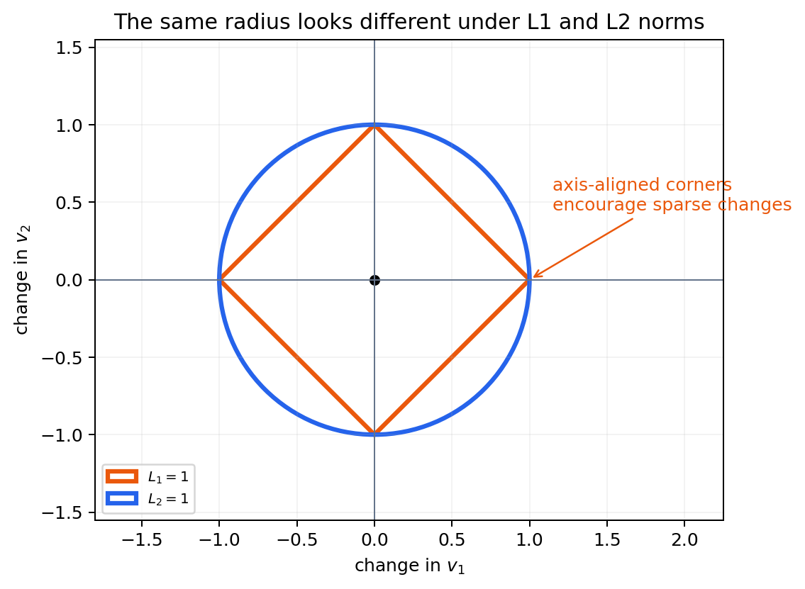

# 준비 학습 B. GEM을 읽기 위한 선형대수

> 스칼라·벡터·행렬에서 출발해 내적, 투영, 행렬곱, 연립방정식, 선형결합을 익히고, 이를 화학량론 행렬 $$\mathbf S$$·정상상태식 $$\mathbf S\mathbf v=\mathbf0$$·MOMA의 거리 최소화로 연결합니다.

## 1. 표기법부터 맞추기

| 대상 | 전형적 표기 | 예 | GEM에서의 예 |
|:---|:---|:---|:---|
| 스칼라(scalar) | 소문자 이탤릭 $$a$$ | 성장률 $$\mu$$ | 한 반응의 flux $$v_j$$ |
| 벡터(vector) | 굵은 소문자 $$\mathbf v$$ | $$(v_1,v_2,v_3)^\mathsf T$$ | 모든 반응의 flux |
| 행렬(matrix) | 굵은 대문자 $$\mathbf S$$ | $$m\times n$$ 배열 | 화학량론 행렬 |
| 텐서(tensor) | 굵은 대문자 또는 calligraphic 표기 | 샘플×유전자×시간 | 여러 조건의 flux 묶음 |

$$x_i$$는 벡터 $$\mathbf x$$의 $$i$$번째 원소, $$S_{ij}$$는 행렬 $$\mathbf S$$의 $$i$$행 $$j$$열 원소입니다. GEM에서는 $$i$$가 대사물, $$j$$가 반응을 가리킵니다.

**전치(transpose)** $$\mathbf x^\mathsf T$$는 행과 열을 바꿉니다. 열벡터 $$\mathbf x\in\mathbb R^{n\times1}$$의 전치는 행벡터 $$\mathbf x^\mathsf T\in\mathbb R^{1\times n}$$입니다.

## 2. 벡터와 벡터 공간

벡터는 크기와 방향을 가진 대상이며, 계산에서는 순서가 있는 수의 배열로 표현합니다. 같은 차원의 벡터는 성분별로 더하고 뺍니다.

$$
\begin{bmatrix}1\\2\end{bmatrix}+
\begin{bmatrix}3\\-1\end{bmatrix}=
\begin{bmatrix}4\\1\end{bmatrix}
$$

스칼라 $$c$$를 곱하면 길이는 $$|c|$$배가 되고 $$c<0$$이면 방향도 뒤집힙니다.

$$
c\mathbf x=
c\begin{bmatrix}x_1\\x_2\\\vdots\\x_n\end{bmatrix}
=\begin{bmatrix}cx_1\\cx_2\\\vdots\\cx_n\end{bmatrix}
$$

벡터 공간은 벡터 덧셈과 스칼라곱에 대해 닫혀 있는 집합입니다. flux 벡터의 가능한 조합을 기하학적으로 다룰 수 있는 이유가 바로 이 선형 구조입니다.

## 3. 길이, 거리, 각도와 직교

### 3.1 노름(norm)

벡터 크기를 수로 나타내는 함수를 노름이라고 합니다.

$$
\lVert\mathbf x\rVert_1=\sum_i|x_i|,
\qquad
\lVert\mathbf x\rVert_2=\sqrt{\sum_i x_i^2}
$$

- $$L_1$$ 노름은 총 절댓값 변화량입니다. pFBA와 linear MOMA에서 사용합니다.
- $$L_2$$ 노름은 원점에서의 유클리드 거리입니다. MOMA가 wild type과 mutant flux 사이 거리를 잴 때 사용합니다.

두 벡터의 유클리드 거리는 $$d(\mathbf x,\mathbf y)=\lVert\mathbf x-\mathbf y\rVert_2$$입니다.



*그림 B.1: 같은 “거리 1”도 노름에 따라 모양이 다릅니다. $$L_2$$ 등고선은 모든 방향을 부드럽게 다루는 원이지만, $$L_1$$ 등고선은 좌표축 위에 꼭짓점이 있어 최적해가 일부 좌표의 변화만 남기는 경향을 만듭니다. 이것이 원형 MOMA와 linear MOMA가 서로 다른 해를 낼 수 있는 기하학적 이유입니다. 이 그림은 `scripts/generate_optimization_figures.py`로 재생성할 수 있습니다.*

### 3.2 내적(dot product)과 각도

$$
\mathbf x^\mathsf T\mathbf y=\sum_i x_i y_i
=\lVert\mathbf x\rVert_2\lVert\mathbf y\rVert_2\cos\theta
$$

따라서 두 벡터의 각도는 다음과 같이 구합니다.

$$
\cos\theta=\frac{\mathbf x^\mathsf T\mathbf y}
{\lVert\mathbf x\rVert_2\lVert\mathbf y\rVert_2}
$$

내적이 0이면 두 벡터는 **직교(orthogonal)**합니다. 데이터 분석에서는 cosine similarity가 방향의 유사도를, Euclidean distance가 절대 위치의 차이를 측정합니다.

### 3.3 투영(projection)

$$\mathbf x$$를 $$\mathbf y$$ 방향으로 투영한 벡터는 다음과 같습니다.

$$
\operatorname{proj}_{\mathbf y}(\mathbf x)
=\frac{\mathbf x^\mathsf T\mathbf y}{\mathbf y^\mathsf T\mathbf y}\mathbf y
$$

[MOMA](perturbation-analysis.md)는 wild-type flux 점을 mutant의 feasible space에서 가장 가까운 점으로 옮깁니다. 기하학적으로는 고차원 볼록집합 위의 투영 문제입니다.

## 4. 행렬과 기본 연산

$$m\times n$$ 행렬은 $$m$$개의 행과 $$n$$개의 열을 갖습니다.

$$
\mathbf A=
\begin{bmatrix}
a_{11}&a_{12}&\cdots&a_{1n}\\
a_{21}&a_{22}&\cdots&a_{2n}\\
\vdots&\vdots&\ddots&\vdots\\
a_{m1}&a_{m2}&\cdots&a_{mn}
\end{bmatrix}
$$

### 4.1 자주 보는 행렬

- **정방행렬(square matrix)**: 행과 열 수가 같습니다.
- **대칭행렬(symmetric matrix)**: $$\mathbf A=\mathbf A^\mathsf T$$입니다.
- **단위행렬(identity matrix)**: 대각 원소가 1, 나머지가 0인 $$\mathbf I$$이며 $$\mathbf I\mathbf x=\mathbf x$$입니다.
- **희소행렬(sparse matrix)**: 대부분의 원소가 0입니다. GEM의 $$\mathbf S$$가 대표적입니다.

행렬의 덧셈은 같은 위치의 원소끼리, 스칼라곱은 모든 원소에 적용합니다. 행렬곱 $$\mathbf A\mathbf B$$가 가능하려면 $$\mathbf A$$의 열 수와 $$\mathbf B$$의 행 수가 같아야 합니다.

$$
(\mathbf A\mathbf B)_{ij}=\sum_k A_{ik}B_{kj}
$$

행렬곱에는 다음 성질이 중요합니다.

$$
\mathbf A(\mathbf B\mathbf C)=(\mathbf A\mathbf B)\mathbf C,
\qquad
\mathbf A(\mathbf B+\mathbf C)=\mathbf A\mathbf B+\mathbf A\mathbf C
$$

그러나 일반적으로 $$\mathbf A\mathbf B\ne\mathbf B\mathbf A$$입니다. 또한 $$(\mathbf A\mathbf B)^\mathsf T=\mathbf B^\mathsf T\mathbf A^\mathsf T$$처럼 전치하면 순서가 뒤집힙니다.

## 5. 연립일차방정식과 행렬 표현

다음 두 식을 생각해 봅시다.

$$
\begin{aligned}
2x+y&=5\\
x-y&=1
\end{aligned}
$$

이를 한 줄로 쓰면 다음과 같습니다.

$$
\underbrace{\begin{bmatrix}2&1\\1&-1\end{bmatrix}}_{\mathbf A}
\underbrace{\begin{bmatrix}x\\y\end{bmatrix}}_{\mathbf x}
=
\underbrace{\begin{bmatrix}5\\1\end{bmatrix}}_{\mathbf b}
$$

즉 $$\mathbf A\mathbf x=\mathbf b$$입니다. 역행렬이 존재하면 $$\mathbf x=\mathbf A^{-1}\mathbf b$$라고 쓸 수 있지만, 실제 수치계산에서는 역행렬을 직접 구하기보다 안정적인 선형해법을 사용합니다.

GEM의 정상상태식 $$\mathbf S\mathbf v=\mathbf0$$은 우변이 0인 **동차 연립방정식**입니다. 반응 수가 독립 방정식 수보다 많으므로 보통 해가 하나로 정해지지 않습니다. FBA는 bounds와 목적함수를 더해 이 무한한 해 공간에서 한 점을 찾습니다.

## 6. 선형결합, span, rank와 null space

벡터 $$\mathbf a_1,\ldots,\mathbf a_k$$의 선형결합은 다음과 같습니다.

$$
c_1\mathbf a_1+c_2\mathbf a_2+\cdots+c_k\mathbf a_k
$$

가능한 모든 선형결합의 집합을 span이라 합니다. 행렬의 열공간은 모든 열벡터의 span입니다.

**rank**는 행렬에서 서로 독립인 행 또는 열의 수입니다. $$\mathbf S\in\mathbb R^{m\times n}$$의 rank가 $$r$$이면 정상상태 flux 해 공간인 오른쪽 null space의 차원은 rank-nullity 정리에 따라 다음과 같습니다.

$$
\dim\ker(\mathbf S)=n-r
$$

따라서 단순히 $$n-m$$을 자유도라고 하면 안 됩니다. 질량수지 방정식끼리 선형 종속일 수 있어 일반적으로 $$r\le m$$이기 때문입니다.

여기서 $$\ker(\mathbf S)=\{\mathbf v:\mathbf S\mathbf v=\mathbf0\}$$ 자체는 덧셈과 스칼라곱에 닫힌 **벡터 공간**입니다. 그러나 실제 flux는 bounds도 만족해야 하므로 feasible set은

$$
\mathcal F=\ker(\mathbf S)\cap\{\mathbf v:\mathbf l\le\mathbf v\le\mathbf u\}
$$

입니다. 이 교집합은 일반적으로 벡터 공간이 아니라 **볼록 다면체(convex polyhedron)**이며, 모든 방향이 유한하게 제한되면 **polytope**입니다. 따라서 null space의 차원은 정상상태 자유도를 설명하지만, bounds를 적용한 뒤 실제로 허용되는 모양이나 최적 flux의 유일성을 곧바로 결정하지는 않습니다.

왼쪽 null space $$\ker(\mathbf S^\mathsf T)$$는 네트워크의 보존량(conserved moiety)을 드러냅니다.

$$
\dim\ker(\mathbf S^\mathsf T)=m-r
$$

이 개념은 [Chapter 2](../chapter-2..md)에서 실제 화학량론 행렬과 함께 자세히 다룹니다.

## 7. 공분산 행렬과 텐서

표본이 행, 특징이 열인 데이터 행렬 $$\mathbf X$$를 평균 중심화했다면 공분산 행렬은 다음과 같습니다.

$$
\mathbf C=\frac{1}{N-1}\mathbf X^\mathsf T\mathbf X
$$

$$C_{ij}$$는 특징 $$i$$와 $$j$$가 함께 변하는 정도이며 $$\mathbf C$$는 대칭행렬입니다. 여러 유전자 발현 또는 여러 조건의 flux를 비교할 때 PCA와 상관 분석의 출발점이 됩니다.

텐서는 스칼라·벡터·행렬을 더 높은 차원으로 일반화한 배열입니다.

| 차수 | 예 |
|:---:|:---|
| 0 | 하나의 성장률 |
| 1 | 한 조건의 flux 벡터 |
| 2 | 조건×반응 flux 행렬 |
| 3 | 환자×반응×시간 flux 텐서 |

머신러닝에서는 한 샘플을 특징 벡터로, 전체 데이터셋을 행렬로, 이미지나 시계열 묶음을 고차원 텐서로 표현합니다.

## 8. 장난감 대사 네트워크로 한 번에 연결하기

두 내부 대사물 $$A,B$$와 세 반응을 정의합니다.

$$
R_1:\;\varnothing\rightarrow A,\qquad
R_2:\;A\rightarrow B,\qquad
R_3:\;B\rightarrow\varnothing
$$

화학량론 행렬과 flux는 다음과 같습니다.

$$
\mathbf S=
\begin{bmatrix}
1&-1&0\\
0&1&-1
\end{bmatrix},
\qquad
\mathbf v=
\begin{bmatrix}v_1\\v_2\\v_3\end{bmatrix}
$$

행렬곱을 직접 하면:

$$
\mathbf S\mathbf v=
\begin{bmatrix}
v_1-v_2\\
v_2-v_3
\end{bmatrix}
=\mathbf0
$$

따라서 $$v_1=v_2=v_3$$입니다. 이 예에서는 rank가 2이고 반응이 3개이므로 null space 차원은 1입니다. 한 flux만 정하면 나머지가 정해집니다. 실제 GEM에서는 이 차원이 수백~수천이므로 bounds와 목적함수가 필요합니다.

```python
import numpy as np

S = np.array([[1, -1,  0],
              [0,  1, -1]], dtype=float)
v = np.array([2, 2, 2], dtype=float)

print(S @ v)                  # [0. 0.]
print(np.linalg.matrix_rank(S))  # 2
print(S.shape[1] - np.linalg.matrix_rank(S))  # nullity = 1
```

## 9. 자주 생기는 오류

1. **차원을 확인하지 않고 곱하기**: $$m\times n$$ 행렬과 flux 벡터는 $$n\times1$$이어야 합니다.
2. **원소별 곱과 행렬곱 혼동**: NumPy에서 `A * B`는 원소별 곱, `A @ B`는 행렬곱입니다.
3. **열·행 의미 뒤집기**: GEM의 표준 관례는 대사물이 행, 반응이 열입니다.
4. **$$n-m$$을 무조건 자유도로 쓰기**: 올바른 값은 $$n-\operatorname{rank}(S)$$입니다.
5. **노름을 생물학적 법칙으로 착각하기**: pFBA의 $$L_1$$, MOMA의 $$L_2$$는 추가 가정입니다. 데이터와 연구 질문에 맞는지 별도로 검토해야 합니다.

## 10. 스스로 점검

1. $$\mathbf x=(3,4)^\mathsf T$$의 $$L_1$$과 $$L_2$$ 노름을 구해 보십시오.
2. $$\mathbf x=(1,0)^\mathsf T$$와 $$\mathbf y=(1,1)^\mathsf T$$ 사이 각도를 구해 보십시오.
3. $$\mathbf S$$가 `72×95`, rank가 67이라면 오른쪽·왼쪽 null space 차원은 각각 얼마입니까?
4. 같은 최적 성장률을 내는 flux가 여러 개인 이유를 rank와 null space로 설명해 보십시오.

<details>
<summary>정답 확인</summary>

1. $$\lVert\mathbf x\rVert_1=7$$, $$\lVert\mathbf x\rVert_2=5$$.
2. $$\cos\theta=1/\sqrt2$$이므로 $$\theta=45^\circ$$.
3. 오른쪽 null space는 $$95-67=28$$, 왼쪽 null space는 $$72-67=5$$.
4. 정상상태식만으로는 null space 방향의 자유도가 남기 때문입니다. 목적함수가 있어도 최적 면이 생기면 여러 대안 최적해가 남을 수 있습니다.

</details>

## 다음 읽기

- $$\mathbf S$$를 실제 반응에서 만드는 법: [Chapter 2](../chapter-2..md)
- feasible polytope와 LP: [Chapter 4](../chapter-4.-flux-balance-analysis-fba.md)
- MOMA의 유클리드 투영과 ROOM의 MILP: [유전자 교란 보충](perturbation-analysis.md)
- 행렬·텐서를 ML 입력으로 쓰는 법: [Chapter 9](../chapter-9.-ai.md)
