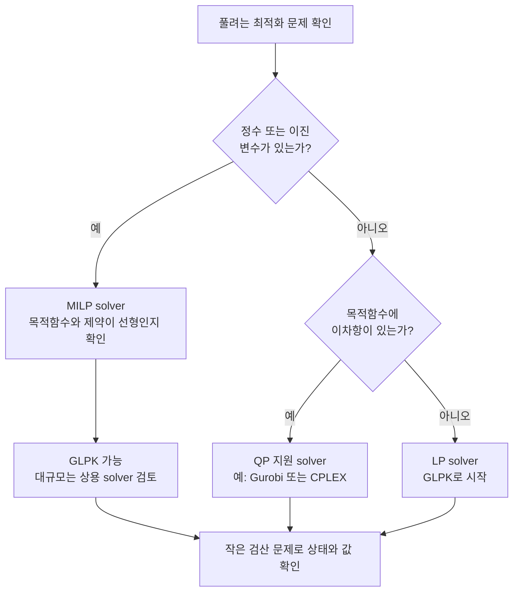

# 준비 학습 D. 재현 가능한 실습 환경 만들기

> 이 페이지의 목표는 단순히 “설치에 성공했다”가 아니라, **같은 모델·같은 solver·같은 조건에서 같은 결과를 다시 얻는 환경**을 만드는 것입니다. 이 책의 실습은 Python과 COBRApy를 기준으로 하며, 예제 수치는 COBRApy 0.30.0의 `textbook` 모델로 검산했습니다.

---

## 1. 왜 환경 정보도 실험 조건인가

같은 모델 파일이라도 다음 항목이 달라지면 출력 형식, 최적해 가운데 선택되는 flux, 수치 허용오차가 달라질 수 있습니다.

- Python, COBRApy, optlang, NumPy, pandas 버전
- LP/MILP/QP solver 종류와 버전
- 모델 파일의 정확한 버전 또는 commit
- 배지, 반응 bounds, 목적함수
- 최적화 허용오차와 난수 seed

따라서 논문이나 과제에는 “Python을 사용했다”가 아니라 **패키지 버전, solver, 모델 식별자와 변경한 제약**을 함께 기록해야 합니다. 목적함수 값이 같아도 flux 벡터는 하나가 아닐 수 있으므로, flux 전체를 비교할 때는 FVA나 2차 목적함수도 함께 명시합니다.

---

## 2. 프로젝트 전용 core 환경

터미널에서 저장소 최상위 폴더로 이동한 뒤 실행합니다. 원 강의 슬라이드는 프로젝트별 환경을 만드는 도구로 **pixi**를 예시했습니다. 여기서는 같은 목적을 Python 표준 `venv`로 재현합니다.

```bash
python3 -m venv .venv
source .venv/bin/activate        # macOS/Linux
# Windows PowerShell: .venv\Scripts\Activate.ps1

python -m pip install --upgrade pip
python -m pip install \
  "cobra==0.30.0" \
  jupyterlab ipykernel \
  pandas numpy scipy statsmodels \
  matplotlib seaborn \
  networkx scikit-learn \
  plotly ipywidgets
python -m pip check
```

`python -m pip`는 현재 활성화된 `python`으로 pip를 실행합니다. 단독 `pip` 명령보다 “설치한 Python”과 “코드를 실행하는 Python”이 어긋날 가능성이 작습니다. 다음 두 경로가 모두 `.venv`를 가리키는지 확인하십시오.

```bash
python -c "import sys; print(sys.executable)"
python -m pip --version
```

`python -m pip check`가 `No broken requirements found.`로 끝나야 설치된 패키지 사이에 알려진 의존성 충돌이 없습니다. 가상환경을 나갈 때는 `deactivate`를 실행합니다. Anaconda/Miniforge를 사용해도 되지만, 한 프로젝트 안에서 `conda` 환경과 `venv`를 겹쳐 활성화하지 마십시오.

### 2.1 core와 선택 패키지를 분리하는 이유

위 환경은 이 책의 표준 FBA·FVA·pFBA·삭제 분석과 시각화에 필요한 **core 환경**입니다. 다음 도구는 플랫폼, Python 버전, CPU/GPU 종류 또는 solver에 따라 의존성이 크게 달라지므로 core 환경에 한꺼번에 설치하지 않습니다.

| 별도 환경 예 | 용도 | 분리해야 하는 이유 |
|:---|:---|:---|
| `.venv-ml` | PyTorch, PyTorch Geometric (`torch-geometric`) | CPU/CUDA/Apple Silicon에 맞는 PyTorch wheel 조합이 다름 |
| `.venv-ecm` | ECMpy | enzyme-constrained model용 의존성과 입력 파일이 추가됨 |
| `.venv-carveme` | CarveMe | reconstruction 도구와 외부 데이터베이스 버전을 함께 관리해야 함 |
| `.venv-memote` | MEMOTE | 테스트·보고서 생성 의존성이 많고 모델 검증 workflow가 별도임 |
| `.venv-troppo` | Troppo | context-specific reconstruction 알고리즘별 의존성이 추가됨 |

예를 들어 ML 실습은 다음처럼 별도 환경을 먼저 만든 뒤, 사용하는 하드웨어와 각 프로젝트의 **공식 설치 지침**에 맞는 명령을 실행합니다.

```bash
python3 -m venv .venv-ml
source .venv-ml/bin/activate
python -m pip install --upgrade pip
# 다음 단계에서 CPU/CUDA/운영체제에 맞는 PyTorch와 PyG를 설치
```

특히 `torch`와 `torch-geometric`은 임의의 버전을 한 줄로 고정하지 마십시오. ECMpy, CarveMe, MEMOTE, Troppo도 각각 별도 가상환경을 만들고 공식 문서가 요구하는 Python·solver·데이터베이스 버전을 기록하는 편이 안전합니다.


이 책은 재현성을 위해 COBRApy 0.30.0을 고정합니다. 최신 버전을 쓰려면 고정을 풀 수 있으나 API나 출력이 달라질 수 있으므로, 먼저 0.30.0으로 기준 결과를 검산하고 업그레이드 뒤 회귀 테스트를 별도로 수행하십시오.


---

## 3. Jupyter 커널 등록·확인·삭제

가상환경을 활성화한 상태에서 커널을 등록하면 Jupyter가 올바른 Python을 사용합니다. `ipykernel`은 core 설치에 이미 포함되어 있습니다.

```bash
python -m ipykernel install --user \
  --name gem-course \
  --display-name "Python (GEM course)"
python -m jupyter kernelspec list
python -m jupyter lab
```

노트북 오른쪽 위의 커널이 `Python (GEM course)`인지 확인합니다. `pip`로 설치했는데 `import cobra`가 실패하는 가장 흔한 이유는 **설치한 Python과 노트북 커널의 Python이 다르기 때문**입니다.

```python
import sys
from importlib.metadata import version

print(sys.executable)       # 경로에 프로젝트의 .venv가 포함되는가?
print(version("cobra"))    # 0.30.0인가?
```

가상환경 폴더를 이동하거나 삭제하면 kernelspec에는 예전 Python 경로가 남을 수 있습니다. 먼저 목록에서 이름을 확인한 뒤 더 이상 쓰지 않는 등록만 삭제합니다.

```bash
python -m jupyter kernelspec list
python -m jupyter kernelspec remove gem-course
```

마지막 명령은 가상환경 자체나 노트북 파일을 삭제하지 않고 `gem-course` 커널 등록만 제거합니다. 새 위치에서 가상환경을 다시 만들었다면 `ipykernel install` 명령으로 재등록하십시오.

---

## 4. 1분 설치 검증과 원격 모델 캐시

`load_model("textbook")`은 단순히 저장소 안의 파일을 여는 함수가 아닙니다. 해당 모델이 COBRApy 캐시에 없으면 설정된 원격 저장소에서 모델을 받아 오므로 **최초 실행에는 네트워크가 필요할 수 있습니다**. 한 번 받은 모델은 로컬 캐시를 사용하지만, 캐시는 분석 자료의 영구 보관소가 아닙니다.

```python
import cobra
from cobra import Configuration
from cobra.io import load_model

configuration = Configuration()
print("cache:", configuration.cache_directory)

model = load_model("textbook")
solution = model.optimize()

print("COBRApy:", cobra.__version__)
print("model:", model.id)
print("reactions/metabolites/genes:",
      len(model.reactions), len(model.metabolites), len(model.genes))
print("objective:", model.objective.expression)
print("solver:", model.solver.interface.__name__)
print("status:", solution.status)
print("growth:", round(solution.objective_value, 6))
```

정상적인 기준 출력은 반응 95개, 대사물 72개, 유전자 137개, 상태 `optimal`, 최대 성장률 약 `0.873922 h⁻¹`입니다. 목적 반응 ID는 `Biomass_Ecoli_core`입니다. 마지막 몇 자리나 선택된 flux는 solver와 허용오차에 따라 달라질 수 있습니다.

모델이 계산되더라도 다음 검사를 통과해야 실습 준비가 끝난 것입니다.

```python
assert len(model.reactions) == 95
assert len(model.metabolites) == 72
assert len(model.genes) == 137
assert model.reactions.has_id("Biomass_Ecoli_core")
assert solution.status == "optimal"
assert abs(solution.objective_value - 0.8739215) < 1e-6
```

오프라인 수업이나 장기 재현에는 캐시에 의존하지 말고, 7절처럼 실제 분석 모델을 SBML과 SHA256으로 동결하십시오.

---

## 5. 문제 유형과 solver 능력

| 분석 | 문제 유형 | 무료 GLPK | QP solver 필요 여부 |
|:---|:---:|:---:|:---:|
| FBA, FVA, pFBA | LP | 가능 | 불필요 |
| ROOM, 일부 tINIT | MILP | 가능(대규모에서는 느릴 수 있음) | 불필요 |
| 선형 MOMA | LP | 가능 | 불필요 |
| 원래의 MOMA | QP | 불가 | Gurobi·CPLEX 등 필요 |



정수·이진 변수와 이차항을 동시에 쓰면 MIQP이고, 이차 제약까지 있으면 이 표의 LP/QP/MILP 범위를 벗어납니다. 그 경우에는 문제 유형과 solver의 해당 기능을 별도로 확인하십시오.

현재 사용 가능한 interface와 활성 solver는 다음처럼 확인합니다.

```python
from cobra.util.solver import solvers

print("available:", sorted(solvers))
print("active:", model.solver.interface.__name__)
```

`glpk`는 교육용 LP/MILP 실습에 충분하지만 **이차 목적함수**를 푸는 solver가 아닙니다. 따라서 `moma(model, solution=wt, linear=False)`가 실패했다고 해서 MOMA 수식이 틀린 것이 아니라, 현재 환경에 QP backend가 없는지 먼저 확인해야 합니다. 반대로 `linear=True`는 원 논문의 Euclidean-distance MOMA가 아니라 L1 거리의 **선형 MOMA**입니다.

Python wrapper 이름만으로는 재현 정보가 충분하지 않습니다. Python, COBRApy, optlang, `swiglpk` Python 패키지, GLPK native library 버전을 함께 기록합니다.

```python
import platform
import sys
from importlib.metadata import version

import cobra
import optlang
import swiglpk

print("platform:", platform.platform())
print("Python:", sys.version.replace("\n", " "))
print("COBRApy:", cobra.__version__)
print("optlang:", optlang.__version__)
print("swiglpk package:", version("swiglpk"))
print("GLPK library:", swiglpk.glp_version())
print("active interface:", model.solver.interface.__name__)
```

상용 solver를 선택했다면 제품 버전과 license 유형도 기록합니다. 설치되어 있다는 사실과 실제로 `model`이 그 interface를 사용한다는 사실은 다르므로 `model.solver.interface.__name__`을 결과에 남기십시오.

---

## 6. 모델 상태, 배지 부호, 실패값을 안전하게 다루기

### 6.1 모델 변경은 context manager 안에서

모델 객체를 직접 수정하면 다음 셀에도 결손과 bounds가 남습니다. 비교 실험은 `with model:` 블록으로 격리합니다.

```python
wt_growth = model.slim_optimize()

with model:
    model.reactions.EX_glc__D_e.lower_bound = -5
    limited_growth = model.slim_optimize()

# 블록을 나오면 원래 bound가 복구됨
restored_growth = model.slim_optimize()
assert abs(restored_growth - wt_growth) < 1e-9
```

다중 유전자 결손처럼 multiprocessing을 쓰는 함수는 노트북·운영체제 조합에 따라 worker 생성 문제가 생길 수 있습니다. 작은 교육 예제에서는 우선 `processes=1`로 재현성을 확보합니다.

```python
from cobra.flux_analysis import single_gene_deletion

result = single_gene_deletion(model, processes=1)
```

### 6.2 `model.medium`과 exchange lower bound의 부호

일반적인 COBRA exchange 반응에서는 **섭취 flux가 음수**입니다. 따라서 glucose를 최대 10만큼 섭취하도록 허용한 반응의 lower bound는 `-10`입니다. 반면 `model.medium` 사전은 사람이 읽기 쉬운 **양의 최대 섭취량**을 반환하고 입력받습니다.

```python
glucose_id = "EX_glc__D_e"

print(model.reactions.get_by_id(glucose_id).lower_bound)  # -10.0
print(model.medium[glucose_id])                            #  10.0

with model:
    medium = model.medium.copy()
    medium[glucose_id] = 5.0
    model.medium = medium

    assert model.medium[glucose_id] == 5.0
    assert model.reactions.get_by_id(glucose_id).lower_bound == -5.0
```

즉 `model.medium[glucose_id] = -5`처럼 음수를 넣지 않습니다. 또한 새 사전을 `model.medium`에 대입하면 목록에서 빠진 uptake가 닫힐 수 있으므로, 한 성분만 바꿀 때는 위처럼 현재 사전을 복사한 뒤 수정합니다. 논문에는 `model.medium`의 양수 용량만 적기보다 실제 exchange bounds와 부호 규약도 함께 명시하십시오.

### 6.3 infeasible 결과는 `None`이 아니라 `NaN`으로 처리

`slim_optimize()`는 flux 전체가 필요 없을 때 목적함수 값만 빠르게 반환합니다. 해가 없을 때 `None`이라고 가정하지 말고, 명시적으로 `NaN`을 요청한 뒤 `np.isfinite`로 검사하십시오.

```python
import numpy as np

def safe_objective_value(m):
    value = m.slim_optimize(error_value=np.nan)
    return float(value) if np.isfinite(value) else np.nan

growth = safe_objective_value(model)
if np.isfinite(growth):
    print(f"growth = {growth:.6f}")
else:
    print("feasible optimum 없음: bounds와 medium을 확인하세요")
```

`if value is None:`은 `NaN`을 걸러내지 못하며, `NaN`을 그대로 평균이나 ML label에 넣으면 뒤 계산까지 오염됩니다. 실패 원인을 진단해야 할 때는 `solution = model.optimize()`를 실행하고 `solution.status`를 먼저 확인합니다. `infeasible`을 생장률 0으로 치환할지는 과학적 분석 정의에 따라 결정하고, 치환했다면 보고서에 명시합니다.

---

## 7. 모델 파일을 SBML과 SHA256으로 동결하기

`load_model`의 모델 이름과 로컬 캐시만으로는 나중에 같은 바이트를 얻었다고 보장할 수 없습니다. 외부 저장소에서 받은 모델은 release tag, commit hash 또는 DOI를 기록하고, 분석 직전의 실제 모델을 SBML로 저장합니다. SHA256은 파일이 바뀌었는지 검출하는 지문입니다.

```python
import hashlib
from pathlib import Path

from cobra.io import read_sbml_model, write_sbml_model
from cobra.util.solver import linear_reaction_coefficients

sbml_path = Path("analysis_model.xml")
hash_path = Path("analysis_model.xml.sha256")

write_sbml_model(model, str(sbml_path))
digest = hashlib.sha256(sbml_path.read_bytes()).hexdigest()
hash_path.write_text(f"{digest}  {sbml_path.name}\n", encoding="utf-8")
print("SHA256:", digest)
```

다른 컴퓨터에서 분석을 시작할 때는 먼저 파일 지문을 검사한 뒤 SBML을 읽습니다.

```python
expected = hash_path.read_text(encoding="utf-8").split()[0]
observed = hashlib.sha256(sbml_path.read_bytes()).hexdigest()

if observed != expected:
    raise ValueError("SBML SHA256 불일치: 분석을 중단하고 파일 출처를 확인하세요")

roundtrip = read_sbml_model(str(sbml_path))
assert len(roundtrip.reactions) == len(model.reactions)
assert len(roundtrip.metabolites) == len(model.metabolites)

def objective_coefficients(m):
    return {
        reaction.id: float(coefficient)
        for reaction, coefficient in linear_reaction_coefficients(m).items()
        if abs(float(coefficient)) > 1e-12
    }

before = objective_coefficients(model)
after = objective_coefficients(roundtrip)

assert roundtrip.objective.direction == model.objective.direction
assert before.keys() == after.keys()
assert all(abs(before[rid] - after[rid]) < 1e-12 for rid in before)
```

이 검사는 파일 동일성과 핵심 구조를 확인하지만, 생장률까지 같다는 뜻은 아닙니다. 저장 직전과 왕복 직후에 같은 배지·solver로 `optimize()`를 실행해 상태와 목적함수 값도 비교하십시오. SBML의 구조와 FBC package, 더 엄밀한 왕복 검증은 [SBML 실무 보충](sbml-practical.md)을 참고하십시오.

---

## 8. 환경 lock 만들고 복원하기

실험이 끝난 뒤가 아니라 **기준 결과를 얻은 즉시** 실제 설치 버전을 저장합니다.

```bash
python --version
python -m pip freeze --all > requirements-lock.txt
python -m pip check
```

`requirements-lock.txt`는 해당 환경의 정확한 Python 패키지 버전 스냅샷입니다. 다만 Python 자체, 운영체제, CPU 아키텍처, 외부 상용 solver와 license까지 담지는 않으므로 5절의 버전 출력도 함께 보존합니다.

새 환경에서 복원할 때는 원래와 같은 Python minor 버전과 가능한 한 같은 운영체제·아키텍처를 사용합니다.

```bash
python3 -m venv .venv-restored
source .venv-restored/bin/activate
python -m pip install --upgrade pip
python -m pip install -r requirements-lock.txt
python -m pip check
```

복원 뒤에는 4절의 모델 크기·목적함수 assertion과 주요 분석의 회귀 테스트를 다시 실행합니다. `pip install`이 성공했다는 사실만으로 solver 수치 결과까지 재현되었다고 판단하지 마십시오. 장기 보존이나 여러 운영체제 지원이 필요하다면 OS별 lock 파일이나 컨테이너 이미지도 함께 제공하는 것이 좋습니다.

논문 Methods에는 최소한 다음을 기재합니다.

1. 모델 이름·버전·출처, SBML SHA256, 직접 수정한 반응
2. Python, COBRApy, optlang, solver와 native solver library 버전
3. 배지와 모든 핵심 bounds 및 exchange 부호 규약
4. 목적함수와 최적성 비율(예: FVA의 `fraction_of_optimum`)
5. 결손 판정 임계값과 수치 허용오차
6. 분석 코드, lock 파일, 재현 가능한 notebook의 위치

---

## 9. 자주 만나는 오류

| 증상 | 먼저 확인할 것 | 해결 방향 |
|:---|:---|:---|
| `ModuleNotFoundError: cobra` | `sys.executable`, kernelspec | 올바른 커널/가상환경 선택 |
| `load_model`이 첫 실행에서 실패 | 네트워크, cache 경로 | 연결을 확인한 뒤 모델을 SBML로 저장 |
| `slim_optimize()`가 `nan` | `np.isfinite(value)`, solver 상태 | 배지·bounds·목적함수를 검사하고 `solution.status` 확인 |
| `infeasible` | 배지·exchange bounds·목적함수 | 최근 변경을 context 안에서 하나씩 되돌려 검사 |
| `SolverNotFound` | LP/MILP/QP 중 어떤 문제인지 | 문제 유형을 지원하는 solver 설치·선택 |
| 결과가 매번 조금 다름 | alternate optima·허용오차 | pFBA/FVA 사용, tolerance와 solver 기록 |
| 유전자 결손이 효과 없음 | OR-GPR·동위효소 | 실제로 꺼진 반응 목록 확인 |
| 병렬 삭제 분석이 멈춤 | multiprocessing | 우선 `processes=1`로 실행 |
| `pip check`가 충돌을 보고 | core와 선택 도구 혼합 여부 | 선택 도구를 별도 환경으로 분리하고 lock 재생성 |

---

## 10. 다음 읽기

- 처음부터 끝까지 실행하는 실습: [Chapter 10 COBRApy 튜토리얼](../chapter-10.-cobrapy-tutorial.md)
- 모델의 구성 요소: [Chapter 3](../chapter-3.-genome-scale-metabolic-model-gem.md)
- 첫 최적화와 결과 해석: [Chapter 4](../chapter-4.-flux-balance-analysis-fba.md)
- MOMA·ROOM과 solver 차이: [유전자 교란 보충](perturbation-analysis.md)
- 모델 교환 형식: [SBML 실무 보충](sbml-practical.md)

## 참고 자료

- Ebrahim A, Lerman JA, Palsson BO, Hyduke DR. COBRApy: COnstraints-Based Reconstruction and Analysis for Python. *BMC Systems Biology*. 2013;7:74. DOI: [10.1186/1752-0509-7-74](https://doi.org/10.1186/1752-0509-7-74)
- [COBRApy 공식 Getting Started](https://cobrapy.readthedocs.io/en/latest/getting_started.html)
- [COBRApy 공식 solver 설정](https://cobrapy.readthedocs.io/en/latest/configuration.html)
- [COBRApy 공식 모델 입출력](https://cobrapy.readthedocs.io/en/latest/io.html)
- [Jupyter kernelspec 관리](https://jupyter-client.readthedocs.io/en/latest/kernels.html)
