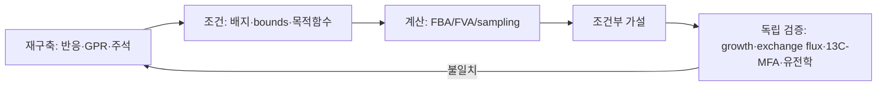
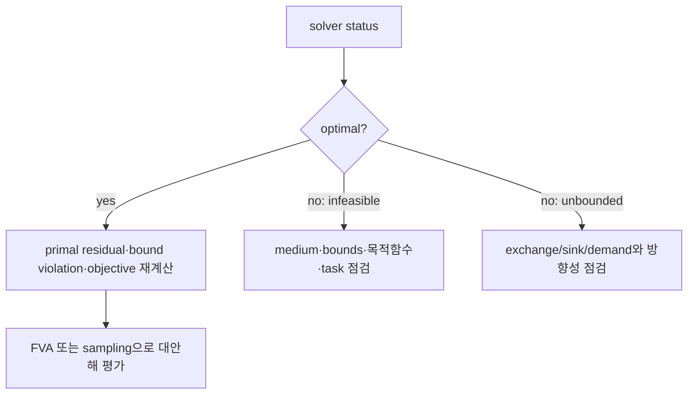
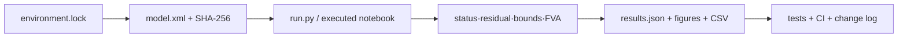

# 대학 교재 보강: 모델의 증거·검증·불확실성

## 대학 교재 보강: 모델의 증거·검증·불확실성

> 이 보강 단원은 Chapters 1–10의 핵심 개념을 연결한다. 모든 계산값은 **모델 파일·릴리스·배지·경계조건·목적함수·solver·허용오차**가 명시될 때에만 재현 가능한 결과가 된다. 아래 도식과 예시는 교육용이며, 실험 관측 또는 임상적 효과의 증명이 아니다.

### 1. 모델이 답하는 질문과 답하지 않는 질문

GEM은 명시된 반응, 화학량론, 경계조건 안에서 가능한 플럭스 상태와 그 조건부 최적해를 계산한다. 따라서 특정 배지에서 성장 가능성, 생산 가능한 범위, 유전자 결손 뒤의 대체 경로 후보에는 유용하다. 반면 농도 변화의 시간 궤적, 효소 포화, 약물의 표적 점유율, 독성, 환자 치료 효과는 별도의 동역학·약리·임상 자료 없이는 직접 예측하지 않는다.

_그림 S.1. 재구축과 조건부 계산, 독립 검증의 관계. 저자 작성; 개념 근거: Thiele & Palsson (2010), Orth et al. (2010)._

### 2. 반응 기록과 화학량론 품질

반응식이 존재한다는 사실만으로 생물학적 기능이 확정되는 것은 아니다. 각 반응에는 (i) 구획별 화학량론과 전하·원소식, (ii) 방향성과 bounds, (iii) GPR, (iv) 데이터베이스 식별자, (v) 증거 유형과 출처, (vi) 검증 task 및 변경 이력을 함께 기록한다. 증거는 직접 실험, 종 특이 문헌, 상동성, 계산적 gap-filling을 구분한다. gap-filled 반응은 검증된 사실이 아니라 이후 실험·문헌 조사가 필요한 가설이다.

원소 조성 행렬을 $$\mathbf E$$라 하면, 완전히 정의된 내부 반응은 원칙적으로 $$\mathbf E\mathbf S=\mathbf0$$을 만족한다. 다만 바이오매스·pseudo-metabolite·경계반응에는 조성 정보가 없거나 모델링 목적상 생략될 수 있으므로, 실패한 검사를 곧바로 질량 보존 위반으로 단정하지 않는다. 어떤 행과 열을 검사했는지 기록해야 한다.

### 3. GPR·구획·수송: 존재·허용·선택의 구분

반응이 네트워크에 **존재**하는 것, 주어진 조건에서 flux가 **허용**되는 것, 현재 목적함수에서 solver가 그 반응을 **선택**하는 것은 서로 다르다. GPR의 AND는 효소 복합체의 모든 유전자 기능이 필요하다는 근사이고 OR는 대체 동종효소의 존재를 뜻한다. 부분 기능상실, copy-number 변화, 발현 보상은 Boolean GPR만으로 표현되지 않는다.

수송반응의 화학량론은 물질 이동을 나타내지만 전기화학적 구동력과 용량을 자동으로 제공하지 않는다. 이온 $$i$$의 전기화학 퍼텐셜 차는

$$
\Delta\mu_i=RT\ln\frac{a_{i,\mathrm{in}}}{a_{i,\mathrm{out}}}+z_iF\Delta\psi
$$

로 표현할 수 있다. 표준 GEM의 $$\mathbf S$$에는 보통 이 항의 시간·전위 의존성이 들어 있지 않으므로, 수송 방향과 상한을 별도 bounds, 열역학 제약 또는 동역학 모델로 정당화해야 한다.

### 4. FBA의 계산 상태와 불확실성

FBA의 선형계획 문제는

$$
\max_{\mathbf v}\ \mathbf c^T\mathbf v\quad\text{subject to}\quad
\mathbf S\mathbf v=\mathbf0,\quad \boldsymbol\ell\le\mathbf v\le\mathbf u
$$

이다. `optimal`은 solver tolerance 안에서 목적값과 제약을 만족하는 해를 찾았다는 뜻이다. `infeasible`은 **현재 모델·bounds·목적함수 조합**에 해가 없다는 신호이지 생물학적 불가능성의 증명은 아니다. `unbounded`는 흔히 exchange/sink/demand 반응 또는 목적함수의 유계 조건을 점검해야 함을 뜻한다.

FVA는 목적값을 유지하면서 각 반응의 개별 최소·최대를 구한다. 두 반응의 FVA 극값은 동시에 실현 가능하지 않을 수 있다. 반응 간 공동분포와 상관을 알고 싶으면 feasible region에서 표본을 뽑는 ACHR 또는 OptGP 같은 flux sampling을 사용하고, sampling 방법·warm-up·seed·tolerance를 보고한다.

_그림 S.2. FBA 종료 상태의 최소 진단 순서. 저자 작성; COBRApy 및 LP solver 문서의 일반 원칙을 교육용으로 종합._

### 5. 재구축·gap-filling·release engineering

자동 재구축은 초안(draft)을 만들며, 품질을 보장하지 않는다. BLASTP 외에 protein family HMM(Pfam/TIGRFAM), orthogroup, active-site 보존, 유전자 주변성, 종 특이 문헌을 함께 검토한다. 다조건 gap-filling에서는 조건 A/B의 task를 학습에 사용하고, 조건 C의 성장·분비·필수성은 hold-out 검증에 남긴다. 같은 phenotype을 gap-filling과 성능 평가에 모두 쓰면 성능이 과대평가될 수 있다.

최소 release 패키지는 SBML L3 FBC 모델 파일과 SHA-256, stable identifier와 주석, 배지·bounds·목적함수 조건 파일, solver/버전/tolerance/seed, MEMOTE·task·phenotype benchmark 결과, 변경 로그와 CI의 SBML round-trip 검사를 포함한다.

### 6. 오믹스의 증거 수준과 독립 검증

전사체는 반응 flux가 아니다. GPR을 통해 만든 RAS는 반응 활성의 근사 점수이며 isoenzyme, complex stoichiometry, 결측값 처리, 임계값 선택에 민감하다. 단백질체는 효소 용량 제약의 근거가 될 수 있지만 절대 정량, $$k_{cat}$$ 출처, 포화도와 결측 메커니즘을 함께 다뤄야 한다. 대사체 농도는 flux가 아니며, 열역학·동역학 정보와 결합할 때 방향성 해석을 보완한다.

외부 uptake/secretion flux와 $$^{13}\mathrm C$$-MFA는 flux 검증의 서로 다른 역할을 가진다. 전자는 경계조건 또는 직접 검증값이 되고, 후자는 동위원소 표지 분포를 이용하여 내부 flux의 일부를 추정한다. 두 자료 모두 조건·단위·세포량 정규화·측정 오차를 명시해야 한다.

### 7. 질병 모델과 약물 표적의 번역 한계

유전자 knockout은 반응을 완전히 차단하는 모형이지만 약물은 대개 부분 억제, 시간 의존적 노출, off-target 및 조직별 분포를 가진다. 부분 억제는 예를 들어 $$v_j^{\max}$$를 연속적으로 낮추어 감도 분석할 수 있으나, 이것만으로 dose–response나 target engagement를 예측하는 것은 아니다. 후보 우선순위에는 암/질병 효과, 정상 조직의 최악 효과, 환경·모델·threshold 변화에 대한 강건성, 약물화 가능성, ADME, 독성, rescue와 isogenic control 계획을 함께 기록한다.

### 8. 세포공장: 성장·생산·수율의 동시 해석

최대 생산 flux는 산업 최적과 동의어가 아니다. 생산 설계는 titer, rate, yield(TRY), 탄소수지, 전자수지, ATP maintenance, biomass, 부산물, 산소전달(OTR), pH, product toxicity, strain stability와 downstream 공정을 함께 고려한다. production envelope는 두 목적을 고정·최적화하여 가능한 범위를 보여 주며, 축을 바꾸면 같은 feasible region을 다른 방향으로 절단한다.

커뮤니티 GEM에서는 상대 존재비가 biomass flux와 같지 않다. compositional abundance, 세포 크기, 성장률, 교환 flux와 시간 변화를 분리하여 보고하고, cross-feeding은 time-course metabolomics 또는 isotope tracing으로 검증한다.

### 9. AI+GEM: 성능보다 evidence card

AI 방법은 (i) solver를 빠르게 근사하는 surrogate, (ii) 기계론 모델의 잔차를 보정하는 residual model, (iii) 실험·큐레이션 후보를 우선순위화하는 ranking model로 구분한다. 성능 숫자는 label source, 데이터 릴리스, split 단위, baseline, OOD test, constraint check, calibration, code/data/license 없이 비교할 수 없다.

특히 같은 GEM에서 만든 graph feature와 FBA-derived label을 무작위로 나눈 교육용 데이터는 생물학적 일반화 benchmark가 아니다. cell line, 생물종/계통, 배지, 시간 또는 반응 family 단위의 group split과 external/OOD 검증을 분리한다. flux 예측 모델은 $$\max|\mathbf S\mathbf v|$$, bounds 위반률, feasibility rate, worst-case error, uncertainty calibration을 함께 보고한다.

### 10. 연구급 실행 기록과 평가

노트북 실행은 연구 결과 그 자체가 아니다. 재현 가능한 결과에는 Python/COBRApy/solver build, OS, seed, tolerance, time limit, MIP gap, 입력 SBML checksum, medium file hash, Git commit, 실행 명령과 notebook execution order를 JSON Schema 또는 lockfile로 남긴다. 결과 QC에는 solver status, $$\max|\mathbf S\mathbf v|$$, bound violation, objective 재계산, alternative optima, 필요한 경우 loopless/energy-generating-cycle 검사가 포함된다.

_그림 S.3. 튜토리얼을 재현 가능한 연구 분석으로 확장하는 최소 산출물. 저자 작성._

### 형성평가

1. `infeasible` FBA 결과가 나왔을 때, 생물학적 해석 전에 확인할 네 항목을 쓰시오.
2. FVA의 각 반응별 최대값을 동시에 해석할 수 없는 이유를 설명하고, 이를 보완할 분석을 하나 제시하시오.
3. RNA-seq, exchange flux, $$^{13}\mathrm C$$-MFA가 각각 GEM에 제공하는 정보와 한계를 비교하시오.
4. knockout 예측이 약물 효과의 증명이 아닌 이유를 부분 억제·off-target·조직 특이성의 관점에서 설명하시오.
5. AI+GEM 논문을 읽을 때 evidence card에 반드시 포함할 항목 여섯 가지를 쓰시오.

풀이 핵심

1. solver status/diagnostic, medium과 exchange bounds, objective 방향과 최소 task, 모델 버전·조건 및 numerical tolerance를 확인한다.
2. FVA는 다면체를 축마다 투영한 구간이므로 반응 간 상관을 보존하지 않는다. flux sampling 또는 공동 최적화/표본 분석을 사용한다.
3. RNA-seq은 반응 활성의 간접 근거, exchange flux는 경계 제약 또는 직접 검증, 13C-MFA는 일부 내부 flux 추정에 기여한다. 어느 자료도 조건·오차·정규화 없이 절대적 증거가 되지 않는다.
4. knockout은 완전 기능 상실 근사다. 약물은 부분 억제·노출·off-target·조직 분포를 가진다.
5. 최소한 task, label/data source와 version, split unit, baseline, OOD/외부 검증, constraint/uncertainty 검사, code/data/license를 기록한다.

