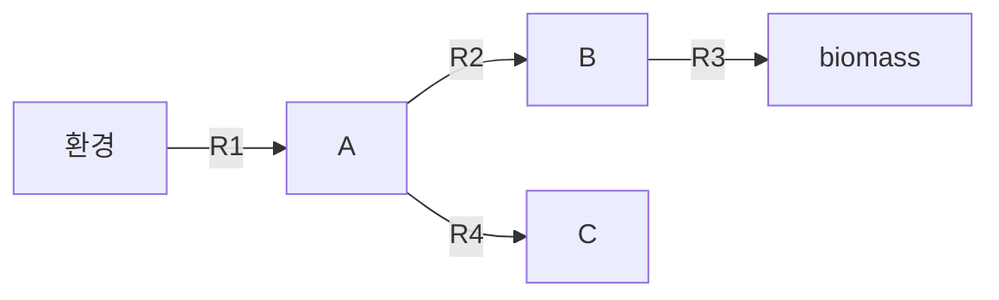
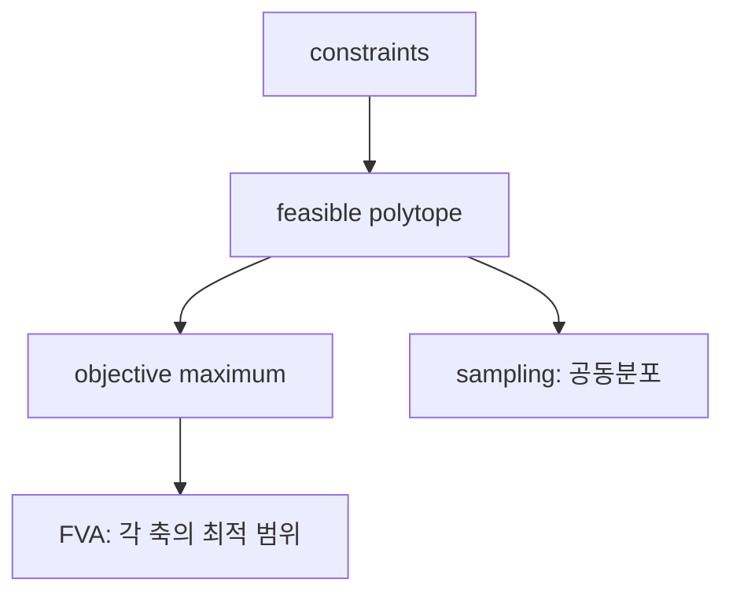

# 전 챕터 워크북: 토이 모델·유도·해석

> 이 워크북은 본문 Chapters 1–10을 읽은 뒤 사용할 **대학 교재 수준의 worked example** 모음이다. 모든 수치 예시는 명시적으로 교육용 toy model이며, 실제 생물종의 정량 예측·임상 결론·산업 공정 조건으로 해석해서는 안 된다. 각 예제는 정의 → 가정 → 수식 → 계산 → 해석 범위 순서로 전개한다.

### 사용하는 공통 표기

* flux의 단위는 특별한 언급이 없으면 $$\mathrm{mmol\,gDW^{-1}\,h^{-1}}$$이다.
* $$\mathbf S$$의 행은 대사물 species, 열은 반응이며, 내부 대사물의 의사 정상상태는 $$\mathbf S\mathbf v=\mathbf0$$으로 쓴다.
* 모든 bounds, 목적함수, 반응 방향은 toy model을 위해 정한 것이며 생리적 사실이 아니다.

***

## Chapter 1. 대사모델링의 질문을 만드는 토이 네트워크

### 예제 1.1 — “반응이 있다”와 “flux가 흐른다”는 다르다

다음 네 반응을 생각하자.

$$
R_1:\ \varnothing\rightarrow A,\qquad
R_2:\ A\rightarrow B,\qquad
R_3:\ B\rightarrow \mathrm{biomass},\qquad
R_4:\ A\rightarrow C
$$

조건 I에서는 $$0\le v_1\le10$$, $$v_2,v_3,v_4\ge0$$이고 biomass를 최대화한다. 조건 II에서는 $$v_3=0$$으로 고정하고 $$v_4$$만 허용한다.

* 조건 I: $$v_2=v_3=10,\ v_4=0$$이 최적이다.
* 조건 II: 반응 $$R_3$$는 모델에 남아 있지만 **조건에 의해 차단**되어 있으며, 목적함수가 없다면 $$R_4$$의 값도 모델만으로 유일하게 정해지지 않는다.



_그림 W1.1. 동일한 재구축에서 bounds와 목적함수가 달라질 때 서로 다른 계산 상태가 나오는 교육용 네트워크. 저자 작성._

<details>

<summary>점검: 이 예제가 보여 주지 않는 것은 무엇인가?</summary>

농도 변화, $$R_2$$ 효소량, $$R_3$$의 실제 성장률, C의 독성은 주어지지 않았다. 이들은 동역학·효소용량·실험 자료가 추가되어야 다룰 수 있다.

</details>

***

## Chapter 2. 반응식에서 화학량론 행렬로

### 예제 2.1 — 손으로 $$\mathbf S\mathbf v=0$$ 검산하기

내부 대사물 A, B에 대해 다음 반응을 정의한다.

$$
R_1:\ \varnothing\rightarrow A,\quad
R_2:\ A\rightarrow B,\quad
R_3:\ B\rightarrow\varnothing,\quad
R_4:\ A\rightarrow\varnothing
$$

$$
\mathbf S=
\begin{bmatrix}
 1&-1&0&-1\\
 0& 1&-1& 0
\end{bmatrix}.
$$

$$\mathbf v=(6,4,4,2)^T$$이면

$$
\mathbf S\mathbf v=
\begin{bmatrix}6-4-2\\4-4\end{bmatrix}=
\begin{bmatrix}0\\0\end{bmatrix}.
$$

A와 B의 순축적이 0이라는 뜻이지 각 반응의 flux가 0이라는 뜻은 아니다. 예를 들어 $$\mathbf v=(6,4,3,2)^T$$는 B에 $$+1$$의 순축적을 만들므로 의사 정상상태를 만족하지 않는다.



A 행: 유입 $$v_1$$은 B 전환 $$v_2$$와 배출 $$v_4$$의 합과 같아야 한다.



R2 열: A에는 -1, B에는 +1을 기여한다. 하나의 열은 하나의 반응의 물질수지 기여를 나타낸다.



***

## Chapter 3. GPR·구획·경계반응

### 예제 3.1 — AND/OR GPR와 유전자 결손

반응 $$R_X$$가 효소 복합체를 필요로 하여 GPR이

$$
(g_A\ \mathrm{AND}\ g_B)\ \mathrm{OR}\ g_C
$$

라고 하자. 아래 표는 Boolean 유전자 결손 근사에서의 반응 가능성을 보여 준다.

| 기능 상태  | $$g_A$$ | $$g_B$$ | $$g_C$$ |   $$R_X$$ |
| ------ | ------: | ------: | ------: | --------: |
| 야생형    |       1 |       1 |       1 |        가능 |
| A 결손   |       0 |       1 |       1 | 가능: C가 대체 |
| A·C 결손 |       0 |       1 |       0 |        불가 |
| B·C 결손 |       1 |       0 |       0 |        불가 |

이 논리는 효소가 존재할 **가능성**만 나타낸다. 부분 발현 저하, 효소 용량, 억제제의 농도 의존적 효과는 `AND/OR`만으로 표현하지 않는다.

### 예제 3.2 — exchange와 transport를 분리하기

$$
EX_A:\ A_e\leftrightarrow\varnothing,\qquad
T_A:\ A_e\leftrightarrow A_c,\qquad
R_A:\ A_c\rightarrow biomass
$$

에서 $$EX_A$$는 환경과의 경계, $$T_A$$는 구획 간 이동, $$R_A$$는 세포 내부 변환이다. 배지 조건은 일반적으로 $$EX_A$$의 bounds로 부여하고, 세포막 수송 능력·에너지 비용은 $$T_A$$의 화학량론과 bounds에 표현한다.

***

## Chapter 4. FBA, 가능영역, 대안 최적해

### 예제 4.1 — 2변수 LP를 직접 풀기

두 flux $$v_1,v_2$$가 다음을 만족한다고 하자.

$$
v_1+v_2\le10,\qquad 0\le v_1\le6,\qquad 0\le v_2\le8.
$$

목적함수 $$z=0.5v_1+0.8v_2$$를 최대화하면 $$v_2$$가 더 큰 계수를 가지므로 $$v_2=8$$, 남은 공급을 $$v_1=2$$에 배분하여 $$z=7.4$$를 얻는다.

반대로 $$z=v_1+v_2$$이면 $$v_1+v_2=10$$인 모든 feasible 점이 최적이다. 즉 최적 목적값은 하나여도 최적 flux 분포는 유일하지 않을 수 있다.



<details>

<summary>FVA와 sampling의 차이</summary>

FVA는 목적값을 유지한 채 한 반응씩 최소·최대화하므로 축별 범위를 준다. sampling은 가능한 상태들의 공동분포를 근사한다. FVA의 두 극값은 동시에 가능하지 않을 수 있다.

</details>

***

## Chapter 5. 재구축, 증거, gap-filling

### 예제 5.1 — gap-filling은 가설 생성이다

모델에 다음 반응이 있고 P로부터 R 생산 task를 요구한다고 하자.

$$
R_1:\ P\rightarrow Q,\qquad R_2:\ Q\rightarrow R.
$$

초안 모델에는 $$R_1$$만 있어 task가 infeasible이다. 후보 데이터베이스에는 직접 반응 $$R_3:P\rightarrow R$$와 $$R_2$$가 있다. 반응 수 최소화만 쓰면 $$R_3$$를 넣을 수 있지만, 종 특이 문헌과 유전자 상동성 증거가 $$R_2$$에만 있다면 evidence-weighted 목적함수는 $$R_1+R_2$$ 경로를 선호할 수 있다.

| 후보      | task 충족 | 유전자 근거 | 해석               |
| ------- | ------- | ------ | ---------------- |
| $$R_3$$ | 예       | 없음     | 검증 우선순위가 높은 가설   |
| $$R_2$$ | 예       | 있음     | 문헌·주석 확인 후 채택 후보 |

검증에는 **학습에 쓰지 않은** 배지·task·분비 데이터가 필요하다. 동일 조건만으로 gap-fill 전후를 평가하면 성능이 부풀려질 수 있다.

***

## Chapter 6. 오믹스 통합과 threshold 감도

### 예제 6.1 — RAS는 flux가 아니다

반응 $$R_Y$$의 GPR이 $$g_1\ \mathrm{AND}\ (g_2\ \mathrm{OR}\ g_3)$$이고 정규화 발현이 $$x_1=5,x_2=1,x_3=4$$라고 하자. 최소–최대 규칙을 쓰면

$$
RAS(R_Y)=\min\{x_1,\max(x_2,x_3)\}=\min\{5,4\}=4.
$$

이 값은 발현으로부터 만든 반응 활성 **점수**다. 실제 flux는 mass balance, uptake, 목적함수, 효소량, 열역학 및 다른 반응과의 경쟁에 의해 달라진다.

threshold를 3으로 두면 반응은 active 후보, 5로 두면 inactive 후보가 된다. 따라서 threshold는 보편 상수가 아니라 task 유지, 독립 필수성/flux 자료, 모델 크기와의 trade-off를 보고 선택해야 한다.

### 예제 6.2 — 증거의 직접성 비교

| 자료                     | GEM에서의 주된 역할 | flux 직접성 | 대표 주의점                              |
| ---------------------- | ------------ | -------- | ----------------------------------- |
| RNA-seq                | RAS·반응 선택    | 낮음       | isoenzyme·결측·threshold              |
| 단백질체                   | 효소용량 근거      | 중간       | absolute quantification·$$k_{cat}$$ |
| 대사체                    | 상태·열역학 근거    | 낮음       | 농도와 flux 혼동                         |
| exchange flux          | bound/검증     | 높음(경계)   | 단위·세포량 정규화                          |
| $$^{13}\mathrm C$$-MFA | 내부 flux 검증   | 높음(부분)   | identifiability·실험 설계               |

***

## Chapter 7. 질병 모델과 표적 선택성

### 예제 7.1 — knockout과 부분 억제는 다르다

질병 모델에서 반응 $$R_T$$의 상한이 $$u_T=10$$이고, 정상 모델과 질병 모델의 성장률이 상한 변화에 따라 아래와 같다고 하자.

| $$u_T$$ | 질병 성장률 | 정상 성장률 |
| ------: | -----: | -----: |
|      10 |   1.00 |   1.00 |
|       5 |   0.30 |   0.85 |
|       0 |   0.00 |   0.20 |

완전 knockout은 $$u_T=0$$ 한 점만 본다. 약물은 실제로는 $$u_T$$를 연속적으로 낮추는 부분 억제, off-target, 노출 시간, 조직 분포를 갖는다. 따라서 질병 선택성이 있어 보이는 후보도 정상 조직 패널, target engagement, rescue, PK/PD를 추가로 검증해야 한다.


합성치사 유전자 상호작용 점수와 약물 조합의 Bliss/Loewe/HSA 점수는 같은 척도가 아니다. 유전자 결손과 농도–반응 자료를 혼용하지 않는다.


***

## Chapter 8. 세포공장과 성장–생산 trade-off

### 예제 8.1 — 탄소수지의 최소 검사

기질 glucose 1 mol이 제품 P, biomass, CO2, 부산물 D로 분배된다고 하자. carbon atom 수를 각각 6, 3, 1, 2라고 놓으면, 외부 flux만으로도 다음 같은 최소 수지를 점검할 수 있다.

$$
6v_{glc}=3v_P+c_{bio}v_{bio}+v_{CO_2}+2v_D.
$$

이 식은 redox, ATP, 수분·양성자 및 세포내 저장물을 생략한 **첫 점검**이다. 높은 제품 수율이 carbon balance를 만족해도 NADH/NADPH 재생, ATP maintenance, 산소전달, product toxicity, 성장 안정성을 만족한다는 뜻은 아니다.

### 예제 8.2 — production envelope 읽기

목표가 $$v_P$$ 최대화일 때 $$v_{bio}\ge0.1$$을 요구하면, 제품 최적해는 성장 요구를 막 만족시키는 경계에 놓일 수 있다. 반대로 성장률을 고정하고 $$v_P$$의 min/max를 구하면 같은 feasible region을 다른 축으로 절단한 production envelope를 얻는다. 단일 최적점보다 가능한 범위를 보고해야 한다.

***

## Chapter 9. AI+GEM의 benchmark 설계

### 예제 9.1 — 같은 모델에서 나온 label의 누출 위험

한 GEM의 graph topology를 feature로 사용하고, 같은 GEM에서 FBA로 계산한 gene essentiality를 label로 만든 뒤 무작위 80:20 split을 했다고 하자. 높은 AUC는 해당 모델의 구조적 패턴을 재발견한 결과일 수 있으며, 새로운 생물종·배지·세포주에 일반화된다는 증거는 아니다.

| split                 | 무엇을 시험하는가  | 한계                      |
| --------------------- | ---------- | ----------------------- |
| random row            | 같은 분포 내 보간 | 관계된 feature/label 누출 위험 |
| group by cell line    | 새 세포주      | 배지·시간 일반화는 별도           |
| leave-one-medium-out  | 새 환경       | 종/계통 일반화는 별도            |
| leave-one-species-out | 새 생물종      | annotation shift가 큼     |

AI+GEM 결과에는 task, label source/version, split unit, baseline, OOD test, $$\max|\mathbf S\mathbf v|$$ 또는 feasibility rate, calibration, code/data/license를 함께 적은 evidence card가 필요하다.

***

## Chapter 10. 연구급 실행 기록과 QC

### 예제 10.1 — 결과 JSON에 남길 최소 정보

다음은 한 FBA 실행의 최소 provenance 구조다.

```json
{
  "model_sha256": "...",
  "model_release": "e_coli_core / recorded version",
  "medium": {"EX_glc__D_e": 10.0},
  "objective": "Biomass_Ecoli_core",
  "solver": "GLPK / recorded version",
  "tolerance": 1e-9,
  "status": "optimal",
  "objective_value": 0.0,
  "max_mass_balance_residual": 0.0,
  "bound_violation": 0.0,
  "git_commit": "..."
}
```

`status="optimal"`만 기록하는 것은 충분하지 않다. $$\max|\mathbf S\mathbf v|$$, bounds 위반, 목적함수 재계산, 대안 최적해(FVA), 필요 시 loopless/energy-generating-cycle 검사를 함께 수행한다. MILP라면 time limit, feasible incumbent, MIP gap도 남긴다.


_그림 W10.1. 튜토리얼 코드를 재현 가능한 분석 단위로 확장하는 최소 구조. 저자 작성._

***

## 종합 연습문제

1. 예제 2.1에서 $$v_1=8,v_2=5,v_3=5$$일 때 A 정상상태를 만족시키기 위한 $$v_4$$를 구하시오.
2. 예제 4.1에서 $$z=v_1+v_2$$일 때 대안 최적해가 생기는 이유를 가능영역과 목적함수의 기하로 설명하시오.
3. 예제 5.1의 $$R_3$$가 더 적은 반응 수를 가지더라도 곧바로 채택하면 안 되는 이유를 세 가지 쓰시오.
4. 예제 7.1에서 정상 조직 안전성 평가가 필요한 이유를 설명하시오.
5. 예제 9.1의 random split 결과가 biological generalization을 보장하지 않는 이유를 설명하시오.

<details>

<summary>정답 핵심</summary>

1. A 수지 $$v_1-v_2-v_4=0$$이므로 $$v_4=3$$이다.
2. $$v_1+v_2=10$$인 feasible 경계 전체에서 같은 목적값을 가지므로 목적값은 유일해도 flux 벡터는 유일하지 않다.
3. 유전자/문헌 근거 부재, 원소·전하·열역학 검증 부재, hold-out phenotype에서의 검증 부재가 대표적이다.
4. 질병 효과만 큰 후보도 정상 모델에서 강한 성장 저하·독성을 만들 수 있으며, 약물은 부분 억제와 조직별 노출을 갖는다.
5. 동일 GEM에서 나온 feature와 label의 구조적 관계가 train/test에 공유될 수 있고, 새 배지·세포주·생물종으로의 OOD 일반화를 시험하지 않기 때문이다.

</details>
